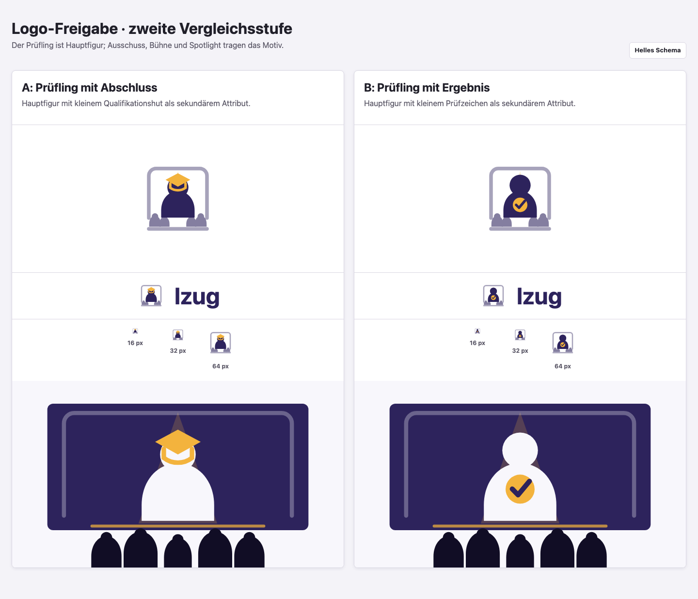
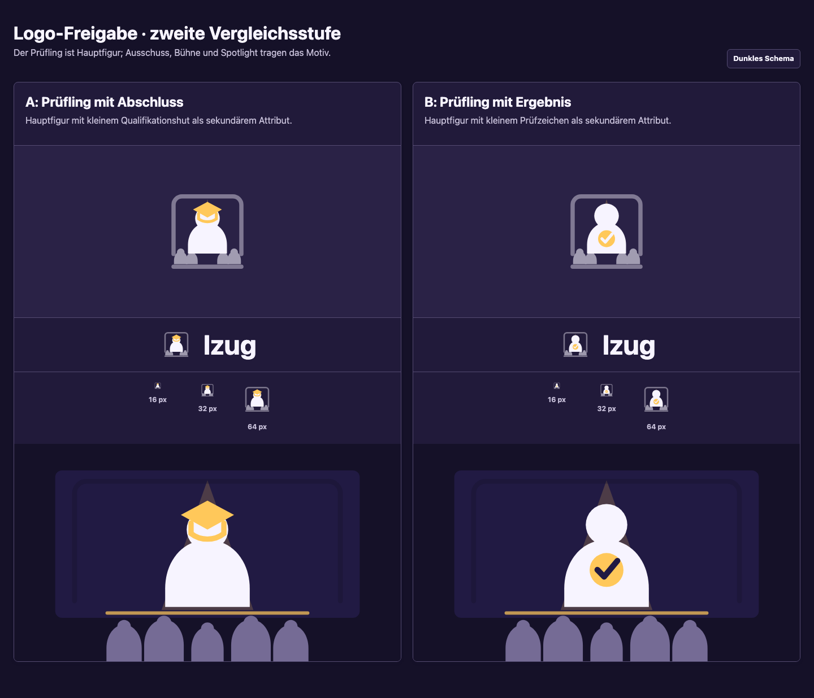
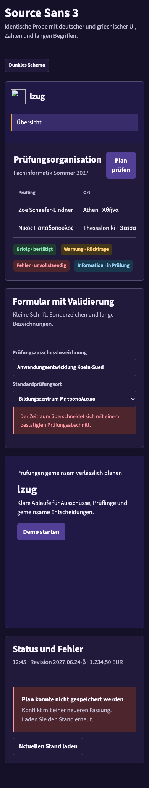
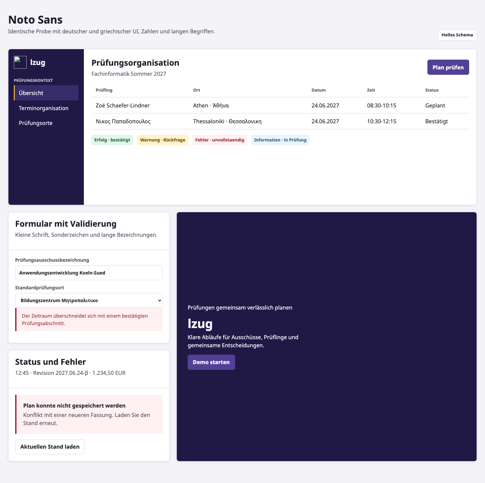
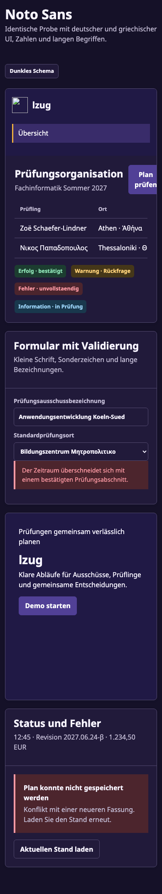
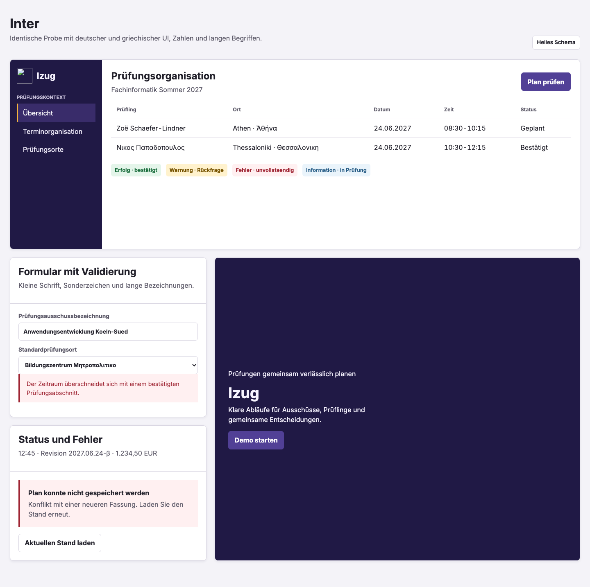
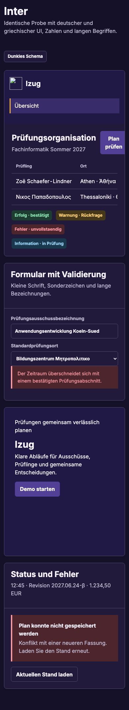

# lzug Corporate Design

## Status

Dieser Stand ist ein visuell prüfbarer Entwurf für Issue #568.
Er integriert noch keine neue Marke oder neue Schrift in Produkt und Publikation.
Die erste Logo-Vergleichsstufe wurde im Issue verworfen.
Logo und Schrift benötigen weiterhin eine dokumentierte Maintainer-Freigabe.

## Designvertrag

lzug vermittelt Verlässlichkeit, Klarheit, Zusammenarbeit und strukturierte Prüfungsprozesse.
Bühne, Spotlight, Ensemble und Ablauf sind eine subtile zweite Ebene und kein dekoratives Theatermotiv.
Die Marke imitiert weder Behörde, Wappen noch IHK und funktioniert für selbst betriebene Instanzen, Demo, öffentliche Seiten, Dokumentation und Release-Artefakte.

Die vorgeschlagene Farbwelt verbindet einen ruhigen dunkelvioletten Primärbereich mit einem zurückhaltenden Amber-Akzent.
Fachstatus, Interaktion und Diagramme erhalten davon unabhängige semantische Rollen.
Helles und dunkles Schema verwenden dieselben Rollen, aber separat geprüfte Werte.

## Inventarbefund

- `frontend/public/favicon.svg` und `favicon.ico` sind die einzigen derzeit veröffentlichten Markenassets.
- Die Produktoberfläche zeigt die Textmarke `LZUG`; die Publikation zeigt `lzug` ohne Bildmarke oder Key Visual.
- `frontend/src/styles.scss` enthält direkt benannte Teal-, Status- und Taiga-Werte in einer gemeinsamen Ebene.
- Einzelne Komponenten enthalten zusätzliche direkte Farben und Fallback-Tokens.
- Source Sans 3 wird bereits lokal über Fontsource ausgeliefert, besitzt für #568 aber noch keine vergleichende Maintainer-Freigabe.
- Funktionale Icons sind derzeit ausgewählte lokal kopierte CoreUI-Pfade und noch nicht die verlangte Lucide-Semantik.
- Produkt und Publikation besitzen keine gemeinsame kanonische Asset- oder Tokenquelle.

## Logoauswahl · zweite Vergleichsstufe

Beide überarbeiteten Entwürfe setzen den Prüfling als deutlich größte, kontraststarke Hauptfigur ins Zentrum.
Der positiv bewertete Prüfungsausschuss bleibt als kleineres abstrahiertes Publikum erhalten.
Bühnenrahmen und Lichtkegel sind in Strichstärke, Kontrast und Fläche zurückgenommen.
Die Varianten unterscheiden ausschließlich das sekundäre Attribut der Hauptfigur:

- **A: Prüfling mit Abschluss** verwendet einen kleinen Qualifikationshut und ist dadurch unmittelbar als Abschlussmotiv lesbar, kann aber akademischer wirken.
- **B: Prüfling mit Ergebnis** verwendet ein kleines Prüfzeichen und bleibt näher an einem branchenoffenen, erfolgreich abgeschlossenen Prüfungsprozess.

Die Vektorquellen unter `brand/proposals/` sind eigenständige SVG-Gestaltungen.
`brand/review/evidence/logo-comparison-light.png` und `logo-comparison-dark.png` zeigen beide Richtungen als Bildmarke, vorläufige Wort-/Bildmarke, Kleinformatprobe und Key Visual.
Die Kleinformatprobe rendert jede unveränderte Bildmarkenquelle mit 16, 32 und 64 Pixeln und macht damit dieselbe Gewichtung ohne separate vereinfachte Ersatzgrafik prüfbar.
Die endgültige Wortmarke wird erst nach gemeinsamer Logo- und Schriftfreigabe festgelegt.

### Helles Schema



### Dunkles Schema



## Schriftvergleich

Die drei Kandidaten werden ausschließlich für den Vergleich geladen und sind noch nicht Teil des Produkt-Bundles.
Alle stammen aus Fontsource 5.3.0, stehen unter OFL-1.1 und enthalten variable Schnitte sowie getrennte Latin-, Greek- und Greek-Extended-Subsets.

| Kandidat      | Upstream-Fassung | Verwendete Achse | WOFF2-Payload der Probe | Charakter im Vergleich                                      |
| ------------- | ---------------- | ---------------- | ----------------------- | ----------------------------------------------------------- |
| Source Sans 3 | v19              | `wght` 200-900   | 53.124 Byte             | ruhig, offen, bereits im Ist-Produkt bekannt                |
| Noto Sans     | v42              | `wght` 100-900   | 68.356 Byte             | neutral, breite Schriftabdeckung, ausgewogenes Tabellenbild |
| Inter         | v20              | `wght` 100-900   | 78.484 Byte             | kompakt und eigenständig, dichtes Tabellenbild              |

Die Probe enthält Navigation, Formular, datenreiche Tabelle, Status, Fehler, Landingpage und mobile Navigation.
Deutsche und polytonisch griechische Zeichen, tabellarische Ziffern, Datum, Zeit, Währung, Sonderzeichen und lange Bezeichnungen sind enthalten.
Jeder Kandidat wird identisch als Desktop im hellen und Mobilansicht im dunklen Schema gerendert.
`brand/review/evidence/render-report.json` weist geladene Subsets, WOFF2-Payload, Upstream, Lizenzhash und Chromium-Fassung aus.

### Source Sans 3




### Noto Sans





### Inter





## Reproduktion

Die Review-Schriften werden außerhalb des Repositorys als unveränderte Registry-Tarballs vorgehalten.
Der Renderer prüft vor Verwendung deren vollständige npm-SHA512-Integrität aus `font-candidates.json`.

```sh
mkdir -p /private/tmp/lzug-568-fonts
npm pack \
  @fontsource-variable/source-sans-3@5.3.0 \
  @fontsource-variable/noto-sans@5.3.0 \
  @fontsource-variable/inter@5.3.0 \
  --pack-destination /private/tmp/lzug-568-fonts
node scripts/render_brand_review.mjs --font-cache /private/tmp/lzug-568-fonts
```

Die Anwendung lädt dabei keine externen Font-, Icon- oder Asset-URLs.
Nur die später freigegebene Schrift und ihre tatsächlich benötigten lokalen WOFF2-Artefakte werden in das Produkt übernommen.
Der vorliegende visuelle Nachweis wurde unter macOS x64 mit Chromium 151.0.7922.34 erzeugt.
Die unterstützte Browser- und CI-Matrix wird nach Auswahl mit der integrierten Schrift geprüft.

## Herkunft und Urheberschaft

Leitidee und Markenanforderungen stammen aus Issue #568 und den dort dokumentierten Maintainer-Entscheidungen.
Die SVG-Entwürfe wurden für lzug als eigenständige geometrische Vektorgestaltungen umgesetzt und enthalten keine fremden Logo-, Marken- oder Iconpfade.
Die Entwürfe begründen keine Freigabe der Marke für einen produktiven oder veröffentlichten Einsatz.

Die Schriftkandidaten stammen aus den exakt bezeichneten Fontsource-Paketen und werden unverändert nur für den Vergleich verwendet.
Paketintegrität, Upstream-Fassung und OFL-Lizenz werden maschinenlesbar geprüft; die final ausgewählte Fassung erhält ihren Lizenztext im Repository.

## Maintainer-Freigabe

Vor der Integration ist im Issue jeweils eine eindeutige Auswahl zu dokumentieren:

1. **Logo:** `A: Prüfling mit Abschluss` oder `B: Prüfling mit Ergebnis`, gegebenenfalls mit präzise benannter Korrektur.
2. **Schrift:** `Source Sans 3`, `Noto Sans` oder `Inter`, gegebenenfalls mit präzise benannter Korrektur.

Die Freigabe bestätigt die subjektive visuelle Richtung, nicht die technische Abnahme.
Kontrast, Assets, Tokenvollständigkeit, lokale Auslieferung, Lucide-Integration und automatisierte Prüfungen bleiben anschließend Aufgabe der Umsetzung.
