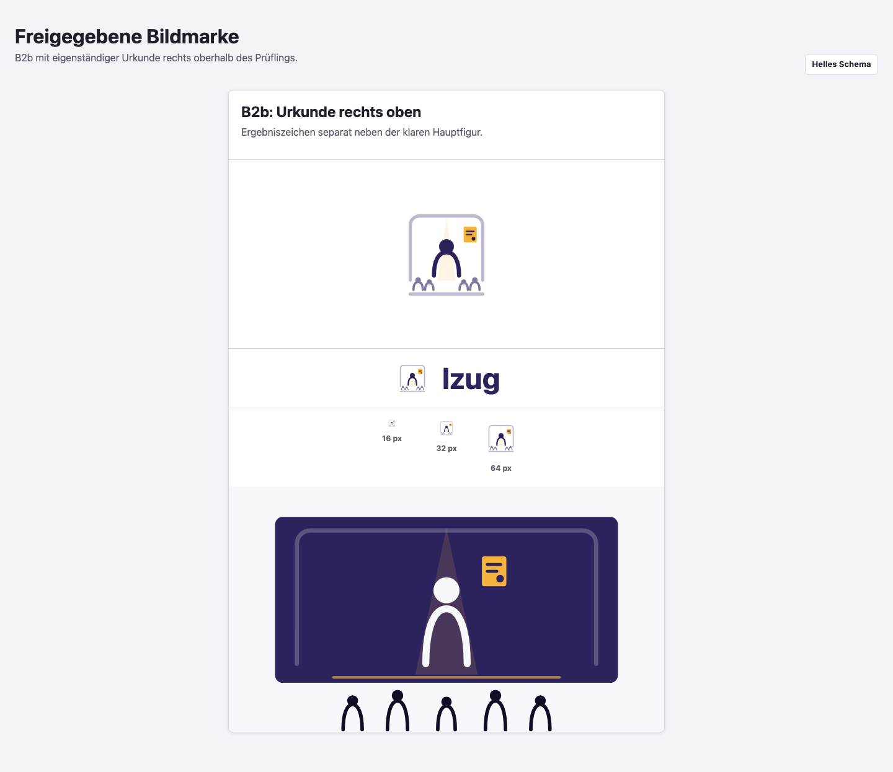
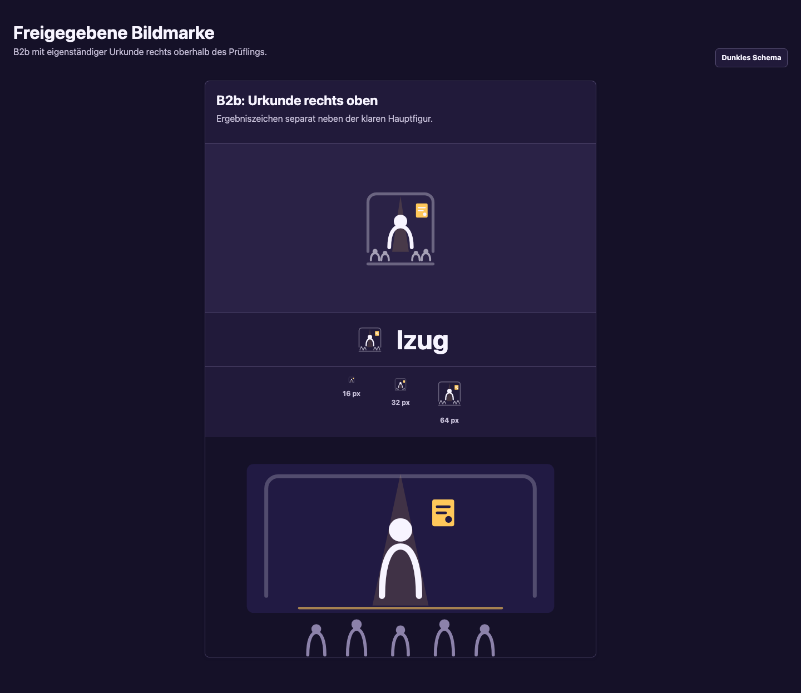

# lzug Corporate Design

## Status

Die Bildmarke **B2b: Urkunde rechts oben** ist durch den Maintainer [kanonisch freigegeben](https://github.com/lxndrp/lzug/issues/568#issuecomment-5512076189).
Die freigegebene Schrift ist [Inter](https://github.com/lxndrp/lzug/issues/568#issuecomment-5514030813).
Produkt, öffentliche Publikation, lokale Schriftauslieferung, Taiga-Adapter und der Lucide-Vertrag werden aus den hier dokumentierten Quellen integriert.
Die finalen Referenzansichten sind durch den Maintainer [kanonisch freigegeben](https://github.com/lxndrp/lzug/issues/568#issuecomment-5515890169).

## Designvertrag

lzug vermittelt Verlässlichkeit, Klarheit, Zusammenarbeit und strukturierte Prüfungsprozesse.
Bühne, Spotlight, Ensemble und Ablauf sind eine subtile zweite Ebene und kein dekoratives Theatermotiv.
Die Marke imitiert weder Behörde, Wappen noch IHK und funktioniert für selbst betriebene Instanzen, Demo, öffentliche Seiten, Dokumentation und Release-Artefakte.

Die vorgeschlagene Farbwelt verbindet einen ruhigen dunkelvioletten Primärbereich mit einem zurückhaltenden Amber-Akzent.
Fachstatus, Interaktion und Diagramme erhalten davon unabhängige semantische Rollen.
Helles und dunkles Schema verwenden dieselben Rollen, aber separat geprüfte Werte.

## Lieferstand

- `brand/source/` enthält ausschließlich die kanonische B2b-Bildmarke und das daraus abgeleitete Key Visual.
- `brand/derived/` enthält die reproduzierbaren Light-, Dark-, Schwarz- und Weißfassungen der Bildmarke und horizontalen Wort-/Bildmarke sowie Favicons, App-Icons, Raster-Key-Visuals und Social Previews.
- `brand/tokens.css` ist die toolkit-neutrale semantische Quelle; `brand/taiga-adapter.css` ordnet die Taiga-Rollen zu.
- Das Produkt bindet die lokal paketierte Inter-Fassung und die abgeleiteten Assets über `frontend/public/brand` ein.
- Die Publikation kopiert dieselben Assets, Tokens und die notwendigen Inter-Subsets beim Build in ihren statischen Ausgabebaum.
- `brand/icon-contract.json` definiert die stabilen semantischen Namen für die lokale Lucide-Auslieferung.

## Kanonischer Logo-Assetvertrag

`brand/source/logo-mark.svg` ist die einzige kanonische Bildmarkenquelle.
`brand/source/key-visual.svg` überträgt dieselbe B2b-Komposition auf das Key Visual.
Der Prüfling bleibt als größter Kopf mit schmaler, offener Schulterlinie die Hauptfigur.
Vier kleinere Köpfe und schmale Büsten bilden in der Bildmarke den nachgeordneten Prüfungsausschuss; im Key Visual sind es fünf.
Bühnenrahmen und Lichtkegel bleiben durch geringere Strichstärke, Deckkraft und Fläche im Hintergrund.
Die Urkunde steht als eigenständiges Ergebniszeichen rechts oberhalb des Prüflings.

`brand/asset-contract.json` benennt Freigabe, Quellen, ViewBoxes, Themefarben, echte Schwarz-/Weißversionen sowie Formate und Größen maschinenlesbar.
`scripts/generate_brand_assets.mjs` erzeugt alle Ableitungen deterministisch mit Resvg aus den kanonischen Vektorquellen.
`task brand:check` stellt sicher, dass keine konkurrierende Logoquelle zurückkehrt, beide SVGs zugänglich und ohne externe Referenzen bleiben, jede geforderte Ableitung existiert und kein thematischer Akzent in eine monochrome Fassung gelangt.
Frühere Varianten einschließlich B2a bleiben ausschließlich als Entscheidungsartefakte in der Git-Historie und in den unveränderlichen Issue-Nachweisen erhalten.

Die Einzelansicht unter `brand/review/evidence/logo-approved-light.png` und `logo-approved-dark.png` zeigt die freigegebene Bildmarke, die Wortmarkenkombination, die unveränderte 16/32/64-Pixel-Probe und das Key Visual.
Der Renderbericht bindet beide kanonischen Quellen über SHA-256 an den Nachweis und prüft SVG-Ladung, tatsächliche Pixelmaße und horizontalen Überlauf.
Die endgültige Wortmarke verwendet Inter und ist im Assetvertrag hinterlegt.

### Helles Schema



### Dunkles Schema



## Ausgelieferte Integration

Der Assetvertrag liefert folgende Ableitungen aus der Bildmarke: Bildmarke und horizontale Wort-/Bildmarke jeweils in Light, Dark, echtem Schwarz und echtem Weiß, kompakte Light-/Dark-Fassungen, Favicon mit 16/32/48 Pixeln sowie App-Icons mit 192/512 Pixeln.
Das Key Visual ist als SVG sowie als PNG mit 1200 und 1600 Pixeln Breite vorhanden.
Die Rasterdateien und das ICO werden im gleichen Durchlauf erzeugt und per Bytevergleich auf Drift geprüft.

Das Produkt verwendet die Wort-/Bildmarke in der Navigation und die abgeleiteten Favicons.
Die öffentliche Publikation erhält helles und dunkles Key Visual sowie die entsprechende Wort-/Bildmarke.
Die finalen Referenzansichten decken kleine Größen, transparente SVGs, helle und dunkle Untergründe sowie die zwei echten monochromen Fassungen ab.

## Schriftvergleich

Die folgenden Vergleichskandidaten sind erhaltene Entscheidungsbelege.
Nur die freigegebene Inter-Fassung ist Teil des Produkt-Bundles.
Alle stammen aus Fontsource 5.3.0, stehen unter OFL-1.1 und enthalten variable Schnitte sowie getrennte Latin-, Greek- und Greek-Extended-Subsets.

| Kandidat      | Upstream-Fassung | Verwendete Achse | WOFF2-Payload der Probe | Charakter im Vergleich                                      |
| ------------- | ---------------- | ---------------- | ----------------------- | ----------------------------------------------------------- |
| Source Sans 3 | v19              | `wght` 200-900   | 53.124 Byte             | ruhig, offen, bereits im Ist-Produkt bekannt                |
| Noto Sans     | v42              | `wght` 100-900   | 68.356 Byte             | neutral, breite Schriftabdeckung, ausgewogenes Tabellenbild |
| Inter         | v20              | `wght` 100-900   | 78.484 Byte             | kompakt und eigenständig, dichtes Tabellenbild              |

Die Probe enthält Navigation, Formular, datenreiche Tabelle, Status, Fehler, Landingpage und mobile Navigation.
Deutsche und polytonisch griechische Zeichen, tabellarische Ziffern, Datum, Zeit, Währung, Sonderzeichen und lange Bezeichnungen sind enthalten.
Jeder Kandidat wird identisch als Desktop im hellen und Mobilansicht im dunklen Schema gerendert.
`brand/review/evidence/render-report.json` weist geladene Subsets, WOFF2-Payload, Upstream, Lizenzhash und Chromium-Fassung aus.

### Source Sans 3


### Noto Sans


### Inter


## Reproduktion und Lieferkette

Inter `5.3.0` stammt aus dem exakt gepinnten Paket `@fontsource-variable/inter`.
`brand/font-contract.json` hält Upstream-Fassung, OFL-1.1-Lizenz, Subsets und Freigabelink fest;
die unveränderte Lizenz liegt unter `brand/licenses/Inter-OFL.txt`.
Produkt und Publikation liefern nur die WOFF2-Subsets `latin`, `greek` und `greek-ext` lokal aus.

```sh
task brand:generate
task brand:check
```

Die Anwendung lädt keine externen Font-, Icon- oder Asset-URLs.
Der Generator läuft browserfrei und prüft das resultierende Inventar im temporären Ausgabeverzeichnis gegen `brand/derived/`.
Die erhaltenen Vergleichsrenders bleiben historische Entscheidungsnachweise; die finale Referenzansicht wird aus dem integrierten Produkt- und Publikationsstand erzeugt.

## Herkunft und Urheberschaft

Leitidee und Markenanforderungen stammen aus Issue #568 und den dort dokumentierten Maintainer-Entscheidungen.
Die SVG-Quellen wurden für lzug als eigenständige geometrische Vektorgestaltungen umgesetzt und enthalten keine fremden Logo-, Marken- oder Iconpfade.
Die Logo-Freigabe gilt für B2b als gestalterische Richtung; Produktintegration und technische Abnahme erfolgen mit den geforderten Prüfungen.

Die Schriftkandidaten stammen aus den exakt bezeichneten Fontsource-Paketen und werden unverändert nur für den Vergleich verwendet.
Paketintegrität, Upstream-Fassung, OFL-Lizenz und die freigegebene Inter-Fassung werden maschinenlesbar geprüft.

## Maintainer-Freigaben

- **Logo:** B2b ist [freigegeben](https://github.com/lxndrp/lzug/issues/568#issuecomment-5512076189).
- **Schrift:** Inter ist [freigegeben](https://github.com/lxndrp/lzug/issues/568#issuecomment-5514030813).
- **Finale Referenzansichten:** Der integrierte Produkt- und Publikationsstand ist [freigegeben](https://github.com/lxndrp/lzug/issues/568#issuecomment-5515890169).

Die Freigaben bestätigen die subjektive visuelle Richtung, nicht die technische Abnahme.
Kontrast, reproduzierbare Assets, Tokenvollständigkeit, lokale Schriftauslieferung, Lucide-Integration und automatisierte Prüfungen bleiben Aufgabe der weiteren Umsetzung.
