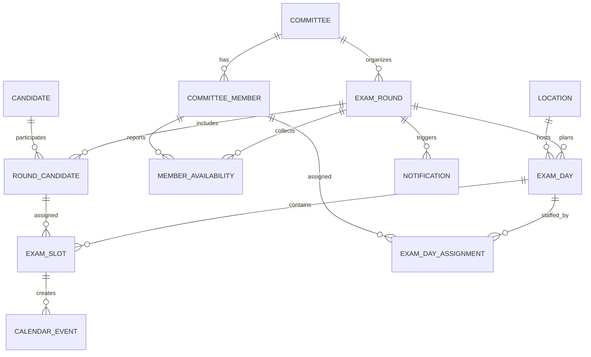

# Prüfwerk – fachliches Datenmodell

Stand: 24.06.2026

Dieses Dokument beschreibt das fachliche Datenmodell für die Server-App. Es bildet den aktuellen klickbaren Prototypen ab und ergänzt die fachlichen Regeln, die später dauerhaft gespeichert, validiert und automatisiert verarbeitet werden sollen.

Ziel ist zunächst kein endgültiges technisches Schema, sondern ein tragfähiges Modell, aus dem anschließend ein SQL-Schema oder ein ORM-Modell abgeleitet werden kann.

## Grundannahmen

- Die App unterstützt einen oder mehrere IHK-Prüfungsausschüsse.
- Im Vordergrund steht die Arbeit des Prüfungsausschusses, nicht die interne IHK-Verwaltung.
- Ein Prüfungsdurchgang entspricht z. B. einer Sommer- oder Winterprüfung.
- Ein Prüfling kann in einem Durchgang eine reguläre Prüfung und zusätzlich eine MEP haben.
- Eine Prüfung bzw. ein Prüfungsslot dauert immer 60 Minuten.
- Prüfungstage beginnen organisatorisch um 08:00 Uhr; der erste Prüfungsslot startet um 08:30 Uhr.
- Wenn eine Mittagspause eingeplant wird, beginnt sie fest um 12:30 Uhr und dauert eine Stunde.
- Vormittag bedeutet: bis zur Mittagspause.
- Nachmittag bedeutet: nach der Mittagspause.
- An jedem Prüfungstag müssen durchgängig mindestens drei Prüfer besetzt sein.
- Die Besetzung muss Arbeitgeberseite, Arbeitnehmerseite und Schulseite abdecken.
- Zusätzlich ist ein Fallback-Prüfer erforderlich.
- An einem Prüfungstag dürfen nicht ausschließlich MEPs stattfinden.

## Überblick der Kernobjekte

## Entitäten

### Prüfungsausschuss

Technischer Name: `committee`

Beschreibt den fachlichen Ausschuss, für den Prüfungsdurchgänge geplant werden.

Felder:

| Feld | Typ | Pflicht | Beschreibung |
| --- | --- | --- | --- |
| `id` | UUID/Integer | ja | Eindeutige ID |
| `name` | Text | ja | Anzeigename, z. B. „PA Fachinformatiker Hamburg 1“ |
| `occupation` | Text | ja | Beruf, zunächst „Fachinformatiker/in“ |
| `created_at` | Zeitstempel | ja | Anlagezeitpunkt |
| `updated_at` | Zeitstempel | ja | Letzte Änderung |

Hinweis: Auch wenn zunächst nur ein Ausschuss unterstützt wird, lohnt sich diese Entität, weil Rechte, Durchgänge und Mitglieder sauber daran hängen.

### Ausschussmitglied / Prüfer

Technischer Name: `committee_member`

Beschreibt eine Person, die im Prüfungsausschuss mitwirkt.

Felder:

| Feld | Typ | Pflicht | Beschreibung |
| --- | --- | --- | --- |
| `id` | UUID/Integer | ja | Eindeutige ID |
| `committee_id` | Fremdschlüssel | ja | Zugehöriger Ausschuss |
| `first_name` | Text | ja | Vorname |
| `last_name` | Text | ja | Nachname |
| `member_status` | Enum | ja | `ordinary`, `deputy` |
| `committee_role` | Enum | ja | `chair`, `deputy_chair`, `member` |
| `representing_side` | Enum | ja | `employer`, `employee`, `school` |
| `email` | Text | ja | E-Mail-Adresse |
| `email_verified_at` | Zeitstempel | nein | Zeitpunkt der E-Mail-Verifikation |
| `mobile` | Text | nein | Mobilfunknummer, zunächst nur Ablage |
| `is_active` | Boolean | ja | Ob das Mitglied aktuell für Planungen berücksichtigt wird |
| `created_at` | Zeitstempel | ja | Anlagezeitpunkt |
| `updated_at` | Zeitstempel | ja | Letzte Änderung |

Fachliche Regeln:

- Pro Ausschuss sollte es genau einen Vorsitzenden geben.
- Pro Ausschuss sollte es genau einen stellvertretenden Vorsitzenden geben.
- Nur Vorsitzender und stellvertretender Vorsitzender dürfen Stammdaten und Planungsdaten bearbeiten.
- Nur der Vorsitzende darf die maximale Anzahl der Prüfungstage pro Woche ändern.

### Benutzerkonto

Technischer Name: `user_account`

Beschreibt den Login-Zugang. Ein Benutzerkonto kann mit einem Ausschussmitglied verbunden sein.

Felder:

| Feld | Typ | Pflicht | Beschreibung |
| --- | --- | --- | --- |
| `id` | UUID/Integer | ja | Eindeutige ID |
| `committee_member_id` | Fremdschlüssel | nein | Zugehöriges Ausschussmitglied |
| `email` | Text | ja | Login-E-Mail |
| `password_hash` | Text | ja | Passwort-Hash |
| `passkey_enabled` | Boolean | ja | Ob Passkey aktiv ist |
| `two_factor_enabled` | Boolean | ja | Ob 2FA aktiv ist |
| `last_login_at` | Zeitstempel | nein | Letzter Login |
| `created_at` | Zeitstempel | ja | Anlagezeitpunkt |
| `updated_at` | Zeitstempel | ja | Letzte Änderung |

Fachliche Regeln:

- Zum Start genügt Passwort-Login.
- 2FA ist nur optional, wenn auch Passkey-Unterstützung angeboten wird.

### Prüfungsort

Technischer Name: `location`

Beschreibt Orte und Räume, in denen Prüfungen stattfinden können.

Felder:

| Feld | Typ | Pflicht | Beschreibung |
| --- | --- | --- | --- |
| `id` | UUID/Integer | ja | Eindeutige ID |
| `committee_id` | Fremdschlüssel | ja | Zugehöriger Ausschuss |
| `name` | Text | ja | Bezeichnung des Prüfungsorts |
| `street` | Text | ja | Straße und Hausnummer |
| `postal_code` | Text | ja | Postleitzahl |
| `city` | Text | ja | Ort |
| `room` | Text | ja | Raum |
| `is_active` | Boolean | ja | Ob der Ort aktuell verwendet wird |
| `created_at` | Zeitstempel | ja | Anlagezeitpunkt |
| `updated_at` | Zeitstempel | ja | Letzte Änderung |

### Prüfling

Technischer Name: `candidate`

Beschreibt die Stammdaten eines Prüflings.

Felder:

| Feld | Typ | Pflicht | Beschreibung |
| --- | --- | --- | --- |
| `id` | UUID/Integer | ja | Eindeutige ID |
| `first_name` | Text | ja | Vorname |
| `last_name` | Text | ja | Nachname |
| `ihk_exam_number` | Text | ja | IHK-Prüfungsnummer |
| `specialization` | Enum | ja | Fachrichtung |
| `training_company` | Text | ja | Ausbildungsbetrieb |
| `created_at` | Zeitstempel | ja | Anlagezeitpunkt |
| `updated_at` | Zeitstempel | ja | Letzte Änderung |

Mögliche Fachrichtungen:

- `application_development` – Anwendungsentwicklung
- `system_integration` – Systemintegration
- `data_and_process_analysis` – Daten- und Prozessanalyse
- `digital_networking` – Digitale Vernetzung

Fachliche Regeln:

- Die IHK-Prüfungsnummer sollte eindeutig sein.
- Beim Import werden Duplikate anhand der IHK-Prüfungsnummer erkannt und automatisch herausgefiltert.

### Prüfungsdurchgang

Technischer Name: `exam_round`

Beschreibt einen konkreten Durchgang, z. B. „Winter 2026/27“.

Felder:

| Feld | Typ | Pflicht | Beschreibung |
| --- | --- | --- | --- |
| `id` | UUID/Integer | ja | Eindeutige ID |
| `committee_id` | Fremdschlüssel | ja | Zuständiger Ausschuss |
| `name` | Text | ja | Anzeigename, z. B. „Winter 2026/27“ |
| `status` | Enum | ja | Status des Durchgangs |
| `availability_deadline` | Datum/Zeit | nein | Rückmeldefrist für Verfügbarkeiten |
| `availability_reminder_at` | Datum/Zeit | nein | Zeitpunkt der Erinnerung nach halber Frist |
| `created_by_member_id` | Fremdschlüssel | ja | Anlegendes Mitglied |
| `created_at` | Zeitstempel | ja | Anlagezeitpunkt |
| `updated_at` | Zeitstempel | ja | Letzte Änderung |

Mögliche Statuswerte:

- `draft` – Entwurf
- `availability_requested` – Verfügbarkeiten angefragt
- `availability_closed` – Rückmeldungen abgeschlossen
- `plan_proposed` – Planungsvorschlag erstellt
- `plan_confirmed` – Termine bestätigt
- `in_progress` – Durchführung läuft
- `completed` – Durchgang abgeschlossen
- `cancelled` – Durchgang abgebrochen

### Prüfling im Prüfungsdurchgang

Technischer Name: `round_candidate`

Verknüpft Prüfling und Prüfungsdurchgang. Hier liegen Angaben, die sich je Durchgang ändern können.

Felder:

| Feld | Typ | Pflicht | Beschreibung |
| --- | --- | --- | --- |
| `id` | UUID/Integer | ja | Eindeutige ID |
| `exam_round_id` | Fremdschlüssel | ja | Prüfungsdurchgang |
| `candidate_id` | Fremdschlüssel | ja | Prüfling |
| `attempt_number` | Integer | ja | Prüfungsversuch, mindestens 1 |
| `requires_mep` | Boolean | ja | Ob eine Mündliche Ergänzungsprüfung erforderlich ist |
| `created_at` | Zeitstempel | ja | Anlagezeitpunkt |
| `updated_at` | Zeitstempel | ja | Letzte Änderung |

Fachliche Regeln:

- Jeder Datensatz erzeugt mindestens einen regulären Prüfungsslot.
- Wenn `requires_mep = true`, wird zusätzlich ein MEP-Slot benötigt.
- MEP-Slots werden am Tagesende geplant.
- Ein Prüfungstag darf nicht nur aus MEP-Slots bestehen.

### Planungsparameter

Technischer Name: `planning_settings`

Beschreibt die Einstellungen für den Planungsvorschlag eines Durchgangs.

Felder:

| Feld | Typ | Pflicht | Beschreibung |
| --- | --- | --- | --- |
| `id` | UUID/Integer | ja | Eindeutige ID |
| `exam_round_id` | Fremdschlüssel | ja | Prüfungsdurchgang |
| `calendar_week_from` | Text/Integerpaar | ja | Erste Kalenderwoche |
| `calendar_week_to` | Text/Integerpaar | ja | Letzte Kalenderwoche |
| `exams_per_day` | Integer | ja | Maximale Prüfungsslots pro Tag |
| `max_exam_days_per_week` | Integer | ja | Maximale Prüfungstage pro Woche, Standard 3 |
| `lunch_break_enabled` | Boolean | ja | Ob Mittagspause eingeplant wird |
| `exclude_public_holidays` | Boolean | ja | Ob gesetzliche Feiertage bei der Tageserzeugung ausgeschlossen werden |
| `holiday_subdivision_code` | Text | nein | Bundesland als ISO-3166-2-Code, wenn Feiertage ausgeschlossen werden |
| `default_location_id` | Fremdschlüssel | nein | Standard-Prüfungsort |
| `updated_by_member_id` | Fremdschlüssel | ja | Letzte Änderung durch |
| `created_at` | Zeitstempel | ja | Anlagezeitpunkt |
| `updated_at` | Zeitstempel | ja | Letzte Änderung |

Fachliche Regeln:

- `exams_per_day` wird durch Vorsitz oder Stellvertretung festgelegt.
- `max_exam_days_per_week` darf nur durch den Vorsitzenden geändert werden.
- Standardwert für `max_exam_days_per_week` ist 3.
- Bei aktivem Feiertagsausschluss ist ein gültiger ISO-3166-2-Code eines deutschen Bundeslands erforderlich.
- Berücksichtigt werden bundesweite und landesweit geltende Feiertage; rein lokale Sonderregeln werden nicht automatisch abgeleitet.

### Möglicher Prüfungstag

Technischer Name: `candidate_exam_day`

Beschreibt einen möglichen Prüfungstag innerhalb des Planungszeitraums, bevor daraus ein bestätigter Prüfungstag wird.

Felder:

| Feld | Typ | Pflicht | Beschreibung |
| --- | --- | --- | --- |
| `id` | UUID/Integer | ja | Eindeutige ID |
| `exam_round_id` | Fremdschlüssel | ja | Prüfungsdurchgang |
| `date` | Datum | ja | Kalendertag |
| `is_active` | Boolean | ja | Ob der Tag für die Planung berücksichtigt wird |
| `created_at` | Zeitstempel | ja | Anlagezeitpunkt |
| `updated_at` | Zeitstempel | ja | Letzte Änderung |

### Verfügbarkeit eines Ausschussmitglieds

Technischer Name: `member_availability`

Beschreibt die Rückmeldung eines Mitglieds für einen möglichen Prüfungstag.

Felder:

| Feld | Typ | Pflicht | Beschreibung |
| --- | --- | --- | --- |
| `id` | UUID/Integer | ja | Eindeutige ID |
| `exam_round_id` | Fremdschlüssel | ja | Prüfungsdurchgang |
| `committee_member_id` | Fremdschlüssel | ja | Ausschussmitglied |
| `candidate_exam_day_id` | Fremdschlüssel | ja | Möglicher Prüfungstag |
| `availability` | Enum | ja | Verfügbarkeit |
| `responded_at` | Zeitstempel | nein | Zeitpunkt der Rückmeldung |
| `created_at` | Zeitstempel | ja | Anlagezeitpunkt |
| `updated_at` | Zeitstempel | ja | Letzte Änderung |

Mögliche Werte für `availability`:

- `full_day` – ganztägig verfügbar
- `morning` – vormittags verfügbar
- `afternoon` – nachmittags verfügbar
- `unavailable` – nicht verfügbar
- `pending` – offen

Fachliche Regeln:

- Bei Ablauf der Rückmeldefrist werden Mitglieder mit offener Rückmeldung benachrichtigt.
- Nach der Hälfte der Frist werden offene Rückmeldungen erinnert.

### Prüfungstag

Technischer Name: `exam_day`

Beschreibt einen konkret geplanten oder bestätigten Prüfungstag.

Felder:

| Feld | Typ | Pflicht | Beschreibung |
| --- | --- | --- | --- |
| `id` | UUID/Integer | ja | Eindeutige ID |
| `exam_round_id` | Fremdschlüssel | ja | Prüfungsdurchgang |
| `location_id` | Fremdschlüssel | ja | Prüfungsort |
| `date` | Datum | ja | Prüfungstag |
| `status` | Enum | ja | Status des Tages |
| `lunch_break_enabled` | Boolean | ja | Ob Mittagspause eingeplant ist |
| `created_from_proposal` | Boolean | ja | Ob der Tag aus dem Vorschlagswesen stammt |
| `created_at` | Zeitstempel | ja | Anlagezeitpunkt |
| `updated_at` | Zeitstempel | ja | Letzte Änderung |

Mögliche Statuswerte:

- `proposed` – vorgeschlagen
- `confirmed` – bestätigt
- `changed` – geändert
- `cancelled` – abgesagt
- `completed` – durchgeführt

Fachliche Regeln:

- Ein bestätigter Prüfungstag erzeugt Kalendereinladungen.
- Wird ein bestätigter Tag geändert, werden aktualisierte Kalendereinladungen verschickt.
- Wenn kein Ersatzprüfer gefunden werden kann, wird die IHK über den Ausfall des Prüfungstags informiert.

### Prüfungsslot

Technischer Name: `exam_slot`

Beschreibt einen konkreten Prüfungstermin innerhalb eines Prüfungstags.

Felder:

| Feld | Typ | Pflicht | Beschreibung |
| --- | --- | --- | --- |
| `id` | UUID/Integer | ja | Eindeutige ID |
| `exam_day_id` | Fremdschlüssel | ja | Prüfungstag |
| `round_candidate_id` | Fremdschlüssel | ja | Prüfling im Durchgang |
| `slot_type` | Enum | ja | Art des Slots |
| `starts_at` | Zeitstempel | ja | Startzeit |
| `ends_at` | Zeitstempel | ja | Endzeit |
| `sequence_number` | Integer | ja | Reihenfolge innerhalb des Tages |
| `status` | Enum | ja | Status des Slots |
| `created_at` | Zeitstempel | ja | Anlagezeitpunkt |
| `updated_at` | Zeitstempel | ja | Letzte Änderung |

Mögliche Werte für `slot_type`:

- `regular` – reguläre Prüfung
- `mep` – Mündliche Ergänzungsprüfung

Mögliche Statuswerte:

- `proposed`
- `confirmed`
- `rescheduled`
- `cancelled`
- `completed`

Fachliche Regeln:

- Jeder Slot dauert 60 Minuten.
- MEP-Slots liegen am Ende des Tages.
- Die konkrete Reihenfolge regulärer Prüflinge spielt zunächst keine Rolle und kann später durch die IHK vorgegeben werden.
- Abgesagte oder verschobene Prüfungen starten den Terminfindungsprozess neu.

### Besetzung eines Prüfungstags

Technischer Name: `exam_day_assignment`

Beschreibt, welche Prüfer an einem Prüfungstag für eine Tageshälfte oder als Fallback eingeplant sind.

Felder:

| Feld | Typ | Pflicht | Beschreibung |
| --- | --- | --- | --- |
| `id` | UUID/Integer | ja | Eindeutige ID |
| `exam_day_id` | Fremdschlüssel | ja | Prüfungstag |
| `committee_member_id` | Fremdschlüssel | ja | Ausschussmitglied |
| `assignment_role` | Enum | ja | Rolle in der Besetzung |
| `day_part` | Enum | ja | Tagesabschnitt |
| `fallback_status` | Enum | nein | Status der Fallback-Bestätigung |
| `created_at` | Zeitstempel | ja | Anlagezeitpunkt |
| `updated_at` | Zeitstempel | ja | Letzte Änderung |

Mögliche Werte für `assignment_role`:

- `examiner` – regulärer Prüfer
- `fallback` – Fallback-Prüfer

Mögliche Werte für `day_part`:

- `morning`
- `afternoon`
- `full_day`

Mögliche Werte für `fallback_status`:

- `not_required`
- `requested`
- `confirmed`
- `declined`
- `expired`

Fachliche Regeln:

- Pro Tagesabschnitt müssen mindestens drei reguläre Prüfer eingeplant sein.
- Arbeitgeberseite, Arbeitnehmerseite und Schulseite müssen je Tagesabschnitt vertreten sein.
- Der Fallback muss ausdrücklich bestätigen.
- Erfolgt die Fallback-Bestätigung nicht innerhalb von 24 Stunden, werden Vorsitz und Stellvertretung benachrichtigt und weitere Mitglieder angefragt.
- Ist die Ausfallmeldung jünger als 36 Stunden vor Prüfungsbeginn, werden alle Mitglieder sofort mit Dringlichkeit benachrichtigt.
- Wenn mehrere Mitglieder einspringen können, wählt der Vorsitzende den Ersatz aus.

### Ausfallmeldung

Technischer Name: `absence_report`

Beschreibt, dass ein eingeplantes Mitglied kurzfristig ausfällt.

Felder:

| Feld | Typ | Pflicht | Beschreibung |
| --- | --- | --- | --- |
| `id` | UUID/Integer | ja | Eindeutige ID |
| `exam_day_id` | Fremdschlüssel | ja | Betroffener Prüfungstag |
| `committee_member_id` | Fremdschlüssel | ja | Ausfallendes Mitglied |
| `reported_at` | Zeitstempel | ja | Zeitpunkt der Meldung |
| `reason` | Text | nein | Optionaler Grund |
| `status` | Enum | ja | Bearbeitungsstatus |
| `selected_replacement_member_id` | Fremdschlüssel | nein | Gewählter Ersatz |
| `created_at` | Zeitstempel | ja | Anlagezeitpunkt |
| `updated_at` | Zeitstempel | ja | Letzte Änderung |

Mögliche Statuswerte:

- `reported`
- `fallback_requested`
- `fallback_confirmed`
- `fallback_expired`
- `replacement_requested`
- `replacement_selected`
- `no_replacement_available`
- `exam_day_cancelled`
- `resolved`

### Ersatzbereitschaft

Technischer Name: `replacement_response`

Beschreibt die Antwort eines Mitglieds auf eine Ersatzanfrage.

Felder:

| Feld | Typ | Pflicht | Beschreibung |
| --- | --- | --- | --- |
| `id` | UUID/Integer | ja | Eindeutige ID |
| `absence_report_id` | Fremdschlüssel | ja | Ausfallmeldung |
| `committee_member_id` | Fremdschlüssel | ja | Angefragtes Mitglied |
| `response` | Enum | ja | Antwort |
| `responded_at` | Zeitstempel | nein | Zeitpunkt der Antwort |
| `created_at` | Zeitstempel | ja | Anlagezeitpunkt |
| `updated_at` | Zeitstempel | ja | Letzte Änderung |

Mögliche Werte:

- `pending`
- `available`
- `unavailable`

### Benachrichtigung

Technischer Name: `notification`

Beschreibt eine fachliche Nachricht, die per E-Mail verschickt werden soll oder verschickt wurde.

Felder:

| Feld | Typ | Pflicht | Beschreibung |
| --- | --- | --- | --- |
| `id` | UUID/Integer | ja | Eindeutige ID |
| `exam_round_id` | Fremdschlüssel | nein | Zugehöriger Durchgang |
| `recipient_member_id` | Fremdschlüssel | nein | Empfänger, falls Ausschussmitglied |
| `recipient_email` | Text | ja | Empfängeradresse |
| `notification_type` | Enum | ja | Art der Benachrichtigung |
| `subject` | Text | ja | Betreff |
| `body` | Text | ja | Inhalt |
| `status` | Enum | ja | Versandstatus |
| `scheduled_at` | Zeitstempel | nein | Geplanter Versandzeitpunkt |
| `sent_at` | Zeitstempel | nein | Versandzeitpunkt |
| `created_at` | Zeitstempel | ja | Anlagezeitpunkt |
| `updated_at` | Zeitstempel | ja | Letzte Änderung |

Mögliche Benachrichtigungstypen:

- `exam_round_created`
- `availability_requested`
- `availability_reminder`
- `availability_deadline_missed`
- `plan_confirmed`
- `plan_changed`
- `examiner_absence_reported`
- `fallback_confirmation_requested`
- `fallback_confirmation_expired`
- `replacement_requested`
- `urgent_replacement_requested`
- `exam_day_cancelled_ihk_notice`

Hinweis: Unzustellbare E-Mails werden zunächst nicht fachlich behandelt, weil E-Mail-Adressen bei Anlage verifiziert werden.

### Kalendereinladung

Technischer Name: `calendar_event`

Beschreibt eine Kalendereinladung zu einem bestätigten oder geänderten Termin.

Felder:

| Feld | Typ | Pflicht | Beschreibung |
| --- | --- | --- | --- |
| `id` | UUID/Integer | ja | Eindeutige ID |
| `exam_slot_id` | Fremdschlüssel | nein | Konkreter Prüfungsslot |
| `exam_day_id` | Fremdschlüssel | nein | Prüfungstag, falls ganztägige Einladung |
| `recipient_member_id` | Fremdschlüssel | nein | Empfänger |
| `external_event_id` | Text | nein | ID des technischen Kalenderdienstes |
| `status` | Enum | ja | Status der Einladung |
| `sent_at` | Zeitstempel | nein | Versandzeitpunkt |
| `created_at` | Zeitstempel | ja | Anlagezeitpunkt |
| `updated_at` | Zeitstempel | ja | Letzte Änderung |

Mögliche Statuswerte:

- `pending`
- `sent`
- `updated`
- `cancelled`

## Wichtige fachliche Validierungen

### Prüfungsslot-Erzeugung

Für jeden `round_candidate` gilt:

- Es wird genau ein regulärer Slot benötigt.
- Wenn `requires_mep = true`, wird zusätzlich genau ein MEP-Slot benötigt.

### MEP-Planung

Für jeden `exam_day` gilt:

- MEP-Slots müssen am Ende des Tages liegen.
- Ein Tag darf nicht ausschließlich aus MEP-Slots bestehen.
- Es muss also mindestens einen regulären Prüfungsslot pro Prüfungstag geben.

### Besetzung

Für jeden relevanten Tagesabschnitt eines `exam_day` gilt:

- Mindestens drei reguläre Prüfer.
- Mindestens eine Person von Arbeitgeberseite.
- Mindestens eine Person von Arbeitnehmerseite.
- Mindestens eine Person von Schulseite.
- Ein zusätzlicher Fallback-Prüfer.
- Der Fallback darf nicht gleichzeitig regulärer Prüfer desselben Abschnitts sein.

### Terminfindung

Der Planungsvorschlag soll:

- möglichst volle Tage bevorzugen,
- nur auf mehr Tage aufteilen, wenn Verfügbarkeiten oder maximale Tageskapazität es erfordern,
- die maximale Anzahl an Prüfungstagen pro Woche beachten,
- die maximale Anzahl an Prüfungen pro Tag beachten,
- die optional festgelegte Mittagspause berücksichtigen,
- den Vorsitzenden erlauben, Vorschläge manuell zu überschreiben.

### Ausfallprozess

Wenn ein Prüfer ausfällt:

1. Fallback, Vorsitzender und stellvertretender Vorsitzender werden sofort benachrichtigt.
2. Der Fallback muss ausdrücklich bestätigen.
3. Erfolgt innerhalb von 24 Stunden keine Bestätigung, werden Vorsitz und Stellvertretung benachrichtigt und alle weiteren Mitglieder angefragt.
4. Liegt die Ausfallmeldung weniger als 36 Stunden vor Prüfungsbeginn, werden alle Mitglieder sofort mit Dringlichkeit angefragt.
5. Wenn mehrere Mitglieder zusagen, wählt der Vorsitzende den Ersatz aus.
6. Wenn kein Ersatz gefunden wird, wird die IHK über den Ausfall des Prüfungstags informiert.
7. Für abgesagte oder verschobene Prüfungen startet der Terminfindungsprozess neu.

## Kandidaten für technische Indizes und Constraints

Diese Punkte sind für das spätere SQL-Schema wichtig:

- `candidate.ihk_exam_number` eindeutig.
- `committee_member.email` eindeutig je Ausschuss.
- Pro `exam_round` und `candidate` nur ein `round_candidate`.
- Pro `exam_round`, `committee_member` und `candidate_exam_day` nur eine Verfügbarkeit.
- Pro `exam_day` und `sequence_number` nur ein Prüfungsslot.
- Pro `exam_day`, `committee_member`, `day_part` und `assignment_role` keine doppelten Besetzungen.
- `round_candidate.attempt_number >= 1`.
- `planning_settings.max_exam_days_per_week >= 1`.
- `planning_settings.exams_per_day >= 1`.
- `exam_slot.ends_at > exam_slot.starts_at`.

## Noch bewusst offen

Diese Punkte wurden fachlich noch nicht final festgelegt und sollten vor der produktiven Umsetzung entschieden werden:

- Hosting und Betriebsmodell.
- Konkreter E-Mail-Dienst.
- Konkreter Kalenderdienst.
- Datenschutz- und Löschfristen.
- Audit-Logging und Änderungsverlauf.
- Ob Ausbildungsbetriebe später als eigene Entität modelliert werden.
- Ob Prüflinge eigene Benutzerkonten bekommen. Aktuell: nein.
- Ob IHK-Mitarbeiter eigene Benutzerkonten bekommen. Aktuell: nicht im Fokus.
- Detailmodell für Antragsgenehmigung und Dokumentationsbewertung.

## Empfehlung für die erste Server-Version

Für die erste persistente Server-App reicht ein fokussierter Kern:

1. `committee`
2. `committee_member`
3. `user_account`
4. `location`
5. `candidate`
6. `exam_round`
7. `round_candidate`
8. `planning_settings`
9. `candidate_exam_day`
10. `member_availability`
11. `exam_day`
12. `exam_slot`
13. `exam_day_assignment`

Benachrichtigungen, Kalendereinladungen und Ausfallprozesse können danach als zweite Ausbaustufe ergänzt werden, ohne das Kernmodell umzubauen.
