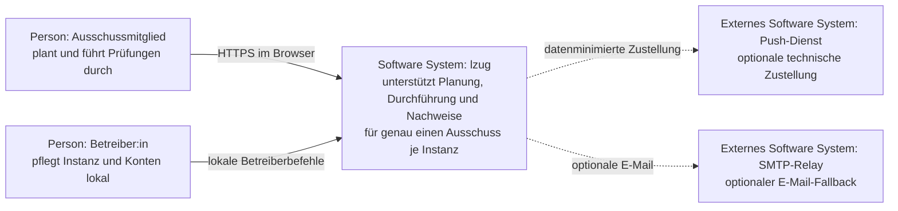
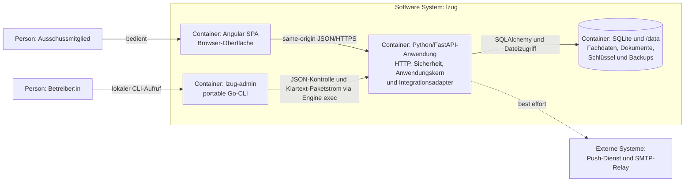
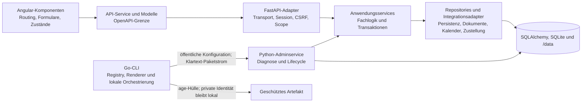
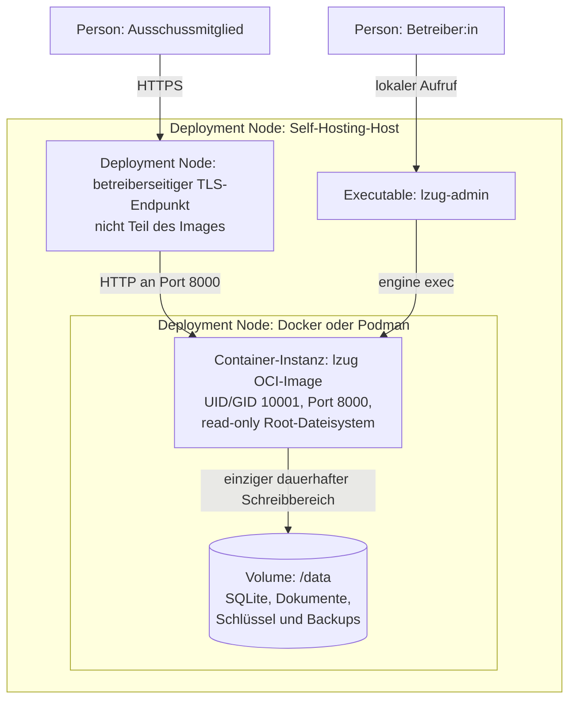
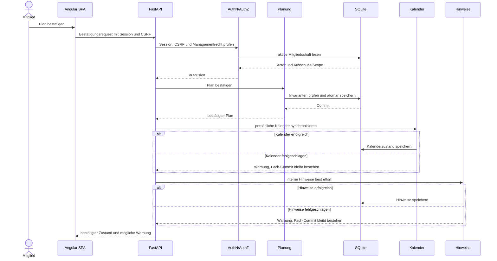

# Architektur und Entscheidungen

`lzug` ist ein modularer Monolith für die Arbeit eines Prüfungsausschusses.
Die Übersicht verwendet die für das Projekt hilfreichen arc42-Blickrichtungen
und C4-Abstraktionen, ohne eine vollständige Schablone oder eine zweite
technische Referenz zu pflegen.
Code, Schema, Migrationen, OpenAPI, Containerverträge und Workflows bleiben für
ihre Details maßgeblich.

## Systemkontext

Fachliche Arbeit ist auf aktive Mitgliedschaften der lokalen Instanz begrenzt.
Betreiberzugriffe bleiben lokal und verleihen keine fachlichen Rechte.
Push und SMTP sind optionale technische Kanäle; ihr Ausfall entfernt weder
interne Hinweise noch einen bereits bestätigten Fachzustand.
Eine zentrale IHK-Plattform und ein externer Identitätsprovider gehören nicht
zum aktuellen System.

## Container-Sicht

Im C4-Sinn bezeichnet ein Container eine laufende Anwendung oder einen
Datenspeicher, nicht nur einen OCI-Container.

Browser-Bundle und Python-Anwendung werden gemeinsam im OCI-Image
ausgeliefert, bleiben aber getrennte C4-Container mit einer HTTP-Grenze.
`lzug-admin` ruft den lokalen Adminprozess im laufenden oder ausdrücklich
vorbereiteten Wartungscontainer auf und öffnet keinen Netzwerk-Adminendpunkt.

## Komponenten-Sicht

Die statische Go-Registry trennt Command-Metadaten, Validierung,
Backendauftrag, Transport und Darstellung und wird in einer sichtbaren
Composition Root explizit verdrahtet.
Transport- und Adapterdetails dürfen keine Fachlogik duplizieren.
Services und Repositories bleiben frameworkunabhängig; HTTP und Adminprozess
verwenden dieselben fachlichen und betrieblichen Kernverträge.
Die Verantwortungen und Testeinstiege sind unter
[Komponenten](components.md) zusammengefasst.

## Deployment-Sicht

Der direkte Einstieg `lzug-admin <objekt> <aktion>` und der geführte Einstieg
`lzug-admin cli` enden in derselben statischen Registry und demselben
Ausführungspfad.
Der Dialog ergänzt ausschließlich Navigation, Eingabe, Zusammenfassung und
Statusrückmeldung.
Er enthält weder eigene Commandparameter noch Backendaufträge oder
Fachlogik und kann deshalb künftige Transportadapter verwenden, ohne die
Bedien- oder Commandverträge zu duplizieren.

Die unterstützte Referenz ist eine einzelne Self-Hosting-Instanz mit
persistenter `/data`-Grenze.
TLS-Terminierung, Host-Härtung, Schlüsselverwahrung, Sicherung und
Aufbewahrung liegen in Betreiberverantwortung und sind im
[Wiki](https://github.com/lxndrp/lzug/wiki/Administration) beschrieben.
Die öffentliche Demo ist eine getrennte flüchtige Azure-Assembly mit
synthetischem Basisseed und kein Self-Hosting-Muster.
Ihre Runtime-Policy erzeugt je Besuch eine isolierte SQLite-Arbeitskopie,
bindet Rollenwechsel an dieselbe absolute 60-Minuten-Frist und entfernt den
Arbeitsstand bei Ablauf, Reset oder Abmeldung.

## Kritischer Ablauf: Plan bestätigen

Session, CSRF und Ausschussrecht werden vor der Fachoperation geprüft.
Planungsinvarianten und Statuswechsel liegen in der fachlichen Transaktion.
Kalender- und Benachrichtigungsfolgen laufen danach getrennt; ihre Fehler sind
sichtbar und wiederholbar, rollen den bestätigten Plan aber nicht zurück.

## Architekturprinzipien

1. **Modularer Monolith vor verteilter Komplexität.** Fachliche Module bleiben
   im gemeinsamen Anwendungskern getrennt, solange unabhängige Auslieferung
   keinen belegten Nutzen hat.
2. **Eine Instanz, ein Ausschuss, ein lokaler Betriebsbereich.**
   Ausschussdaten und fachliche Rollen bleiben instanzbezogen;
   Betreiberrechte ersetzen keine Mitgliedschaft.
3. **Verträge sind an jeder Außengrenze explizit.** OpenAPI, Admin-JSON,
   OCI-Konfiguration, Schema, Migrationen und Artefaktformate sind
   überprüfbare Verträge.
4. **Der Anwendungskern bleibt von Adaptern unabhängig.** HTTP, Persistenz,
   Benachrichtigung, Kalender und CLI übersetzen an klaren Grenzen und
   duplizieren keine Fachlogik.
5. **Datenhaltung entwickelt sich vorwärts und erhält Nachweise.**
   Schemaänderungen verwenden geordnete Migrationen; fachliche Versionen und
   Korrekturen überschreiben frühere Stände nicht stillschweigend.
6. **Sicherheitsgrenzen sind serverseitig und fail-closed.** Identität, CSRF,
   Ausschuss-Scope, Rollen, Betreiberzugriff, Uploads und Konfiguration werden
   an der kontrollierenden Grenze validiert.
7. **Externe Integrationen gefährden keinen bestätigten Fachzustand.**
   Kalender, Push und E-Mail sind idempotent oder best effort entkoppelt.
8. **Daten werden minimiert und Änderungen bleiben nachvollziehbar.**
   Schnittstellen, Logs, Diagnosen und Integrationen geben nur den für Zweck
   und Empfänger notwendigen Inhalt aus.
9. **Jeder Gegenstand hat eine maßgebliche Quelle.** Ausführbarer Code,
   deklarative Verträge, ADRs, Handbuch, Wiki und GitHub-Artefakte behalten
   klar getrennte Zuständigkeiten.
10. **Prüftiefe folgt Risiko und Auswirkungsbreite.** Eng begrenzte Änderungen
    erhalten fokussierte Nachweise; Verträge, Sicherheit, Migrationen,
    Toolchain und Querschnittsänderungen benötigen breitere Prüfung.

## Querschnittliche Grenzen

**Authentifizierung und Autorisierung:** Kontenidentität, Betreiberstatus,
Person und Ausschussmitgliedschaft sind getrennt.
Opaque Sessions, sichere Cookies, CSRF, Actor-Auflösung und fachliche Scopes
werden serverseitig durchgesetzt.
Kennwort/TOTP, Einladungen und Recovery verwenden kontrollierte lokale
Verträge; Secrets und Token erscheinen weder in URLs noch in Logs.

**Persistenz und Dokumente:** Fachtransaktion, Dokumentablage und
Snapshot-Sperre besitzen eine gemeinsame kontrollierte Grenze.
Migrationen laufen vorwärts, und Restore aktiviert Datenbank, Dokumente und
Authentifizierungsschlüssel erst nach vollständiger Vor- und Nachprüfung.
Die CLI legt die age-Hülle um den Backend-Paketstrom; private Identitäten
verlassen den Bedienrechner nicht.

**Betrieb und Observability:** Health ist nur Liveness, Ready prüft
Anwendungsbereitschaft, und `lzug-admin system doctor` ergänzt lokale Schema-,
Konfigurations-, Persistenz- und Speicherprüfungen.
Diagnosen, strukturierte Ereignisse und Workflow-Zusammenfassungen bleiben
geheimnisfrei; sie belegen ohne entsprechende Evidenz keinen produktiven
Betriebszustand.

**Öffentliche Demo:** Die Demo verwendet ein unveränderliches App-/Seed-Paar,
flüchtigen Zustand und synthetische Daten.
Die fachlichen Demo-Szenarien laufen in regulären Produktansichten gegen einen
besucherspezifischen Arbeitsstand; produktive Autorisierung und eine enge
rollen- und zustandsgebundene Demo-Allowlist müssen gemeinsam erfüllt sein.
Benachrichtigungen bleiben intern, persönliche Kalenderereignisse sind nur als
eigene Einzeltermine abrufbar und externe Zustellung ist deaktiviert.
OIDC, Environment-Gates, Readiness und Smoke grenzen die technische Promotion
ab; sie begründen keine Produktivitätszusage.

## Risikobasierte Architekturprüfung

- Bleiben Systemgrenze, Verantwortungen und betroffene ADRs
  widerspruchsfrei, oder ist eine neue langfristige Entscheidung nötig?
- Sind Abhängigkeiten, Transaktionen, Seiteneffekte und Fehlerpfade mit ihren
  Auswirkungen beschrieben?
- Bleiben Identität, Ausschuss-Scope, Datenminimierung und Betreibergrenzen
  serverseitig durchgesetzt?
- Sind Migration, Kompatibilität, Wiederanlauf sowie gegebenenfalls Backup und
  Restore nachvollziehbar?
- Passen Konfiguration, Deployment, Readiness, Diagnose und Rückfallgrenze zum
  Betriebsmodell?
- Decken Tests und Dokumentation das konkrete Risiko und die betroffenen
  Schichten ab?

Der [OWASP Application Security Verification Standard](https://owasp.org/www-project-application-security-verification-standard/)
wird nur bei berührten Anwendungssicherheitsrisiken herangezogen.
Das [Azure Well-Architected Framework](https://learn.microsoft.com/azure/well-architected/what-is-well-architected-framework)
ist nur für Änderungen an der Azure-Demo relevant.
Eine pauschale Konformität wird nicht behauptet.

Langfristige Entscheidungen stehen ausschließlich im
[ADR-Register](decisions/index.md).
Ein ADR erklärt Richtung, Alternativen und Konsequenzen, nicht aktuelle
Routen-, Feld- oder Workflowdetails.
