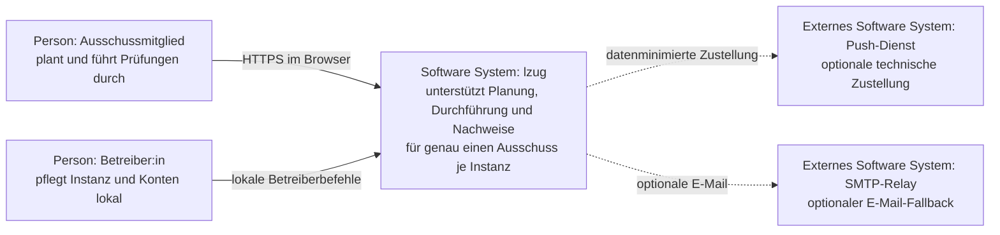
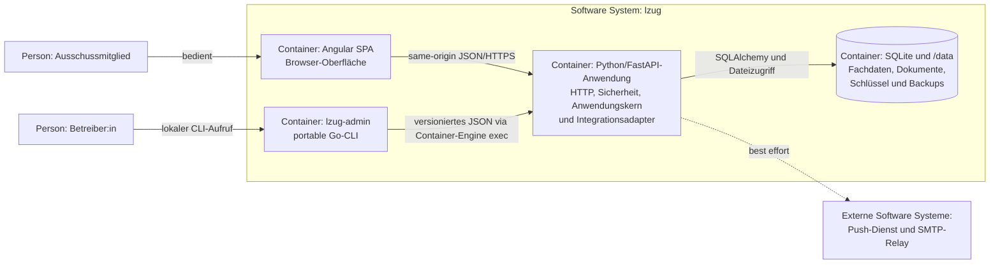
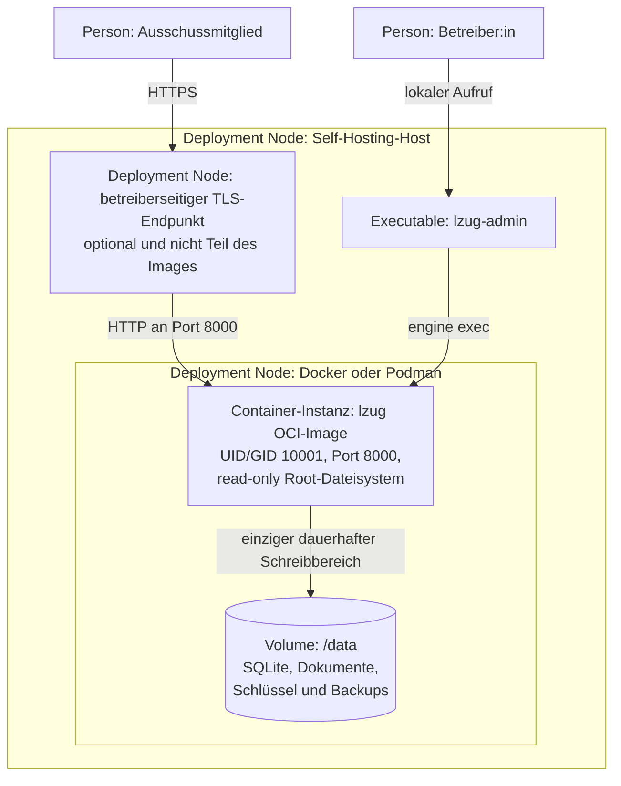
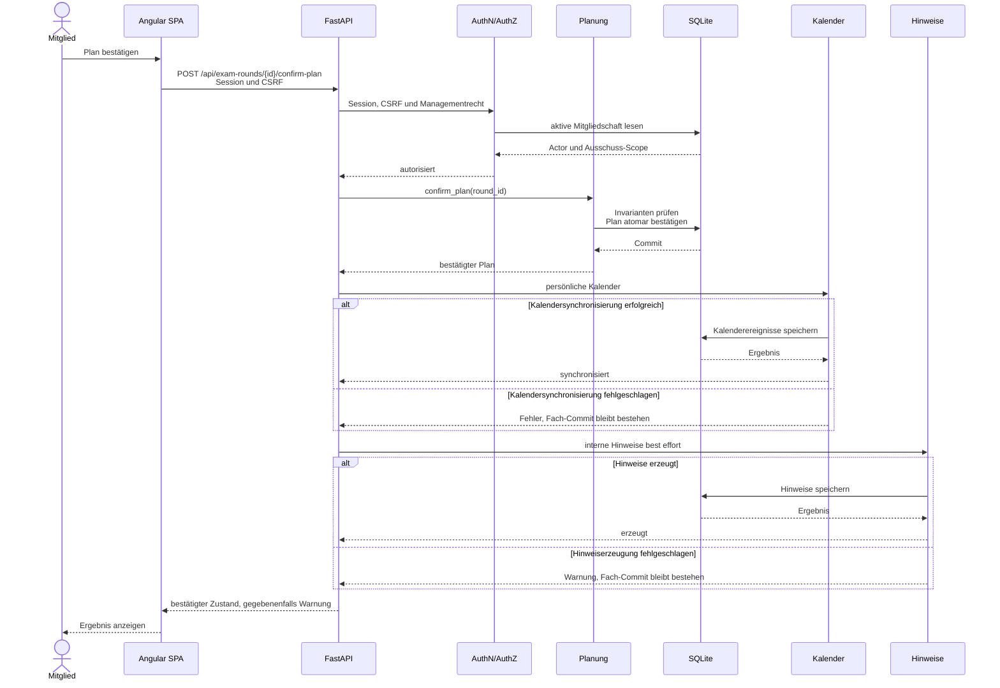

# Architekturansichten

Diese Sichten verwenden C4-Begriffe und C4-Abstraktionsebenen in stabiler Mermaid-`flowchart`-Syntax.
Sie zeigen Orientierung und bewusste Grenzen, keine vollständige Inventarliste aller Klassen, Tabellen, Routen oder Azure-Ressourcen.
Die ausführbaren Quellen und die verlinkten Detailseiten bleiben maßgeblich.

## Systemkontext

Fachliche Arbeit ist immer auf aktive Mitgliedschaften des Ausschusses begrenzt.
Betreiberzugriffe bleiben lokal und verleihen keine fachlichen Rechte.
Push-Dienst und SMTP-Relay sind optionale technische Kanäle; ohne sie bleibt der interne Hinweis erhalten.
Eine zentrale IHK-Plattform oder ein externer Identitätsprovider gehört derzeit nicht zum laufenden System.

## Container-Sicht

Im C4-Sinn bezeichnet ein Container hier eine laufende Anwendung oder einen Datenspeicher, nicht nur einen OCI-Container.

Das Browser-Bundle und die Python-Anwendung werden gemeinsam im OCI-Image ausgeliefert, bleiben aber getrennte C4-Container mit einer HTTP-Grenze.
Die Python-Anwendung hält HTTP, Authentifizierung, frameworkfreie Anwendungsservices, Repositories und Integrationsadapter in einem Prozess.
Die [Backend-Übersicht](backend.md) beschreibt diese internen Komponenten, ohne sie fälschlich als unabhängig deploybare Dienste darzustellen.
`lzug-admin` kennt weder SQLite noch SQLAlchemy; es ruft das versionierte lokale Admin-Protokoll im laufenden Anwendungscontainer auf.

## Deployment-Sicht

Das Diagramm zeigt die unterstützte Self-Hosting-Grenze einer Instanz.
TLS-Terminierung, Host-Härtung, Sicherung und Wiederherstellung liegen in der Betreiberverantwortung und werden nicht durch das Image erfunden.
Der Container kann mit schreibgeschütztem Root-Dateisystem laufen; `/data` trägt den gesamten dauerhaften Zustand einschließlich des lokalen Authentifizierungsschlüssels.
Details stehen im [OCI-Runtime-Vertrag](oci-runtime.md).
Die [öffentliche Demo](../demo-deployment.md) ist eine separate flüchtige Azure-Assembly mit synthetischen Daten und kein Vorbild für persistentes Self-Hosting.

## Kritischer Ablauf: Plan bestätigen

Die Planbestätigung zeigt die zentrale Sicherheits- und Transaktionsgrenze sowie die bewusste Entkopplung technischer Folgen.

Session, CSRF und Ausschussrecht werden vor der Fachoperation geprüft.
Die Planungsinvarianten und der Statuswechsel werden in der fachlichen Transaktion bestätigt.
Kalender- und Benachrichtigungsfolgen laufen danach best effort; ein Fehler bleibt sichtbar, rollt den bestätigten Plan aber nicht zurück.
Die spätere technische Zustellung wird getrennt durch `lzug-admin process-notifications` verarbeitet und kann keine Exactly-once-Garantie gegenüber externen Kanälen geben.
