# Backend-Vertrag

Diese Seite legt Zielverantwortungen, Ports, Transaktionsgrenzen,
Lebensdauern und den schrittweisen Übergang für das Backend fest.
Sie ergänzt die aktuelle Implementierungsbeschreibung unter
[Komponenten](components.md#backend) und die
[Architekturübersicht](architecture.md).
Langfristige Leitplanken und ihre Begründung stehen in
[ADR-0041](decisions/0041-backend-modulverantwortung-und-use-case-vertraege.md).

## Zielgraph

```mermaid
flowchart TB
  http["FastAPI HTTP-Adapter"]
  admin["Unix-Socket Admin-Adapter"]
  composition["Composition Root\nKonfiguration und Lebensdauer"]
  app["application\nUse-Case-Koordination und Cross-Domain-UoW"]
  planning["planning\nPlanung, Rundenorganisation, Prüfungsorte"]
  execution["execution\nAnwesenheit, Protokolle, Tagesabschluss, Wiederöffnung"]
  assessment["assessment\nBewertung und Ergebnisse"]
  identity["identity\nKonten, Personen, Mitgliedschaften, Autorisierung"]
  calendar["calendar\nFeed-Lifecycle, Eventprojektion und ICS"]
  notifications["notifications\nClaim, Zustellentscheidung, Abschluss"]
  documents["documents\nDokumenteninhalt und Metadaten"]
  operations["operations\ntechnische Instanz, Lifecycle und Wartung"]
  presentation["presentation\npure Darstellung"]
  persistence["persistence\nSQLAlchemy, SQLite, Schema und Sessionadapter"]
  integrations["integrations\nkonkrete Provider- und Dateiadapter"]

  http -->|cross-domain use cases| app
  http -->|single-domain use cases| planning
  http -->|single-domain use cases| execution
  http -->|single-domain use cases| assessment
  http -->|single-domain use cases| identity
  http -->|single-domain use cases| calendar
  http -->|single-domain use cases| notifications
  http -->|single-domain use cases| documents
  admin -->|cross-domain use cases| app
  admin -->|single-domain use cases| operations
  composition --> http
  composition --> admin
  composition --> app
  composition --> persistence
  composition --> integrations
  composition --> planning
  composition --> execution
  composition --> assessment
  composition --> identity
  composition --> calendar
  composition --> notifications
  composition --> documents
  composition --> operations
  app --> planning
  app --> execution
  app --> assessment
  app --> identity
  app --> operations
  app --> calendar
  app --> notifications
  app --> documents
  execution --> presentation
  assessment --> presentation
  persistence -.->|"implements ports owned by"| planning
  persistence -.->|"implements ports owned by"| execution
  persistence -.->|"implements ports owned by"| assessment
  persistence -.->|"implements ports owned by"| identity
  persistence -.->|"implements ports owned by"| calendar
  persistence -.->|"implements ports owned by"| notifications
  persistence -.->|"implements ports owned by"| documents
  persistence -.->|"implements ports owned by"| operations
  planning -.->|"implements port owned by"| calendar
  calendar -.->|"implements port owned by"| app
  integrations -.->|"implements ports owned by"| notifications
  integrations -.->|"implements ports owned by"| documents
  integrations -.->|"implements port owned by"| planning
```

Durchgezogene Pfeile zeigen Aufruf- und Verdrahtungsabhängigkeiten;
gestrichelte Pfeile zeigen Portimplementierungen und damit die
Abhängigkeitsumkehrung.
Fachmodule importieren keine HTTP-, FastAPI-, Socket-, SQLAlchemy- oder
konkreten Provider-Implementierungen.
Ihre ausgehenden Fähigkeiten werden als Ports beim konsumierenden
Fach- oder Operationsmodul definiert und durch `persistence` oder
`integrations` implementiert.
Zusammengehörige Abfragen und Mutationen werden über einen explizit
komponierten UoW verbunden.

`application` besitzt keine Fachregeln und stellt keine universelle
`ResourceRepository`-Fassade bereit.
Es koordiniert mehrere Fachmodule nur dann, wenn ein sichtbarer Use Case deren
Ergebnisse oder Atomarität verbindet.
Ein einzelnes Modul konsumiert seine eigenen Ports direkt aus der
Composition Root.

### Ownership

| Modul | Fachlicher oder technischer Eigentümer | Erlaubte Verantwortung |
| --- | --- | --- |
| `planning` | Kandidaten-/Rundenzuordnung, Verfügbarkeit, Planung, Prüfungsorte und Planfolgen | Vorschläge, Revisionen, Bestätigung, CAS und fachliche Konsequenzen |
| `execution` | Abwesenheit, Tagesablauf, Protokolle, Tagesabschluss und Wiederöffnung | Zustandsübergänge, Revisionsschutz, Audit und Wiederöffnungsaufgaben |
| `assessment` | Bewertungsmodell und Prüfungsergebnisse | Eingabe, Berechnung, Festschreibung und Ergebnisrevisionen |
| `identity` | Konten, Personen, Mitgliedschaften und Autorisierung | Anmeldung, Mitgliedschaftsregeln, Sitzungen und Identitätsänderungen |
| `application` | Cross-Domain-Use-Cases | Anwendungsweite Koordination und gemeinsamer UoW; keine eigene Fachregel |
| `calendar` | Kalenderfeeds und ICS-Ausgabe | Feed-Credentials, lokale `CalendarEvent`-Projektion bestätigter Zuweisungen und deren datensparsame ICS-Ausgabe |
| `notifications` | Benachrichtigungszustellung | Claim, Provideraufruf und Abschluss/Retry eines eigenen Claims |
| `documents` | Dokumenteninhalt und Metadaten | Gekoppelte Inhalts-/Metadatenänderung und Kompensation |
| `operations` | Technische Instanz und Wartung | Lifecycle, Diagnose, Backup, Restore, Schema- und Migrationsverwaltung |
| `presentation` | Darstellung | Deterministische Darstellung freigegebener Werte ohne I/O oder Fachentscheidung |
| `persistence` | Datenbank und ORM | SQLAlchemy/SQLite, Schema, Queries, Transaktionen und konkrete Portadapter |
| `integrations` | Konkrete technische Integrationen | Providerzugriff, Dateisystemadapter und externe Fehlerabbildung |

Kandidaten und Prüfungsrunden gehören zu `planning`; Personen und
Mitgliedschaften zu `identity`.
Ein gleich benanntes ORM-Modell begründet keine fachliche Ownership.
Ein Domänentyp wird nur von seinem fachlichen Eigentümer definiert und über
seinen stabilen öffentlichen Vertrag geteilt.
Für technische Typen gilt dasselbe: der technische Verbraucher besitzt das
benötigte Portmodell.
Es gibt keinen globalen Satz geteilter ORM-Modelle, Dictionaries, Exceptions,
Enums oder Hilfsfunktionen.

## Port-Inventar

Die folgende Inventarliste ist der verbindliche Mindestvertrag.
Öffentliche Befehle erhalten typisierte Commands und Ergebnisse, wo mehrere
Felder oder Zustände einen Fachvertrag bilden.
Einfache primitive Werte bleiben zulässig, wenn sie die beobachtbare
Semantik vollständig ausdrücken.
Fehler werden als fachliche Ergebnisunion oder stabile domänenspezifische
Exception nach außen übersetzt; SQLAlchemy- und Providerfehler verlassen
keinen Adapter.

| Eigentümer / Konsument | Port und Fähigkeit | Commands, Ergebnis und beobachtbarer Fehler | UoW und Lebensdauer | Aktueller Adapter / Übergang |
| --- | --- | --- | --- | --- |
| `planning` | Planungsdaten lesen und ändern | Availability, Proposal, ConfirmedPlan; `PlanValidationError`, Revision-/Konfliktfehler; Reads liefern materialisierte Snapshots | Planbestätigung umfasst CAS, Planaggregate, Revision und Audit atomar; UoW pro Use Case | `PlanningService` und `ResourceRepository` über `Store`; Persistence-Port wird in Planning-Phase 2 eingeführt |
| `planning` | Kandidatentage und Feiertage | Generierungsbefehl liefert Kandidatentage und Validierungsbefunde; Providerfehler sind als nicht verfügbare Feiertagsquelle erkennbar | Reiner Berechnungsteil ist ohne DB; Konfiguration/Verfügbarkeit wird beim Aufruf gelesen | `CandidateDayService` plus `HolidayProvider` aus ADR-0008; Provideradapter verbleibt unter `integrations` |
| `planning` | Prüfungsorte und Planfolgen | Änderungen liefern Venue-/Room-/Contact-Snapshot oder Fachfehler; Revision, Bestätigung, Dubletten und betroffene Runden sind beobachtbar | Änderung und Audit gemeinsam; Folgen werden mit stabilen Aufträgen abgeleitet, externe Arbeit danach | `ExamVenueService`, `ExamVenueApi`, `VenueConsequenceService`; `ExamVenueApi` fällt nach Routeumstellung weg |
| `execution` | Anwesenheit, Abwesenheit und Vertretung | Befehle liefern aktuellen Zustands-Snapshot oder Konflikt-/Validierungs-/Berechtigungsfehler; Auswahl bleibt serverseitig zulässig | Zustandswechsel, Actor-Bindung und Audit atomar; Folgeaufträge mit stabilem Schlüssel im selben Commit | `AbsenceService`, `ResourceRepository`; generische Schreibpfade für diese Aggregate werden nach vollständiger Use-Case-Abdeckung entfernt |
| `execution` | Protokoll und Tagesabschluss/Wiederöffnung | Versionierte Mutationen liefern bestätigte Revision bzw. Findings; CAS-Konflikt, ungültiger Übergang und fehlende Berechtigung bleiben unterscheidbar | CAS, Einträge, Audit, Korrekturen, Wiedereröffnungsaufgaben und stale-export-Marker gemeinsam atomar | `ExamProtocolService`, `ExamDayClosureService` und `ResourceRepository`; freie Ressourcenmutationen werden nach Route-/CLI-Migration entfernt |
| `execution` | Prüfungsrunden-Lifecycle | `get`, `close`, `cancel`, `reopening_impact`, `reopen`, Kandidatenabschlussstatus, IHK-Dokumentstatus, Entwurfsrundenlöschung sowie Maschinen- und Human-Export; liefern Lifecycle-Snapshot/Export oder Konflikt-, Validierungs- und Berechtigungsfehler | Revisionsprüfung, Entscheidung, Audit, Wiederöffnungstasks und Exportmarker je Mutation in einem UoW; Benachrichtigungszustellung nach Commit; Exportinhalt und Exportnachweis im Export-UoW | `ExamRoundLifecycleService`; `presentation.exam_exports` rendert den materialisierten Human-Export |
| `assessment` | Ergebnis lesen, berechnen, festschreiben oder korrigieren | Commands liefern typisierte Ergebnis-/Revisions-Snapshots oder Validierungs-, Konflikt- und Berechtigungsfehler; ungültige Berechnung wird nicht als Ergebnis ausgegeben | Ergebnis-CAS, Revision, Audit und betroffene Korrekturaufgaben atomar; Offenlegung stets nach Scope und Ergebnisstatus | `ExamResultService` und `ResourceRepository`; generische Ergebniszugriffe werden nach Portumstellung entfernt |
| `identity` | Anmeldung, Konto, Person und Mitgliedschaft | Authentisierung nach außen generisch; administrative Änderungen liefern Identitäts-Snapshot oder nicht offenlegenden Fehler | TOTP-/Recovery-Verbrauch, Rehash und Sessionersatz atomar; Personen-/Mitgliedschaftsregeln in Identity-UoW | `AuthenticationRepository`, `LocalAuthService`, `CommitteeAdminService`, `ResourceRepository`; generische Fassade fällt nach Endpunktmigration weg |
| `calendar` | Bestätigten Planstand beziehen | Kalenderdefinierter Port liefert einen typisierten, materialisierten Snapshot der bestätigten Zuweisungen samt erforderlicher Termin-, Empfänger- und Ortswerte; keine ORM- oder HTTP-Typen | Read-Snapshot über den Planning-Adapter; die Snapshot-Transaktion commitet keine Kalenderprojektion | Heute fragt `integrations.calendar` Planungsmodelle direkt ab; #1078 ersetzt das durch einen vom `calendar`-Konsumenten definierten Port, den ein Planning-Adapter erfüllt |
| `application` (Port-Eigner/Konsument; `calendar` implementiert) | Lokale Projektion aktualisieren und typisiertes Ergebnis beziehen | Refresh erzeugt aus dem typisierten Plan-Snapshot `CalendarEvent`-Projektionen; der öffentliche Calendar-Service liefert ein Ergebnis mit Abschlussstatus und bestätigter Event-ID/-Version für den Folgeauftrag | Der vollständige Rundenrefresh läuft in einem eigenen DB-UoW: Fehler bei einem späteren Payload rollen sämtliche zuvor vorgenommenen Projektionsänderungen dieses Laufs zurück. Application speichert den Taskabschluss mit dem Serviceergebnis danach in einem eigenen UoW; Wiederholung bleibt stabil | Heute ruft `PlanConsequenceService._process_calendars` `CalendarService.sync_round` auf; `PlanConsequence` ist das Persistenzmodell und `_complete_calendar_task` liest danach `CalendarEvent` direkt. #1081 verlagert den Handoff in Application. Provider-Claim oder Provider-I/O gibt es nicht |
| `calendar` | Feed-Lifecycle und ICS ausgeben | Feed-Credentials bleiben geheim; autorisierte Reads liefern materialisierte Events oder ICS, ohne ORM-Werte | Read-Abläufe synchronisieren die lokale Projektion vor dem Read in getrennten Session-Scopes; kein externer Provideraufruf | Heute `list_events`, `feed_ics` und `event_ics` synchronisieren vor Lesen/Rendern; diese Seiteneffekte und UoW-Grenzen bleiben gemäß #1078 erhalten |
| `notifications` | Dauerhafte Hinweise, Supersession und Empfänger-Lesen | Erzeugung ist pro Empfänger/Ereignisursprung idempotent; Supersession blendet nur noch nicht versuchte Planänderungen aus; Empfänger lesen materialisierte eigene Hinweise. Es gibt derzeit keinen persistenten individuellen Gelesen-Status | Hinweise und Supersession werden je Befehl in einem DB-UoW gespeichert; optionale Kanalaufträge werden darin angelegt und erst nach Commit verarbeitet | `NotificationService.create_for_event`, `create_direct`, `list_own`, `supersede_unsent_plan_changes` |
| `notifications` | Push-Subscription-Lifecycle | Registrierung/Reaktivierung und nutzereigene Entfernung | Je Befehl ein DB-UoW | `NotificationService.register_push`, `unregister_push` |
| `notifications` | Zustelldiagnose | Management sieht in Scope begrenzte, inhaltsfreie Zustellmetadaten und Fehlerlisten | Materialisierte, schreibfreie Abfrage | `NotificationService.problems`, `management_overview` |
| `notifications` | Technische Zustellung | Claim liefert eindeutige Claim-ID und begrenzten Inhalt; Abschluss liefert gesendet/erneut versuchen/terminal; Providerfehler wird klassifiziert; technische Push-Bestätigung schließt den offenen Push-Zustand | Claim wird vor Provider-I/O committed; Abschluss oder `confirm_push` ändert nur den weiterhin gültigen Zustellzustand | `NotificationService` und Provideradapter; Delivery bleibt wiederholbar und ist nicht Exactly-once |
| `documents` | Dokumentinhalt und Metadaten lesen/schreiben/löschen | Commands liefern opaque Storage-ID und freigegebenen Metadaten-Snapshot; Not-found, ungültiger Name, Kollision und Storagefehler sind getrennt | Datei- und DB-Metadaten werden mit Lock und Kompensation als ein beobachtbarer Erfolg/Fehler behandelt | `DocumentStorage`-Protocol und `FilesystemDocumentStorage`; konkrete Klasse bleibt Infrastructure-Adapter |
| `operations` | Lifecycle und Runtime-Zulassung | Diagnose liefert materialisierten Runtime-Snapshot; Sperrkonflikt, inkompatibles Schema und Diagnosefehler bleiben technisch klassifiziert | Admission und Worker-Eigentum folgen dokumentierter Lockordnung; abgebrochene Clientverbindung gibt aktive Arbeit nicht frei | `RuntimeCoordinator`, `operations.lifecycle`, `AdminApplication`; DB-spezifische Runtime-/Lockadapter bleiben explizit |
| `operations` | Backup, Export, Restore und Migration | Command liefert verifiziertes Paket/Report oder phasenbezogenen Fehler; Teilpakete werden nicht veröffentlicht oder aktiviert | Backup umfasst DB, Dokumente und Auth-Schlüssel; Restore prüft und staged vor atomarer Aktivierung unter Restore-Lock | `ArtifactService`, `ClearArtifactService`, `persistence.database`; kein generischer portabler DB-Adapter |
| `presentation` | Exportdarstellung | Renderer nimmt vollständig materialisierte, bereits freigegebene Werte entgegen; Ausgabe ist deterministisch und wirft nur Darstellungs-/Formatfehler | Kein UoW, keine I/O, keine Autorisierung, kein ORM-Lazy-Load | `presentation.exam_exports`; Aufrufer materialisieren und filtern vor dem Renderer |

Jeder Port hat genau einen konsumierenden Eigentümer.
Wenn zwei Use Cases dieselbe physische Tabelle berühren, ist das allein kein
Grund für einen gemeinsamen generischen Repository-Port.
Die benötigte fachliche Operation und ihr beobachtbares Ergebnis bestimmen
den Port.

### Verträge und Fehlergrenzen

- Commands enthalten die Absicht des Aufrufers, erwartete Revisionen und
  fachliche Eingaben; serverseitiger Actor und Scope werden nicht aus
  ungeprüften Payloadfeldern übernommen.
- Ergebnisse enthalten bestätigte neue Revisionen oder vollständig
  materialisierte Sichten.
  Sie enthalten keine Session oder lazy ORM-Beziehung.
- Fehler unterscheiden mindestens nicht gefunden, nicht berechtigt,
  ungültigen Zustand/Eingabe, CAS-/Konkurrenzkonflikt,
  temporären externen Fehler und nicht wiederholbaren technischen Fehler,
  soweit der bestehende Wire-Vertrag diese Unterscheidung zulässt.
- Adapter mappen Fehler auf bestehende HTTP/OpenAPI- und Admin-Status-
  und Fehlerverträge.
  Neue interne Struktur ändert keinen öffentlichen Fehlerstatus oder
  Fehlerkörper ohne separate Vertragsentscheidung.
- Kein Provideraufruf läuft innerhalb eines SQLite-Schreib-UoW.
  Bestätigte Fachdaten bleiben auch dann bestätigt, wenn die nachgelagerte
  externe Zustellung fehlschlägt.

## Konsistenz- und UoW-Matrix

Ein UoW ist der äußerste Commit-/Rollback-Besitzer.
Verbraucher-Ports erhalten einen domänenspezifischen Transaktionskontext,
keine SQLAlchemy-Session.
Konkrete Persistence-Adapter teilen intern dieselbe Session, öffnen innerhalb
des UoW keine zweite Session und committen nicht selbst.
Materialisierte Leseoperationen definieren ihren Snapshotumfang ausdrücklich.

| Use Case | Konsistenzvertrag | Commit / externe Grenze | Materialisierte Leseoperation |
| --- | --- | --- | --- |
| Planungsvorschlag/-bestätigung | erwartete Revision vergleichen; bestätigte Tage schützen; Aggregat, Revision und Audit aus demselben Stand | Die Planbestätigung committet CAS, Aggregat, Revision und Audit. `save_confirmed_plan` und `PlanConsequenceService.process_revision` laufen heute in getrennten UoWs; schlägt die Ableitung fehl, bleibt der Plan bestätigt und der Request meldet `derivation_status=missing`. Die abgeleitete Konsequenzbatch kann separat erneut verarbeitet werden. Kalenderprojektion und externe Zustellung folgen danach | `get_proposal`, `get_confirmed_plan`, Revisions- und Konsequenzübersichten geben Values statt ORM-Objekte zurück |
| Ausführung und Protokoll | Slot-/Tagesrevision prüfen; Mutation und Audit dürfen nicht auseinanderlaufen | Zustandswechsel, Protokollrevision und Audit atomar; stabile Folgeaufträge mitmutieren | Abschluss-/Protokoll-Snapshot lädt erforderliche Slots, Anwesenheit, Protokolle, Ergebnisse und Findings konsistent |
| Ergebnisse und Wiederöffnung | Ergebnis-CAS vor Mutation; Korrektur-/Wiederöffnungsfolge bleibt an bestätigte Revision gebunden | Ergebnisänderung, Audit, Korrektur, Wiederöffnung, stale-export-Marker und Task-Schlüssel gemeinsam atomar | Exporte enthalten nur autorisierte und freigegebene Ergebniswerte; verborgene aktuelle und historische Ergebnisse fehlen vollständig |
| Identität und Authentisierung | Konto- und Mitgliedschaftsscope vor Mutation binden; generische Fehler verhindern Identitätsauskunft | TOTP-/Recovery-Verbrauch, Rehash und Sessionersatz in einer atomaren Änderung | Authentisierung verwendet einen abgeschlossenen Entscheidungsdatensatz; Loginfehler enthüllen weder unbekanntes Konto noch Status |
| Kalenderprojektion | Bestätigte Planrevision und stabile Konsequenz-Aufträge führen zur aktuellen lokalen Projektion; Identität, Generation und Eventversion bleiben über Wiederholungen und Planänderungen gemäß #1078 stabil | Der heutige Plan-Commit und die anschließende Konsequenzableitung liegen in getrennten UoWs. Im Ziel orchestriert Application die Kalenderarbeit: Calendar bezieht Planungsdaten über seinen typisierten Snapshot-Port und schreibt den vollständigen Rundenrefresh in einem DB-UoW. Payloadfehler rollen alle Änderungen dieses Sync-Laufs zurück. Application erhält über seinen Calendar-Service-Port ein typisiertes Ergebnis mit Event-ID/-Version und bestätigt den Task in einem getrennten UoW. Eine zusätzliche stale-task-Fencing-Semantik ist nicht festgelegt | `list_events`, `feed_ics` und `event_ics` synchronisieren lokal vor dem Lesen/Rendern. Feedprüfung (nur bei `feed_ics`), Refresh und Read haben getrennte Session-Scopes; Ausgabe nutzt autorisierte materialisierte Werte |
| Benachrichtigungen | Claim ist eindeutig und prüft Empfänger-/Ereignisgültigkeit | Claim zuerst committen, dann Provider-I/O; Completion/Retries nur auf gültigem eigenen Claim; stabile Idempotenzschlüssel | Zustellansicht materialisiert Empfänger und begrenzte Nachrichtendaten vor Netz-I/O |
| Dokumente | Dateiinhalt und Metadaten bleiben eine zusammengehörige Änderung | Lock, Dateiänderung und DB-Metadaten werden mit expliziter Kompensation gekoppelt; Cleanupfehler bleibt diagnostizierbar | Download-/Exportwerte enthalten geprüfte opaque ID, Metadaten und Inhaltshandle mit festgelegter Lebensdauer |
| Wartung, Snapshot und Restore | Backup-Snapshot umfasst DB, Dokumente und Auth-Schlüssel als zusammengehörige Instanz | Snapshot-/Activation-/Migration-Locks folgen fester Reihenfolge; Restore staged und validiert vor atomarer Aktivierung | Diagnose und Backup-Report materialisieren Lifecycle, Schema, Migrationshistorie und Inhaltsmanifest vor Ausgabe |

### Kalenderprojektion: Ist- und Zielsemantik

Der heutige `CalendarService` liegt unter `integrations.calendar`, arbeitet aber
lokal mit SQLAlchemy und SQLite.
Er materialisiert bestätigte Zuweisungen als `CalendarEvent`-Projektion und
rendert sie als ICS; ein externer Kalenderprovider wird nicht aufgerufen.
Der aktuelle Code codiert Eventgenerationen in `source_key` und
`external_event_id`.
Inhaltsänderungen behalten die Eventidentität und erhöhen `version`; eine
Reaktivierung erzeugt im aktuellen Ablauf eine weitere Generation.
Diese Implementierungsdetails belegen nicht allein die vollständige
Stabilitätsgarantie, die #1078 als Ziel fordert.
`PlanConsequence` speichert den Kalenderauftrag mit der Planrevision.
`_process_calendars` aktualisiert die Projektion danach in einem separaten
DB-UoW und speichert anschließend Event-ID und Eventversion in einem weiteren
UoW.

Auch Kalenderreads synchronisieren zunächst lokal:
`list_events`, `feed_ics` und `event_ics` rufen `sync_person` vor dem Lesen oder
Rendern auf.
Bei `feed_ics` laufen Feedvalidierung, Synchronisierung und anschließendes
Lesen in getrennten `session_scope`-Transaktionen.
`list_events` und `event_ics` synchronisieren ebenfalls vor ihrem Read, ohne
Feed-Credential zu validieren.
Keiner dieser Read-Pfade hat eine gemeinsame Snapshot- oder Commit-Grenze über
Synchronisierung und anschließendes Lesen.

Das Ziel aus [Issue #1078](https://github.com/lxndrp/lzug/issues/1078) ist,
stabile Kalenderidentitäten und Generationen über Wiederholungen und
Planänderungen zu erhalten, die Seiteneffekte lokaler Synchronisation in den
Read-Pfaden zu bewahren und Feed-Lifecycle, Projektion und ICS als eigenes
`calendar`-Modul zu besitzen.
`calendar` definiert den benötigten Planning-Snapshot-Port; ein Planning-
Adapter liefert den typisierten Snapshot ohne ORM- oder HTTP-Werte.
Der bestätigte Endzustand aus [Issue #1081](https://github.com/lxndrp/lzug/issues/1081)
belässt die fachliche Ableitung der Folgeaufträge in Planning und überträgt
ihre Ausführung an `application`.
Application konsumiert den öffentlichen Calendar-Service-Port, erhält daraus
Event-ID und Eventversion und speichert den Taskabschluss.
Der Composition Root verdrahtet Planning-Adapter, Application-Port und
Calendar-Service; die Module rufen einander nicht direkt auf.
Der heutige Aufruf von `CalendarService` und der direkte `CalendarEvent`-Read
aus `PlanConsequence` sind Übergangspfade und werden nach Einführung dieser
Orchestrierung entfernt.
Issue #1078 verlangt keinen externen Kalenderprovider und spezifiziert keine
zusätzliche Generation-Fencing-Regel für verspätete Task-Abschlüsse.
Beides wird durch diesen Backend-Vertrag nicht ergänzt.

Autorisierung prüft zuerst den gespeicherten Quellbesitz.
Bei erlaubtem Besitzerwechsel folgt danach die Zielscopeprüfung.
Der Server bindet Actor und Scope; Payloadwerte überschreiben sie nicht.
Zusammengehörige Sichtbarkeits- und Autorisierungsabfragen verwenden einen
expliziten SQLite-Lese-Snapshot und mengenorientierte Queries.
Ein einfacher Read braucht keinen zusätzlichen UoW, wenn ein konsistenter
Mehrfachread nicht zum beobachtbaren Vertrag gehört.

## Typen, Ports und Lebensdauern

`typing.Protocol` beschreibt die kleine strukturelle Fähigkeit, die genau ein
Konsument benötigt.
Es wird dort definiert, wo der Konsument lebt, und von einem Adapter
implementiert.
Es erzwingt weder Registrierung noch Laufzeitvalidierung, Commit-Verhalten,
Thread-Sicherheit oder Versionskompatibilität.
Diese Eigenschaften werden durch UoW, Factory, Tests und Composition Root
festgelegt.

Dataclasses eignen sich für unveränderliche Commands, Ergebnisse und
materialisierte Snapshots.
Enums beschreiben geschlossene Zustandsmengen.
Unions machen alternative fachliche Ergebnisse oder Fehler sichtbar.
Keines davon rechtfertigt das Duplizieren sämtlicher ORM-Felder oder ein
universelles Dictionary-Schema.
Context Manager besitzen Öffnen, Commit/Rollback und Freigabe eines UoW.
Die UoW-Factory erhält DB-Auswahl und Sperrmanager explizit.

Die Composition Root erzeugt pro Prozess Runtime-/Lifecycle-Koordination,
Persistenz- und Provideradapter sowie langlebige Service-Factories.
Request- und Adminadapter erzeugen kurzlebige Request-/Actor-Kontexte und
verwenden die für Runtime und Instanz gewählte Datenbank.
UoW, Session, Provider-Claim und Dateihandle sind kurzlebig und durch ihren
äußersten Context Manager abgeschlossen.
Fachlogik liest keine Prozessstreams, Konfiguration oder aktuelle
DB-Auswahl aus versteckten Globals.

## Übergang und erlaubte Migration

Die Migration bewahrt beobachtbare Verträge und erfolgt in dieser
Reihenfolge.
Jede Phase besteht ihre Vertrags- und Konsistenzprüfungen,
bevor der zugehörige Kompatibilitätsadapter entfernt wird.

| Phase | Eigentümer der Übergangsfassade | Arbeit und Entfernungsschritt |
| --- | --- | --- |
| 1. Composition und Ports | `application` für Cross-Domain-Aufrufe; jede Domäne für ihren Port | UoW-/Adapterfactories aus einer Composition Root verdrahten; bestehende Services zunächst über Adapter anbinden; Adapter entfernen, wenn alle Aufrufer denselben domänenspezifischen Port und UoW nutzen und die Persistence-Adapter intern dieselbe Session teilen |
| 2. Planning | `planning` | `ResourceRepository`-Operationen für Kandidaten, Rundenzuordnung, Verfügbarkeit, Planung und Orte in fachliche Commands/Queries überführen; generische Schreibpfade und `PlanningService`-Datenbankzugriff nach letztem Aufrufer entfernen |
| 3. Execution und Assessment | jeweiliges `execution`- oder `assessment`-Modul | Slot-/Protokoll-/Tages- und Ergebniszugriffe in Use-Case-Ports überführen; CAS-/Audit-/Wiederöffnungs- und Offenlegungstests bestehen; generische Mutationen nach letztem Adapteraufrufer entfernen |
| 4. Identity | `identity` | Konto-, Personen- und Mitgliedschaftszugriffe aus generischem Resource-Zugriff lösen; Auth-Atomarität und nicht offenlegende HTTP-Fehler belegen; Identity-Adapter nach letztem alten Aufrufer entfernen |
| 5. Supporting und Operations | `calendar`, `notifications`, `documents`, `operations` | Calendar erhält Planungsdaten über seinen typisierten Snapshot-Port, den ein Planning-Adapter erfüllt; Application nutzt den öffentlichen Calendar-Service-Port mit Event-ID/-Version-Ergebnis für Folgeaufträge. Den heutigen Planning→Calendar-Aufruf und direkten `CalendarEvent`-Read als Übergang entfernen und beide Ports im Composition Root verdrahten; Benachrichtigungs-Claim/Provider-I/O, Dateikompensation und Runtime-/Restore-Sperren nachweisen |
| 6. Adapterbereinigung | `application` komponiert; jeweiliger Adaptereigentümer entfernt | HTTP und Admin auf dieselben Commands/Ergebnisse mappen; `RequestContext`-/Transport-Kompatibilitätsmethoden nach Wegfall des letzten Legacy-Aufrufers entfernen; Wire- und OpenAPI-Verträge unverändert prüfen |

Zulässige Übergänge sind ein synchroner Aufruf im selben Prozess, ein
kurzlebiger Adapter mit expliziter Übergabe desselben UoW und eine temporäre
Facade, deren einzelne Operation einen klaren Domäneneigentümer hat.
Ein Übergang darf vorhandene Middleware, Runtime Admission, ContextVars,
Session- und Lockmanager als benannte Erweiterungspunkte verwenden.
Eine Facade darf keine neue Quelle für Regeln oder Commits werden.

Nicht zulässig sind parallele Persistenzautoritäten, eine zweite Session im
Cross-Domain-UoW, versteckte Commit-/Retry-/Autorisierungshooks, globale
Interception, ein generisches Repository für alle Ressourcen, das Durchreichen
von ORM-/SQLAlchemy-Typen sowie zusätzliche DI-, AOP- oder
Repository-Frameworklayer.
Asynchrone Konvertierung, Datenbankwechsel, neue Features, Event Bus/CQRS,
Migrationsframework, Kryptographie, Frontend, Deployment und offene
Entscheidungen aus [#904](https://github.com/lxndrp/lzug/issues/904) gehören
nicht zu dieser Migration.

## Vertragserhaltende Invarianten

- Revision-CAS und zugehörige Fachdaten, Audit, Wiederöffnung, stale-export-
  Kennzeichnung und stabile Folgeaufträge committen als ein definierter
  Use-Case-Vertrag.
- Quellenbesitz wird vor Zielscope geprüft; Actors werden serverseitig
  gebunden.
- Read-Snapshots und mengenorientierte Sichtbarkeitsqueries bleiben
  konsistent.
- Ein Kalender-Rundenrefresh ist atomar: Ein Fehler bei einem späteren Payload
  rollt alle früheren Projektionsänderungen desselben Sync-Laufs zurück.
- `calendar` bezieht Planungsdaten über einen typisierten Snapshot-Port und
  liefert ein typisiertes Eventergebnis an `application`.
  Planning liefert Folgeauftragsbeschreibungen; `application` orchestriert
  deren Ausführung und speichert Ergebnisse.
  Der direkte `CalendarEvent`-Zugriff in `PlanConsequence` entfällt nach
  Einführung dieses Handoffs.
- Notification-Claim committen vor Provider-I/O; Completion gehört nur dem
  noch gültigen Claim.
  Externe Zustellung ist nicht Exactly-once.
- Dokumentinhalt und Metadaten behalten ihre Lock- und
  Kompensationssemantik.
- Nicht freigegebene aktuelle und historische Ergebnisse bleiben in
  Bildschirm-, Datei- und Maschinenexporten verborgen.
- TOTP-/Recovery-Verbrauch, Kennwort-Rehash und Sessionersatz bleiben
  atomar.
- Runtime-Lockordnung und Worker-Eigentum gelten auch bei Timeout,
  Verbindungsabbruch und Cancellation.
- Backup enthält Datenbank, Dokumente und Auth-Schlüssel; Restore aktiviert
  erst nach vollständiger Prüfung.
- HTTP/OpenAPI/Admin-Verträge, Demo-Isolation und bestehende
  migrationskompatible Daten bleiben kompatibel.

## Prüfung

Die Modulverantwortung wird durch Tests der jeweiligen Portverträge und der
expliziten Composition Root geprüft.
Cross-Domain-UoW-Tests belegen dieselbe Session und atomaren Rollback.
Fachtests erhalten die oben genannten CAS-, Autorisierungs-, Offenlegungs-,
Claim-, Kompensations- und Runtime-Invarianten.
Adaptertests belegen unveränderte HTTP/OpenAPI/Admin-Verträge.
Ein Architekturtest darf verbotene Import-Richtungen und ORM-Ausfluss
erkennen; er ersetzt keine Verhaltens- und Transaktionstests.

Für diese Dokumentationsänderung wurde kein Produktcode geändert.
