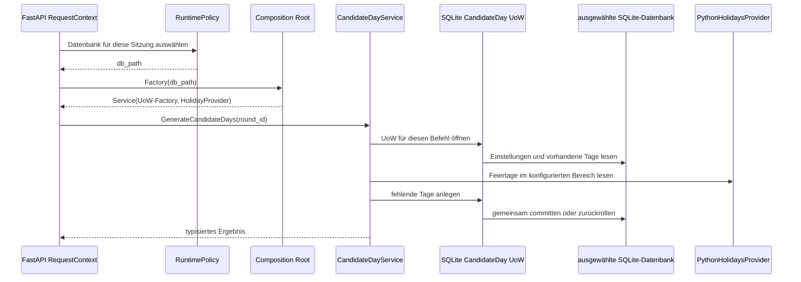

# Backend-Vertrag

Diese Seite legt Zielverantwortungen, Ports, Transaktionsgrenzen,
Lebensdauern und den schrittweisen Übergang für das Backend fest.
Sie ergänzt die aktuelle Implementierungsbeschreibung unter
[Komponenten](components.md#backend) und die
[Architekturübersicht](architecture.md).
Langfristige Leitplanken und ihre Begründung stehen in
[ADR-0041](decisions/0041-backend-modulverantwortung-und-use-case-vertraege.md).

## Zielgraph

```mermaid
flowchart TB
  http["FastAPI HTTP-Adapter"]
  admin["Unix-Socket Admin-Adapter"]
  composition["Composition Root\nKonfiguration und Lebensdauer"]
  app["application\nUse-Case-Koordination, Cross-Domain-UoW und Folgeausführung"]
  planning["planning\nPlanung, Rundenorganisation, Prüfungsorte"]
  execution["execution\nAnwesenheit, Protokolle, Tagesabschluss, Wiederöffnung"]
  assessment["assessment\nBewertung und Ergebnisse"]
  identity["identity\nKonten, Personen, Mitgliedschaften, Autorisierung"]
  calendar["calendar\nFeed-Lifecycle, Eventprojektion und ICS"]
  notifications["notifications\nClaim, Zustellentscheidung, Abschluss"]
  documents["documents\nDokumenteninhalt und Metadaten"]
  operations["operations\ntechnische Instanz, Lifecycle und Wartung"]
  presentation["presentation\npure Darstellung"]
  persistence["persistence\nSQLAlchemy, SQLite, Schema und Sessionadapter"]
  integrations["integrations\nkonkrete Provider- und Dateiadapter"]

  http -->|cross-domain use cases| app
  http -->|single-domain use cases| planning
  http -->|single-domain use cases| execution
  http -->|single-domain use cases| assessment
  http -->|single-domain use cases| identity
  http -->|single-domain use cases| calendar
  http -->|single-domain use cases| notifications
  http -->|single-domain use cases| documents
  http -->|render authorized snapshots| presentation
  admin -->|cross-domain use cases| app
  admin -->|identity commands| identity
  admin -->|notification management| notifications
  admin -->|single-domain use cases| operations
  composition --> http
  composition --> admin
  composition --> app
  composition --> persistence
  composition --> integrations
  composition --> planning
  composition --> execution
  composition --> assessment
  composition --> identity
  composition --> calendar
  composition --> notifications
  composition --> documents
  composition --> operations
  app --> planning
  app --> execution
  app --> assessment
  app --> identity
  app --> operations
  app --> calendar
  app --> notifications
  app --> documents
  execution --> presentation
  assessment --> presentation
  persistence -.->|"implements port owned by"| app
  persistence -.->|"implements ports owned by"| planning
  persistence -.->|"implements ports owned by"| execution
  persistence -.->|"implements ports owned by"| assessment
  persistence -.->|"implements ports owned by"| identity
  persistence -.->|"implements ports owned by"| calendar
  persistence -.->|"implements ports owned by"| notifications
  persistence -.->|"implements ports owned by"| documents
  persistence -.->|"implements ports owned by"| operations
  identity -.->|"implements port owned by"| planning
  identity -.->|"implements port owned by"| calendar
  identity -.->|"implements port owned by"| execution
  execution -.->|"implements port owned by"| planning
  execution -.->|"implements port owned by"| calendar
  planning -.->|"implements port owned by"| calendar
  planning -.->|"implements diagnostic port owned by"| operations
  documents -.->|"implements diagnostic port owned by"| operations
  notifications -.->|"implements diagnostic port owned by"| operations
  calendar -.->|"implements port owned by"| app
  integrations -.->|"implements ports owned by"| notifications
  integrations -.->|"implements ports owned by"| documents
  integrations -.->|"implements port owned by"| planning
```

Durchgezogene Pfeile zeigen Aufruf- und Verdrahtungsabhängigkeiten;
gestrichelte Pfeile zeigen Portimplementierungen und damit die
Abhängigkeitsumkehrung.
Fachmodule importieren keine HTTP-, FastAPI-, Socket-, SQLAlchemy- oder
konkreten Provider-Implementierungen.
Ihre ausgehenden Fähigkeiten werden als Ports beim konsumierenden
Fach-, Application- oder Operationsmodul definiert.
Ein zuständiges Adaptermodul implementiert den Port; das kann ein anderes
Fachmodul, `persistence` oder `integrations` sein.
Die Composition Root verdrahtet Port und Adapter.
Zusammengehörige Abfragen und Mutationen werden über einen explizit
komponierten UoW verbunden.

`application` besitzt keine Fachregeln und stellt keine universelle
`ResourceRepository`-Fassade bereit.
Es koordiniert mehrere Fachmodule nur dann, wenn ein sichtbarer Use Case deren
Ergebnisse oder Atomarität verbindet.
Ein einzelnes Modul konsumiert seine eigenen Ports direkt aus der
Composition Root.

Der Admin-Socket folgt denselben Grenzen: `bootstrap`, `invite`, `disable`,
`recover`, `consume-invitation`, `consume-recovery` und `committee-*` gehen an
`identity`; `test-notification` an `notifications`; `process-notifications`
und die Planfolgen-Status-/Retry-Befehle an `application`; Upgrade-, Rollback-
und Runtime-Befehle an `operations`.
Der Application-Pfad koordiniert nur dort, wo Folgeauftragszustand und
fachliche Ableitung zusammenlaufen.

### Ownership

| Modul | Fachlicher oder technischer Eigentümer | Erlaubte Verantwortung |
| --- | --- | --- |
| `planning` | Kandidaten-/Rundenzuordnung, Prüfungszeiträume, Verfügbarkeit, Planung, Prüfungsorte und Ableitung von Planfolgen | Vorschläge, Revisionen, Bestätigung, CAS, Planning-eigene Rundenzustände und Entwurfsrundenlöschung; ein Halbjahr wird nur gemeinsam mit einer Runde angelegt |
| `execution` | Abwesenheit, Tagesablauf, Protokolle, Tagesabschluss und Wiederöffnung | Zustandsübergänge, Revisionsschutz, Audit, Tages-/Slotfolgen und Wiederöffnungsaufgaben |
| `assessment` | Bewertungsmodell und Prüfungsergebnisse | Eingabe, Berechnung, Festschreibung und Ergebnisrevisionen |
| `identity` | Konten, Personen, Mitgliedschaften und Autorisierung | Anmeldung, Mitgliedschaftsregeln, Sitzungen und Identitätsänderungen |
| `application` | Cross-Domain-Use-Cases und dauerhafte Folgeausführung | Anwendungsweite Koordination, verbrauchereigener Claim-/Retry-/Ursprungsschlüsselstatus und gemeinsamer UoW; keine eigene Fachregel |
| `calendar` | Kalenderfeeds und ICS-Ausgabe | Feed-Credentials, lokale `CalendarEvent`-Projektion bestätigter Zuweisungen und deren datensparsame ICS-Ausgabe |
| `notifications` | Benachrichtigungszustellung | Claim, Provideraufruf und Abschluss/Retry eines eigenen Claims |
| `documents` | Dokumenteninhalt und Metadaten | Gekoppelte Inhalts-/Metadatenänderung und Kompensation |
| `operations` | Technische Instanz und Wartung | Lifecycle, Diagnose, Backup, Restore, Schema- und Migrationsverwaltung |
| `presentation` | Darstellung | Deterministische Darstellung bereits autorisierter, materialisierter Werte ohne I/O oder Fachentscheidung; der HTTP-Adapter rendert Cross-Domain-Exports nach Rückgabe des Use Case |
| `persistence` | Datenbank und ORM | SQLAlchemy/SQLite, Schema, Queries, Transaktionen und konkrete Portadapter |
| `integrations` | Konkrete technische Integrationen | Providerzugriff, Dateisystemadapter und externe Fehlerabbildung |

Kandidaten und Prüfungsrunden gehören zu `planning`; Personen und
Mitgliedschaften zu `identity`.
Ein gleich benanntes ORM-Modell begründet keine fachliche Ownership.
Ein Domänentyp wird nur von seinem fachlichen Eigentümer definiert und über
seinen stabilen öffentlichen Vertrag geteilt.
Für technische Typen gilt dasselbe: der technische Verbraucher besitzt das
benötigte Portmodell.
Es gibt keinen globalen Satz geteilter ORM-Modelle, Dictionaries, Exceptions,
Enums oder Hilfsfunktionen.

## Port-Inventar

Die folgende Inventarliste ist der verbindliche Mindestvertrag.
Öffentliche Befehle erhalten typisierte Commands und Ergebnisse, wo mehrere
Felder oder Zustände einen Fachvertrag bilden.
Einfache primitive Werte bleiben zulässig, wenn sie die beobachtbare
Semantik vollständig ausdrücken.
Fehler werden als fachliche Ergebnisunion oder stabile domänenspezifische
Exception nach außen übersetzt; SQLAlchemy- und Providerfehler verlassen
keinen Adapter.

| Eigentümer / Konsument | Port und Fähigkeit | Commands, Ergebnis und beobachtbarer Fehler | UoW und Lebensdauer | Aktueller Adapter / Übergang |
| --- | --- | --- | --- | --- |
| `planning` | Proposal und ConfirmedPlan lesen, bestätigen und revisionieren | Planning-eigene Proposal-Commands und materialisierte Snapshots; `PlanValidationError`, Revision-/Konfliktfehler | Proposal-CAS, Planaggregat, bestätigte Revision und Audit committen gemeinsam; UoW pro Use Case | `planning.proposals` und `planning.proposal_ports`; `persistence.planning` implementiert SQLite, `composition.planning_service` verdrahtet den Adapter. Andere Planning-Ressourcen behalten ihre eigenen Übergangspfade |
| `planning` | Verfügbarkeit anfragen und Planning-Folgequelle festschreiben | Idempotenter Command wechselt `draft` zu `availability_requested` und liefert stabile Origin-ID, typisierte Notice-Beschreibung, die beim Übergang geltende Deadline und die damals ausgewählten aktiven Membership-IDs; fehlende Runde, ungültiger Status, fehlende Frist, fehlende Planning-Einstellungen oder kein aktiver Kandidatentag bleiben fachliche Fehler. Planning fragt den Membership-Snapshot über einen Planning-eigenen Identity-Port ab | Statuswechsel, Audit/Übergangsquelle, Deadline, Notice-Beschreibung und ursprünglicher Empfängersnapshot committen atomar im selben Planning-UoW. Application speichert danach den Auftrag und replayt exakt diesen Inhalt und diese Empfänger-IDs; es rekonstruiert Empfänger nicht aus späteren Memberships. Ob die IDs beim Zustellversuch aktuell versandberechtigt sind, bleibt #1079 überlassen, ohne hier eine Suppressionspolicy festzulegen | `PlanningService.request_availabilities` speichert heute nur den Status; `fastapi_planning_router` versucht die Benachrichtigung danach direkt und best-effort. Nach Handoff ersetzt Application den direkten Aufruf und restauriert fehlende Ursprünge aus Planning-Übergangsquellen |
| `planning` | Kandidatentage und Feiertage (Pilot #1071) | `GenerateCandidateDays` liefert materialisierte Kandidatentage, übersprungene Daten und ausgeschlossene Feiertage; bestehende Validierungsfehler bleiben erhalten | Planning liest Settings und Tage und legt alle fehlenden Tage atomar im Candidate-Day-UoW an; UoW und Provider werden pro Servicekomposition injiziert | `planning.candidate_days` definiert Command, Ergebnis und Ports; `persistence.candidate_days` und `integrations.holiday_provider` implementieren die SQLite- und Feiertagsadapter, die nur im Composition Root gewählt werden. Der Planning-Resource-Adapter bindet diesen UoW für Planungs-Snapshots ein |
| `application` | Resource-Ownership, Zugriff und sichtbare Projektionen (Pilot #1072) | Consumer-eigene `ResourceKind`, typisierte Referenzänderungen und materialisierte Committee-/Round-Owner; sichtbare Reads liefern Projektionen. Fachliche `ForbiddenRequestError` bleiben von technischen Persistenzfehlern unterscheidbar | Verwandte Ownership-/Visibility-Reads laufen im selben expliziten SQLite-Read-Snapshot; die generischen Schreibübergänge revalidieren mutable Ownership-Voraussetzungen im Schreib-UoW mit vorab erworbener SQLite-Schreibabsicht. Actor-Felder werden weiter ausschließlich aus dem serverseitigen Scope gebunden | `application.resource_access` definiert Query-Port und Werte; `persistence.resource_access` implementiert SQLite-Zugriffe und Prädikate. `ResourceRepository` nutzt den Port vorübergehend für generische HTTP-Reads und Schreibübergänge |
| `identity` | Personen, Memberships und Ausschüsse | Identity-eigene Schreib-UoWs kapseln Person, Membership, Ausschuss-Masterdaten und Committee-Admin-Commands; Query-Projektionen liefern Login-Personen, aktive Actor-Memberships und sichtbare Member-Views. Keine Session, ORM-Werte oder SQL-Ausdrücke verlassen Persistence | Membership-Ownership wird mit dem Query-Vertrag aus #1072 im Schreib-UoW erneut geprüft; gespeicherte Actor-Mitgliedschaft, authentisierte Person, Aktivität und Managementrolle werden vor jeder geschützten HTTP-Mutation derselben Transaktion gelesen. Committee-Bootstrap, Abschluss, Wiedereinladung, Lifecycle, Audit und Einladungstoken bleiben atomar im Committee-Admin-UoW | `identity.people` und `identity.committee_admin` definieren Ports und Use-Case-Regeln; `persistence.identity` und `persistence.committee_admin` setzen typisierte SQLite-Adapter mit materialisierten Strukturwerten um. `composition` verdrahtet die Adapter. Personen-/Membership-POST/PATCH/DELETE sowie Ausschuss-PATCH/DELETE laufen über Identity; Ausschussanlage erfolgt über Committee-Admin-Commands. Generische `ResourceRepository`-Schreibpfade weisen Personen, Memberships und Ausschussänderungen zurück |
| `planning` | Prüfungsrunden, Kandidaten, Prüfungszeiträume, Einstellungen und Mitgliederverfügbarkeiten (#1087) | Commands und Queries liefern materialisierte Werte; Planning validiert Rundenerstellung und entscheidet die Kandidaten-/Rundenzuordnung aus detached Referenzfakten. Sichtbarkeits-IDs werden innerhalb desselben Read-UoW in Seiten zu höchstens 500 Werten gelesen und abgefragt; eine unbeschränkte ID-Liste wird nicht an SQLite gebunden. Rundenerstellung legt ein benötigtes Halbjahr atomar mit der Runde an. Eigenständige Halbjahres-Updates und -Löschungen sind nicht verfügbar; Scope, gespeicherter Besitz, Rolle, Referenzkonflikte und mutable Vorbedingungen werden innerhalb des Schreib-UoW geprüft | Planungseinstellungen, Verfügbarkeiten, Kandidaten, Rundenzuordnungen, Runden und optionale Halbjahresanlage committen pro Command atomar; referenzierte Ownership-Abfragen teilen denselben UoW | `planning.resources` definiert die use-case Ports und immutable Werte; `persistence.planning_resources` liefert SQLite-Referenzfakten und führt den vorbereiteten relationalen Schreibplan atomar aus. `composition` injiziert den Adapter. Die Aufrufer verwenden Planning-Commands; die migrierten `ResourceRepository`-Branches sind entfernt. Direkte Halbjahres-Schreibzugriffe bleiben durch den bestehenden HTTP-Vertrag verboten |
| `planning` | Prüfungsorte, Geokodierung und Planfolgen | `planning_ports` enthält Venue-Queries und typisierte Commands, die materialisierte Venue-/Room-/Contact-Werte, `VenueChange` oder Fachfehler liefern; `planning.exam_venues.ExamVenuePolicy` entscheidet Scope-/Ausschuss-, Barrierefreiheits-, Koordinaten-, Aktivierungs-/Deaktivierungs-, Kontaktzuordnungs-, Duplicate-Scoring- und zukünftige Zuweisungsbestätigungsregeln aus detached Werten; Geokodierung nimmt Venue-ID und erwartete Revision und liefert `GeocodeCandidate` samt Quelle oder unterscheidet fehlenden Ort, Revisionskonflikt, deaktivierten Provider, `timeout`, `quota`, `provider_error`, `not_found` und `invalid_response`; sie persistiert keine Koordinaten | Venueänderung, Revision, Actor-Bindung und Audit committen gemeinsam; SQLite liest Bestands-, Duplicate-Kandidaten- und künftige Zuweisungsfakten innerhalb desselben `BEGIN IMMEDIATE`-Schreib-UoW und übergibt sie der Planning-Policy als Werte. Der Adapter behält SQL-Kandidatenauswahl, gespeicherte Ownership-/Autorisierungsprüfungen, relationale Eindeutigkeit/Verwendungsabfragen und Transaktion; fachliche Venue-Entscheidungen liegen in Planning. Geokodierung autorisiert und prüft Revision vor Provider-I/O, sendet nur die Adressdarstellung und läuft außerhalb eines Schreib-UoW. Die explizite Post-Commit-Follow-up-Transition konsumiert `VenueChange`; ein Fehler kann den Venue-Commit nicht zurückrollen | `planning.exam_venues` enthält Use Cases und reine Venue-Policies; `persistence.sqlite_exam_venues` hält SQL-Mapping, UoW-gebundene gespeicherte Ownership-/Autorisierungsprüfungen, relationale Integrität und Schreibtransaktion; `integrations.map_provider.NominatimGeocoder` und `VenueConsequenceService` werden ausschließlich in `composition` verdrahtet |
| `planning` | Plan-/Ortsfolgen ableiten und erneut bereitstellen | Planning liefert aus einer bestätigten Planrevision oder unveränderlichen Venue-Audit-ID deterministisch typisierte Folgeauftragsbeschreibungen mit stabiler Ursprungsidentität; Ableitungsfehler bleiben von Fehlern einzelner Folgemodule unterscheidbar | Ableitung bleibt nach dem Domain-Commit wiederholbar; dauerhafter Folgeauftragszustand und Claim/Retry liegen beim konsumierenden Application-Modul. Unveränderliche Revisions-/Auditdaten bleiben die Quelle zum Wiederaufbau fehlender Application-Aufträge | `PlanConsequenceService`, `VenueConsequenceService`; heutige Planning-eigene Batch-/Taskpersistenz und direkte Kalenderaufrufe werden nach Handoff entfernt |
| `execution` | Anwesenheit, Abwesenheit und Vertretung | Befehle liefern aktuellen Zustands-Snapshot oder Konflikt-/Validierungs-/Berechtigungsfehler; Auswahl bleibt serverseitig zulässig. Calendar- und Notification-Folgen gehen als typisierte Beschreibung mit stabiler Ursprungs-ID an Application. Nur wenn der Prüfungstag beim Mutation-Commit offen ist, enthält die unveränderliche `select_replacement`-Calendar-Before-Image-Quelle den atomar gebundenen Guard-Snapshot `closure_status == "open"` sowie Assignment-ID, vorherige Empfänger-Membership-ID und materialisierten Eventinhalt und monoton steigende per-Assignment-Execution-Folgeversion; Generationen gehören ausschließlich Calendar. Bei `reopen` beschreibt sie die Wiederherstellung des ursprünglichen Assignees und die Ablösung des Ersatz-Events. Ist der Status beim Mutation-Commit `reopening`, entstehen weder Before-Image noch Calendar-Quelle. Für Notification-Folgen gehören die ursprünglichen Empfänger-IDs zur Beschreibung | Zustandswechsel, Actor-Bindung, Audit und unveränderliche Calendar-/Notification-Folgequelle mit Before-Image und ursprünglichen Empfänger-IDs committen atomar. Application orchestriert `select_replacement` aus Planning-, Identity- und Execution-Ports innerhalb eines gemeinsamen UoW und committet Read-Snapshots, Mutation, Audit und Quelle atomar. Application replayt eine vorhandene `select_replacement`-Quelle einschließlich ihres gespeicherten `open`-Guard-Snapshots ohne den inzwischen veränderlichen Tagesstatus neu zu bewerten. Calendar erstellt aus diesem autorisierten Before-Image auch ohne vorherige Projektion eine stornierte Eventzeile für den alten Empfänger; danach wird die neue Zuweisungssicht mit derselben Execution-Folgeversion synchronisiert. Bei einer Mutation im Status `reopening` gibt es keine Calendar-Quelle und keinen Projektionseffekt | `AbsenceService`, `ResourceRepository`; heutiges `select_replacement` synchronisiert vor und nach der Mutation nur bei offenem Prüfungstag, `reopen` nach dem Commit ebenfalls nur bei offenem Prüfungstag. Direkte Calendar-/Notification-Aufrufe werden nach Handoff an Application entfernt |
| `execution` (Port-Eigner/Konsument; `identity` implementiert) | Ursprüngliche Notification-Empfänger für Execution-Commands lesen | Liefert Membership-IDs der nach dem bestehenden Committee-/Rollen-Scope benachrichtigten Personen für Abwesenheits-`report`/`respond`, `select_replacement` und Prüfungstags-Lifecycle-Commands; bei `replacement_selected` umfasst sie den bisherigen Assignee, das ausgewählte Ersatzmitglied und alle übrigen aktiven Ausschussmitglieder. Keine Namen oder weiteren Personendaten. Der Snapshot gehört zum auslösenden Zustand und wird nie beim Replay neu berechnet. Die Planning-eigene Rundungsabsage bezieht ihre Management-IDs im Application-UoW separat über Identity | Identity-Snapshot, Execution-Mutation, Actor-Bindung, Audit und unveränderliche Folgequelle mit Notice-Beschreibung und exakt diesen ursprünglichen Empfänger-IDs teilen den Execution-UoW; bei `select_replacement` teilen Planning, Identity und Execution denselben Application-UoW. Bei anderen Cross-Domain-Lifecycle-Commands gilt derselbe gemeinsame Application-UoW für die beteiligten Module. Die Rundungsabsage-Notice-Quelle gehört ausschließlich Planning | Heute lesen `AbsenceService` und `ExamDayClosureService` Identity-Tabellen direkt über `_management_member_ids` bzw. Rollenabfragen; der Execution-Port wird von Identity implementiert. Rundungsabsage-Empfänger werden aus Planning-, Identity- und Calendar-Read-Snapshots durch Application vereinigt |
| `execution` | Protokollinhalt, Teilnehmende, Versionierung, Reaktionen, Korrekturen, Aufbewahrung sowie Tagesabschluss/Wiederöffnung | Versionierte Mutationen liefern bestätigte Revision bzw. Findings; CAS-Konflikt, ungültiger Übergang und fehlende Berechtigung bleiben unterscheidbar | Protokoll-CAS, Einträge, Reaktionen, Korrekturen, Audit und Tagesrevision teilen einen Execution-UoW; Tagesabschluss, Wiedereröffnungsaufgaben und stale-export-Marker bleiben beim separaten Lifecycle-Pfad | `ExamProtocolService` konsumiert `ExecutionProtocolUnitOfWork`; der SQLite-Adapter materialisiert Snapshots und speichert typisierte Befehle. `ExamDayClosureService` und `ResourceRepository` bleiben Übergangspfade; freie Ressourcenmutationen werden nach Route-/CLI-Migration entfernt |
| `planning` | Assignment eines Prüfungstags neu zuweisen oder wiederherstellen | Commands `reassign_assignment` und `restore_assignment` nehmen Assignment-ID, erwartete Revision, erwartete aktuelle Membership-ID und Ziel-Membership-ID an; Reassignment validiert die neue Ziel-Membership, Restore darf die gespeicherte ursprüngliche Membership-ID auch dann wiederherstellen, wenn sie inzwischen inaktiv ist. Sie liefern den neuen Snapshot oder stabile Revisions-/Mitgliedschafts-/Tagesstatuskonflikte. Die Mutation verlangt Execution-Mutationsberechtigung für einen offenen Tag oder für den explizit wiedereröffneten Scope bei passender Revision; ein offener Tag-Guard ist keine Voraussetzung für die Planning-Schreibberechtigung | Planning-CAS, Assignment-Änderung und Audit laufen im gemeinsamen Application-UoW mit Identity-/Execution-Reads sowie Execution-Mutation und unveränderlicher Folgequelle; Reopen stellt den gespeicherten ursprünglichen Membership-Bezug über denselben Planning-Port wieder her | `select_replacement` und `reopen` ändern heute `ExamDayAssignment.committee_member_id` direkt aus `AbsenceService`; diese Writes werden in Planning-Commands verschoben |
| `application` | Ersatzzuweisung auswählen (`select_replacement`) | Application bindet Execution-Report-Snapshot und verfügbare Response, Planning-Assignment-/Candidate-Day-Snapshot, Identity-Membership-Snapshot und Execution-Mutationsberechtigung samt Tagesrevision. Für die unveränderliche `replacement_selected`-Notification-Quelle bezieht es zusätzlich über den Execution-owned Identity-Port die nach bisherigem Verhalten ausgewählten Empfänger-IDs: bisheriger Assignee, Ersatzmitglied und übrige aktive Ausschussmitglieder. Der Report muss den erlaubten Status haben, versionsaktuell sein und vor Prüfungsbeginn liegen, außer im autorisierten `reopening`-Scope. Die Zielantwort muss aktuell `available` sein; Ziel-Membership und Committee-Zugehörigkeit müssen aktiv sein, und die Vertretungsseite muss passen, außer die Zielzuweisung greift gemäß bestehender Regel als Fallback. Der aktuelle Day-Part-Snapshot muss Doppelbesetzung, bestehende Zuweisung und Konflikte ausschließen; die Fallback-Rolle behält ihre spezifischen Prüfungen. Abgelehnte, nicht verfügbare, inaktive, seitenfalsche oder inzwischen doppelt/konfliktbehaftete Kandidaten werden abgewiesen. Fehlender Scope, ungültige Antwort, Revisionskonflikt, fehlende Verfügbarkeit und unzulässiger Tagesstatus bleiben unterscheidbare Fachfehler | Alle genannten Read-Snapshots einschließlich Notification-Empfänger, Planning-Zuweisungsänderung mit CAS auf Assignment-Revision und vorherige Membership-ID, Execution-Mutation, Audit und unveränderliche Calendar-/Notification-Folgequellen teilen den Application-UoW; Planning prüft die erwartete Ziel-Membership im selben UoW erneut. Ein offener Tag erzeugt die Calendar-Before-Image-Quelle; ein autorisierter `reopening`-Scope darf Report und Planning-Assignment korrigieren, erzeugt aber keine Calendar-Quelle. Keine Domäne liest fremde Tabellen direkt oder öffnet eine zusätzliche Session | Der heutige `AbsenceService` liest Planning-/Identity-Daten und ändert das Planning-Assignment direkt; diese Abhängigkeiten werden nach Übernahme durch Application-Ports entfernt |
| `application` | Prüfungsrunden-Cross-Domain-Lifecycle | `close`, `cancel`, `reopening_impact`, `reopen` und Export liefern materialisierte Lifecycle-/Exportsnapshots oder fachliche Konflikt-, Validierungs- und Berechtigungsfehler; Application enthält keine Lifecycle-Regeln | Orchestrierung bindet Planning-Rundenentscheidung/-revision, Execution-Tages-/Slotfolgen und Wiederöffnungsaufgaben sowie benötigte Assessment-Ergebnis-Snapshots an einen gemeinsamen UoW-Kontext; vor `cancel` liest Application Planning-Zuweisungen, Identity-Rollen und über Calendar aktive künftige Projektions-Empfänger. Planning speichert die vereinigten Empfänger-IDs, `decision_date`, Notice-Beschreibung und die alleinige Cancellation-Folgequelle mit der Rundungsentscheidung. Execution besitzt die unveränderlichen Notice-Quellen anderer Execution-eigener Zustandswechsel; für dieselbe Rundungsabsage erzeugt es keine zweite Quelle. Alle Persistence-Adapter teilen intern dieselbe Session und committen nicht selbst. Application übernimmt und re-drived die unveränderliche Quelle des jeweiligen Fachmoduls nach dem Domain-Commit | `ExamRoundLifecycleService` wird in Application-Orchestrierung plus Planning-, Execution-, Assessment- und Calendar-Ports zerlegt. Human-Export rendert der HTTP-Adapter nach dem UoW mit `presentation.exam_exports` aus bereits autorisierten, materialisierten Werten |
| `application` | Prüfungstags-Lifecycle über Execution und Assessment | `close` liefert Execution-Tagesergebnis unter Berücksichtigung des Assessment-Readiness-Snapshots; `reopen` liefert Impact und atomare Korrekturen. Scope-, Revisions-, readiness- und Impactkonflikte bleiben unterscheidbar | Application orchestriert Execution-Tagesstatus und Assessment-Bewertung/Korrektur in einem gemeinsamen UoW; Dayrevision/Audit/Wiedereröffnung und Resultrevision/Korrekturstatus/-Audit committen gemeinsam. Benachrichtigungen folgen erst nach dem Domain-Commit | `ExamDayClosureService.close`, `_evaluate` und `_open_result_correction` lesen bzw. ändern derzeit Assessment-Modelle/Ergebnisse direkt in der Execution-Session; wird in Execution- und Assessment-Ports aufgeteilt |
| `application` | Prüfungssummen-Abfrage | Typisierter Query liefert Rundenstatus/-name, Halbjahr, Planungssettings, aktive Kandidaten-/MEP-Zahlen, Verfügbarkeit und autorisierten Ausschussnamen; Mitgliedschaft/Committee-Scope wird vor Ausgabe geprüft. Nicht authentisiert ergibt `401`; verbotener Scope und eine fehlende Runde ergeben nicht unterscheidbar `403`. Die HATEOAS-Antwort bleibt erhalten | Ein schreibfreier Planning-Read-UoW liest zuerst die Runde und prüft deren Committee-ID gegen die übergebenen Berechtigungen; erst danach baut derselbe UoW die typisierte Summary. Keine ORM-Werte verlassen Adapter | `ReadApplication.round_summary` übergibt die Committee-IDs an `PlanningResourceService.round_summary`; `GET /api/round-summary` behält seinen Wire-Vertrag. Eine fehlende oder nicht sichtbare Runde wird ohne Summary-Daten als `403` behandelt |
| `application` | Dauerhafter Zustand und Wiederanlauf modulübergreifender Folgeaufträge | Konsumenten-Port speichert stabile Ursprungs-/Folgeschlüssel, Claim, Retry, Ergebnis und Fehlerzuordnung; Ergebnis unterscheidet erledigt, erneut versuchen und terminalen Fehler. Wiederholung derselben Quelle erzeugt keinen zweiten Folgeauftrag; fehlende Queue-Einträge und Ableitungsfehler sind beobachtbar | Application speichert den Folgeauftrag nach dem auslösenden Domain-Commit in seinem eigenen UoW; Claim wird vor Kalender-/Provider-I/O committed, Completion/Retry danach separat. Der erneut ausgelöste Verarbeitungslauf (`lzug-admin notification process`) gleicht bestätigte Planrevisionen, Planning-Availability-Übergangsquellen, Planning-Rundungsabsagequellen, Venue-Auditquellen und unveränderliche Execution-Folgequellen mit Application-Ursprüngen ab. Ein beim Upgrade persistiertes Cutover-Wasserzeichen je Execution-Auditstream grenzt neue Folgen ab: nur atomar mit Mutationen nach dem Cutover gespeicherte unveränderliche Quellen werden wiederhergestellt. Historische Execution-Auditzeilen ohne solche Folgequelle werden weder rekonstruiert noch zugestellt. Für die Rundungsabsage liest er die unveränderliche Planning-Quelle samt `decision_date`, Notice-Beschreibung und ursprünglichen Empfänger-IDs; Execution wird dafür nicht als Quelle abgefragt. Automatischer Startup-Hook oder Hintergrundworker ist damit nicht beauftragt. Kein Folgefehler rollt die bestätigte Fachänderung zurück | #1081 verlangt consumer-eigenen Zustand und Restart-Prüfung; heutige Planning-Batch-/Taskpersistenz und weitere direkte Orchestrierung werden nach Handoff entfernt |
| `application` | Geplante Benachrichtigungserzeugung | Use Case liest fällige Reminder-/Deadline-Snapshots über Planning-Port und ruft danach Notifications-Commands für fachlich definierte Ereignisse auf; die erste `availability_requested`-Notice wird mit der atomaren Planning-Übergangsquelle aus stabiler Origin-ID, fixierter Frist-/Nachrichtenbeschreibung und den damals ausgewählten Empfänger-IDs wiederhergestellt, nicht aus aktuellen Rundendaten oder Memberships rekonstruiert | Verarbeitung läuft beim expliziten Admin-Befehl `lzug-admin notification process`; Notifications werden nach dem auslösenden Fach-Commit gespeichert/zugestellt. Wiederholung nutzt denselben Ursprung, Nachrichtinhalt und Empfänger-IDs. Zustellberechtigung bei verändertem Membership-/Ereignisstatus bleibt in #1079 offen; keine Suppressionspolicy wird hier festgelegt. Kein automatischer Worker oder Startup-Aufruf ist Teil des Vertrags | Heute `process_due_events` liest Reminder und Deadline aus `ExamRound`; direkte Reads von Planning-Runden werden durch Planning-Snapshot-Port plus Application-Orchestrierung ersetzt |
| `planning` | Rundenentscheidung und Kandidatenabschluss | Planning-Commands liefern Rundensnapshot, bestätigte Entscheidung/Revision und Kandidatenstatus oder Konflikt-, Validierungs- und Berechtigungsfehler; Planning besitzt auch Entwurfsrundenlöschung. IHK-Dokumentstatus ist kein Planning-Port, sondern wird von Application mit Planning- und Assessment-Ports orchestriert | Revisionsprüfung, Planning-eigene Entscheidung, Kandidatenstatus und Audit atomar; Halbjahres-Update/-Delete sind keine eigenständigen Commands | Der aktuelle `ExamRoundLifecycleService` greift direkt auf Planning- und weitere Tabellen zu; wird auf Planning-Port und UoW begrenzt |
| `planning` | Rundungsabsage und unveränderliche Notice-Quelle | Cancellation-Command nimmt erwartete Rundenrevision, `decision_date`, die von Application aus Planning-, Identity- und Calendar-Snapshots materialisierten ursprünglichen Membership-IDs sowie typisierte Notice-Beschreibung an; Ergebnis enthält stabile Origin-ID und dieselben unveränderlichen Werte | Entscheidung, Revision, Audit und Cancellation-Folgequelle inklusive Datum und vollständiger Empfängermenge committen atomar im Planning-UoW; Application replayt exakt diese Quelle | Der heutige `ExamRoundLifecycleService` mutiert Calendar-Projektionen direkt; Application materialisiert künftig vor der Entscheidung die Planning-Zuweisungen, aktiven Vorsitz-/Stellvertretungsrollen und Calendar-Projektionen und Planning schreibt die Vereinigung unveränderlich fest |
| `execution` | Tages-/Rundenfolgen, Tages-/Slotstatus und Wiederöffnung | Port liefert betroffene Tages-/Slot-Snapshots sowie Execution-eigene fachliche Wiederöffnungsaufgaben oder Konflikt-/Validierungsfehler. Kalender- und Execution-eigene Notification-Folgequellen tragen stabile Ursprünge; Cancellation-Notice-Quelle der Rundungsabsage gehört ausschließlich Planning | Tages-/Slotänderungen, Audit, Execution-eigene fachliche Wiederöffnungsaufgaben und unveränderliche Folgequellen im gemeinsamen Cross-Domain-UoW; Application-Folgeaufträge entstehen danach separat und sind samt ursprünglichem Empfängerscope wiederherstellbar | `ExamRoundLifecycleService`, `ExamDayClosureService`; direkte Lifecycle-ORM-Mutationen werden nach Portübernahme entfernt |
| `assessment` | Ergebnisstatus für Runden-/Prüfungstags-Lifecycle und Export | Materialisierte, autorisierte Modell-/Ergebnis-/Readiness-/Impact-Snapshots; für explizites Wiederöffnen ein typisierter Befehl zum Öffnen der erforderlichen Result-Korrekturen mit Ergebnisrevision, Korrekturstatus und fachlichen Folgeeffekten | Read oder Mutation innerhalb des Application-UoW, wenn Teil der Lifecycle-Entscheidung; Assessment bleibt Eigentümer der Ergebnisregeln und Persistenz | `ExamRoundLifecycleService`, `ExamDayClosureService`, `ExamResultService`; Lifecycle konsumiert Assessment-Port statt Ergebnistabellen direkt zu lesen oder zu ändern |
| `assessment` | Ergebnis lesen, berechnen, festschreiben oder korrigieren | Commands liefern typisierte Ergebnis-/Revisions-Snapshots oder Validierungs-, Konflikt- und Berechtigungsfehler; ungültige Berechnung wird nicht als Ergebnis ausgegeben | Ergebnis-CAS, Revision, Audit und betroffene Korrekturaufgaben atomar; Offenlegung stets nach Scope und Ergebnisstatus | `ExamResultService` und `ResourceRepository`; generische Ergebniszugriffe werden nach Portumstellung entfernt |
| `application` | Ergebnisänderung mit Wiederöffnung eines geschlossenen Prüfungstags | Orchestriert autorisierte Assessment-Ergebnisänderung und Execution-Tagesmutation; stale revision, gesperrte Änderung, fehlender Scope und ungültiger Zustand bleiben unterscheidbar | Assessment-CAS/Ergebnis/Audit und Execution-Tagesrevision, Wiederöffnungs-Audit/-Aufgabe sowie Export-Stale-Marker teilen einen UoW und committen oder rollen gemeinsam zurück | `ExamResultService` ruft derzeit `guard_day_mutation` und `complete_day_mutation` im gemeinsamen Session-Kontext auf; wird durch Assessment- und Execution-Ports unter Application-Orchestrierung ersetzt |
| `assessment` | Modellkatalog, unveränderliche Bewertungsmodelle und Assessment-Seite der Rundenbindung | Queries liefern materialisierte Modell-/Versions-Snapshots; Modellanlage ist unveränderlich; Bindungs-Commands erhalten einen typisierten Applicability-Snapshot und liefern bestätigte Bindungsversion oder fachlichen Anwendbarkeits-/CAS-Konflikt. Assessment entscheidet die Anwendbarkeit des Bewertungsmodells nach seinen Domainregeln anhand von Committee-Beruf/IHK aus Identity sowie aktiven Kandidaten-Schwerpunkten und effektivem Rundungsdatum aus Planning. Planning-Runde und Assessment-Bindung werden durch Application orchestriert | Application komponiert im gemeinsamen UoW Planning-Runden-/Halbjahres-/Prüfungstag-/aktive-Kandidaten-Snapshots, den Identity-Committee-Snapshot mit Beruf und IHK sowie Assessment-Modell-/Bindungssnapshots und ruft Assessment zur Anwendbarkeitsprüfung/-mutation auf; bestehende Bindung ändert sich nur per erwarteter Version, nach erster Bewertung ist Modellwechsel gesperrt; fehlende Ergebniszeilen entstehen mit der Bindung atomar | `ExamResultService.bind_round` und Assessment-Modellservices; Cross-Domain-Route wird auf Application-Use-Case plus Planning-/Identity-/Assessment-Ports umgestellt |
| `identity` | Anmeldung, Konto, Person, Mitgliedschaft und Ausschussverwaltung | Authentisierung nach außen generisch; Konten, Sessions, Einladungs-/Recovery-Tokens und Faktoren verwenden transportneutrale Identity-Commands und materialisierte Snapshots. Der TOTP-Schlüssel wird über einen kleinen Identity-Key-Port bezogen | TOTP-/Recovery-CAS, Kennwort-Rehash, Sessionwiderruf und Sessionersatz laufen im selben Identity-UoW; ein Fehler rollt Faktorverbrauch, Rehash und Sessionänderungen gemeinsam zurück. Bootstrap, Einladungs-/Recovery-Tokenverbrauch, Faktoraktivierung und Konto-Deaktivierung mit Sessionwiderruf bleiben atomar | `identity.auth`, `identity.local_auth` und `identity.admin_service` besitzen Ports und Regeln; `persistence.auth` und `persistence.local_auth` implementieren SQLite-/Dateiadapter. `composition` verdrahtet sie explizit; `operations.backup_restore` verwendet den Schlüsseladapter für Snapshot/Restore. Die konkreten Auth-Altpfade sind entfernt. Generische `ResourceRepository`-Schreibpfade weisen Identity-Ressourcen zurück. `/api/committees`-Reads bleiben spätere Migrationsarbeit |
| `calendar` | Bestätigten Planstand beziehen | Kalenderdefinierter Port liefert einen typisierten, materialisierten Snapshot der bestätigten Zuweisungen samt erforderlicher Termin-, Empfänger- und Ortswerte; keine ORM- oder HTTP-Typen | Read-Snapshot über den Planning-Adapter; die Snapshot-Transaktion commitet keine Kalenderprojektion | Heute fragt `integrations.calendar` Planungsmodelle direkt ab; #1078 ersetzt das durch einen vom `calendar`-Konsumenten definierten Port, den ein Planning-Adapter erfüllt |
| `application` (Port-Eigner/Konsument; `calendar` implementiert) | Kalenderprojektion aktualisieren, stornieren und Ergebnis beziehen | Commands decken `sync_round`, `sync_assignment(future_from)`, `cancel_assignment` und `cancel_round_future` ab; Ergebnisse sind materialisierte Event-ID/Versionen und pro Event ein Abschluss-/Stornierungsstatus oder klassifizierter, wiederholbarer Fehler. `cancel_round_future` übernimmt das bei der Rundungsentscheidung gespeicherte `decision_date` als inklusiven Cutoff `CalendarEvent.date >= decision_date`, auch wenn Retry nach Mitternacht erfolgt: es storniert Events am Entscheidungstag und an späteren Tagen, nicht nur spätere Zeitpunkte. Kein Aufrufer liest oder mutiert `CalendarEvent` direkt | Jeder Calendar-Befehl besitzt seinen Calendar-Schreib-UoW; ein Rundenrefresh ist all-or-nothing. Ein Calendar-eigener, je Assignment serialisierter Allocator reserviert Generationen in diesem UoW und persistiert eindeutige, idempotente Zuordnungen von stabilem Ursprung zu Generation. `sync_round`, `sync_assignment`, `sync_person`, ICS-read-triggered Sync, `select_replacement`-Before-Image-Replay und Reopen-Folgen verwenden vor jeder Assignment-Reconciliation denselben Planning- und Execution-Snapshot sowie denselben Allocator. Execution-Folgen tragen eine monotone per-Assignment-Folgeversion und einen Zustand einschließlich Cancellation-Tombstone; Calendar speichert die zuletzt angewandte Version atomar mit der Projektion, überspringt ältere Versionen als `superseded` und lässt eine Tombstone nicht durch einen weiterhin aktiven Planning-Snapshot reaktivieren. Nur eine höhere Execution-Folgeversion kann die Projektion erneut aktivieren. So reserviert Before-Image-Replay die alte Tombstone-Generation kollisionsfrei auch dann, wenn ein anderer Sync die aktuelle Ersatzprojektion bereits angelegt hat; es entsteht keine zweite aktive Generation. Der auslösende Planning-/Execution-Commit bleibt bestehen, wenn Projektion danach fehlschlägt. Application speichert, claimt und bestätigt Folgeaufträge in eigenen UoWs, unabhängig vom jeweiligen Fach- und Calendar-UoW; ein Folgefehler lässt ihn wiederholbar offen | Heute rufen `planning.plan_consequences`, `planning.venue_consequences`, `execution.absence`, `execution.exam_round_lifecycle`, FastAPI-Routen und Calendar-Reads `CalendarService` direkt auf oder mutieren `CalendarEvent`; diese Aufruf- und ORM-Pfade werden nach Handoff entfernt. Provider-Claim oder Provider-I/O gibt es nicht |
| `calendar` (Port-Eigner/Konsument; `identity` implementiert) | Aktiven Membership- und Committee-Scope einer Person lesen | Identity liefert eine materialisierte Liste aktiver Membership-ID-/Committee-ID-Paare für die angefragte Person; die Liste enthält keine Namen oder weiteren Personendaten. Eine leere Liste autorisiert keine Kalenderdaten. Calendar beschränkt die personenbezogene Sync-Projektion und Ausgabe auf genau diese Mitgliedschaften/Committees und prüft den Scope vor Sync, vor dem Read-Snapshot und erneut unmittelbar vor ICS-Antwortfreigabe | Identity-Snapshot wird vor Calendar-Sync, vor der nachfolgenden Ausgabe und unmittelbar vor ICS-Antwortfreigabe erneut gelesen; bei verändertem Scope verwirft Calendar das gesamte materialisierte ICS-Ergebnis. Die Snapshotabfragen sind read-only und geben keine ORM-Typen heraus | Heute prüft `feed_ics` nur, ob die Person irgendeine aktive Membership hat, und Kalenderpfade filtern/synchronisieren weitgehend per `person_id`; Identity stellt künftig den vom Calendar-Konsumenten definierten Port bereit |
| `calendar` (Port-Eigner/Konsument; `execution` implementiert) | Neueste Execution-Projektion eines Assignments lesen | Read liefert pro Assignment die monotone Execution-Sequenz und den Zustand der neuesten autoritativen Projektion einschließlich Cancellation-Tombstone; fehlende Quelle ist von einer neueren Cancellation unterscheidbar. Planning-Snapshotdaten dürfen eine Cancellation nicht reaktivieren; nur eine höhere Execution-Sequenz kann den Zustand ändern | Calendar kombiniert Planning- und Execution-Snapshots vor jeder Assignment-Reconciliation durch `sync_round`, `sync_assignment` oder `sync_person`, einschließlich verzögerter Planning-Folgeaufträge und der Read-Aufrufer `list_events`, `feed_ics` und `event_ics`; Reads bleiben materialisiert und schreibfrei | Read- und Planning-Syncs konsumieren heute keinen Execution-Zustand und können nach Abwesenheitsstorno eine aktive Planning-Zuweisung neu anlegen; der Calendar-eigene Port wird von Execution implementiert |
| `calendar` (Port-Eigner/Konsument) | Künftige Rundungsprojektionsempfänger vor Storno lesen | `snapshot_future_projection_recipients(round_id, decision_date)` liefert Membership-IDs aller nicht stornierten Calendar-Event-Zeilen mit `date >= decision_date`, einschließlich veralteter oder ersetzter Assignees. Planning liefert zusätzlich alle der Runde zugewiesenen Membership-IDs; Identity liefert die bestehenden aktiven Vorsitz-/Stellvertretungs-Membership-IDs | Calendar-, Planning- und Identity-Reads sowie Rundungsentscheidung, Execution-Folgen und Audit teilen denselben schreibenden Application-UoW und dieselbe Session; Application speichert die Vereinigung als vollständige Empfängerliste atomar mit Planning-Entscheidung, `decision_date` und Notice-Beschreibung. Replay verwendet genau diese Liste; Calendar storniert danach mit demselben Cutoff | Der heutige Rundungsstorno mutiert Calendar-Zeilen direkt im Lifecycle-Service; Application materialisiert künftig auch aktuelle fachliche Empfänger ohne Calendar-Event und noch aktive obsolete Projektionen |
| `calendar` | Feed-Status, Aktivierung, Tokenrotation, Widerruf und ICS ausgeben | Status liefert Credential-/Sync-Status; Aktivierung/Rotation gibt das Feed-Secret genau einmal zurück; Widerruf liefert bestätigten Zustand. Die personenbezogene Sync-Projektion und Event-/ICS-Reads enthalten ausschließlich aktive Membership-IDs und Committees aus dem Identity-Scope-Snapshot. Teilwiderruf einer Mitgliedschaft entzieht deren Kalenderdaten auch dann, wenn andere Memberships aktiv bleiben; ein Token allein gewährt keine widerrufenen Committee-Daten. Fehler unterscheiden Scope, fehlendes Feed, bereits aktiven Feed, laufende Rotation, Status-/CAS-Konflikt und Syncfehler | Initiale Aktivierung persistiert unter dem kurzen Lifecycle-Lock eine nicht-geheime, generationengebundene Pending-Absicht, synchronisiert danach außerhalb der Sperre und legt das Credential erst nach erneutem Lock-/CAS-Check atomar an, sofern Absicht und Revocation-Generation unverändert sind; Syncfehler legen kein Credential an und können durch erneuten Sync-Aufruf wiederholt werden. Rotation invalidiert das bisher aktive Credential zuerst in einem eigenen atomaren Calendar-UoW und persistiert dabei einen nicht-geheimen Pending-Generationsstand. Sync läuft außerhalb der Feed-Lifecycle-Sperre; bei Syncfehler bleibt der alte Token widerrufen und der Pending-Stand kann durch einen ausdrücklichen Retry erneut synchronisiert werden. Finalisierung erwirbt die Sperre erneut, prüft die unveränderte Pending-Generation, erzeugt einen neuen Token und aktiviert dessen Hash atomar per CAS; nur nach Commit wird die URL einmalig ausgegeben. Jeder Aktivierungs-/Rotations-POST setzt einen vorhandenen Pending-Stand vor Auswertung von `rotate` fort. `DELETE` setzt unter der prozessweit geteilten Feed-Lifecycle-Sperre und dem Commit-Gate zuerst den prozesslokalen Revocation-Fence und verwirft wartende Sync-Aufträge. Es gibt beide Sperren während Abschluss/Rollback des einzelnen aktiven UoW frei; danach revalidiert es den Stand erneut und committet Revocation-Generation samt Löschen oder Fencing aktiver sowie initialer Pending-Stände atomar, so dass ein späterer Finalizer nicht reaktivieren kann. Commitfehler geben kein Secret aus; ein weiter bestehender Pending-Stand darf erneut synchronisiert und finalisiert werden; bei bereits aktivierter neuer Generation wird ein verlorenes Secret nie erneut offengelegt und erfordert eine neue ausdrückliche Rotation. Konkurrierende Aktivierungen/Rotationen/Widerrufe liefern stabile `FeedAlreadyActive`-, `FeedRotationPending`- oder `FeedConflict`-Ergebnisse ohne Secret; CAS-/Unique-Konflikte werden als Domainfehler abgebildet. Ein Token-ICS-Read validiert Credential-Generation und Identity-Scope unter der Sperre, führt Sync außerhalb aus und materialisiert den Read-Snapshot unter kurzer Sperre; Rendering läuft außerhalb und vor Rückgabe wird die aktive Generation erneut geprüft. Ist der Widerruf zuerst committet, wird das Ergebnis verworfen. Kein externer Provideraufruf | `CalendarService.status`, `activate`, `revoke`, `list_events`, `feed_ics`, `event_ics`; heute commitet `activate` erst das neue Credential (und invalidiert damit den alten Token), synchronisiert danach und kann bei Syncfehler die nicht ausgegebene URL dauerhaft verlieren. Initiale Aktivierung bleibt künftig Sync-first; Rotation widerruft/persistiert Pending vor dem Sync, und Credential-Übergänge verwenden kurze Sperrabschnitte. HTTP `GET/POST/DELETE /api/calendar/feed` und Event-/ICS-Routen werden auf den Calendar-Port abgebildet |
| `calendar` | Widerruf nach fehlgeschlagenem durablem Commit fortsetzen | `revoke` liefert bei nicht bestätigtem SQLite-Commit `FeedRevocationPending`; dieser Fehler ist retryfähig und unterscheidbar von bestätigtem Widerruf | `RevocationPending` hält den prozesslokalen Fence aktiv. Ein erneutes `DELETE` setzt den dauerhaften Widerruf fort und liefert Erfolg erst nach Commit; ein Neustart rekonstruiert ausschließlich den persistierten Zustand | Der Fencing-Zustand darf bei Commitfehler nicht als Erfolg gemeldet oder vor Retry aufgehoben werden |
| `notifications` | Dauerhafte Hinweise, Supersession und Empfänger-Lesen | Erzeugung ist pro Empfänger/Ereignisursprung idempotent; Supersession blendet nur noch nicht versuchte Planänderungen aus; Empfänger lesen materialisierte eigene Hinweise. Es gibt derzeit keinen persistenten individuellen Gelesen-Status | Hinweise und Supersession werden je Befehl in einem DB-UoW gespeichert; optionale Kanalaufträge werden darin angelegt und erst nach Commit verarbeitet | `NotificationService.create_for_event`, `create_direct`, `list_own`, `supersede_unsent_plan_changes` |
| `notifications` | Push-Subscription-Lifecycle | Registrierung/Reaktivierung und nutzereigene Entfernung | Je Befehl ein DB-UoW | `NotificationService.register_push`, `unregister_push` |
| `notifications` | Zustelldiagnose | Management sieht in Scope begrenzte, inhaltsfreie Zustellmetadaten und Fehlerlisten | Materialisierte, schreibfreie Abfrage | `NotificationService.problems`, `management_overview` |
| `notifications` | Kanalverfügbarkeit lesen und synthetische Zustellung testen | `channels` liefert materialisierten, geheimnisfreien Push-/E-Mail-/Sink-Status samt öffentlichem VAPID-Schlüssel oder klassifiziert ungültige Konfiguration; `synthetic_test` verlangt aktives Mitglied und unterstützten Kanal, liefert content-freie Zustelldiagnostik bzw. Berechtigungs-/Konfigurationsfehler | Kanalstatus ist schreibfreier Read. Synthetische Notice und Delivery werden vor Provider-I/O in einem UoW persistiert; Providerzustellung läuft danach separat, und der Diagnose-Read folgt in einem eigenen UoW | `NotificationService.channels`, `synthetic_test`; HTTP `GET /api/notification-channels` und Admin `test-notification` bleiben erhalten |
| `notifications` | Technische Zustellung | `NotificationService` besitzt Empfänger-/Ereigniseligibilität, Inhaltswahl und Retry-/Fallbackpolicy. Ein typisiertes Gateway liefert normalisierte ProviderOutcomes; Repository-/UoW-Ports geben materialisierte Snapshots und Ergebnisse zurück, keine ORM-Objekte. Claim liefert begrenzten Zustellinhalt; Abschluss liefert gesendet/erneut versuchen/terminal; technische Push-Bestätigung schließt den offenen Push-Zustand. Ob Empfänger-Mitgliedschaft und fachliche Ereignisgültigkeit vor dem Versand erneut geprüft werden, bleibt die offene Entscheidung in #1079; keine Policy wird vorweggenommen | Der Claim wird vor Provider-I/O in einem eigenen UoW committet. Abschluss und Abonnementinvalidierung erfolgen in einem getrennten UoW nur für denselben nicht abgelaufenen Claim; fremde oder abgelaufene Claims ändern keinen Zustell- oder Abonnementzustand. Ein Provider kann eine Nachricht annehmen, bevor der Prozess die lokale Bestätigung speichert; nach Ablauf des Claims kann ein weiterer Versuch folgen. Zustellung ist daher wiederholbar, nicht Exactly-once. Nachrichtentext kann Prüfungstermin und -ort enthalten | `backend.notifications.service`, `backend.notifications.repository`, `backend.integrations.notification_delivery`, `backend.persistence.notifications`; die Revalidierungsentscheidung bleibt bis zur Bestätigung in #1079 offen |
| `documents` | Dokumentinhalt und Metadaten lesen/schreiben/löschen | Commands liefern opaque Storage-ID und freigegebenen Metadaten-Snapshot; Not-found, ungültiger Name, Kollision und Storagefehler sind getrennt | Datei- und DB-Metadaten werden mit Lock und Kompensation als ein beobachtbarer Erfolg/Fehler behandelt | `DocumentStorage`-Protocol und `FilesystemDocumentStorage`; konkrete Klasse bleibt Infrastructure-Adapter |
| `operations` | Lifecycle und Runtime-Zulassung | Diagnose liefert materialisierten Runtime-Snapshot; Sperrkonflikt, inkompatibles Schema und Diagnosefehler bleiben technisch klassifiziert | Admission und Worker-Eigentum folgen dokumentierter Lockordnung; abgebrochene Clientverbindung gibt aktive Arbeit nicht frei | `RuntimeCoordinator`, `operations.lifecycle`, `AdminApplication`; DB-spezifische Runtime-/Lockadapter bleiben explizit |
| `operations` (Port-Eigner) | Geheimnisfreie Provider-/Integrationskonfiguration prüfen | Admin-`config` und `doctor` liefern stabile Check-ID, Status, Fehlercode und sichere Details für Dokument-Upload-Policy, Notification-Kanäle und Kartenanbieter-Modus; ungültige Konfiguration bleibt als Warning/Error sichtbar, Secretwerte und private Schlüssel sind ausgeschlossen | Schreibfreier, materialisierter Snapshot; Adapter kapseln konkrete Konfigurations-/Integrationsfehler und geben keine Providerobjekte zurück | `operations.diagnostics._configuration_checks`; Dokumente-, Notifications- und Planning-Adapter erfüllen die Operations-Ports statt Operations konkrete Integrationen importieren zu lassen |
| `operations` | Backup, Export, Restore und Migration | Command liefert verifiziertes Paket/Report oder phasenbezogenen Fehler; unvollständige Pakete werden nicht veröffentlicht | Backup umfasst DB, Dokumente und Auth-Schlüssel. Restore prüft und staged unter Restore-Lock; Aktivierung ersetzt mehrere Live-Dateien nacheinander und ist bei Prozess-/Hostabbruch nicht atomar. Der Runtime-Admission-Lock hält den Dienst während des Laufs gesperrt; nach Absturz bleibt der Laufzeitjob zur Wiederaufnahme bestehen. Operator stoppt Neustarts/Fachzugriff, bewahrt `.lzug-retired-*` und alle partiellen Zielartefakte auf, prüft das vollständige Quellpaket und führt den unterstützten Restore erneut vollständig aus. Kein manuelles Löschen des Runtime-Jobs oder einzelner Dateien; wenn kein intaktes Quellpaket vorliegt, bleibt die Instanz gesperrt bis zur gesicherten Wiederherstellung | `ArtifactService`, `ClearArtifactService`, `persistence.database`; kein generischer portabler DB-Adapter |
| `operations` | Backup-Empfänger verwalten | `show`, `set`, `replace` liefern redigierten Empfängerstatus oder stabile Validierungs-/Konfigurationsfehler; privates Schlüsselmaterial verlässt den Operationsadapter nicht; Legacy-Umgebungswerte werden idempotent migriert | Empfängeränderung und append-only Audit atomar; Legacy-Migration ist ein eigener idempotenter UoW und darf nicht zwischen Change und Audit Commit-Grenzen erzeugen | `BackupRecipientRepository`; aktueller Environment-Migrationspfad wird durch Operations-Port/Adapter ersetzt |
| `presentation` | Exportdarstellung | Renderer nimmt vollständig materialisierte, bereits freigegebene Werte entgegen; Ausgabe ist deterministisch und wirft nur Darstellungs-/Formatfehler | Kein UoW, keine I/O, keine Autorisierung, kein ORM-Lazy-Load | `presentation.exam_exports`; Aufrufer materialisieren und filtern vor dem Renderer |

Jeder Port hat genau einen konsumierenden Eigentümer.
Wenn zwei Use Cases dieselbe physische Tabelle berühren, ist das allein kein
Grund für einen gemeinsamen generischen Repository-Port.
Die benötigte fachliche Operation und ihr beobachtbares Ergebnis bestimmen
den Port.

### Verträge und Fehlergrenzen

- Commands enthalten die Absicht des Aufrufers, erwartete Revisionen und
  fachliche Eingaben; serverseitiger Actor und Scope werden nicht aus
  ungeprüften Payloadfeldern übernommen.
- Ergebnisse enthalten bestätigte neue Revisionen oder vollständig
  materialisierte Sichten.
  Sie enthalten keine Session oder lazy ORM-Beziehung.
- Fehler unterscheiden mindestens nicht gefunden, nicht berechtigt,
  ungültigen Zustand/Eingabe, CAS-/Konkurrenzkonflikt,
  temporären externen Fehler und nicht wiederholbaren technischen Fehler,
  soweit der bestehende Wire-Vertrag diese Unterscheidung zulässt.
- Adapter mappen Fehler auf bestehende HTTP/OpenAPI- und Admin-Status-
  und Fehlerverträge.
  Neue interne Struktur ändert keinen öffentlichen Fehlerstatus oder
  Fehlerkörper ohne separate Vertragsentscheidung.
- Kein Provideraufruf läuft innerhalb eines SQLite-Schreib-UoW.
  Bestätigte Fachdaten bleiben auch dann bestätigt, wenn die nachgelagerte
  externe Zustellung fehlschlägt.

## Konsistenz- und UoW-Matrix

### Ergänzende Cross-Domain-Verträge

Diese Verträge konkretisieren die Porttabelle für bereits vorhandene
Aufrufpfade.
Sie legen Zielverhalten fest; die darunter genannten Services und
Repositories bleiben Übergangsadapter bis zur jeweiligen Portmigration.

| Fähigkeit | Eigentümer und Konsument | Snapshot, Fehler und Transaktion | Übergang und Entfernung |
| --- | --- | --- | --- |
| Planning-Identitätssnapshots | `planning` besitzt und konsumiert den Port; `identity` implementiert ihn | Planning liest im eigenen Snapshot seine `ExamDayAssignment`-Zeilen und Membership-Referenzen aus Planning-eigenen Tabellen. Es übergibt neue Kandidaten und bestehende Zuweisungen an Identity; Identity liefert neue Kandidaten mit aktiver Membership-/Person-/Committee-Zuordnung und bestehende IDs mit Person-IDs auch bei inaktiver Membership, sodass `_blocked_person_ids` und `_validate_assignment_conflict` ihre Cross-Committee-Prüfung erhalten. Für `availability_requested` liefert derselbe Planning-owned Port die damals ausgewählten aktiven Membership-IDs der Rundenzuordnung. Es werden nur IDs und Committee-Bezüge, keine Namen oder sonstigen Personendaten benötigt; unbekannte oder nicht aktive IDs einer neuen Zuweisung führen zu einem Planning-Validierungsfehler. Identity liest in seinem Read-Snapshot ausschließlich eigene Identitätstabellen und fragt Planning-Schema nicht ab; der Snapshot und die resultierende Planning-Mutation/Quelle teilen den Planning-UoW | `PlanningService._load_context`, `_blocked_person_ids` und `ResourceRepository._validate_assignment_conflict` lesen heute Planning- und Identity-Tabellen direkt. Planning-lokale Zuordnungs-Reads bleiben im Planning-Adapter; direkte Identity-Reads werden durch den Planning-owned Port ersetzt und vom Identity-Adapter implementiert |
| `GET /api/scheduling-overview` | `application` komponiert Planning- und Identity-Reads | Ein gemeinsamer read-only Snapshot liefert je sichtbarer Runde Status und Statusgruppe, Rundenname/-ID, autorisierten Ausschussnamen, Halbjahr, Kalenderwochen und `can_continue`. Planning liefert Rundendaten/Settings; Identity liefert Membership-Scope und Committee-Namen. Nicht sichtbare Runden fehlen statt teilweise angereicherter Antworten | `ResourceRepository.scheduling_overview` und seine direkten Tabellenreads werden nach Migration entfernt; HTTP- und HATEOAS-Felder bleiben kompatibel |
| `GET /api/confirmed-plans` | `application` komponiert Planning-, Identity- und Execution-Reads | Ein gemeinsamer read-only Snapshot enthält ausschließlich bestätigte Pläne sowie Committee, Halbjahr, bestätigte Tage, Slots, Zuweisungen, Räume/Prüfungsorte, Kandidaten, Round-Candidate- und Mitgliedschaftsreferenzen, Anwesenheit und Ausführungsstatus. Planning besitzt Plan und Stammdaten; Identity liefert Committee-Namen und die vom bestehenden Wire-View verwendeten Mitgliedschafts-/Personenfelder, einschließlich weiter dargestellter zugewiesener Mitglieder; Execution besitzt Anwesenheit sowie Tages-/Slotstatus. Scope wird vor Ausgabe geprüft; vorgeschlagene Pläne bleiben verborgen | `ResourceRepository.confirmed_plans` und `_confirmed_plan_context` werden durch Application-Query plus typisierte Domänensnapshots ersetzt; existierende Antwortfelder bleiben erhalten |
| `GET /api/confirmed-plan-days/{id}` | `application` komponiert Planning-, Identity- und Execution-Reads | Derselbe konsistente Snapshotvertrag wie für bestätigte Pläne, begrenzt auf den autorisierten bestätigten Tag. Der Execution-Snapshot ergänzt Closure-View, Tagesabschlussstatus, Abschluss-/Wiederöffnungsrevision und Anwesenheit; unbekannte, vorgeschlagene oder nicht sichtbare Tage ergeben die bestehende nicht verfügbare Antwort ohne Datenleck | `confirmed_plan_day` wird nicht über eine zweite, unabhängige Planabfrage mit nachgelagerter Closure-Abfrage aufgebaut; Closure-Snapshot und Planwerte stammen aus demselben Read-UoW |
| Rundenzusammenfassung, `GET /api/round-summary` | `application` übergibt den Committee-Scope an Planning | Ein schreibfreier Planning-Read-UoW liest zuerst die Runde, prüft deren Committee-ID und berechnet das Summary nur für sichtbare Runden. Ohne Authentisierung gilt `401`; verbotener Scope und eine fehlende Runde ergeben dieselbe `403`-Antwort | `ReadApplication.round_summary` verwendet `PlanningResourceService.round_summary`; Scope-Prüfung und Summary-Abfrage teilen dasselbe Planning-UoW. Eine fehlende oder nicht sichtbare Runde wird vor dem Summary-Aufbau abgewiesen |
| Rundungsbindung an ein Bewertungsmodell | `application` orchestriert Planning-, Identity- und Assessment-Ports | Application liest im selben UoW die autorisierte Planning-Runde samt aktivem Kandidaten-Schwerpunkt- und effektivem Datums-Snapshot, den Identity-Committee-Snapshot mit Beruf/IHK sowie Assessment-Modell-/Bindungssnapshots, prüft Scope und erwartete Bindungsversion und ruft Assessment-Commands mit diesen materialisierten Anwendbarkeitswerten auf. Assessment entscheidet die Modellanwendbarkeit und liefert dafür einen typisierten fachlichen Konflikt. Bindung, gegebenenfalls initiale Ergebniszeilen und CAS committen gemeinsam. Fehlende Runde/Modell, unzulässiges Modell, fehlender Scope und Versionskonflikt bleiben unterscheidbar | `ExamResultService.bind_round` wird in Application-Orchestrierung sowie Planning-, Identity- und Assessment-Ports aufgeteilt; die Persistence-Adapter teilen den UoW und committen nicht selbst |
| IHK-Dokumentstatus erfassen | `application` orchestriert Planning- und Assessment-Ports | Planning liefert die autorisierte Rundenzuordnung; Assessment prüft, dass das Ergebnis zu genau dieser Runde gehört, und speichert Status, Referenz, Actor und idempotenten Befehlsfingerabdruck. Rundenzuordnung, Ergebnisprüfung und Status-/Idempotenzrecord teilen einen UoW. Ein Ergebnis aus einer anderen Runde wird abgewiesen | `ExamRoundLifecycleService.document_ihk_status` wird aus dem Execution-Service entfernt und in Application-Orchestrierung mit Planning- und Assessment-Commands zerlegt |
| Bestätigten Plan gegen laufende Ausführung schützen | `planning` besitzt und konsumiert den Guard-Port; `execution` implementiert ihn, `application` komponiert den gemeinsamen UoW | Vor Revisionserhöhung, Aggregatänderung oder Auditbildung lädt Planning für alle betroffenen bestätigten Tage einen Execution-Snapshot mit Tages-/Closurestatus, Slotstatus und tatsächlichen Start-/Abschlusszeitpunkten. Begonnene, geschlossene oder anderweitig operativ gesperrte Tage dürfen weder geändert noch entfernt werden. Ein Konflikt bricht die gesamte Mutation ab; Snapshot, CAS, Revision, Planänderung und Audit teilen einen UoW | `_protected_confirmed_day_ids` prüft heute nur lokal gespeicherte Plan-/Execution-Felder innerhalb Planning. Dieser technische Zwischenstand wird durch den Execution-Port ersetzt, ohne die Schutzregel aus dem Planungsservice in ein universelles Repository zu verschieben |

`availability_requested` wird bei der heutigen Requestverarbeitung nach dem
Planning-Commit direkt an Notifications gemeldet; ein verlorener Aufruf ist
aus dem aktuellen Rundestatus nicht eindeutig als noch ausstehende
Erstbenachrichtigung erkennbar.
Der Ziel-Planning-Command liest im Planning-UoW über seinen Identity-Port die
damals ausgewählten aktiven Membership-IDs und persistiert Statusübergang
sowie unveränderliche, stabile Übergangs-/Auditquelle gemeinsam.
Diese Quelle enthält Origin-ID, Empfänger-IDs und den bei der Anfrage
beobachteten Deadline-Wert oder die daraus bereits gebildete typisierte
Benachrichtigungsbeschreibung samt Fristtext.
Der Application-Processing-Lauf vergleicht diese Quellen mit seinen
Benachrichtigungsursprüngen und leitet eine fehlende
`availability_requested`-Benachrichtigung mit demselben stabilen Ursprung
wieder ab, wobei er gespeicherten Fristtext, Nachrichtinhalt und Empfänger-IDs
exakt übernimmt statt spätere `ExamRound`- oder Membership-Werte neu zu lesen.
Die gespeicherten IDs definieren die Recovery-Identität des Auftrags; eine
aktuelle Versandberechtigungsentscheidung und mögliche Suppression bleiben
außerhalb dieses Vertrags bei #1079.
Das ist eine künftig erforderliche Quelle und behauptet kein heute vorhandenes
Availability-Audit.

Beim Rollout der Übergangsquelle erhalten bereits `availability_requested`-
Runden einen dauerhaften Legacy-Cutover-Marker und werden nicht automatisch
als neue Transition re-drived: der frühere Best-Effort-Versand ist aus dem
Status allein nicht feststellbar, und ein automatischer Replay könnte eine
bereits zugestellte Notice duplizieren. Der Marker behauptet nicht, dass die
Notice zugestellt wurde; ein neuer Request nach Cutover erhält wie üblich eine
vollständige unveränderliche Quelle. Migrationstests belegen, dass Legacy-Zeilen
keine neue Notice erzeugen und neue Transitionen nach Neustart replaybar sind.

Execution-generierte Benachrichtigungsfolgen tragen stabile Ursprünge aus den
fachlichen Audit-Identitäten:
Abwesenheitsbericht/-audit und Tagesabschluss-/Wiederöffnungs-Audit.
Execution persistiert mit dem Fachzustand und Audit atomar eine unveränderliche,
typisierte Notification-Beschreibung mit Ereignis, Empfängern, Inhalt,
Handlungspfad und stabiler Ursprungs-ID.
Die Empfänger-IDs entsprechen der beim Auslösen ausgewählten Menge und werden
nicht später aus aktuellen Membership- oder Rollenwerten neu berechnet.
Application speichert danach den dauerhaften Queueeintrag, verwaltet
Claim/Retry und rekonstruiert fehlende Einträge aus genau dieser
Consequenzquelle.
So bleiben Inhalt und Empfängerscope bei einem Replay unverändert.
Die Rundungsabsage ist Planning-eigen: ihre einzige Notification-Quelle
entsteht mit Planning-Entscheidung und Audit und wird ausschließlich aus dieser
Quelle wiederhergestellt; Execution erzeugt dafür keine Folgequelle.
Die Rundungsabsage ist Planning-eigen: ihre einzige Notification-Quelle
entsteht mit Planning-Entscheidung und Audit und wird ausschließlich aus dieser
Quelle wiederhergestellt; Execution erzeugt dafür keine Folgequelle.
Der Notifications-Port beansprucht den Zustellversuch vor Provider-I/O und
bestätigt ausschließlich den weiterhin gültigen Claim.
Direkte `_notify`-/`create_direct`-Aufrufe aus Execution werden nach Handoff
entfernt.

Ein UoW ist der äußerste Commit-/Rollback-Besitzer.
Verbraucher-Ports erhalten einen domänenspezifischen Transaktionskontext,
keine SQLAlchemy-Session.
Konkrete Persistence-Adapter teilen intern dieselbe Session, öffnen innerhalb
des UoW keine zweite Session und committen nicht selbst.
Materialisierte Leseoperationen definieren ihren Snapshotumfang ausdrücklich.

| Use Case | Konsistenzvertrag | Commit / externe Grenze | Materialisierte Leseoperation |
| --- | --- | --- | --- |
| Planungsvorschlag/-bestätigung | erwartete Revision vergleichen; bestätigte Tage schützen; Aggregat, Revision und Audit aus demselben Stand | Die Planbestätigung committet CAS, Aggregat, Revision und Audit. `save_confirmed_plan` und `PlanConsequenceService.process_revision` laufen heute in getrennten UoWs; schlägt die Ableitung fehl, bleibt der Plan bestätigt und der Request meldet `derivation_status=missing`. Die abgeleitete Konsequenzbatch kann separat erneut verarbeitet werden. Im Ziel wird der Folgeauftrag danach im Application-UoW gespeichert; fehlt dieser Commit oder crasht der Prozess vorher, entdeckt der nächste `lzug-admin notification process`-Lauf die bestätigte Revision und leitet mit demselben Ursprungsschlüssel erneut ab. `availability_requested` erhält zusätzlich die stabile Planning-Übergangsquelle samt Deadline, typisierter Notice-Beschreibung und damals ausgewählten Membership-IDs atomar mit dem Statuswechsel; Application übernimmt beim Replay exakt diese Empfänger-IDs und rekonstruiert sie nicht aus späteren Memberships. Die Frage der Versandberechtigung beim Zustellversuch bleibt in #1079 offen. Kalenderprojektion folgt nach dem Application-Auftragscommit; Benachrichtigungen folgen dem Plan-Commit | `get_proposal`, `get_confirmed_plan`, Revisions- und Konsequenzübersichten geben Values statt ORM-Objekte zurück |
| Verfügbarkeit anfragen | Vorhandene Runde ist im erlaubten Status, Planning-Einstellungen und mindestens ein aktiver Kandidatentag sind vorhanden; gespeicherte Frist, typisierte Erstnachricht und ursprünglich ausgewählte aktive Membership-IDs gehören zu derselben Planning-Transition | Planning fragt Membership-IDs über den Planning-owned Identity-Read-Port ab. Statuswechsel, Audit/Übergangsquelle, Deadline, Notice-Beschreibung und Empfängersnapshot committen atomar. Application legt den Folgeauftrag danach separat an und re-drived ihn mit derselben Origin-ID, Deadline, Nachricht und denselben Empfänger-IDs, ohne spätere `ExamRound`- oder Membership-Werte zur Rekonstruktion zu verwenden. Ob Empfänger beim Zustellversuch aktuell versandberechtigt sind, bleibt in #1079 offen; keine Suppressionspolicy wird hier festgelegt | Planning liefert die materialisierte Übergangsquelle; Application liest für Erstbenachrichtigung oder Replay weder Deadline noch Empfänger erneut aus veränderlichen Planungs-/Identitätsdaten |
| Prüfungstag schließen/wiederöffnen | Tagesrevision und Managementscope prüfen; Assessment-Readiness vor Abschluss und Result-Impact vor expliziter Wiederöffnung materialisieren | Application orchestriert Execution-Tagesstatus/Audit und nötige Assessment-Korrektur-/Ergebnisversionen im gemeinsamen UoW. Fachdaten, Audit und unveränderliche Notification-Beschreibung samt ursprünglich ausgewählten Empfänger-IDs committen gemeinsam; dauerhafte Application-Aufträge folgen in separatem UoW und werden aus dieser Quelle unverändert wiederhergestellt | Day-Status, readiness items, betroffene Protokoll-/Ergebnisrevisionen und offenlegbare Impactdetails sind vollständig materialisiert |
| Prüfungssumme lesen | aktiven Mitgliedschafts-/Committee-Scope vor Ausgabe prüfen; Planning liefert die typisierte Runde, Halbjahr, Einstellungen, Kandidaten-/MEP-Zahlen und Verfügbarkeit | Planning liest zunächst die Runde im schreibfreien UoW. Nur für eine sichtbare Committee-ID berechnet dasselbe UoW das Summary; kein ORM-Wert verlässt Adapter. Ohne Authentisierung gilt `401`; verbotener Scope und eine fehlende Runde ergeben dieselbe `403`-Antwort | Antwort enthält ausschließlich die typisierten Summen-/Planungswerte und den zulässigen Ausschussnamen; die Summary wird nicht vor der Scope-Prüfung materialisiert |
| Ausführung und Protokoll | Slot-/Tagesrevision prüfen; Mutation und Audit dürfen nicht auseinanderlaufen | Zustandswechsel, Protokollrevision, Audit sowie unveränderliche Folgequelle atomar; für Benachrichtigungen enthält sie die typisierte Beschreibung und die bei Auslösung gewählten Empfänger-IDs. Application speichert daraus Calendar- und Notification-Aufträge nach dem Fach-Commit in eigenem UoW; ein Replay übernimmt Beschreibung und Empfänger-IDs exakt als Recovery-Identität aus der Quelle. Ob und wie aktuelle Memberships/Rollen oder Ereignisstatus die Zustellung beeinflussen, bleibt als offene Versandberechtigungsfrage bei #1079 | Abschluss-/Protokoll-Snapshot lädt erforderliche Slots, Anwesenheit, Protokolle, Ergebnisse und Findings konsistent |
| Execution-Notice-Empfänger | Execution-owned Identity-Snapshot für Abwesenheits-, `select_replacement`- und Prüfungstags-Notices; bestehende Committee-/Rollen-Auswahl erhalten | Identity liefert nur die ursprünglich gewählten Membership-IDs im selben Execution-UoW; bei `replacement_selected` umfasst die Menge den bisherigen Assignee, das ausgewählte Ersatzmitglied und alle übrigen aktiven Ausschussmitglieder. Mutation, Audit und unveränderliche Notification-Quelle committen damit atomar. Replay übernimmt diese IDs unverändert. Die Rundungsabsage-Notice ist eine Planning-eigene Quelle | Execution liest keine Identity-Tabellen direkt; Identity implementiert den consumer-owned Port |
| Ergebnisse und Wiederöffnung | Ergebnis-CAS vor Mutation; Korrektur-/Wiederöffnungsfolge bleibt an bestätigte Revision gebunden | Ergebnisänderung, Assessment-/Execution-Audit, Tagesrevision, Wiederöffnung und stale-export-Marker committen gemeinsam im Cross-Domain-UoW; eine unveränderliche Quell-/Audit-ID bleibt für die Folgeableitung erhalten. Der dauerhafte Application-Auftrag samt Claim/Retry wird danach in einem eigenen UoW gespeichert und ist aus dieser Quelle wiederherstellbar | Exporte enthalten nur autorisierte und freigegebene Ergebniswerte; verborgene aktuelle und historische Ergebnisse fehlen vollständig |
| Identität und Authentisierung | Konto- und Mitgliedschaftsscope vor Mutation binden; generische Fehler verhindern Identitätsauskunft | TOTP-/Recovery-Verbrauch, Rehash und Sessionersatz in einer atomaren Änderung | Authentisierung verwendet einen abgeschlossenen Entscheidungsdatensatz; Loginfehler enthüllen weder unbekanntes Konto noch Status |
| Kalenderprojektion | Bestätigte Planrevision und stabile Folgeaufträge führen zur aktuellen lokalen Projektion; Identität, Generation und Eventversion bleiben über Wiederholungen und Planänderungen gemäß #1078 stabil | Fach-Commit, Application-Auftrag und Folgeausführung haben getrennte UoWs. Eine Rundungsabsage trägt ihr bei der Fachentscheidung materialisiertes Entscheidungsdatum als inklusiven Calendar-Cutoff, damit Retry am Folgetag denselben Bestand storniert. Application speichert den Auftrag im consumer-eigenen UoW, claimt und führt ihn aus: Calendar bezieht Planungsdaten über seinen typisierten Snapshot-Port und führt `sync_round`, `sync_assignment`, `cancel_assignment` oder `cancel_round_future` im eigenen Calendar-UoW aus. Payloadfehler rollen alle Änderungen eines Rundenrefreshes zurück. Application speichert typisierte Eventresultate im eigenen Task-UoW. Fehlt nach Commit ein Application-Auftrag, stellt der nächste explizite Admin-Processing-Lauf ihn aus dem jeweiligen unveränderlichen Domain-Quellstand mit derselben Ursprungsidentität wieder her; ein Startup-Hook oder Hintergrundworker ist nicht vorausgesetzt. Es gibt keine Exactly-once- oder gemeinsame Commit-Garantie | Identity liefert vor `sync_person` und erneut vor Event-/ICS-Read eine materialisierte Liste aktiver Membership-ID-/Committee-ID-Paare. Execution liefert vor jeder `sync_round`-/`sync_assignment`-/`sync_person`-Reconciliation die höchste Assignment-Folgeversion samt Cancellation-Tombstone; verzögerte Planning-Aufträge reaktivieren keine stornierte Zuweisung, nur eine höhere Execution-Folgeversion kann sie wiederherstellen. Personen-Sync-Projektion und Ausgabe filtern nach genau den jeweils gültigen Membership-/Committee-IDs; ein Teilwiderruf entzieht dessen Committee-Daten auch bei weiterer aktiver Mitgliedschaft. Feed-Token allein autorisiert keine widerrufene Mitgliedschaft. Refresh und Read nutzen getrennte Session-Scopes |
| Abwesenheit, Ersatz und Wiederöffnung | Vorherige Empfängeridentität bleibt nach Mutation erhalten; Planning-/Execution-Berechtigung gilt für `open` oder einen explizit autorisierten `reopening`-Scope mit passender Revision. Nur Calendar-Folgen verlangen den gebundenen `open`-Guard-Snapshot | Bei `open` speichert `select_replacement` Before-Image, Empfänger-ID und Guard-Snapshot im selben Cross-Domain-UoW. Application replayt diese unveränderliche Quelle ohne Prüfung des späteren Tagesstatus; Calendar weist per stabilem Origin über seinen je Assignment serialisierten Allocator Tombstone- und aktuelle Generationen kollisionsfrei zu und verwirft überholte Execution-Folgeversionen ohne Projektionseffekt. Bei autorisiertem `reopening` darf die Mutation Report und Planning-Assignment korrigieren, erzeugt aber keine Calendar-Quelle und keinen Projektionseffekt. `reopen` stellt bei offenem Tag den Originalassignee wieder her; Calendar storniert das Ersatz-Event samt Versionssprung und reserviert die Originalassignee-Generation | Before-Image und Guard-Snapshot sind vollständig materialisiert und unveränderlich; Generationsreservierungen und Origin-Zuordnungen gehören in den Calendar-UoW; keine zweite Planning-/Execution-Session wird innerhalb des Cross-Domain-UoW geöffnet |
| Planning-Zuweisung bei Ersatz und Wiederöffnung | `committee_member_id` bleibt Planning-eigener Zustand; erwartete Revision und vorherige Membership-ID verhindern verlorene Updates. Execution autorisiert entweder einen offenen Tag oder einen explizit wiedereröffneten Scope; der `open`-Calendar-Guard autorisiert nur die Folgeprojektion | `select_replacement` ruft Planning-Reassignment auf und `reopen` ruft Planning-Restore auf; beide Mutationen teilen mit Execution-Mutation, Audit und Folgequelle den Application-UoW und rollen bei jedem Konflikt gemeinsam zurück. Im `reopening`-Scope wird die Calendar-Folge unterdrückt | Application besitzt die Orchestrierung; Planning-Port besitzt CAS und Assignment-Schreibzugriff, Execution liefert die aktuelle Mutationsberechtigung und schreibt eigene Ausführungszustände |
| Feed-Token, Rotation und expliziter Widerruf | Nach Widerrufscommit darf kein später autorisierter Read den alten Token verwenden; parallele Rotation darf expliziten Widerruf nicht überschreiben oder verzögern. Ein vor der ICS-Antwortfreigabe geänderter Identity-Scope verwirft die ICS-Antwort | Initiale Aktivierung, Token-ICS, Rotation und `DELETE /api/calendar/feed` verwenden dieselbe Composition-Root-geteilte prozessweite Sperre nur für kurze Credential-Prüfungen, Revalidierungen und Commits. Alle Sync-Auslöser laufen durch den je Feed serialisierten Coordinator; gleiche Credential- oder Pending-Generationen teilen einen Lauf. ICS prüft Credential-Generation und Identity-Scope am Anfang, führt Sync außerhalb aus und materialisiert den Read-Snapshot unter kurzer Sperre; Rendering läuft außerhalb. Vor Rückgabe werden aktive Credential-Generation und Identity-Scope erneut gelesen; bei geändertem Scope wird das gesamte materialisierte ICS-Ergebnis verworfen. Initiale Aktivierung reserviert eine nicht-geheime Pending-Generation kurz unter Sperre, synchronisiert außerhalb und finalisiert nur, wenn kein neuerer Widerruf sie gefenced hat. Rotation committet Widerruf und Pending-Generation kurz unter Sperre, synchronisiert außerhalb und finalisiert nach erneuter Pending-CAS-Prüfung unter Sperre. `DELETE` setzt unter einem kurzen Commit-Gate den prozesslokalen Cancellation-Fence und verwirft wartende Sync-Aufträge. Es lässt beide Sperren während des Wartens auf Abschluss/Rollback des einzelnen aktiven Sync-UoW frei; erst danach revalidiert es und committet die dauerhafte Revocation-Generation sowie Fencing aktiver und initialer Pending-Stände atomar. Das Gate serialisiert letzte Cancellation-Prüfung und Calendar-Commit, damit SQLite keinen Widerrufs-Write parallel zu einem aktiven Writer committen muss. Reads, deren letzte Revalidierung nach einem Widerrufscommit stattfindet oder eine veraltete Generation erkennt, werden verworfen | Der letzte Credential- und Identity-Scope-Check vor der Rückgabe ist der Autorisierungszeitpunkt des ICS-Reads; bereits zugelassene Antworten werden nicht bis zum Ende des Netzwerktransfers gesperrt. Registry/Service wird prozessweit geteilt, nicht pro `RequestContext` oder `CalendarService`; die Sperre gilt im einzelnen autoritativen Backendprozess, mehrere Serverprozesse pro DB werden nicht unterstützt |
| Benachrichtigungen | Aktuell gehört der Claim eindeutig zu einem Delivery-Versuch; Empfänger-/Ereignisgültigkeit wird nicht erneut geprüft. Die unveränderlichen ursprünglichen Empfänger-IDs sind Recovery-Identität für verlustfreies Replay, keine Entscheidung über aktuelle Versandberechtigung. Ob Membership- oder Ereignisgültigkeit beim Versand erneut geprüft wird, bleibt als Risiko in #1079 offen; hier wird keine Suppressionspolicy festgelegt | Claim zuerst committen, dann Provider-I/O; Completion/Retries nur auf gültigem eigenen Claim. Eine spätere Mitgliedschafts- oder Ereignisänderung stoppt bereits gequeue-te Sendungen nicht zuverlässig; der Notice-Text kann konkrete Termine und Orte enthalten | Zustellansicht materialisiert Empfänger und begrenzte Nachrichtendaten vor Netz-I/O |
| Dokumente | Dateiinhalt und Metadaten bleiben eine zusammengehörige Änderung | Lock, Dateiänderung und DB-Metadaten werden mit expliziter Kompensation gekoppelt; Cleanupfehler bleibt diagnostizierbar | Download-/Exportwerte enthalten geprüfte opaque ID, Metadaten und Inhaltshandle mit festgelegter Lebensdauer |
| Wartung, Snapshot und Restore | Backup-Snapshot umfasst DB, Dokumente und Auth-Schlüssel als zusammengehörige Instanz | Snapshot-/Activation-/Migration-Locks folgen fester Reihenfolge; Restore staged und validiert vor mehrteiliger Aktivierung. Python-Ausnahmen lösen Kompensation aus; Prozess-/Hostabbruch kann Teilaktivierung hinterlassen, und Recovery folgt dem Operationsverfahren oben | Diagnose und Backup-Report materialisieren Lifecycle, Schema, Migrationshistorie und Inhaltsmanifest vor Ausgabe |

### Kalenderprojektion: Ist- und Zielsemantik

Der heutige `CalendarService` liegt unter `integrations.calendar`, arbeitet aber
lokal mit SQLAlchemy und SQLite.
Er materialisiert bestätigte Zuweisungen als `CalendarEvent`-Projektion und
rendert sie als ICS; ein externer Kalenderprovider wird nicht aufgerufen.
Der aktuelle Code codiert Eventgenerationen in `source_key` und
`external_event_id`.
Inhaltsänderungen behalten die Eventidentität und erhöhen `version`; eine
Reaktivierung erzeugt im aktuellen Ablauf eine weitere Generation.
Diese Implementierungsdetails belegen nicht allein die vollständige
Stabilitätsgarantie, die #1078 als Ziel fordert.
`PlanConsequenceService` in Planning leitet den Kalenderauftrag mit der
Planrevision ab und speichert ihn dort.
`CalendarService` materialisiert die Projektion danach in einem separaten
DB-UoW; Planning speichert anschließend Event-ID und Eventversion als
Auftragsabschluss in einem weiteren Planning-UoW.

Auch Kalenderreads synchronisieren zunächst lokal:
`list_events`, `feed_ics` und `event_ics` rufen `sync_person` vor dem Lesen oder
Rendern auf.
Bei `feed_ics` laufen Feedvalidierung, Synchronisierung und anschließendes
Lesen in getrennten `session_scope`-Transaktionen.
`list_events` und `event_ics` synchronisieren ebenfalls vor ihrem Read, ohne
Feed-Credential zu validieren.
Keiner dieser Read-Pfade hat eine gemeinsame Snapshot- oder Commit-Grenze über
Synchronisierung und anschließendes Lesen.

Der heutige Adapter prüft bei `feed_ics`, ob die Person irgendeine aktive
Mitgliedschaft hat, und filtert Kalenderereignisse anschließend nach
`person_id`.
Bei einem Teilwiderruf bleibt dadurch die Ausgabe von Zuweisungen aus einem
inzwischen deaktivierten Committee möglich, solange eine andere Mitgliedschaft
aktiv ist.
Die Sync- und Read-Pfade verwenden heute keine Liste aktiver Committees als
Scope.

Im Ziel liefert Identity für die Person eine materialisierte Liste aktiver
Membership-ID-/Committee-ID-Paare.
`feed_ics` validiert zusätzlich das Credential, aber das Token allein gewährt
keine Membership-Rechte.
Calendar bezieht den Identity-Snapshot vor `sync_person` und beschränkt die
Projektion auf genau diese Membership- und Committee-IDs.
Vor dem nachfolgenden Read/Render prüft Calendar den Scope erneut und filtert
Events ausschließlich nach denselben aktiven Membership-/Committee-IDs. Ändert
sich der Scope zwischen diesem Snapshot und der finalen ICS-Antwortfreigabe,
verwirft Calendar das gesamte gerenderte ICS-Ergebnis.
Das gilt ebenso für `list_events` und `event_ics`.
Ein Teilwiderruf blendet daher Kalenderdaten des widerrufenen Committees aus,
auch wenn eine andere Mitgliedschaft aktiv bleibt; eine leere Scope-Liste
autorisiert weder Sync noch Kalenderausgabe.

Vor jeder Assignment-Reconciliation — auch in `sync_round` und
`sync_assignment` nach einem verzögerten Planning-Folgeauftrag — kombiniert
Calendar den Planning-Snapshot mit dem vom Execution-Port gelieferten neuesten
Zustand je Assignment. Der Execution-Snapshot enthält eine monotone
Folgeversion und Cancellation-Tombstones. Ein Planning-Snapshot mit noch
aktiver Zuweisung darf eine Cancellation nicht reaktivieren; erst eine höhere
Execution-Folgeversion kann die Projektion wieder aktivieren. Das gilt ebenso
für Read-Sync in `list_events`, `feed_ics` und `event_ics`.

Für initiale Feed-Aktivierung und Rotation gelten getrennte Recovery-Wege.
Bei initialer Aktivierung reserviert Calendar unter dem kurzen Lifecycle-Lock
eine nicht-geheime, generationengebundene Pending-Absicht und synchronisiert
danach die lokale Projektion im eigenen Calendar-UoW außerhalb der Sperre.
Nach Sync legt ein Credential-UoW das Credential nur an, wenn Pending-Absicht
und Revocation-Generation unverändert sind; die Credential-Aktivierung erfolgt
also erst nach erfolgreichem Sync.
Ein Syncfehler legt kein aktives Credential an; ein erneuter Aufruf setzt die
Pending-Absicht fort und wiederholt den Sync.
Ein Credential-Commitfehler gibt kein Secret aus; bei weiterhin gültiger
Pending-Absicht kann die Aktivierung mit erneutem Sync wiederholt werden.
Nach erfolgreichem Credential-Commit wird die URL genau einmal ausgegeben.
Geht diese Antwort verloren, wird das Hash nicht in ein Secret zurückgewandelt;
die Person startet eine ausdrückliche Rotation.

Bei Rotation prüft Calendar den Identity-Scope und committet zunächst in
einem eigenen Calendar-UoW den Widerruf des bisherigen Credentials samt
nicht-geheimer Pending-Generation.
Der bisherige Token ist unmittelbar nach diesem Commit ungültig.
Erst danach synchronisiert Calendar die lokale Projektion außerhalb des Locks.
Scheitert Sync, bleibt der alte Token widerrufen und der Pending-Stand erhalten;
ein ausdrücklicher Retry wiederholt Sync für diese Generation.
Nach erfolgreichem Sync erzeugt Calendar ein neues zufälliges Token und
finalisiert Hash, Aktivstatus und Pending-Generationswechsel atomar per CAS.
Nur der erfolgreiche Commit gibt die URL genau einmal aus.
Scheitert die Finalisierung mit sicherem Rollback, bleibt der Pending-Stand
erhalten und Retry wiederholt Sync sowie Token-Erzeugung.
Ist der Commit erfolgt, aber die Antwort verloren, bleibt das Secret
unverfügbar; eine neue ausdrückliche Rotation widerruft die unbekannte
Generation und beginnt den Ablauf erneut.
`DELETE` fenced ältere initiale Pending-Absichten. Für einen aktiven Feed-Sync
setzt es zuerst unter einem prozessweit geteilten, je Feed indizierten
Commit-Gate einen sofort sichtbaren Cancellation-Fence; dieses Signal benötigt
keinen SQLite-Write-Commit. Der Sync prüft das Signal vor jedem begrenzten
Schreibabschnitt und erneut im Commit-Gate unmittelbar vor Verlassen seines
Calendar-UoW. Hat `DELETE` das Gate zuerst erhalten, rollt der Sync zurück,
bestätigt das Ende seines UoW und legt keine Projektion an. Hat der Sync das
Gate für seine abschließende Prüfung und den Commit zuerst erhalten, darf
dieser Commit vor dem Widerruf linearisiert werden; `DELETE` setzt danach den
Fence und wartet höchstens auf diesen einzelnen Commit. Während ein Widerruf
auf den Rollback wartet, sehen neue Reads und Finalizer den prozesslokalen
Fence bereits und liefern oder aktivieren nichts. Erst nach Ende des aktiven
UoW committet `DELETE` die dauerhafte Revocation-Generation samt Löschen oder
Fencing aktiver und initialer Pending-Stände in SQLite. Das Gate serialisiert
Cancellation-Prüfung und Sync-Commit, nicht den gesamten Refresh; es wird vor
dem Warten auf Rollback freigegeben. Auch den Lifecycle-Lock gibt `DELETE`
während dieses Wartens frei und erwirbt ihn für den dauerhaften Revocation-
Commit erneut. Der Finalizer darf nach dem Fence kein Credential anlegen.

Kann dieser dauerhafte `DELETE`-Commit nicht bestätigt werden, bleibt der
prozesslokale Fence als `RevocationPending` bestehen. Calendar liefert einen
stabilen retryfähigen Fehler `FeedRevocationPending`; Reads, Syncs und
Finalizer bleiben gefenced. Ein erneutes `DELETE` setzt den Widerruf fort und
meldet Erfolg erst nach bestätigtem SQLite-Commit. Nach Prozessneustart gilt
ausschließlich der persistierte Zustand: ein nicht committeter Widerruf gilt
nicht als erfolgreich.

Der pro-Feed Lifecycle-Lock lebt in einem vom Composition Root erzeugten,
prozessweit geteilten Registry-/Serviceobjekt, nicht in `RequestContext` oder
einer pro Request neu erzeugten `CalendarService`-Instanz.
Er wird nach aufgelöster Datenbankidentität und Feed-Person indiziert.
Initiale Aktivierung, ICS-Reads, Rotation und `DELETE` verwenden ihn nur für
kurze Credential-Prüfungen, Fences, Revalidierungen und Commits; Sync,
Read-Snapshot, Rendering und sonstige Refresh-Arbeit laufen außerhalb.
Der Calendar-Sync-Coordinator fasst parallele Feed-GET-Refreshes pro Feed zu
höchstens einem laufenden Sync-UoW zusammen. Derselbe je Feed serialisierte
Coordinator umfasst auch initiale Aktivierung sowie Rotation und Retry einer
Pending-Generation; gleichzeitige Aufträge für dieselbe aktive oder Pending-
Generation teilen einen Lauf. Wartende GETs starten keinen weiteren Refresh
und revalidieren Credential und Identity-Scope vor ihrem Read-Snapshot erneut.
Jeder aktive Refresh besitzt ein prozessweit sichtbares Cancellation-Signal.
Seine begrenzten Schreibabschnitte prüfen dieses Signal; die letzte
Signalprüfung und der SQLite-Commit werden für denselben Feed durch ein kurzes
Commit-Gate serialisiert. `DELETE` setzt den Fence unter diesem Gate, gibt es
vor dem Warten frei und committet den dauerhaften Widerruf erst, nachdem der
aktive Writer sein UoW zurückgerollt hat. Zugleich verwirft es alle wartenden
Sync-Aufträge; sie prüfen den Fence und starten keinen UoW. Damit muss SQLite
keinen Revocation-Write parallel zu einem aktiven Writer committen, und
zwischen letzter Prüfung und Sync-Commit kann kein Widerruf vorbeilaufen. Ein
bereits vor dem Fence abgeschlossener Sync darf committen; der danach
linearisierte Widerruf blockiert Read-Snapshots, Feed-Finalizer und
Antwortfreigaben.
Ein Token-ICS-Request ermittelt den möglichen Sperrschlüssel aus dem Tokenhash,
prüft nach Sperrerwerb Credential-Generation und Identity-Scope und führt danach
Sync außerhalb der Sperre aus.
Für den Read-Snapshot erwirbt er die Sperre erneut und prüft Credential und
Identity-Scope noch einmal; Rendering erfolgt danach außerhalb der Sperre.
Unmittelbar vor Rückgabe erwirbt der Read dieselbe Sperre erneut und prüft,
dass die beobachtete Credential-Generation unverändert aktiv und der
Identity-Membership-/Committee-Scope noch aktuell ist. Hat sich der Scope seit
dem Read-Snapshot geändert, verwirft Calendar das gesamte materialisierte
ICS-Ergebnis und gibt keine Events aus diesem Read zurück. Das Rendering
erzeugt nur das finale ICS-Dokument; Calendar muss keine bereits gerenderte
Antwort nachträglich parsen oder filtern. Ein bereits committeter
Credential-Widerruf oder eine Scope-Änderung vor diesem finalen Identity-Check
verwirft damit das Ergebnis.
Dieser letzte Credential- und Identity-Check ist der Autorisierungszeitpunkt
der Antwort; die Sperre wird nicht bis zum Ende des Netzwerktransfers gehalten.
Rotation validiert Scope und Generation unter der Sperre und committet
Widerruf samt Pending-Generation atomar. Sync läuft außerhalb der Sperre;
die Finalisierung erwirbt sie erneut und aktiviert nur nach erfolgreicher
Pending-CAS-Prüfung.
`DELETE` setzt unter Lifecycle-Lock und Commit-Gate zuerst den prozesslokalen
Revocation-Fence; offene Rotations- und Aktivierungsstände sowie wartende Reads
und Sync-Aufträge werden dadurch gefenced. Es gibt beide Sperren frei und wartet
höchstens auf Abschluss oder Rollback des einzelnen aktiven Sync-UoW, nie auf
eine Refresh-Warteschlange oder ICS-Rendering. Danach erwirbt es den
Lifecycle-Lock erneut, revalidiert Status/Generation und committet den
dauerhaften Widerruf samt Löschen oder Fencing offener Pending-Stände atomar.
Jeder Finalizer revalidiert die beobachtete Credential- oder Pending-Generation.
Ein veralteter Rotationsfinalizer kann den Feed nicht reaktivieren.
Die Sperre gilt prozessweit im einzelnen autoritativen Backendprozess und ist
nicht mehrprozessfähig.
Das bestehende Runtime-Lease lässt für dieselbe Datenbank nur einen
autoritativen Backendprozess zu; mehrere Serverprozesse, die eine Datenbank
gemeinsam bedienen, sind kein unterstütztes Laufzeitmodell.
CAS-, Insert- und Unique-Konflikte werden auf diese Domainfehler abgebildet;
rohe Datenbankfehler verlassen den Adapter nicht.
Der bestehende `POST`-Use-Case prüft einen gespeicherten Pending-Stand vor
dem `rotate`-Argument.
Solange er besteht, setzt jeder explizite Aktivierungsaufruf genau diese
Generation fort, auch `rotate=false` nach Reload oder `rotate=true` aus einem
veralteten aktiven UI-Zustand; er ersetzt den Pending-Stand nicht und widerruft
keine Generation ein zweites Mal.
`GET` behält sein bestehendes Statusformat ohne Pending-Feld und meldet nach
dem ersten Widerrufscommit `active=false`.
Ein fehlgeschlagener Sync liefert den stabilen Retry-Fehler im vorhandenen
HTTP-Fehlerformat, ohne Secret; ein erneuter `POST` setzt den persistierten
Pending-Stand fort.
Nach jedem fehlgeschlagenen Aktivierungs-/Rotations-`POST` liest der UI-Adapter
den Status erneut und ersetzt seinen lokalen Feedstatus durch diese Antwort.
Er löscht oder verbirgt zugleich sofort die lokal gehaltene einmalige
Feed-URL; `GET` enthält kein Secret und kann den Link nie wiederherstellen.
Auch wenn der Status-Read `active=true` meldet, bleibt der Link verborgen;
bei unbekanntem Secret kann der Nutzer bewusst erneut rotieren.
Scheitert auch der Status-Read, wird ein zuvor geladenes `active=true` als
veraltet/unbekannt markiert, die alte URL bleibt verborgen und der Status darf
nicht als aktuell aktiv dargestellt werden.
Ist die Finalisierung bereits committet, meldet `GET` `active=true`, aber das
verlorene Secret bleibt unlesbar und nur eine ausdrückliche Rotation erzeugt
eine neue einmalige URL.
Der Sync ist eine lokale Projektion und hat keine externe Providerwirkung.

Das Ziel aus [Issue #1078](https://github.com/lxndrp/lzug/issues/1078) ist,
stabile Kalenderidentitäten und Generationen über Wiederholungen und
Planänderungen zu erhalten, die Seiteneffekte lokaler Synchronisation in den
Read-Pfaden zu bewahren und Feed-Lifecycle, Projektion und ICS als eigenes
`calendar`-Modul zu besitzen.
`calendar` definiert den benötigten Planning-Snapshot-Port; ein Planning-
Adapter liefert den typisierten Snapshot ohne ORM- oder HTTP-Werte.
Der bestätigte Endzustand aus [Issue #1081](https://github.com/lxndrp/lzug/issues/1081)
belässt die fachliche Ableitung der Planfolgen in Planning und überträgt
Folgeausführung sowie dauerhaften Folgeauftragszustand an `application`.
Application konsumiert den öffentlichen Calendar-Service-Port, erhält daraus
Event-ID und Eventversion und speichert Taskabschluss oder Retry im eigenen
Application-UoW.
Der Composition Root verdrahtet Planning-Adapter, Application-Port und
Calendar-Service; die Module rufen einander nicht direkt auf.
Der heutige Aufruf von `CalendarService` und der direkte `CalendarEvent`-Read
aus `PlanConsequence` sind Übergangspfade und werden nach Einführung dieser
Orchestrierung entfernt.
Issue #1078 verlangt keinen externen Kalenderprovider und spezifiziert keine
zusätzliche Generation-Fencing-Regel für verspätete Task-Abschlüsse.
Beides wird durch diesen Backend-Vertrag nicht ergänzt.

Autorisierung prüft zuerst den gespeicherten Quellbesitz.
Bei erlaubtem Besitzerwechsel folgt danach die Zielscopeprüfung.
Der Server bindet Actor und Scope; Payloadwerte überschreiben sie nicht.
Zusammengehörige Sichtbarkeits- und Autorisierungsabfragen verwenden einen
expliziten SQLite-Lese-Snapshot und mengenorientierte Queries.
Ein einfacher Read braucht keinen zusätzlichen UoW, wenn ein konsistenter
Mehrfachread nicht zum beobachtbaren Vertrag gehört.

## Typen, Ports und Lebensdauern

`typing.Protocol` beschreibt die kleine strukturelle Fähigkeit, die genau ein
Konsument benötigt.
Es wird dort definiert, wo der Konsument lebt, und von einem Adapter
implementiert.
Es erzwingt weder Registrierung noch Laufzeitvalidierung, Commit-Verhalten,
Thread-Sicherheit oder Versionskompatibilität.
Diese Eigenschaften werden durch UoW, Factory, Tests und Composition Root
festgelegt.

Dataclasses eignen sich für unveränderliche Commands, Ergebnisse und
materialisierte Snapshots.
Enums beschreiben geschlossene Zustandsmengen.
Unions machen alternative fachliche Ergebnisse oder Fehler sichtbar.
Keines davon rechtfertigt das Duplizieren sämtlicher ORM-Felder oder ein
universelles Dictionary-Schema.
Context Manager besitzen Öffnen, Commit/Rollback und Freigabe eines UoW.
Die UoW-Factory erhält DB-Auswahl und Sperrmanager explizit.

Die Composition Root erzeugt pro Prozess Runtime-/Lifecycle-Koordination,
Persistenz- und Provideradapter sowie langlebige Service-Factories.
Request- und Adminadapter erzeugen kurzlebige Request-/Actor-Kontexte und
verwenden die für Runtime und Instanz gewählte Datenbank.
UoW, Session, Provider-Claim und Dateihandle sind kurzlebig und durch ihren
äußersten Context Manager abgeschlossen.
Fachlogik liest keine Prozessstreams, Konfiguration oder aktuelle
DB-Auswahl aus versteckten Globals.

### Vertikaler Pilot: Kandidatentage

`planning.candidate_days` besitzt den Command `GenerateCandidateDays`, die
materialisierten Planungswerte sowie `CandidateDayUnitOfWorkFactory` und
`HolidayProvider`. Das Modul importiert weder SQLAlchemy, FastAPI, Dateisystem-
oder Provideradapter noch globale Datenbankpfade.
Die SQLite-Implementierung liegt in `persistence.candidate_days`; der
Feiertagsadapter liegt in `integrations.holiday_provider`.
Beide Adapter verwenden die Porttypen nur für statische Typprüfung.

Das Serviceobjekt wird für den Request mit dessen ausgewähltem Datenbankpfad
komponiert; es hält weder Session noch Datenbankzustand. Der UoW umfasst
Einstellungen, bestehende Tage und sämtliche neuen Tage eines Befehls.
Ein sequenzieller Retry liest die bereits angelegten Tage erneut und legt sie
nicht doppelt an; das Ergebnis beschreibt den aktuellen Lesezustand und
verspricht keine identische Antwortwiedergabe oder Exactly-once-Garantie.
Provider- und Persistenzfehler verlassen ihre jeweiligen Adapter und werden
durch den bestehenden HTTP-Fehlervertrag abgebildet. Der Adapter bildet das
typisierte Ergebnis auf das unveränderte JSON-Antwortformat ab.
Vorschlagsgenerierung, Bestätigung und Revisionierung wurden in #1074 separat
auf Planning-Ports und einen eigenen UoW umgestellt.
Andere noch nicht migrierte Planning-Aufrufe bleiben explizite Legacy-Pfade;
dieser Pilot behauptet keine Migration des gesamten Planning-Moduls.

## Übergang und erlaubte Migration

Die Migration bewahrt beobachtbare Verträge und erfolgt in dieser
Reihenfolge.
Jede Phase besteht ihre Vertrags- und Konsistenzprüfungen,
bevor der zugehörige Kompatibilitätsadapter entfernt wird.

| Phase | Eigentümer der Übergangsfassade | Arbeit und Entfernungsschritt |
| --- | --- | --- |
| 1. Composition und Ports | `application` für Cross-Domain-Aufrufe; jede Domäne für ihren Port | UoW-/Adapterfactories aus einer Composition Root verdrahten; bestehende Services zunächst über Adapter anbinden; Adapter entfernen, wenn alle Aufrufer denselben domänenspezifischen Port und UoW nutzen und die Persistence-Adapter intern dieselbe Session teilen |
| 2. Planning | `planning` | Kandidaten, Rundenzuordnung, Prüfungsrunden und -zeiträume, Einstellungen sowie Verfügbarkeiten verwenden die Planning-Resource-Ports aus #1087; Rundenerstellung legt ein fehlendes Halbjahr atomar mit an. Vorschlagsgenerierung und Revisionen verwenden seit #1074 Planning-Ports und einen eigenen UoW; Orte und Geokodierung sind seit #1088 über Planning-Ports angebunden. Assignment-Reassignment/Restore für `select_replacement`/`reopen` bleibt weitere Migration. Keine eigenständigen Halbjahres-Update-/Delete-Commands einführen. `ExamVenueApi` nach Routeumstellung entfernen |
| 3. Execution und Assessment | jeweiliges `execution`- oder `assessment`-Modul, Cross-Domain-Koordination durch `application` | Slot-/Protokoll-/Tages- und Ergebniszugriffe in Use-Case-Ports überführen; Runden-Lifecycle in Application-Orchestrierung sowie Planning-/Execution-/Assessment-Ports mit gemeinsamem UoW aufteilen; Ergebnisänderung mit Tageswiederöffnung und die inverse Day-Close-/Reopen-Richtung mit Assessment-Readiness/Result-Korrekturen ebenso; CAS-/Audit-/Wiederöffnungs- und Offenlegungstests bestehen. Kalender- und Benachrichtigungsfolgen an den jeweiligen Planning- bzw. Execution-Post-Commit hängen; Application speichert Claim/Retry und Ergebnis unter stabiler Ursprungsidentität und kann fehlende Aufträge nach Crash anhand unveränderlicher Folgequellen erneut ableiten. Für Execution kommen nur Quellen mit Audit-ID nach dem im Upgrade persistierten Cutover-Wasserzeichen infrage; historische Auditzeilen ohne Folgequelle werden diagnostiziert, aber weder rekonstruiert noch zugestellt. Direkte Kalenderaufrufe und `CalendarEvent`-Mutationen aus `execution.absence`, `planning.venue_consequences`, `execution.exam_round_lifecycle` und HTTP-Routen nach Handoff entfernen |
| 4. Identity | `identity` | Konto-, Personen-, Mitgliedschafts- und Ausschusszugriffe aus generischem Resource-Zugriff lösen; `/api/committees`, `committee-*` und Bootstrap-/Einladungs-/Recovery-Kommandos über Identity-Commands abbilden; Auth-Atomarität, Membership-Scope und nicht offenlegende HTTP-Fehler belegen; Identity-Adapter nach letztem alten Aufrufer entfernen |
| 5. Supporting und Operations | `calendar`, `notifications`, `documents`, `operations`; Planning/Execution liefern fachliche Folgeauftragsbeschreibungen, Application besitzt ihren dauerhaften Ausführungszustand | Calendar erhält Planungsdaten über seinen typisierten Planning-Snapshot-Port und aktive Membership-/Committee-Scopes über seinen Calendar-eigenen Identity-Port. Ein Identity-Adapter implementiert diesen Port; Sync-Projektion und Event-/ICS-Reads bleiben strikt auf die aktiven IDs begrenzt. Der Application-Port deckt Rundenrefresh, einzelne Zuweisungssynchronisierung, Zuweisungsstorno und Storno künftiger Rundentermine mit typisierten Ergebnissen ab. Feedstatus, Aktivierung, Rotation, Widerruf und ICS-Reads bleiben Calendar-Use-Cases; initiale Aktivierung reserviert eine nicht-geheime Pending-Generation unter kurzem Lock, synchronisiert außerhalb und speichert das aktive Credential nach erfolgreicher CAS-Revalidierung; `DELETE` fencet die Pending-Generation. Alle Sync-Auslöser laufen durch den je Feed serialisierten Coordinator; ein prozesslokaler Revocation-Fence bricht den aktiven UoW ab und verwirft wartende Sync-Aufträge. `DELETE` committet den dauerhaften Widerruf erst nach Abschluss oder Rollback des einzelnen aktiven UoW. Rotation widerruft das bisherige Credential vor dem Sync in einem eigenen UoW und persistiert einen nicht-geheimen Pending-Stand; nach Sync wird eine neue Token-Generation nur per CAS auf diesen Stand aktiviert. Der pro-Feed Lifecycle-Lock schützt nur kurze Credential-Prüfungen und Commits; Sync/Rendering liegen außerhalb und Generation-Revalidierung schützt konkurrierende Requests; Secret-Ausgabe erfolgt genau einmal nach Finalisierungscommit. Planning behält die Ableitung, Execution die fachlichen Zustandsänderungen; Application speichert Folgeaufträge, stabile Ursprungsidentitäten, Claim/Retry und Ergebnisse in seinem consumer-eigenen Vertrag. Notification-Beschreibung und ursprüngliche Empfänger-IDs committen mit Execution-Fachzustand/Audit atomar und sind Application-Recovery-Quelle. Geplante Reminder/Deadline-Verarbeitung läuft über Application mit Planning-Snapshot-Port und explizitem Admin-Processing-Befehl. Alle direkten `CalendarService`-Aufrufe und `CalendarEvent`-Reads/-Mutationen außerhalb Calendar werden nach Handoff entfernt. Notifications erhalten Ports für Kanalübersicht und synthetische Zustellung; Operations behält `config`-/`doctor`-Checks über secret-freie Ports zu Dokumenten-, Notifications- und Planning-Adaptern. Backup-Empfängerverwaltung samt Environment-Migration und atomarem Audit in Operations aufnehmen; die aktuelle fehlende Empfänger-/Ereignis-Revalidierung am Notification-Claim als offenes Risiko in #1079 entscheiden; Dokumentkompensation sowie Runtime-/Restore-Sperr- und Crash-Recovery-Verfahren nachweisen |
| 6. Adapterbereinigung | `application` komponiert; jeweiliger Adaptereigentümer entfernt | `GET /api/round-summary`, `GET /api/notification-channels`, Admin `test-notification`, `config` und `doctor` auf die beschriebenen Query-/Command-/Diagnostic-Ports abbilden. HTTP und Admin auf dieselben Commands/Ergebnisse mappen; `RequestContext`-/Transport-Kompatibilitätsmethoden nach Wegfall des letzten Legacy-Aufrufers entfernen; Wire- und OpenAPI-Verträge unverändert prüfen |

Execution besitzt Notification-Folgequellen für seine eigenen Zustandswechsel.
Die Rundungsabsage ist davon ausgenommen: Planning speichert ihre einzige
Cancellation-Notice-Quelle einschließlich der vollständigen, von Application
im gemeinsamen UoW materialisierten Empfängermenge.

In Planning-Phase 2 liest der Planning-Adapter seine eigenen
`ExamDayAssignment`- und Membership-Referenzen im lokalen Snapshot und
übergibt die referenzierten Membership-IDs an den Planning-owned
Identity-Port.
Der Identity-Adapter löst ausschließlich eigene Identitätstabellen auf und
liefert Person-IDs auch für inaktive Memberships; er liest kein Planning-
Schema.
Für `availability_requested` liefert der Planning-owned Identity-Port in
demselben Planning-UoW die ausgewählten aktiven Membership-IDs der Runde;
Planning committet sie mit Statuswechsel, Auditquelle, Origin-ID, Deadline
und unveränderlicher Notice-Beschreibung.
Application replayt genau diese Empfänger-IDs und berechnet sie nicht aus
späteren Memberships neu.
Die aktuelle Versandberechtigung bleibt als Frage in #1079 offen; es wird hier
keine Suppressionspolicy festgelegt.

Die Ersatzzuweisung wird als Application-Use-Case ausgeführt: Application
liest Execution-Report und aktuelle verfügbare Response, den Planning-
Assignment-/Candidate-Day-Snapshot, aktive Ziel-Membership samt Committee und
Vertretungsseite über Identity sowie die Execution-Mutationsberechtigung mit
Tagesrevision. Der Reportstatus muss `fallback_confirmed`,
`replacement_requested` oder `fallback_expired` sein, seine erwartete Version
muss stimmen, und vor Prüfungsbeginn muss die Mutation abgeschlossen sein,
außer wenn ein explizit autorisierter `reopening`-Scope gilt. Der Kandidat muss
eine aktuelle `available`-Antwort haben und aktiv sein. Sie muss für die
passende Vertretungsseite zugelassen sein, außer die Zielzuweisung folgt der
bestehenden Fallback-Ausnahme. Planning prüft anhand des aktuellen
Day-Part-Snapshots erneut, dass keine doppelte reguläre Prüferzuweisung,
Zielbelegung oder Verfügbarkeits-/Zuweisungskollision vorliegt; eine
Fallback-Rolle behält dabei ihre dafür geltenden Sonderregeln. Abgelehnte,
nicht verfügbare, inaktive oder zwischenzeitlich unzulässige Kandidaten werden
im selben UoW abgewiesen.

Planning besitzt die Reassignment- und Restore-Commands für
`ExamDayAssignment.committee_member_id`; Execution besitzt Anwesenheit und die
Ausführungsfolgequelle. Application führt Planning-, Identity- und
Execution-Reads, beide Mutationen, Audit und unveränderliche Folgequelle im
gemeinsamen UoW aus. Die Quelle für `replacement_selected` friert auch die
ursprüngliche Notification-Empfängermenge (alter Assignee, Ersatzmitglied und
übrige aktive Ausschussmitglieder) ein. Planning-CAS bindet Assignment-Revision und vorherige
Membership-ID. Keine Domäne liest fremde Tabellen direkt oder öffnet eine
zweite Session.

In Execution-Phase 3 entfällt der heutige Pre-Sync von `select_replacement`.
Execution autorisiert eine Report- und Planning-Mutation entweder für einen
offenen Tag oder für einen explizit wiedereröffneten Scope bei passender
Revision. Nur wenn der Tag beim Mutation-Commit offen ist, committet Execution
zusätzlich das unveränderliche Assignment-Before-Image mit altem
Membership-Bezug, materialisiertem Calendar-Eventinhalt und dem gebundenen
`closure_status == "open"`-Guard-Snapshot gemeinsam mit der
Abwesenheitsmutation.
Application replayt diese autorisierte Quelle ohne Prüfung des inzwischen
veränderlichen Tagesstatus.
Der Calendar-Port kann daraus die alte stornierte Eventzeile auch ohne
vorherige Projektion erzeugen und anschließend die neue Generation syncen.
Wenn der Tag beim Mutation-Commit den Status `reopening` hat und der Scope
autorisiert ist, werden Report und Planning-Assignment korrigiert, aber weder
ein solches Before-Image noch eine Calendar-Quelle erzeugt. Der offene
Calendar-Guard autorisiert nur die Folgeprojektion und ist keine Voraussetzung
für die Planning- oder Execution-Schreibberechtigung.
Jede Calendar-Folge aus einer Execution-Mutation enthält zusätzlich die
monotone Execution-Folgeversion der betroffenen Assignment-Projektion.
Calendar speichert die zuletzt angewandte Version pro Assignment im selben
Calendar-UoW; ältere Folgen sind `superseded` und ändern keine Events.
Gleiche Versionen sind nur bei identischer stabiler Origin-ID idempotente
Wiederholungen; unterschiedliche Quellen mit derselben Version ergeben einen
stabilen Konflikt.
Eine Rundungsabsage persistiert ihr fachliches Entscheidungsdatum mit der
unveränderlichen Application-/Rundungsentscheidungsquelle und übergibt es als
`decision_date` an `cancel_round_future`; ein Retry nach Mitternacht verwendet
weiterhin den ursprünglichen inklusiven Tages-Cutoff.

Vor der Rundungsentscheidung liest Application über den Calendar-Port die
Membership-IDs aller nicht stornierten künftigen Projektionen ab
`decision_date`, einschließlich aktiver Projektionen veralteter Assignees.
Planning speichert diese unveränderliche Empfängerliste mit Entscheidung,
Datum und Notice-Beschreibung. Replay verwendet dieselben Empfänger; die
nachgelagerte Stornierung nutzt weiterhin dasselbe `decision_date`.

Beim offenen Prüfungstag führt `reopen` den ursprünglichen Assignee zurück;
Calendar storniert das Ersatz-Event mit Versionssprung und legt für den
Originalassignee eine neue Generation an.

In Supporting-Phase 5 teilen initiale Aktivierung, Token-ICS-Read, Rotation
und explizites Feed-`DELETE` denselben prozessweit geteilten Lifecycle-Lock
aus der Composition-Root-Registry für kurze Credential-Prüfungen, Fences und
Commits.
Parallele ICS-Refreshes werden pro Feed auf einen laufenden Sync-UoW
zusammengeführt; derselbe Coordinator serialisiert Sync-Aufträge aus initialer
Aktivierung, Rotation und deren Retries und führt identische
Generationsaufträge zusammen. Das prozessweit geteilte Commit-Gate je Feed
serialisiert nur Cancellation-Prüfung und abschließenden SQLite-Commit des
aktiven Syncs. `DELETE` setzt darunter sofort den prozesslokalen Fence, gibt das
Gate frei, verwirft wartende Aufträge und fenced wartende Reads. Es wartet auf
Rollback oder Abschluss des einzelnen aktiven UoW; erst danach committet es die
dauerhafte Revocation-Generation. Wartende Aktivierungs-/Rotationsaufrufe sehen
den Fence und starten keinen neuen Sync. So konkurriert der Widerrufs-Write
nicht mit einem aktiven SQLite-Writer. `DELETE` wartet nicht auf eine
Refresh-Warteschlange oder Rendering.
Vor Rückgabe revalidiert der ICS-Read Credential-Generation und
Identity-Membership-/Committee-Scope.
Hat sich der Scope seit dem Read-Snapshot geändert, verwirft Calendar das
gesamte materialisierte ICS-Ergebnis.

Der Calendar-Repository-UoW serialisiert zusätzlich Generationreservierungen
je Assignment und persistiert sie idempotent unter dem stabilen fachlichen
Origin.
`sync_person`- und ICS-read-triggered Sync sowie Before-Image-Replay nutzen
denselben Allocator; Tombstone- und aktuelle Projektion erhalten so bei jeder
Reihenfolge kollisionsfreie, stabile Generationen, auch wenn ein Read-Sync
die Ersatzzuweisung bereits angelegt hat.

Für die initiale Calendar-Feed-Aktivierung bleibt die Projektion Sync-first:
Calendar reserviert unter kurzem Lifecycle-Lock eine nicht-geheime Pending-
Generation und synchronisiert außerhalb der Sperre.
Erst nach erfolgreichem Sync legt ein Credential-UoW das aktive Feed-Credential
an, wenn Pending-Generation und Revocation-Generation noch aktuell sind.
`DELETE` fencet diese Pending-Generation; ein späterer Finalizer legt kein
Credential an.
Eine Rotation widerruft das alte Credential dagegen vor dem Sync in einem
eigenen atomaren UoW und hinterlässt einen nicht-geheimen Pending-Stand.
Der alte Token ist ab diesem Commit ungültig, auch wenn Sync oder spätere
Finalisierung scheitern.
Ein expliziter Retry synchronisiert den Pending-Stand erneut und aktiviert
eine neu erzeugte Token-Generation nur per CAS auf genau diesen Stand.
Ein pro-Feed Lifecycle-Lock schützt nur kurze Credential-Übergänge; Sync und
Rendering laufen außerhalb. Jeder Finalizer revalidiert nach Lock-Erwerb die
beobachtete Pending-Generation.
Damit kann ein wartender Request nicht unbemerkt eine zwischenzeitlich
ausgegebene URL wieder rotieren.
Es wird ausschließlich nach erfolgreichem Finalisierungscommit einmalig die
Feed-URL ausgegeben.
Commitfehler geben kein Secret aus; bei weiterem Pending-Stand kann der
Aufruf wiederholt werden.
Wenn die Finalisierung bereits committet wurde und nur die Antwort verloren
ging, bleibt das Secret unverfügbar und der Nutzer startet eine neue
ausdrückliche Rotation.
Konkurrierende Requests dürfen den Pending-Stand nicht doppelt finalisieren:
der erfolgreiche CAS gewinnt, weitere Aufrufe erhalten stabil
`FeedRotationPending` oder `FeedConflict` ohne Secret.
Insert-, CAS- und Unique-Konflikte werden in diese stabilen Domainfehler
übersetzt und erscheinen nie als rohe Datenbankfehler.

Zulässige Übergänge sind ein synchroner Aufruf im selben Prozess, ein
kurzlebiger Adapter mit expliziter Übergabe desselben UoW und eine temporäre
Facade, deren einzelne Operation einen klaren Domäneneigentümer hat.
Ein Übergang darf vorhandene Middleware, Runtime Admission, ContextVars,
Session- und Lockmanager als benannte Erweiterungspunkte verwenden.
Eine Facade darf keine neue Quelle für Regeln oder Commits werden.

Nicht zulässig sind parallele Persistenzautoritäten, eine zweite Session im
Cross-Domain-UoW, versteckte Commit-/Retry-/Autorisierungshooks, globale
Interception, ein generisches Repository für alle Ressourcen, das Durchreichen
von ORM-/SQLAlchemy-Typen sowie zusätzliche DI-, AOP- oder
Repository-Frameworklayer.
Asynchrone Konvertierung, Datenbankwechsel, neue Features, Event Bus/CQRS,
Migrationsframework, Kryptographie, Frontend, Deployment und offene
Entscheidungen aus [#904](https://github.com/lxndrp/lzug/issues/904) gehören
nicht zu dieser Migration.

## Vertragserhaltende Invarianten

- Revision-CAS und zugehörige Fachdaten, Audit, Wiederöffnung, stale-export-
  Kennzeichnung sowie eine unveränderliche Ursprungs-/Audit-ID committen als
  definierter Fach-Use-Case-Vertrag.
  Der dauerhafte Application-Folgeauftrag wird danach separat gespeichert und
  lässt sich aus dieser Quelle wiederherstellen.
- Quellenbesitz wird vor Zielscope geprüft; Actors werden serverseitig
  gebunden.
- Read-Snapshots und mengenorientierte Sichtbarkeitsqueries bleiben
  konsistent.
- Ein Kalender-Rundenrefresh ist atomar: Ein Fehler bei einem späteren Payload
  rollt alle früheren Projektionsänderungen desselben Sync-Laufs zurück.
- `calendar` bezieht Planungsdaten über einen typisierten Snapshot-Port und
  liefert ein typisiertes Eventergebnis an `application`.
  Planning und Execution liefern fachliche Folgeauftragsbeschreibungen;
  `application` speichert Zustand, Claim/Retry und Ergebnisse im
  consumer-eigenen Vertrag und orchestriert nach dem Domain-Commit.
  Der direkte `CalendarEvent`-Zugriff in `PlanConsequence` entfällt nach
  Einführung dieses Handoffs.
- Kalenderwirkungen aus Abwesenheit, venuebezogenen Planfolgen und
  Rundenstorno verwenden denselben `application`-Calendar-Port.
  Kalenderprojektion und Taskabschluss haben getrennte UoWs; ein Fehler nach
  dem Fach-Commit lässt die Folgearbeit wiederholbar offen.
- Fach-Commit und Application-Auftrag sind keine gemeinsame Transaktion.
  Der explizite Admin-Processing-Command gleicht nach einem Restart
  Application-Aufgaben mit unveränderlichen Planrevisionen,
  Venue-Auditquellen und betroffenen Execution-Quellen ab, leitet fehlende
  Beschreibungen deterministisch mit derselben Ursprungsidentität erneut ab
  und macht Ableitungs-/Queue-Lücken diagnostizierbar und wiederanlaufbar.
  Ein Startup-Hook oder Hintergrundworker ist nicht vorausgesetzt.
  Daraus folgt keine Exactly-once- oder Outbox-Garantie.
- Notification-Claim committen vor Provider-I/O; Completion gehört nur dem
  noch gültigen Claim.
  Externe Zustellung ist nicht Exactly-once.
- Dokumentinhalt und Metadaten behalten ihre Lock- und
  Kompensationssemantik.
- Nicht freigegebene aktuelle und historische Ergebnisse bleiben in
  Bildschirm-, Datei- und Maschinenexporten verborgen.
- TOTP-/Recovery-Verbrauch, Kennwort-Rehash und Sessionersatz bleiben
  atomar.
- Runtime-Lockordnung und Worker-Eigentum gelten auch bei Timeout,
  Verbindungsabbruch und Cancellation.
- Backup enthält Datenbank, Dokumente und Auth-Schlüssel; Restore aktiviert
  erst nach vollständiger Prüfung.
- HTTP/OpenAPI/Admin-Verträge, Demo-Isolation und bestehende
  migrationskompatible Daten bleiben kompatibel.

Jede Calendar-Assignment-Reconciliation — `sync_round`, `sync_assignment` und
`sync_person`, einschließlich verspäteter Planning-Aufträge — liest die neueste
Execution-Folgeversion samt Cancellation-Tombstone. Ein noch aktiver
Planning-Snapshot reaktiviert eine stornierte Zuweisung nicht; dafür ist eine
höhere autorisierte Execution-Folgeversion erforderlich.

Die Assessment-Modellanwendbarkeit erhält Committee-Beruf und IHK aus einem
Identity-Snapshot sowie aktive Kandidaten-Schwerpunkte und das effektive
Rundungsdatum aus Planning im gemeinsamen Application-UoW. Das Datum ist der
erste Prüfungstag oder, wenn dieser fehlt, der fachliche Beginn des Halbjahrs.
Assessment entscheidet die Regel anhand dieser materialisierten Werte.

Das Upgrade persistiert je Execution-Auditstream ein Cutover-Wasserzeichen.
Recovery berücksichtigt nur unveränderliche Execution-Folgequellen, die
atomar mit Mutationen nach diesem Cutover gespeichert wurden. Historische
Auditzeilen ohne Folgequelle werden diagnostiziert und zur manuellen
Abstimmung ausgewiesen; sie werden weder aus veränderlichem Zustand
rekonstruiert noch erneut zugestellt.

## Prüfung

Die Modulverantwortung wird durch Tests der jeweiligen Portverträge und der
expliziten Composition Root geprüft.
Cross-Domain-UoW-Tests belegen dieselbe Session und atomaren Rollback.
Für jede Post-Commit-Folge belegt ein Wiederanlauftest den Ablauf
Fach-Commit → Queue-Insertionfehler oder Prozessabbruch → Neustart → expliziter
Admin-Processing-Command → erneute Ableitung mit derselben stabilen
Ursprungsidentität; eine fehlende Queue wird diagnostiziert und kann wieder
eingereiht werden. Der Lauf findet Planning-Rundungsabsagen aus ihrer
unveränderlichen Planning-Entscheidungsquelle wieder und übernimmt
`decision_date`, Notice-Beschreibung und ursprüngliche Empfänger-IDs unverändert.
Upgrade-Tests belegen das persistierte Cutover-Wasserzeichen je Execution-
Auditstream: historische Auditzeilen ohne Folgequelle werden diagnostiziert,
nicht rekonstruiert und nicht zugestellt; eine nach Cutover atomar gespeicherte
unveränderliche Quelle wird mit identischer Notice und Empfängermenge replayt.
Assessment-Tests belegen, dass die Modellbindung Beruf/IHK, aktive
Kandidatenschwerpunkte und effektives Datum aus materialisierten Identity-
und Planning-Snapshots erhält und typisierte Anwendbarkeitskonflikte liefert.
Calendar-Contract-Tests belegen den einmaligen Feed-Refresh bei parallelen GETs,
den prozesslokalen Cancellation-Fence, die Gate-Reihenfolge für Check/Commit,
SQLite-Rollback vor dauerhaftem Revocation-Commit und Abbruch
wartender/aktiver Refreshes aus GET, initialer Aktivierung und Rotation sowie
den DELETE-Wettlauf mit Aktivierung, Rotation und ICS-Read. Sie prüfen, dass ein Read nach
Widerrufscommit kein ICS-Ergebnis liefert und dass ein Identity-Teilwiderruf
zwischen Read-Snapshot und finaler Antwortfreigabe das gesamte ICS-Ergebnis
verwirft, auch wenn andere Memberships aktiv bleiben.
Kalenderfolgen-Tests belegen den stabilen `decision_date`-Cutoff über Mitternacht
und dass ältere Assignment-Folgeversionen nach neueren Mutationen keine Events
ändern. Planning-Tests belegen, dass Legacy-Availability-Zeilen nicht replayt
werden, neue Übergänge nach Neustart wiederhergestellt werden und fehlende
Planning-Einstellungen oder aktive Kandidatentage die Transition verhindern.
Zusätzliche Calendar-Contract-Tests belegen, dass verzögerte oder wiederholte
`sync_round`- und `sync_assignment`-Folgen nach einer Execution-Cancellation
kein Planning-Assignment reaktivieren, ein höherer Execution-Stand aber eine
spätere Wiederzuweisung erlaubt; `DELETE` nach
fehlgeschlagenem SQLite-Commit bleibt mit `FeedRevocationPending` gefenced und
erfolgreicher Retry bestätigt den Widerruf. Planning-/Application-Tests
belegen, dass `select_replacement` den bisherigen Assignee, das ausgewählte
Ersatzmitglied und alle übrigen aktiven Ausschussmitglieder als ursprüngliche
Empfänger-IDs im selben Cross-Domain-UoW einfriert. Sie belegen Assignment-
Reassignment und Restore in `select_replacement`/`reopen`
im gemeinsamen UoW, die erneute Prüfung von Assignment-Revision und Ziel-
Membership sowie Abweisung abgelehnter, nicht verfügbarer, inaktiver,
seitenfalscher, doppelt besetzter und konfliktbehafteter Ersatzkandidaten.
Sie belegen außerdem, dass ein gültiger `reopening`-Scope Report und
Planning-Assignment bei passender Revision ändern darf, dabei aber keine
Calendar-Folge erzeugt; ein geschlossener oder nicht autorisierter Scope bleibt
verboten. Planning-/Application-Tests belegen die vollständige
Rundungsstorno-Empfängerunion aus Planning-Zuweisungen, aktiven Vorsitz-/
Stellvertretungsrollen und noch aktiven obsoleten Calendar-Projektionen, auch
wenn kein Event für einen Planning-Empfänger existiert; Replay hält dieselbe
Menge stabil.
Execution-Contract-Tests belegen für Abwesenheits-`report`/`respond` und
Prüfungstags-Lifecycle-Kommandos, dass die Identity-Snapshots im gemeinsamen
UoW mit Mutation, Audit und Folgequelle gebunden sind und Replay die
ursprünglichen Empfänger-IDs unverändert übernimmt. Planning-Tests belegen,
dass ausschließlich die Rundungsabsage ihre vollständige Empfängervereinigung
samt `decision_date` in der Planning-Folgequelle speichert; Application findet
diese Quelle nach Neustart wieder und erzeugt keine Execution-Duplikatquelle.
Fachtests erhalten die oben genannten CAS-, Autorisierungs-, Offenlegungs-,
Claim-, Kompensations- und Runtime-Invarianten.
Adaptertests belegen unveränderte HTTP/OpenAPI/Admin-Verträge.
Ein Architekturtest darf verbotene Import-Richtungen und ORM-Ausfluss
erkennen; er ersetzt keine Verhaltens- und Transaktionstests.

Für diese Dokumentationsänderung wurde kein Produktcode geändert.
