# Backend-Vertrag

Diese Seite legt Zielverantwortungen, Ports, Transaktionsgrenzen,
Lebensdauern und den schrittweisen Übergang für das Backend fest.
Sie ergänzt die aktuelle Implementierungsbeschreibung unter
[Komponenten](components.md#backend) und die
[Architekturübersicht](architecture.md).
Langfristige Leitplanken und ihre Begründung stehen in
[ADR-0041](decisions/0041-backend-modulverantwortung-und-use-case-vertraege.md).

## Zielgraph

```mermaid
flowchart TB
  http["FastAPI HTTP-Adapter"]
  admin["Unix-Socket Admin-Adapter"]
  composition["Composition Root\nKonfiguration und Lebensdauer"]
  app["application\nUse-Case-Koordination, Cross-Domain-UoW und Folgeausführung"]
  planning["planning\nPlanung, Rundenorganisation, Prüfungsorte"]
  execution["execution\nAnwesenheit, Protokolle, Tagesabschluss, Wiederöffnung"]
  assessment["assessment\nBewertung und Ergebnisse"]
  identity["identity\nKonten, Personen, Mitgliedschaften, Autorisierung"]
  calendar["calendar\nFeed-Lifecycle, Eventprojektion und ICS"]
  notifications["notifications\nClaim, Zustellentscheidung, Abschluss"]
  documents["documents\nDokumenteninhalt und Metadaten"]
  operations["operations\ntechnische Instanz, Lifecycle und Wartung"]
  presentation["presentation\npure Darstellung"]
  persistence["persistence\nSQLAlchemy, SQLite, Schema und Sessionadapter"]
  integrations["integrations\nkonkrete Provider- und Dateiadapter"]

  http -->|cross-domain use cases| app
  http -->|single-domain use cases| planning
  http -->|single-domain use cases| execution
  http -->|single-domain use cases| assessment
  http -->|single-domain use cases| identity
  http -->|single-domain use cases| calendar
  http -->|single-domain use cases| notifications
  http -->|single-domain use cases| documents
  http -->|render authorized snapshots| presentation
  admin -->|cross-domain use cases| app
  admin -->|identity commands| identity
  admin -->|notification management| notifications
  admin -->|single-domain use cases| operations
  composition --> http
  composition --> admin
  composition --> app
  composition --> persistence
  composition --> integrations
  composition --> planning
  composition --> execution
  composition --> assessment
  composition --> identity
  composition --> calendar
  composition --> notifications
  composition --> documents
  composition --> operations
  app --> planning
  app --> execution
  app --> assessment
  app --> identity
  app --> operations
  app --> calendar
  app --> notifications
  app --> documents
  execution --> presentation
  assessment --> presentation
  persistence -.->|"implements port owned by"| app
  persistence -.->|"implements ports owned by"| planning
  persistence -.->|"implements ports owned by"| execution
  persistence -.->|"implements ports owned by"| assessment
  persistence -.->|"implements ports owned by"| identity
  persistence -.->|"implements ports owned by"| calendar
  persistence -.->|"implements ports owned by"| notifications
  persistence -.->|"implements ports owned by"| documents
  persistence -.->|"implements ports owned by"| operations
  identity -.->|"implements port owned by"| planning
  identity -.->|"implements port owned by"| calendar
  execution -.->|"implements port owned by"| planning
  planning -.->|"implements port owned by"| calendar
  planning -.->|"implements diagnostic port owned by"| operations
  documents -.->|"implements diagnostic port owned by"| operations
  notifications -.->|"implements diagnostic port owned by"| operations
  calendar -.->|"implements port owned by"| app
  integrations -.->|"implements ports owned by"| notifications
  integrations -.->|"implements ports owned by"| documents
  integrations -.->|"implements port owned by"| planning
```

Durchgezogene Pfeile zeigen Aufruf- und Verdrahtungsabhängigkeiten;
gestrichelte Pfeile zeigen Portimplementierungen und damit die
Abhängigkeitsumkehrung.
Fachmodule importieren keine HTTP-, FastAPI-, Socket-, SQLAlchemy- oder
konkreten Provider-Implementierungen.
Ihre ausgehenden Fähigkeiten werden als Ports beim konsumierenden
Fach-, Application- oder Operationsmodul definiert.
Ein zuständiges Adaptermodul implementiert den Port; das kann ein anderes
Fachmodul, `persistence` oder `integrations` sein.
Die Composition Root verdrahtet Port und Adapter.
Zusammengehörige Abfragen und Mutationen werden über einen explizit
komponierten UoW verbunden.

`application` besitzt keine Fachregeln und stellt keine universelle
`ResourceRepository`-Fassade bereit.
Es koordiniert mehrere Fachmodule nur dann, wenn ein sichtbarer Use Case deren
Ergebnisse oder Atomarität verbindet.
Ein einzelnes Modul konsumiert seine eigenen Ports direkt aus der
Composition Root.

Der Admin-Socket folgt denselben Grenzen: `bootstrap`, `invite`, `disable`,
`recover`, `consume-invitation`, `consume-recovery` und `committee-*` gehen an
`identity`; `test-notification` an `notifications`; `process-notifications`
und die Planfolgen-Status-/Retry-Befehle an `application`; Upgrade-, Rollback-
und Runtime-Befehle an `operations`.
Der Application-Pfad koordiniert nur dort, wo Folgeauftragszustand und
fachliche Ableitung zusammenlaufen.

### Ownership

| Modul | Fachlicher oder technischer Eigentümer | Erlaubte Verantwortung |
| --- | --- | --- |
| `planning` | Kandidaten-/Rundenzuordnung, Prüfungszeiträume, Verfügbarkeit, Planung, Prüfungsorte und Ableitung von Planfolgen | Vorschläge, Revisionen, Bestätigung, CAS, Planning-eigene Rundenzustände und Entwurfsrundenlöschung; ein Halbjahr wird nur gemeinsam mit einer Runde angelegt |
| `execution` | Abwesenheit, Tagesablauf, Protokolle, Tagesabschluss und Wiederöffnung | Zustandsübergänge, Revisionsschutz, Audit, Tages-/Slotfolgen und Wiederöffnungsaufgaben |
| `assessment` | Bewertungsmodell und Prüfungsergebnisse | Eingabe, Berechnung, Festschreibung und Ergebnisrevisionen |
| `identity` | Konten, Personen, Mitgliedschaften und Autorisierung | Anmeldung, Mitgliedschaftsregeln, Sitzungen und Identitätsänderungen |
| `application` | Cross-Domain-Use-Cases und dauerhafte Folgeausführung | Anwendungsweite Koordination, verbrauchereigener Claim-/Retry-/Ursprungsschlüsselstatus und gemeinsamer UoW; keine eigene Fachregel |
| `calendar` | Kalenderfeeds und ICS-Ausgabe | Feed-Credentials, lokale `CalendarEvent`-Projektion bestätigter Zuweisungen und deren datensparsame ICS-Ausgabe |
| `notifications` | Benachrichtigungszustellung | Claim, Provideraufruf und Abschluss/Retry eines eigenen Claims |
| `documents` | Dokumenteninhalt und Metadaten | Gekoppelte Inhalts-/Metadatenänderung und Kompensation |
| `operations` | Technische Instanz und Wartung | Lifecycle, Diagnose, Backup, Restore, Schema- und Migrationsverwaltung |
| `presentation` | Darstellung | Deterministische Darstellung bereits autorisierter, materialisierter Werte ohne I/O oder Fachentscheidung; der HTTP-Adapter rendert Cross-Domain-Exports nach Rückgabe des Use Case |
| `persistence` | Datenbank und ORM | SQLAlchemy/SQLite, Schema, Queries, Transaktionen und konkrete Portadapter |
| `integrations` | Konkrete technische Integrationen | Providerzugriff, Dateisystemadapter und externe Fehlerabbildung |

Kandidaten und Prüfungsrunden gehören zu `planning`; Personen und
Mitgliedschaften zu `identity`.
Ein gleich benanntes ORM-Modell begründet keine fachliche Ownership.
Ein Domänentyp wird nur von seinem fachlichen Eigentümer definiert und über
seinen stabilen öffentlichen Vertrag geteilt.
Für technische Typen gilt dasselbe: der technische Verbraucher besitzt das
benötigte Portmodell.
Es gibt keinen globalen Satz geteilter ORM-Modelle, Dictionaries, Exceptions,
Enums oder Hilfsfunktionen.

## Port-Inventar

Die folgende Inventarliste ist der verbindliche Mindestvertrag.
Öffentliche Befehle erhalten typisierte Commands und Ergebnisse, wo mehrere
Felder oder Zustände einen Fachvertrag bilden.
Einfache primitive Werte bleiben zulässig, wenn sie die beobachtbare
Semantik vollständig ausdrücken.
Fehler werden als fachliche Ergebnisunion oder stabile domänenspezifische
Exception nach außen übersetzt; SQLAlchemy- und Providerfehler verlassen
keinen Adapter.

| Eigentümer / Konsument | Port und Fähigkeit | Commands, Ergebnis und beobachtbarer Fehler | UoW und Lebensdauer | Aktueller Adapter / Übergang |
| --- | --- | --- | --- | --- |
| `planning` | Planungsdaten lesen und ändern | Availability, Proposal, ConfirmedPlan; `PlanValidationError`, Revision-/Konfliktfehler; Reads liefern materialisierte Snapshots | Planbestätigung umfasst CAS, Planaggregate, Revision und Audit atomar; UoW pro Use Case | `PlanningService` und `ResourceRepository` über `Store`; Persistence-Port wird in Planning-Phase 2 eingeführt |
| `planning` | Kandidatentage und Feiertage | Generierungsbefehl liefert Kandidatentage und Validierungsbefunde; Providerfehler sind als nicht verfügbare Feiertagsquelle erkennbar | Reiner Berechnungsteil ist ohne DB; Konfiguration/Verfügbarkeit wird beim Aufruf gelesen | `CandidateDayService` plus `HolidayProvider` aus ADR-0008; Provideradapter verbleibt unter `integrations` |
| `planning` | Prüfungsrunden, Kandidaten und Prüfungszeiträume | Queries liefern materialisierte Runden-, Kandidaten- und Halbjahres-Snapshots; ein Round-Create-Command legt ein benötigtes Halbjahr nur als Teil der Rundenerstellung an. Es gibt keinen eigenständigen Halbjahres-Update-/Delete-Befehl; Scope, Referenzkonflikt und Validierung der Rundenerstellung sind explizit | Rundenrevision, Entscheidung, Kandidatenstatus, Audit und Halbjahresanlage atomar in einem Planning-UoW | `ResourceRepository`, `_resolve_exam_round_half_year`; allgemeine CRUD-Routen sind Übergang. Direkte Halbjahres-Schreibzugriffe sind derzeit durch `ResourceAuthorizer` verboten und werden nach Übernahme der unterstützten Planning-Commands entfernt |
| `planning` | Prüfungsorte, Geokodierung und Planfolgen | Venue-Commands liefern Venue-/Room-/Contact-Snapshot oder Fachfehler; Geokodierung nimmt Venue-ID und erwartete Revision und liefert Koordinatenkandidaten samt Quelle oder unterscheidet fehlenden Ort, Revisionskonflikt, deaktivierten Provider, `timeout`, `quota`, `provider_error`, `not_found` und `invalid_response`; sie persistiert keine Koordinaten | Venueänderung und Audit gemeinsam; Geokodierung autorisiert und prüft Revision vor Provider-I/O, sendet nur die Adressdarstellung, und läuft außerhalb eines Schreib-UoW. Folgen werden mit stabilen Aufträgen abgeleitet, externe Arbeit danach | `ExamVenueService`, `ExamVenueApi`, `NominatimGeocoder`, `VenueConsequenceService`; Planning-Port ersetzt Route-Service-Kopplung, Provideradapter verbleibt unter `integrations` |
| `planning` | Plan-/Ortsfolgen ableiten und erneut bereitstellen | Planning liefert aus einer bestätigten Planrevision oder unveränderlichen Venue-Audit-ID deterministisch typisierte Folgeauftragsbeschreibungen mit stabiler Ursprungsidentität; Ableitungsfehler bleiben von Fehlern einzelner Folgemodule unterscheidbar | Ableitung bleibt nach dem Domain-Commit wiederholbar; dauerhafter Folgeauftragszustand und Claim/Retry liegen beim konsumierenden Application-Modul. Unveränderliche Revisions-/Auditdaten bleiben die Quelle zum Wiederaufbau fehlender Application-Aufträge | `PlanConsequenceService`, `VenueConsequenceService`; heutige Planning-eigene Batch-/Taskpersistenz und direkte Kalenderaufrufe werden nach Handoff entfernt |
| `execution` | Anwesenheit, Abwesenheit und Vertretung | Befehle liefern aktuellen Zustands-Snapshot oder Konflikt-/Validierungs-/Berechtigungsfehler; Auswahl bleibt serverseitig zulässig. Calendar- und Notification-Folgen gehen als typisierte Beschreibung mit stabiler Ursprungs-ID an Application. Für Notification-Folgen gehören die ursprünglichen Empfänger-IDs zur Beschreibung | Zustandswechsel, Actor-Bindung, Audit und unveränderliche Calendar-/Notification-Folgequelle mit Beschreibung und ursprünglichen Empfänger-IDs committen atomar; Application übernimmt und re-drived den Folgeauftrag danach separat | `AbsenceService`, `ResourceRepository`; direkte Calendar-/Notification-Aufrufe werden nach Handoff an Application entfernt |
| `execution` | Protokoll und Tagesabschluss/Wiederöffnung | Versionierte Mutationen liefern bestätigte Revision bzw. Findings; CAS-Konflikt, ungültiger Übergang und fehlende Berechtigung bleiben unterscheidbar | CAS, Einträge, Audit, Korrekturen, Wiedereröffnungsaufgaben und stale-export-Marker gemeinsam atomar | `ExamProtocolService`, `ExamDayClosureService` und `ResourceRepository`; freie Ressourcenmutationen werden nach Route-/CLI-Migration entfernt |
| `application` | Prüfungsrunden-Cross-Domain-Lifecycle | `close`, `cancel`, `reopening_impact`, `reopen` und Export liefern materialisierte Lifecycle-/Exportsnapshots oder fachliche Konflikt-, Validierungs- und Berechtigungsfehler; Application enthält keine Lifecycle-Regeln | Orchestrierung bindet Planning-Rundenentscheidung/-revision, Execution-Tages-/Slotfolgen und Wiederöffnungsaufgaben sowie benötigte Assessment-Ergebnis-Snapshots an einen gemeinsamen UoW-Kontext; alle Persistence-Adapter teilen intern dieselbe Session und committen nicht selbst. Execution committet typisierte Notification-Beschreibung samt ursprünglichen Empfänger-IDs als unveränderliche Folgequelle mit Domainzustand und Audit; Application übernimmt und re-drived diese Quelle nach dem Domain-Commit | `ExamRoundLifecycleService` wird in Application-Orchestrierung plus Planning-, Execution- und Assessment-Ports zerlegt. Human-Export rendert der HTTP-Adapter nach dem UoW mit `presentation.exam_exports` aus bereits autorisierten, materialisierten Werten |
| `application` | Prüfungstags-Lifecycle über Execution und Assessment | `close` liefert Execution-Tagesergebnis unter Berücksichtigung des Assessment-Readiness-Snapshots; `reopen` liefert Impact und atomare Korrekturen. Scope-, Revisions-, readiness- und Impactkonflikte bleiben unterscheidbar | Application orchestriert Execution-Tagesstatus und Assessment-Bewertung/Korrektur in einem gemeinsamen UoW; Dayrevision/Audit/Wiedereröffnung und Resultrevision/Korrekturstatus/-Audit committen gemeinsam. Benachrichtigungen folgen erst nach dem Domain-Commit | `ExamDayClosureService.close`, `_evaluate` und `_open_result_correction` lesen bzw. ändern derzeit Assessment-Modelle/Ergebnisse direkt in der Execution-Session; wird in Execution- und Assessment-Ports aufgeteilt |
| `application` | Prüfungssummen-Abfrage | Typisierter Query liefert Rundenstatus/-name, Halbjahr, Planungssettings, aktive Kandidaten-/MEP-Zahlen, Verfügbarkeit und autorisierten Ausschussnamen; Mitgliedschaft/Committee-Scope wird vor Ausgabe geprüft. Nicht authentisiert ergibt `401`; verbotener Scope und eine fehlende Runde ergeben `403`, weil für eine fehlende Runde kein Committee-Scope autoritativ feststeht. Die HATEOAS-Antwort bleibt erhalten | Ein gemeinsamer schreibfreier Read-Snapshot umfasst Planning- und Identity-Snapshots; keine ORM-Werte verlassen Adapter | `ReadApplication.round_summary`, `ResourceRepository.round_summary`, `GET /api/round-summary`; der heutige getrennte Scope- und Summary-Read kann bei Verschwinden der Runde zwischen den UoWs noch `404` liefern. Diese Legacy-Race entfällt nach Portmigration |
| `application` | Dauerhafter Zustand und Wiederanlauf modulübergreifender Folgeaufträge | Konsumenten-Port speichert stabile Ursprungs-/Folgeschlüssel, Claim, Retry, Ergebnis und Fehlerzuordnung; Ergebnis unterscheidet erledigt, erneut versuchen und terminalen Fehler. Wiederholung derselben Quelle erzeugt keinen zweiten Folgeauftrag; fehlende Queue-Einträge und Ableitungsfehler sind beobachtbar | Application speichert den Folgeauftrag nach dem auslösenden Domain-Commit in seinem eigenen UoW; Claim wird vor Kalender-/Provider-I/O committed, Completion/Retry danach separat. Der erneut ausgelöste Verarbeitungslauf (`lzug-admin notification process`) gleicht bestätigte Planrevisionen, Venue-Auditquellen und betroffene Execution-Lifecycle-/Auditquellen mit Application-Ursprüngen ab; fehlende Beschreibungen werden deterministisch mit demselben stabilen Schlüssel erneut abgeleitet und gespeichert. Automatischer Startup-Hook oder Hintergrundworker ist damit nicht beauftragt. Kein Folgefehler rollt die bestätigte Fachänderung zurück | #1081 verlangt consumer-eigenen Zustand und Restart-Prüfung; heutige Planning-Batch-/Taskpersistenz und weitere direkte Orchestrierung werden nach Handoff entfernt |
| `application` | Geplante Benachrichtigungserzeugung | Use Case liest fällige Reminder-/Deadline-Snapshots über Planning-Port und ruft danach Notifications-Commands für fachlich definierte Ereignisse auf; Fehler und leere Läufe bleiben beobachtbar | Verarbeitung läuft beim expliziten Admin-Befehl `lzug-admin notification process`; Notifications werden nach dem auslösenden Fach-Commit gespeichert/zugestellt. Kein automatischer Worker oder Startup-Aufruf ist Teil des Vertrags | Heute `process_due_events` in `NotificationService`; direkte Reads von Planning-Runden werden durch Planning-Snapshot-Port plus Application-Orchestrierung ersetzt |
| `planning` | Rundenentscheidung und Kandidatenabschluss | Planning-Commands liefern Rundensnapshot, bestätigte Entscheidung/Revision und Kandidatenstatus oder Konflikt-, Validierungs- und Berechtigungsfehler; Planning besitzt auch Entwurfsrundenlöschung. IHK-Dokumentstatus ist kein Planning-Port, sondern wird von Application mit Planning- und Assessment-Ports orchestriert | Revisionsprüfung, Planning-eigene Entscheidung, Kandidatenstatus und Audit atomar; Halbjahres-Update/-Delete sind keine eigenständigen Commands | Der aktuelle `ExamRoundLifecycleService` greift direkt auf Planning- und weitere Tabellen zu; wird auf Planning-Port und UoW begrenzt |
| `execution` | Rundenfolgen, Tages-/Slotstatus und Wiederöffnung | Port liefert betroffene Tages-/Slot-Snapshots sowie Execution-eigene fachliche Wiederöffnungsaufgaben oder Konflikt-/Validierungsfehler. Kalender- und Notification-Folgequellen tragen stabile Ursprünge; Notification-Quellen enthalten die typisierte Beschreibung und die bei Auslösung gewählten Empfänger-IDs | Tages-/Slotänderungen, Audit, Execution-eigene fachliche Wiederöffnungsaufgaben und unveränderliche Folgequellen im gemeinsamen Cross-Domain-UoW; Application-Folgeaufträge entstehen danach separat und sind samt ursprünglichem Empfängerscope wiederherstellbar | `ExamRoundLifecycleService`, `ExamDayClosureService`; direkte Lifecycle-ORM-Mutationen werden nach Portübernahme entfernt |
| `assessment` | Ergebnisstatus für Runden-/Prüfungstags-Lifecycle und Export | Materialisierte, autorisierte Modell-/Ergebnis-/Readiness-/Impact-Snapshots; für explizites Wiederöffnen ein typisierter Befehl zum Öffnen der erforderlichen Result-Korrekturen mit Ergebnisrevision, Korrekturstatus und fachlichen Folgeeffekten | Read oder Mutation innerhalb des Application-UoW, wenn Teil der Lifecycle-Entscheidung; Assessment bleibt Eigentümer der Ergebnisregeln und Persistenz | `ExamRoundLifecycleService`, `ExamDayClosureService`, `ExamResultService`; Lifecycle konsumiert Assessment-Port statt Ergebnistabellen direkt zu lesen oder zu ändern |
| `assessment` | Ergebnis lesen, berechnen, festschreiben oder korrigieren | Commands liefern typisierte Ergebnis-/Revisions-Snapshots oder Validierungs-, Konflikt- und Berechtigungsfehler; ungültige Berechnung wird nicht als Ergebnis ausgegeben | Ergebnis-CAS, Revision, Audit und betroffene Korrekturaufgaben atomar; Offenlegung stets nach Scope und Ergebnisstatus | `ExamResultService` und `ResourceRepository`; generische Ergebniszugriffe werden nach Portumstellung entfernt |
| `application` | Ergebnisänderung mit Wiederöffnung eines geschlossenen Prüfungstags | Orchestriert autorisierte Assessment-Ergebnisänderung und Execution-Tagesmutation; stale revision, gesperrte Änderung, fehlender Scope und ungültiger Zustand bleiben unterscheidbar | Assessment-CAS/Ergebnis/Audit und Execution-Tagesrevision, Wiederöffnungs-Audit/-Aufgabe sowie Export-Stale-Marker teilen einen UoW und committen oder rollen gemeinsam zurück | `ExamResultService` ruft derzeit `guard_day_mutation` und `complete_day_mutation` im gemeinsamen Session-Kontext auf; wird durch Assessment- und Execution-Ports unter Application-Orchestrierung ersetzt |
| `assessment` | Modellkatalog, unveränderliche Bewertungsmodelle und Assessment-Seite der Rundenbindung | Queries liefern materialisierte Modell-/Versions-Snapshots; Modellanlage ist unveränderlich; Bindungs-Commands liefern bestätigte Bindungsversion oder fachlichen Anwendbarkeits-/CAS-Konflikt. Assessment entscheidet die Anwendbarkeit des Bewertungsmodells nach seinen Domainregeln. Planning-Runde und Assessment-Bindung werden durch Application orchestriert | Application prüft Planning-Runde, Scope und erwartete Bindungsversion im gemeinsamen UoW und ruft Assessment zur Anwendbarkeitsprüfung/-mutation auf; bestehende Bindung ändert sich nur per erwarteter Version, nach erster Bewertung ist Modellwechsel gesperrt; fehlende Ergebniszeilen entstehen mit der Bindung atomar | `ExamResultService.bind_round` und Assessment-Modellservices; Cross-Domain-Route wird auf Application-Use-Case plus Planning-/Assessment-Ports umgestellt |
| `identity` | Anmeldung, Konto, Person, Mitgliedschaft und Ausschussverwaltung | Authentisierung nach außen generisch; Konten, Einladungen, Recovery, Personen/Mitgliedschaften und Ausschuss-Lifecycle liefern autorisierte Identity-Snapshots oder nicht offenlegende/stabile Fachfehler | TOTP-/Recovery-Verbrauch, Rehash und Sessionersatz atomar; Bootstrap, Abschluss, Wiedereinladung, Deaktivierung/Reaktivierung, Mitgliedschaftsänderung, Audit und Tokenwechsel je schreibendem Identity-UoW | `AuthenticationRepository`, `LocalAuthService`, `CommitteeAdminService`, `ResourceRepository`; generische Fassade fällt nach Migration von `/api/committees`, Admin-`committee-*` und Identitätscommands weg |
| `calendar` | Bestätigten Planstand beziehen | Kalenderdefinierter Port liefert einen typisierten, materialisierten Snapshot der bestätigten Zuweisungen samt erforderlicher Termin-, Empfänger- und Ortswerte; keine ORM- oder HTTP-Typen | Read-Snapshot über den Planning-Adapter; die Snapshot-Transaktion commitet keine Kalenderprojektion | Heute fragt `integrations.calendar` Planungsmodelle direkt ab; #1078 ersetzt das durch einen vom `calendar`-Konsumenten definierten Port, den ein Planning-Adapter erfüllt |
| `application` (Port-Eigner/Konsument; `calendar` implementiert) | Kalenderprojektion aktualisieren, stornieren und Ergebnis beziehen | Commands decken `sync_round`, `sync_assignment(future_from)`, `cancel_assignment` und `cancel_round_future` ab; Ergebnisse sind materialisierte Event-ID/Versionen und pro Event ein Abschluss-/Stornierungsstatus oder klassifizierter, wiederholbarer Fehler. `cancel_round_future` behält den heutigen inklusiven Tages-Cutoff `CalendarEvent.date >= now[:10]`: es storniert Events am Entscheidungstag und an späteren Tagen, nicht nur spätere Zeitpunkte. Kein Aufrufer liest oder mutiert `CalendarEvent` direkt | Jeder Calendar-Befehl besitzt seinen Calendar-Schreib-UoW; ein Rundenrefresh ist all-or-nothing. Der auslösende Planning-/Execution-Commit bleibt bestehen, wenn Projektion danach fehlschlägt. Application speichert, claimt und bestätigt den Folgeauftrag in eigenen UoWs, unabhängig vom jeweiligen Fach- und Calendar-UoW; ein Folgefehler lässt ihn wiederholbar offen | Heute rufen `planning.plan_consequences`, `planning.venue_consequences`, `execution.absence`, `execution.exam_round_lifecycle`, FastAPI-Routen und Calendar-Reads `CalendarService` direkt auf oder mutieren `CalendarEvent`; diese Aufruf- und ORM-Pfade werden nach Handoff entfernt. Provider-Claim oder Provider-I/O gibt es nicht |
| `calendar` (Port-Eigner/Konsument; `identity` implementiert) | Aktiven Membership- und Committee-Scope einer Person lesen | Identity liefert eine materialisierte Liste aktiver Membership-ID-/Committee-ID-Paare für die angefragte Person; die Liste enthält keine Namen oder weiteren Personendaten. Eine leere Liste autorisiert keine Kalenderdaten. Calendar beschränkt die personenbezogene Sync-Projektion und Ausgabe auf genau diese Mitgliedschaften/Committees und prüft den Scope vor Sync und erneut vor Read/Render | Identity-Snapshot wird vor Calendar-Sync und vor der nachfolgenden Ausgabe gelesen; die Snapshotabfragen sind read-only und geben keine ORM-Typen heraus | Heute prüft `feed_ics` nur, ob die Person irgendeine aktive Membership hat, und Kalenderpfade filtern/synchronisieren weitgehend per `person_id`; Identity stellt künftig den vom Calendar-Konsumenten definierten Port bereit |
| `calendar` | Feed-Status, Aktivierung, Tokenrotation, Widerruf und ICS ausgeben | Status liefert Credential-/Sync-Status; Aktivierung/Rotation gibt das Feed-Secret genau einmal zurück; Widerruf liefert bestätigten Zustand. Die personenbezogene Sync-Projektion und Event-/ICS-Reads enthalten ausschließlich aktive Membership-IDs und Committees aus dem Identity-Scope-Snapshot. Teilwiderruf einer Mitgliedschaft entzieht deren Kalenderdaten auch dann, wenn andere Memberships aktiv bleiben; ein Token allein gewährt keine widerrufenen Committee-Daten. Fehler unterscheiden Scope, fehlendes Feed, bereits aktiven Feed, laufende Rotation, Status-/CAS-Konflikt und Syncfehler | Initiale Aktivierung synchronisiert zuerst und legt das Credential danach atomar an, sofern der beobachtete Zustand weiterhin inaktiv ist; Syncfehler legen kein Credential an und können durch erneuten Sync-Aufruf wiederholt werden. Rotation invalidiert das bisher aktive Credential zuerst in einem eigenen atomaren Calendar-UoW und persistiert dabei einen nicht-geheimen Pending-Generationsstand. Erst danach läuft die fehlertolerante Projektion; bei Syncfehler bleibt der alte Token widerrufen und der Pending-Stand kann durch einen ausdrücklichen Retry erneut synchronisiert werden. Finalisierung erzeugt einen neuen Token, speichert nur dessen Hash und aktiviert ihn atomar per CAS auf genau diese Pending-Generation; nur nach Commit wird die URL einmalig ausgegeben. Commitfehler geben kein Secret aus: ein weiter bestehender Pending-Stand darf erneut synchronisiert und finalisiert werden; bei bereits aktivierter neuer Generation wird ein verlorenes Secret nie erneut offengelegt und erfordert eine neue ausdrückliche Rotation. Konkurrierende Aktivierungen/Rotationen liefern stabile `FeedAlreadyActive`-, `FeedRotationPending`- oder `FeedConflict`-Ergebnisse ohne Secret; CAS-/Unique-Konflikte werden als Domainfehler abgebildet. Widerruf hat ein eigenes UoW. Der jeweilige Identity-Scope wird vor Sync und Ausgabe geprüft; kein externer Provideraufruf | `CalendarService.status`, `activate`, `revoke`, `list_events`, `feed_ics`, `event_ics`; heute commitet `activate` erst das neue Credential (und invalidiert damit den alten Token), synchronisiert danach und kann bei Syncfehler die nicht ausgegebene URL dauerhaft verlieren. Initiale Aktivierung bleibt künftig Sync-first; Rotation wechselt auf atomaren Widerruf/Pending-Stand vor dem Sync. HTTP `GET/POST/DELETE /api/calendar/feed` und Event-/ICS-Routen werden auf den Calendar-Port abgebildet |
| `notifications` | Dauerhafte Hinweise, Supersession und Empfänger-Lesen | Erzeugung ist pro Empfänger/Ereignisursprung idempotent; Supersession blendet nur noch nicht versuchte Planänderungen aus; Empfänger lesen materialisierte eigene Hinweise. Es gibt derzeit keinen persistenten individuellen Gelesen-Status | Hinweise und Supersession werden je Befehl in einem DB-UoW gespeichert; optionale Kanalaufträge werden darin angelegt und erst nach Commit verarbeitet | `NotificationService.create_for_event`, `create_direct`, `list_own`, `supersede_unsent_plan_changes` |
| `notifications` | Push-Subscription-Lifecycle | Registrierung/Reaktivierung und nutzereigene Entfernung | Je Befehl ein DB-UoW | `NotificationService.register_push`, `unregister_push` |
| `notifications` | Zustelldiagnose | Management sieht in Scope begrenzte, inhaltsfreie Zustellmetadaten und Fehlerlisten | Materialisierte, schreibfreie Abfrage | `NotificationService.problems`, `management_overview` |
| `notifications` | Kanalverfügbarkeit lesen und synthetische Zustellung testen | `channels` liefert materialisierten, geheimnisfreien Push-/E-Mail-/Sink-Status samt öffentlichem VAPID-Schlüssel oder klassifiziert ungültige Konfiguration; `synthetic_test` verlangt aktives Mitglied und unterstützten Kanal, liefert content-freie Zustelldiagnostik bzw. Berechtigungs-/Konfigurationsfehler | Kanalstatus ist schreibfreier Read. Synthetische Notice und Delivery werden vor Provider-I/O in einem UoW persistiert; Providerzustellung läuft danach separat, und der Diagnose-Read folgt in einem eigenen UoW | `NotificationService.channels`, `synthetic_test`; HTTP `GET /api/notification-channels` und Admin `test-notification` bleiben erhalten |
| `notifications` | Technische Zustellung | Claim liefert eindeutige Claim-ID und begrenzten Inhalt; Abschluss liefert gesendet/erneut versuchen/terminal; Providerfehler wird klassifiziert; technische Push-Bestätigung schließt den offenen Push-Zustand. Ist-Grenze: der Claim prüft Empfänger-Mitgliedschaft und fachliche Ereignisgültigkeit nicht erneut; das ist ein offenes Risiko für #1079, keine bestätigte Zielpolicy | Claim wird vor Provider-I/O committed; Abschluss oder `confirm_push` ändert nur den weiterhin gültigen Zustellzustand. Bereits gequeue-te Nachricht kann trotz späterer Deaktivierung oder Änderung des Ereignisses versendet werden; Nachrichtentext kann Prüfungstermin und -ort enthalten | `NotificationService` und Provideradapter; aktuelle Revalidierungslücke bleibt bis zur Entscheidung und Umsetzung in #1079 bestehen. Delivery bleibt wiederholbar und ist nicht Exactly-once |
| `documents` | Dokumentinhalt und Metadaten lesen/schreiben/löschen | Commands liefern opaque Storage-ID und freigegebenen Metadaten-Snapshot; Not-found, ungültiger Name, Kollision und Storagefehler sind getrennt | Datei- und DB-Metadaten werden mit Lock und Kompensation als ein beobachtbarer Erfolg/Fehler behandelt | `DocumentStorage`-Protocol und `FilesystemDocumentStorage`; konkrete Klasse bleibt Infrastructure-Adapter |
| `operations` | Lifecycle und Runtime-Zulassung | Diagnose liefert materialisierten Runtime-Snapshot; Sperrkonflikt, inkompatibles Schema und Diagnosefehler bleiben technisch klassifiziert | Admission und Worker-Eigentum folgen dokumentierter Lockordnung; abgebrochene Clientverbindung gibt aktive Arbeit nicht frei | `RuntimeCoordinator`, `operations.lifecycle`, `AdminApplication`; DB-spezifische Runtime-/Lockadapter bleiben explizit |
| `operations` (Port-Eigner) | Geheimnisfreie Provider-/Integrationskonfiguration prüfen | Admin-`config` und `doctor` liefern stabile Check-ID, Status, Fehlercode und sichere Details für Dokument-Upload-Policy, Notification-Kanäle und Kartenanbieter-Modus; ungültige Konfiguration bleibt als Warning/Error sichtbar, Secretwerte und private Schlüssel sind ausgeschlossen | Schreibfreier, materialisierter Snapshot; Adapter kapseln konkrete Konfigurations-/Integrationsfehler und geben keine Providerobjekte zurück | `operations.diagnostics._configuration_checks`; Dokumente-, Notifications- und Planning-Adapter erfüllen die Operations-Ports statt Operations konkrete Integrationen importieren zu lassen |
| `operations` | Backup, Export, Restore und Migration | Command liefert verifiziertes Paket/Report oder phasenbezogenen Fehler; unvollständige Pakete werden nicht veröffentlicht | Backup umfasst DB, Dokumente und Auth-Schlüssel. Restore prüft und staged unter Restore-Lock; Aktivierung ersetzt mehrere Live-Dateien nacheinander und ist bei Prozess-/Hostabbruch nicht atomar. Der Runtime-Admission-Lock hält den Dienst während des Laufs gesperrt; nach Absturz bleibt der Laufzeitjob zur Wiederaufnahme bestehen. Operator stoppt Neustarts/Fachzugriff, bewahrt `.lzug-retired-*` und alle partiellen Zielartefakte auf, prüft das vollständige Quellpaket und führt den unterstützten Restore erneut vollständig aus. Kein manuelles Löschen des Runtime-Jobs oder einzelner Dateien; wenn kein intaktes Quellpaket vorliegt, bleibt die Instanz gesperrt bis zur gesicherten Wiederherstellung | `ArtifactService`, `ClearArtifactService`, `persistence.database`; kein generischer portabler DB-Adapter |
| `operations` | Backup-Empfänger verwalten | `show`, `set`, `replace` liefern redigierten Empfängerstatus oder stabile Validierungs-/Konfigurationsfehler; privates Schlüsselmaterial verlässt den Operationsadapter nicht; Legacy-Umgebungswerte werden idempotent migriert | Empfängeränderung und append-only Audit atomar; Legacy-Migration ist ein eigener idempotenter UoW und darf nicht zwischen Change und Audit Commit-Grenzen erzeugen | `BackupRecipientRepository`; aktueller Environment-Migrationspfad wird durch Operations-Port/Adapter ersetzt |
| `presentation` | Exportdarstellung | Renderer nimmt vollständig materialisierte, bereits freigegebene Werte entgegen; Ausgabe ist deterministisch und wirft nur Darstellungs-/Formatfehler | Kein UoW, keine I/O, keine Autorisierung, kein ORM-Lazy-Load | `presentation.exam_exports`; Aufrufer materialisieren und filtern vor dem Renderer |

Jeder Port hat genau einen konsumierenden Eigentümer.
Wenn zwei Use Cases dieselbe physische Tabelle berühren, ist das allein kein
Grund für einen gemeinsamen generischen Repository-Port.
Die benötigte fachliche Operation und ihr beobachtbares Ergebnis bestimmen
den Port.

### Verträge und Fehlergrenzen

- Commands enthalten die Absicht des Aufrufers, erwartete Revisionen und
  fachliche Eingaben; serverseitiger Actor und Scope werden nicht aus
  ungeprüften Payloadfeldern übernommen.
- Ergebnisse enthalten bestätigte neue Revisionen oder vollständig
  materialisierte Sichten.
  Sie enthalten keine Session oder lazy ORM-Beziehung.
- Fehler unterscheiden mindestens nicht gefunden, nicht berechtigt,
  ungültigen Zustand/Eingabe, CAS-/Konkurrenzkonflikt,
  temporären externen Fehler und nicht wiederholbaren technischen Fehler,
  soweit der bestehende Wire-Vertrag diese Unterscheidung zulässt.
- Adapter mappen Fehler auf bestehende HTTP/OpenAPI- und Admin-Status-
  und Fehlerverträge.
  Neue interne Struktur ändert keinen öffentlichen Fehlerstatus oder
  Fehlerkörper ohne separate Vertragsentscheidung.
- Kein Provideraufruf läuft innerhalb eines SQLite-Schreib-UoW.
  Bestätigte Fachdaten bleiben auch dann bestätigt, wenn die nachgelagerte
  externe Zustellung fehlschlägt.

## Konsistenz- und UoW-Matrix

### Ergänzende Cross-Domain-Verträge

Diese Verträge konkretisieren die Porttabelle für bereits vorhandene
Aufrufpfade.
Sie legen Zielverhalten fest; die darunter genannten Services und
Repositories bleiben Übergangsadapter bis zur jeweiligen Portmigration.

| Fähigkeit | Eigentümer und Konsument | Snapshot, Fehler und Transaktion | Übergang und Entfernung |
| --- | --- | --- | --- |
| Planning-Identitätsvalidierung | `planning` besitzt und konsumiert den Port; `identity` implementiert ihn | Ein materialisierter Snapshot liefert aktive Membership- und Person-IDs samt Committee-Zuordnung für Zuweisungsvalidierung. Zusätzlich liefert er Person-IDs aller bestehenden Zuweisungen im betroffenen Planungszeitraum, unabhängig davon, ob die zugehörige Membership noch aktiv ist. So bleibt die Cross-Committee-Doppelbelegung bestehender Zuweisungen erhalten, wie sie heute `_blocked_person_ids` und `_validate_assignment_conflict` prüfen. Der Snapshot enthält nur IDs und Committee-Bezüge, keine Namen oder sonstigen Personendaten; unbekannte oder nicht aktive IDs einer neuen Zuweisung führen zu einem Planning-Validierungsfehler. Snapshot und Planning-Mutation teilen den Planning-UoW | `PlanningService._load_context`, `_blocked_person_ids` und `ResourceRepository._validate_assignment_conflict` lesen heute Identity-Tabellen direkt. Diese Reads werden durch den Identity-Port ersetzt; die bestehende lokale Repository-Abfrage entfällt nach letzter Migration |
| `GET /api/scheduling-overview` | `application` komponiert Planning- und Identity-Reads | Ein gemeinsamer read-only Snapshot liefert je sichtbarer Runde Status und Statusgruppe, Rundenname/-ID, autorisierten Ausschussnamen, Halbjahr, Kalenderwochen und `can_continue`. Planning liefert Rundendaten/Settings; Identity liefert Membership-Scope und Committee-Namen. Nicht sichtbare Runden fehlen statt teilweise angereicherter Antworten | `ResourceRepository.scheduling_overview` und seine direkten Tabellenreads werden nach Migration entfernt; HTTP- und HATEOAS-Felder bleiben kompatibel |
| `GET /api/confirmed-plans` | `application` komponiert Planning-, Identity- und Execution-Reads | Ein gemeinsamer read-only Snapshot enthält ausschließlich bestätigte Pläne sowie Committee, Halbjahr, bestätigte Tage, Slots, Zuweisungen, Räume/Prüfungsorte, Kandidaten, Round-Candidate- und Mitgliedschaftsreferenzen, Anwesenheit und Ausführungsstatus. Planning besitzt Plan und Stammdaten; Identity liefert Committee-Namen und die vom bestehenden Wire-View verwendeten Mitgliedschafts-/Personenfelder, einschließlich weiter dargestellter zugewiesener Mitglieder; Execution besitzt Anwesenheit sowie Tages-/Slotstatus. Scope wird vor Ausgabe geprüft; vorgeschlagene Pläne bleiben verborgen | `ResourceRepository.confirmed_plans` und `_confirmed_plan_context` werden durch Application-Query plus typisierte Domänensnapshots ersetzt; existierende Antwortfelder bleiben erhalten |
| `GET /api/confirmed-plan-days/{id}` | `application` komponiert Planning-, Identity- und Execution-Reads | Derselbe konsistente Snapshotvertrag wie für bestätigte Pläne, begrenzt auf den autorisierten bestätigten Tag. Der Execution-Snapshot ergänzt Closure-View, Tagesabschlussstatus, Abschluss-/Wiederöffnungsrevision und Anwesenheit; unbekannte, vorgeschlagene oder nicht sichtbare Tage ergeben die bestehende nicht verfügbare Antwort ohne Datenleck | `confirmed_plan_day` wird nicht über eine zweite, unabhängige Planabfrage mit nachgelagerter Closure-Abfrage aufgebaut; Closure-Snapshot und Planwerte stammen aus demselben Read-UoW |
| Rundenzusammenfassung, `GET /api/round-summary` | `application` komponiert Planning- und Identity-Reads | Eine einzelne schreibfreie Snapshotabfrage bindet Runde und Committee-Scope. Ohne Authentisierung gilt `401`; verbotener Scope oder eine fehlende Runde gilt `403`, da für eine fehlende Runde kein Committee-Scope autoritativ bestimmt ist | Der heutige getrennte Scope- und Summary-Read kann bei Verschwinden der Runde zwischen UoWs noch `404` liefern. Diese Legacy-Race ist kein Zielvertrag und entfällt mit dem einzelnen Snapshot |
| Rundungsbindung an ein Bewertungsmodell | `application` orchestriert Planning- und Assessment-Ports | Application liest die autorisierte Planning-Runde und Assessment-Modell-/Bindungssnapshots im selben UoW, prüft Scope und erwartete Bindungsversion und ruft Assessment-Commands auf. Assessment entscheidet die Modellanwendbarkeit und liefert dafür einen typisierten fachlichen Konflikt. Bindung, gegebenenfalls initiale Ergebniszeilen und CAS committen gemeinsam. Fehlende Runde/Modell, unzulässiges Modell, fehlender Scope und Versionskonflikt bleiben unterscheidbar | `ExamResultService.bind_round` wird in Application-Orchestrierung sowie Planning- und Assessment-Ports aufgeteilt; beide Persistence-Adapter teilen den UoW und committen nicht selbst |
| IHK-Dokumentstatus erfassen | `application` orchestriert Planning- und Assessment-Ports | Planning liefert die autorisierte Rundenzuordnung; Assessment prüft, dass das Ergebnis zu genau dieser Runde gehört, und speichert Status, Referenz, Actor und idempotenten Befehlsfingerabdruck. Rundenzuordnung, Ergebnisprüfung und Status-/Idempotenzrecord teilen einen UoW. Ein Ergebnis aus einer anderen Runde wird abgewiesen | `ExamRoundLifecycleService.document_ihk_status` wird aus dem Execution-Service entfernt und in Application-Orchestrierung mit Planning- und Assessment-Commands zerlegt |
| Bestätigten Plan gegen laufende Ausführung schützen | `execution` besitzt den Guard-Snapshot, `planning` konsumiert ihn, `application` komponiert den gemeinsamen UoW | Vor Revisionserhöhung, Aggregatänderung oder Auditbildung lädt Planning für alle betroffenen bestätigten Tage einen Execution-Snapshot mit Tages-/Closurestatus, Slotstatus und tatsächlichen Start-/Abschlusszeitpunkten. Begonnene, geschlossene oder anderweitig operativ gesperrte Tage dürfen weder geändert noch entfernt werden. Ein Konflikt bricht die gesamte Mutation ab; Snapshot, CAS, Revision, Planänderung und Audit teilen einen UoW | `_protected_confirmed_day_ids` prüft heute nur lokal gespeicherte Plan-/Execution-Felder innerhalb Planning. Dieser technische Zwischenstand wird durch den Execution-Port ersetzt, ohne die Schutzregel aus dem Planungsservice in ein universelles Repository zu verschieben |

`availability_requested` wird bei der heutigen Requestverarbeitung nach dem
Planning-Commit direkt an Notifications gemeldet; ein verlorener Aufruf ist
aus dem aktuellen Rundestatus nicht eindeutig als noch ausstehende
Erstbenachrichtigung erkennbar.
Der Ziel-Planning-Command persistiert deshalb Statusübergang und eine
unveränderliche, stabile Übergangs-/Auditquelle gemeinsam im Planning-UoW.
Der Application-Processing-Lauf vergleicht diese Quellen mit seinen
Benachrichtigungsursprüngen und leitet eine fehlende
`availability_requested`-Benachrichtigung mit demselben stabilen Ursprung
wieder ab.
Das ist eine künftig erforderliche Quelle und behauptet kein heute vorhandenes
Availability-Audit.

Execution-generierte Benachrichtigungsfolgen tragen stabile Ursprünge aus den
fachlichen Audit-Identitäten:
Abwesenheitsbericht/-audit, Tagesabschluss-/Wiederöffnungs-Audit und
Rundenentscheidungs-/Audit-ID.
Execution persistiert mit dem Fachzustand und Audit atomar eine unveränderliche,
typisierte Notification-Beschreibung mit Ereignis, Empfängern, Inhalt,
Handlungspfad und stabiler Ursprungs-ID.
Die Empfänger-IDs entsprechen der beim Auslösen ausgewählten Menge und werden
nicht später aus aktuellen Membership- oder Rollenwerten neu berechnet.
Application speichert danach den dauerhaften Queueeintrag, verwaltet
Claim/Retry und rekonstruiert fehlende Einträge aus genau dieser
Consequenzquelle.
So bleiben Inhalt und Empfängerscope bei einem Replay unverändert.
Der Notifications-Port beansprucht den Zustellversuch vor Provider-I/O und
bestätigt ausschließlich den weiterhin gültigen Claim.
Direkte `_notify`-/`create_direct`-Aufrufe aus Execution werden nach Handoff
entfernt.

Ein UoW ist der äußerste Commit-/Rollback-Besitzer.
Verbraucher-Ports erhalten einen domänenspezifischen Transaktionskontext,
keine SQLAlchemy-Session.
Konkrete Persistence-Adapter teilen intern dieselbe Session, öffnen innerhalb
des UoW keine zweite Session und committen nicht selbst.
Materialisierte Leseoperationen definieren ihren Snapshotumfang ausdrücklich.

| Use Case | Konsistenzvertrag | Commit / externe Grenze | Materialisierte Leseoperation |
| --- | --- | --- | --- |
| Planungsvorschlag/-bestätigung | erwartete Revision vergleichen; bestätigte Tage schützen; Aggregat, Revision und Audit aus demselben Stand | Die Planbestätigung committet CAS, Aggregat, Revision und Audit. `save_confirmed_plan` und `PlanConsequenceService.process_revision` laufen heute in getrennten UoWs; schlägt die Ableitung fehl, bleibt der Plan bestätigt und der Request meldet `derivation_status=missing`. Die abgeleitete Konsequenzbatch kann separat erneut verarbeitet werden. Im Ziel wird der Folgeauftrag danach im Application-UoW gespeichert; fehlt dieser Commit oder crasht der Prozess vorher, entdeckt der nächste `lzug-admin notification process`-Lauf die bestätigte Revision und leitet mit demselben Ursprungsschlüssel erneut ab. `availability_requested` erhält zusätzlich eine stabile Planning-Übergangs-/Auditquelle, die gemeinsam mit dem Statuswechsel committet; Application gleicht sie mit Benachrichtigungsursprüngen ab und rekonstruiert die verlorene Erstbenachrichtigung. Kalenderprojektion folgt nach dem Application-Auftragscommit; Benachrichtigungen folgen dem Plan-Commit | `get_proposal`, `get_confirmed_plan`, Revisions- und Konsequenzübersichten geben Values statt ORM-Objekte zurück |
| Prüfungstag schließen/wiederöffnen | Tagesrevision und Managementscope prüfen; Assessment-Readiness vor Abschluss und Result-Impact vor expliziter Wiederöffnung materialisieren | Application orchestriert Execution-Tagesstatus/Audit und nötige Assessment-Korrektur-/Ergebnisversionen im gemeinsamen UoW. Fachdaten, Audit und unveränderliche Notification-Beschreibung samt ursprünglich ausgewählten Empfänger-IDs committen gemeinsam; dauerhafte Application-Aufträge folgen in separatem UoW und werden aus dieser Quelle unverändert wiederhergestellt | Day-Status, readiness items, betroffene Protokoll-/Ergebnisrevisionen und offenlegbare Impactdetails sind vollständig materialisiert |
| Prüfungssumme lesen | aktiven Mitgliedschafts-/Committee-Scope vor Ausgabe prüfen; Planning liefert Runde, Halbjahr, Einstellungen, Kandidaten-/MEP-Zahlen und Verfügbarkeit; Identity liefert Ausschussname | Schreibfreier gemeinsamer Read-Snapshot; kein ORM-Wert verlässt Adapter. Nicht authentisiert ergibt `401`; verbotener Scope oder eine fehlende Runde ergibt `403`, weil für eine fehlende Runde kein autoritativer Committee-Scope vorliegt. Der heutige getrennte Scope- und Summary-Read kann bei Verschwinden der Runde zwischen UoWs noch `404` liefern; dies ist eine Legacy-Race, keine Zielsemantik | Antwort enthält ausschließlich die typisierten Summen-/Planungswerte und den zulässigen Ausschussnamen |
| Ausführung und Protokoll | Slot-/Tagesrevision prüfen; Mutation und Audit dürfen nicht auseinanderlaufen | Zustandswechsel, Protokollrevision, Audit sowie unveränderliche Folgequelle atomar; für Benachrichtigungen enthält sie die typisierte Beschreibung und die bei Auslösung gewählten Empfänger-IDs. Application speichert daraus Calendar- und Notification-Aufträge nach dem Fach-Commit in eigenem UoW; ein Replay übernimmt Beschreibung und Empfänger exakt aus der Quelle, ohne aktuelle Memberships/Rollen neu auszuwerten | Abschluss-/Protokoll-Snapshot lädt erforderliche Slots, Anwesenheit, Protokolle, Ergebnisse und Findings konsistent |
| Ergebnisse und Wiederöffnung | Ergebnis-CAS vor Mutation; Korrektur-/Wiederöffnungsfolge bleibt an bestätigte Revision gebunden | Ergebnisänderung, Assessment-/Execution-Audit, Tagesrevision, Wiederöffnung und stale-export-Marker committen gemeinsam im Cross-Domain-UoW; eine unveränderliche Quell-/Audit-ID bleibt für die Folgeableitung erhalten. Der dauerhafte Application-Auftrag samt Claim/Retry wird danach in einem eigenen UoW gespeichert und ist aus dieser Quelle wiederherstellbar | Exporte enthalten nur autorisierte und freigegebene Ergebniswerte; verborgene aktuelle und historische Ergebnisse fehlen vollständig |
| Identität und Authentisierung | Konto- und Mitgliedschaftsscope vor Mutation binden; generische Fehler verhindern Identitätsauskunft | TOTP-/Recovery-Verbrauch, Rehash und Sessionersatz in einer atomaren Änderung | Authentisierung verwendet einen abgeschlossenen Entscheidungsdatensatz; Loginfehler enthüllen weder unbekanntes Konto noch Status |
| Kalenderprojektion | Bestätigte Planrevision und stabile Folgeaufträge führen zur aktuellen lokalen Projektion; Identität, Generation und Eventversion bleiben über Wiederholungen und Planänderungen gemäß #1078 stabil | Fach-Commit, Application-Auftrag und Folgeausführung haben getrennte UoWs. Application speichert den Auftrag im consumer-eigenen UoW, claimt und führt ihn aus: Calendar bezieht Planungsdaten über seinen typisierten Snapshot-Port und führt `sync_round`, `sync_assignment`, `cancel_assignment` oder `cancel_round_future` im eigenen Calendar-UoW aus. Payloadfehler rollen alle Änderungen eines Rundenrefreshes zurück. Application speichert typisierte Eventresultate im eigenen Task-UoW. Fehlt nach Commit ein Application-Auftrag, stellt der nächste explizite Admin-Processing-Lauf ihn aus dem jeweiligen unveränderlichen Domain-Quellstand mit derselben Ursprungsidentität wieder her; ein Startup-Hook oder Hintergrundworker ist nicht vorausgesetzt. Es gibt keine Exactly-once- oder gemeinsame Commit-Garantie | Identity liefert vor `sync_person` und erneut vor Event-/ICS-Read eine materialisierte Liste aktiver Membership-ID-/Committee-ID-Paare. Personen-Sync-Projektion und Ausgabe filtern nach genau den jeweils gültigen IDs; ein Teilwiderruf entzieht dessen Committee-Daten auch bei weiterer aktiver Mitgliedschaft. Feed-Token allein autorisiert keine widerrufene Mitgliedschaft. Refresh und Read nutzen getrennte Session-Scopes |
| Benachrichtigungen | Aktuell gehört der Claim eindeutig zu einem Delivery-Versuch; Empfänger-/Ereignisgültigkeit wird nicht erneut geprüft. Das bleibt als Risiko in #1079 zu entscheiden und ist keine bestätigte Zielpolicy | Claim zuerst committen, dann Provider-I/O; Completion/Retries nur auf gültigem eigenen Claim. Eine spätere Mitgliedschafts- oder Ereignisänderung stoppt bereits gequeue-te Sendungen nicht zuverlässig; der Notice-Text kann konkrete Termine und Orte enthalten | Zustellansicht materialisiert Empfänger und begrenzte Nachrichtendaten vor Netz-I/O |
| Dokumente | Dateiinhalt und Metadaten bleiben eine zusammengehörige Änderung | Lock, Dateiänderung und DB-Metadaten werden mit expliziter Kompensation gekoppelt; Cleanupfehler bleibt diagnostizierbar | Download-/Exportwerte enthalten geprüfte opaque ID, Metadaten und Inhaltshandle mit festgelegter Lebensdauer |
| Wartung, Snapshot und Restore | Backup-Snapshot umfasst DB, Dokumente und Auth-Schlüssel als zusammengehörige Instanz | Snapshot-/Activation-/Migration-Locks folgen fester Reihenfolge; Restore staged und validiert vor mehrteiliger Aktivierung. Python-Ausnahmen lösen Kompensation aus; Prozess-/Hostabbruch kann Teilaktivierung hinterlassen, und Recovery folgt dem Operationsverfahren oben | Diagnose und Backup-Report materialisieren Lifecycle, Schema, Migrationshistorie und Inhaltsmanifest vor Ausgabe |

### Kalenderprojektion: Ist- und Zielsemantik

Der heutige `CalendarService` liegt unter `integrations.calendar`, arbeitet aber
lokal mit SQLAlchemy und SQLite.
Er materialisiert bestätigte Zuweisungen als `CalendarEvent`-Projektion und
rendert sie als ICS; ein externer Kalenderprovider wird nicht aufgerufen.
Der aktuelle Code codiert Eventgenerationen in `source_key` und
`external_event_id`.
Inhaltsänderungen behalten die Eventidentität und erhöhen `version`; eine
Reaktivierung erzeugt im aktuellen Ablauf eine weitere Generation.
Diese Implementierungsdetails belegen nicht allein die vollständige
Stabilitätsgarantie, die #1078 als Ziel fordert.
`PlanConsequenceService` in Planning leitet den Kalenderauftrag mit der
Planrevision ab und speichert ihn dort.
`CalendarService` materialisiert die Projektion danach in einem separaten
DB-UoW; Planning speichert anschließend Event-ID und Eventversion als
Auftragsabschluss in einem weiteren Planning-UoW.

Auch Kalenderreads synchronisieren zunächst lokal:
`list_events`, `feed_ics` und `event_ics` rufen `sync_person` vor dem Lesen oder
Rendern auf.
Bei `feed_ics` laufen Feedvalidierung, Synchronisierung und anschließendes
Lesen in getrennten `session_scope`-Transaktionen.
`list_events` und `event_ics` synchronisieren ebenfalls vor ihrem Read, ohne
Feed-Credential zu validieren.
Keiner dieser Read-Pfade hat eine gemeinsame Snapshot- oder Commit-Grenze über
Synchronisierung und anschließendes Lesen.

Der heutige Adapter prüft bei `feed_ics`, ob die Person irgendeine aktive
Mitgliedschaft hat, und filtert Kalenderereignisse anschließend nach
`person_id`.
Bei einem Teilwiderruf bleibt dadurch die Ausgabe von Zuweisungen aus einem
inzwischen deaktivierten Committee möglich, solange eine andere Mitgliedschaft
aktiv ist.
Die Sync- und Read-Pfade verwenden heute keine Liste aktiver Committees als
Scope.

Im Ziel liefert Identity für die Person eine materialisierte Liste aktiver
Membership-ID-/Committee-ID-Paare.
`feed_ics` validiert zusätzlich das Credential, aber das Token allein gewährt
keine Membership-Rechte.
Calendar bezieht den Identity-Snapshot vor `sync_person` und beschränkt die
Projektion auf genau diese Membership- und Committee-IDs.
Vor dem nachfolgenden Read/Render prüft Calendar den Scope erneut und filtert
Events ausschließlich nach denselben aktiven Membership-/Committee-IDs.
Das gilt ebenso für `list_events` und `event_ics`.
Ein Teilwiderruf blendet daher Kalenderdaten des widerrufenen Committees aus,
auch wenn eine andere Mitgliedschaft aktiv bleibt; eine leere Scope-Liste
autorisiert weder Sync noch Kalenderausgabe.

Für initiale Feed-Aktivierung und Rotation gelten getrennte Recovery-Wege.
Bei initialer Aktivierung prüft Calendar den Identity-Scope und synchronisiert
zuerst die lokale Projektion im eigenen Calendar-UoW.
Danach legt ein Credential-UoW das neue Credential atomar an, sofern der
beobachtete Zustand weiterhin inaktiv ist.
Ein Syncfehler legt kein Credential an; ein erneuter Aufruf wiederholt den
Sync.
Ein Credential-Commitfehler gibt kein Secret aus; bei weiterhin inaktivem
Zustand kann die Aktivierung mit erneutem Sync wiederholt werden.
Nach erfolgreichem Credential-Commit wird die URL genau einmal ausgegeben.
Geht diese Antwort verloren, wird das Hash nicht in ein Secret zurückgewandelt;
die Person startet eine ausdrückliche Rotation.

Bei Rotation prüft Calendar den Identity-Scope und committet zunächst in
einem eigenen Calendar-UoW den Widerruf des bisherigen Credentials samt
nicht-geheimer Pending-Generation.
Der bisherige Token ist unmittelbar nach diesem Commit ungültig.
Erst danach synchronisiert Calendar die lokale Projektion.
Scheitert Sync, bleibt der alte Token widerrufen und der Pending-Stand erhalten;
ein ausdrücklicher Retry wiederholt Sync für diese Generation.
Nach erfolgreichem Sync erzeugt Calendar ein neues zufälliges Token und
finalisiert Hash, Aktivstatus und Pending-Generationswechsel atomar per CAS.
Nur der erfolgreiche Commit gibt die URL genau einmal aus.
Scheitert die Finalisierung mit sicherem Rollback, bleibt der Pending-Stand
erhalten und Retry wiederholt Sync sowie Token-Erzeugung.
Ist der Commit erfolgt, aber die Antwort verloren, bleibt das Secret
unverfügbar; eine neue ausdrückliche Rotation widerruft die unbekannte
Generation und beginnt den Ablauf erneut.

Der pro-Feed Lifecycle-Lock lebt in einem vom Composition Root erzeugten,
prozessweit geteilten Registry-/Serviceobjekt, nicht in `RequestContext` oder
einer pro Request neu erzeugten `CalendarService`-Instanz.
Token-ICS-Reads und Rotation verwenden dieselbe Sperre, die nach aufgelöster
Datenbankidentität und Feed-Person indiziert ist.
Ein Token-ICS-Request ermittelt zunächst nur den möglichen Sperrschlüssel aus
dem Tokenhash, erwirbt die Sperre und validiert danach Token und Identity-Scope
erneut unter der Sperre.
Er hält sie über Sync, Read-Snapshot und vollständige ICS-Ausgabe.
Rotation erwirbt dieselbe Sperre vor Scope-/Generationsvalidierung und hält
sie über Widerrufscommit, Sync und CAS-Finalisierung.
Damit müssen bereits zugelassene Feed-Reads vor dem Widerrufscommit enden;
nach dessen Commit kann kein wartender oder späterer Read den alten Token
ausgeben, weil er nach Sperrerwerb erneut validiert.
Jeder wartende Request revalidiert nach Sperrerwerb die beim Start beobachtete
Credential- oder Pending-Generation.
Nur ein Request kann die Pending-Generation finalisieren; veraltete Requests
erhalten stabile `FeedAlreadyActive`, `FeedRotationPending` oder
`FeedConflict` ohne Secret.
Die Sperre gilt prozessweit im einzelnen autoritativen Backendprozess und ist
nicht mehrprozessfähig.
Das bestehende Runtime-Lease lässt für dieselbe Datenbank nur einen
autoritativen Backendprozess zu; mehrere Serverprozesse, die eine Datenbank
gemeinsam bedienen, sind kein unterstütztes Laufzeitmodell.
CAS-, Insert- und Unique-Konflikte werden auf diese Domainfehler abgebildet;
rohe Datenbankfehler verlassen den Adapter nicht.
Der bestehende `POST`-Use-Case prüft einen gespeicherten Pending-Stand vor
dem `rotate`-Argument.
Solange er besteht, setzt jeder explizite Aktivierungsaufruf genau diese
Generation fort, auch `rotate=false` nach Reload oder `rotate=true` aus einem
veralteten aktiven UI-Zustand; er ersetzt den Pending-Stand nicht und widerruft
keine Generation ein zweites Mal.
`GET` behält sein bestehendes Statusformat ohne Pending-Feld und meldet nach
dem ersten Widerrufscommit `active=false`.
Ein fehlgeschlagener Sync liefert den stabilen Retry-Fehler im vorhandenen
HTTP-Fehlerformat, ohne Secret; ein erneuter `POST` setzt den persistierten
Pending-Stand fort.
Nach jedem fehlgeschlagenen Aktivierungs-/Rotations-`POST` liest der UI-Adapter
den Status erneut und ersetzt seinen lokalen Feedstatus durch diese Antwort.
Er löscht oder verbirgt zugleich sofort die lokal gehaltene einmalige
Feed-URL; `GET` enthält kein Secret und kann den Link nie wiederherstellen.
Auch wenn der Status-Read `active=true` meldet, bleibt der Link verborgen;
bei unbekanntem Secret kann der Nutzer bewusst erneut rotieren.
Scheitert auch der Status-Read, wird ein zuvor geladenes `active=true` als
veraltet/unbekannt markiert, die alte URL bleibt verborgen und der Status darf
nicht als aktuell aktiv dargestellt werden.
Ist die Finalisierung bereits committet, meldet `GET` `active=true`, aber das
verlorene Secret bleibt unlesbar und nur eine ausdrückliche Rotation erzeugt
eine neue einmalige URL.
Der Sync ist eine lokale Projektion und hat keine externe Providerwirkung.

Das Ziel aus [Issue #1078](https://github.com/lxndrp/lzug/issues/1078) ist,
stabile Kalenderidentitäten und Generationen über Wiederholungen und
Planänderungen zu erhalten, die Seiteneffekte lokaler Synchronisation in den
Read-Pfaden zu bewahren und Feed-Lifecycle, Projektion und ICS als eigenes
`calendar`-Modul zu besitzen.
`calendar` definiert den benötigten Planning-Snapshot-Port; ein Planning-
Adapter liefert den typisierten Snapshot ohne ORM- oder HTTP-Werte.
Der bestätigte Endzustand aus [Issue #1081](https://github.com/lxndrp/lzug/issues/1081)
belässt die fachliche Ableitung der Planfolgen in Planning und überträgt
Folgeausführung sowie dauerhaften Folgeauftragszustand an `application`.
Application konsumiert den öffentlichen Calendar-Service-Port, erhält daraus
Event-ID und Eventversion und speichert Taskabschluss oder Retry im eigenen
Application-UoW.
Der Composition Root verdrahtet Planning-Adapter, Application-Port und
Calendar-Service; die Module rufen einander nicht direkt auf.
Der heutige Aufruf von `CalendarService` und der direkte `CalendarEvent`-Read
aus `PlanConsequence` sind Übergangspfade und werden nach Einführung dieser
Orchestrierung entfernt.
Issue #1078 verlangt keinen externen Kalenderprovider und spezifiziert keine
zusätzliche Generation-Fencing-Regel für verspätete Task-Abschlüsse.
Beides wird durch diesen Backend-Vertrag nicht ergänzt.

Autorisierung prüft zuerst den gespeicherten Quellbesitz.
Bei erlaubtem Besitzerwechsel folgt danach die Zielscopeprüfung.
Der Server bindet Actor und Scope; Payloadwerte überschreiben sie nicht.
Zusammengehörige Sichtbarkeits- und Autorisierungsabfragen verwenden einen
expliziten SQLite-Lese-Snapshot und mengenorientierte Queries.
Ein einfacher Read braucht keinen zusätzlichen UoW, wenn ein konsistenter
Mehrfachread nicht zum beobachtbaren Vertrag gehört.

## Typen, Ports und Lebensdauern

`typing.Protocol` beschreibt die kleine strukturelle Fähigkeit, die genau ein
Konsument benötigt.
Es wird dort definiert, wo der Konsument lebt, und von einem Adapter
implementiert.
Es erzwingt weder Registrierung noch Laufzeitvalidierung, Commit-Verhalten,
Thread-Sicherheit oder Versionskompatibilität.
Diese Eigenschaften werden durch UoW, Factory, Tests und Composition Root
festgelegt.

Dataclasses eignen sich für unveränderliche Commands, Ergebnisse und
materialisierte Snapshots.
Enums beschreiben geschlossene Zustandsmengen.
Unions machen alternative fachliche Ergebnisse oder Fehler sichtbar.
Keines davon rechtfertigt das Duplizieren sämtlicher ORM-Felder oder ein
universelles Dictionary-Schema.
Context Manager besitzen Öffnen, Commit/Rollback und Freigabe eines UoW.
Die UoW-Factory erhält DB-Auswahl und Sperrmanager explizit.

Die Composition Root erzeugt pro Prozess Runtime-/Lifecycle-Koordination,
Persistenz- und Provideradapter sowie langlebige Service-Factories.
Request- und Adminadapter erzeugen kurzlebige Request-/Actor-Kontexte und
verwenden die für Runtime und Instanz gewählte Datenbank.
UoW, Session, Provider-Claim und Dateihandle sind kurzlebig und durch ihren
äußersten Context Manager abgeschlossen.
Fachlogik liest keine Prozessstreams, Konfiguration oder aktuelle
DB-Auswahl aus versteckten Globals.

## Übergang und erlaubte Migration

Die Migration bewahrt beobachtbare Verträge und erfolgt in dieser
Reihenfolge.
Jede Phase besteht ihre Vertrags- und Konsistenzprüfungen,
bevor der zugehörige Kompatibilitätsadapter entfernt wird.

| Phase | Eigentümer der Übergangsfassade | Arbeit und Entfernungsschritt |
| --- | --- | --- |
| 1. Composition und Ports | `application` für Cross-Domain-Aufrufe; jede Domäne für ihren Port | UoW-/Adapterfactories aus einer Composition Root verdrahten; bestehende Services zunächst über Adapter anbinden; Adapter entfernen, wenn alle Aufrufer denselben domänenspezifischen Port und UoW nutzen und die Persistence-Adapter intern dieselbe Session teilen |
| 2. Planning | `planning` | `ResourceRepository`-Operationen für Kandidaten, Rundenzuordnung, Prüfungszeiträume, Verfügbarkeit, Planung und Orte in fachliche Commands/Queries überführen; Rundenerstellung erhält den benötigten Halbjahres-Snapshot und legt ein fehlendes Halbjahr im selben Planning-UoW an. Keine selbstständigen Halbjahres-Update-/Delete-Commands einführen; die aktuell verbotenen generischen Schreibpfade nach Migration der unterstützten Aufrufer entfernen. Geokodierung als Planning-Port mit Autorisierung und Revisionsprüfung vor Provider-I/O anbinden; `ExamVenueApi` nach Routeumstellung entfernen |
| 3. Execution und Assessment | jeweiliges `execution`- oder `assessment`-Modul, Cross-Domain-Koordination durch `application` | Slot-/Protokoll-/Tages- und Ergebniszugriffe in Use-Case-Ports überführen; Runden-Lifecycle in Application-Orchestrierung sowie Planning-/Execution-/Assessment-Ports mit gemeinsamem UoW aufteilen; Ergebnisänderung mit Tageswiederöffnung und die inverse Day-Close-/Reopen-Richtung mit Assessment-Readiness/Result-Korrekturen ebenso; CAS-/Audit-/Wiederöffnungs- und Offenlegungstests bestehen. Kalender- und Benachrichtigungsfolgen an den jeweiligen Planning- bzw. Execution-Post-Commit hängen; Application speichert Claim/Retry und Ergebnis unter stabiler Ursprungsidentität und kann fehlende Aufträge nach Crash anhand der unveränderlichen Planning-/Execution-Revision oder Audit-ID erneut ableiten. Direkte Kalenderaufrufe und `CalendarEvent`-Mutationen aus `execution.absence`, `planning.venue_consequences`, `execution.exam_round_lifecycle` und HTTP-Routen nach Handoff entfernen |
| 4. Identity | `identity` | Konto-, Personen-, Mitgliedschafts- und Ausschusszugriffe aus generischem Resource-Zugriff lösen; `/api/committees`, `committee-*` und Bootstrap-/Einladungs-/Recovery-Kommandos über Identity-Commands abbilden; Auth-Atomarität, Membership-Scope und nicht offenlegende HTTP-Fehler belegen; Identity-Adapter nach letztem alten Aufrufer entfernen |
| 5. Supporting und Operations | `calendar`, `notifications`, `documents`, `operations`; Planning/Execution liefern fachliche Folgeauftragsbeschreibungen, Application besitzt ihren dauerhaften Ausführungszustand | Calendar erhält Planungsdaten über seinen typisierten Planning-Snapshot-Port und aktive Membership-/Committee-Scopes über seinen Calendar-eigenen Identity-Port. Ein Identity-Adapter implementiert diesen Port; Sync-Projektion und Event-/ICS-Reads bleiben strikt auf die aktiven IDs begrenzt. Der Application-Port deckt Rundenrefresh, einzelne Zuweisungssynchronisierung, Zuweisungsstorno und Storno künftiger Rundentermine mit typisierten Ergebnissen ab. Feedstatus, Aktivierung, Rotation, Widerruf und ICS-Reads bleiben Calendar-Use-Cases; initiale Aktivierung ist Sync-first und speichert das Credential danach atomar. Rotation widerruft das bisherige Credential vor dem Sync in einem eigenen UoW und persistiert einen nicht-geheimen Pending-Stand; nach Sync wird eine neue Token-Generation nur per CAS auf diesen Stand aktiviert. Pro-Feed Lifecycle-Lock und Generation-Revalidierung schützen konkurrierende Requests; Secret-Ausgabe erfolgt genau einmal nach Finalisierungscommit. Planning behält die Ableitung, Execution die fachlichen Zustandsänderungen; Application speichert Folgeaufträge, stabile Ursprungsidentitäten, Claim/Retry und Ergebnisse in seinem consumer-eigenen Vertrag. Notification-Beschreibung und ursprüngliche Empfänger-IDs committen mit Execution-Fachzustand/Audit atomar und sind Application-Recovery-Quelle. Geplante Reminder/Deadline-Verarbeitung läuft über Application mit Planning-Snapshot-Port und explizitem Admin-Processing-Befehl. Alle direkten `CalendarService`-Aufrufe und `CalendarEvent`-Reads/-Mutationen außerhalb Calendar werden nach Handoff entfernt. Notifications erhalten Ports für Kanalübersicht und synthetische Zustellung; Operations behält `config`-/`doctor`-Checks über secret-freie Ports zu Dokumenten-, Notifications- und Planning-Adaptern. Backup-Empfängerverwaltung samt Environment-Migration und atomarem Audit in Operations aufnehmen; die aktuelle fehlende Empfänger-/Ereignis-Revalidierung am Notification-Claim als offenes Risiko in #1079 entscheiden; Dokumentkompensation sowie Runtime-/Restore-Sperr- und Crash-Recovery-Verfahren nachweisen |
| 6. Adapterbereinigung | `application` komponiert; jeweiliger Adaptereigentümer entfernt | `GET /api/round-summary`, `GET /api/notification-channels`, Admin `test-notification`, `config` und `doctor` auf die beschriebenen Query-/Command-/Diagnostic-Ports abbilden. HTTP und Admin auf dieselben Commands/Ergebnisse mappen; `RequestContext`-/Transport-Kompatibilitätsmethoden nach Wegfall des letzten Legacy-Aufrufers entfernen; Wire- und OpenAPI-Verträge unverändert prüfen |

Für die initiale Calendar-Feed-Aktivierung bleibt die Projektion Sync-first:
Erst nach erfolgreichem Sync legt ein Credential-UoW das Feed-Credential an,
wenn der beobachtete Zustand noch inaktiv ist.
Eine Rotation widerruft das alte Credential dagegen vor dem Sync in einem
eigenen atomaren UoW und hinterlässt einen nicht-geheimen Pending-Stand.
Der alte Token ist ab diesem Commit ungültig, auch wenn Sync oder spätere
Finalisierung scheitern.
Ein expliziter Retry synchronisiert den Pending-Stand erneut und aktiviert
eine neu erzeugte Token-Generation nur per CAS auf genau diesen Stand.
Ein pro-Feed Lifecycle-Lock serialisiert die Rotation über Sync und
Finalisierung; jeder Aufruf revalidiert nach Lock-Erwerb die bei seinem Start
beobachtete aktive oder Pending-Generation.
Damit kann ein wartender Request nicht unbemerkt eine zwischenzeitlich
ausgegebene URL wieder rotieren.
Es wird ausschließlich nach erfolgreichem Finalisierungscommit einmalig die
Feed-URL ausgegeben.
Commitfehler geben kein Secret aus; bei weiterem Pending-Stand kann der
Aufruf wiederholt werden.
Wenn die Finalisierung bereits committet wurde und nur die Antwort verloren
ging, bleibt das Secret unverfügbar und der Nutzer startet eine neue
ausdrückliche Rotation.
Konkurrierende Requests dürfen den Pending-Stand nicht doppelt finalisieren:
der erfolgreiche CAS gewinnt, weitere Aufrufe erhalten stabil
`FeedRotationPending` oder `FeedConflict` ohne Secret.
Insert-, CAS- und Unique-Konflikte werden in diese stabilen Domainfehler
übersetzt und erscheinen nie als rohe Datenbankfehler.

Zulässige Übergänge sind ein synchroner Aufruf im selben Prozess, ein
kurzlebiger Adapter mit expliziter Übergabe desselben UoW und eine temporäre
Facade, deren einzelne Operation einen klaren Domäneneigentümer hat.
Ein Übergang darf vorhandene Middleware, Runtime Admission, ContextVars,
Session- und Lockmanager als benannte Erweiterungspunkte verwenden.
Eine Facade darf keine neue Quelle für Regeln oder Commits werden.

Nicht zulässig sind parallele Persistenzautoritäten, eine zweite Session im
Cross-Domain-UoW, versteckte Commit-/Retry-/Autorisierungshooks, globale
Interception, ein generisches Repository für alle Ressourcen, das Durchreichen
von ORM-/SQLAlchemy-Typen sowie zusätzliche DI-, AOP- oder
Repository-Frameworklayer.
Asynchrone Konvertierung, Datenbankwechsel, neue Features, Event Bus/CQRS,
Migrationsframework, Kryptographie, Frontend, Deployment und offene
Entscheidungen aus [#904](https://github.com/lxndrp/lzug/issues/904) gehören
nicht zu dieser Migration.

## Vertragserhaltende Invarianten

- Revision-CAS und zugehörige Fachdaten, Audit, Wiederöffnung, stale-export-
  Kennzeichnung sowie eine unveränderliche Ursprungs-/Audit-ID committen als
  definierter Fach-Use-Case-Vertrag.
  Der dauerhafte Application-Folgeauftrag wird danach separat gespeichert und
  lässt sich aus dieser Quelle wiederherstellen.
- Quellenbesitz wird vor Zielscope geprüft; Actors werden serverseitig
  gebunden.
- Read-Snapshots und mengenorientierte Sichtbarkeitsqueries bleiben
  konsistent.
- Ein Kalender-Rundenrefresh ist atomar: Ein Fehler bei einem späteren Payload
  rollt alle früheren Projektionsänderungen desselben Sync-Laufs zurück.
- `calendar` bezieht Planungsdaten über einen typisierten Snapshot-Port und
  liefert ein typisiertes Eventergebnis an `application`.
  Planning und Execution liefern fachliche Folgeauftragsbeschreibungen;
  `application` speichert Zustand, Claim/Retry und Ergebnisse im
  consumer-eigenen Vertrag und orchestriert nach dem Domain-Commit.
  Der direkte `CalendarEvent`-Zugriff in `PlanConsequence` entfällt nach
  Einführung dieses Handoffs.
- Kalenderwirkungen aus Abwesenheit, venuebezogenen Planfolgen und
  Rundenstorno verwenden denselben `application`-Calendar-Port.
  Kalenderprojektion und Taskabschluss haben getrennte UoWs; ein Fehler nach
  dem Fach-Commit lässt die Folgearbeit wiederholbar offen.
- Fach-Commit und Application-Auftrag sind keine gemeinsame Transaktion.
  Der explizite Admin-Processing-Command gleicht nach einem Restart
  Application-Aufgaben mit unveränderlichen Planrevisionen,
  Venue-Auditquellen und betroffenen Execution-Quellen ab, leitet fehlende
  Beschreibungen deterministisch mit derselben Ursprungsidentität erneut ab
  und macht Ableitungs-/Queue-Lücken diagnostizierbar und wiederanlaufbar.
  Ein Startup-Hook oder Hintergrundworker ist nicht vorausgesetzt.
  Daraus folgt keine Exactly-once- oder Outbox-Garantie.
- Notification-Claim committen vor Provider-I/O; Completion gehört nur dem
  noch gültigen Claim.
  Externe Zustellung ist nicht Exactly-once.
- Dokumentinhalt und Metadaten behalten ihre Lock- und
  Kompensationssemantik.
- Nicht freigegebene aktuelle und historische Ergebnisse bleiben in
  Bildschirm-, Datei- und Maschinenexporten verborgen.
- TOTP-/Recovery-Verbrauch, Kennwort-Rehash und Sessionersatz bleiben
  atomar.
- Runtime-Lockordnung und Worker-Eigentum gelten auch bei Timeout,
  Verbindungsabbruch und Cancellation.
- Backup enthält Datenbank, Dokumente und Auth-Schlüssel; Restore aktiviert
  erst nach vollständiger Prüfung.
- HTTP/OpenAPI/Admin-Verträge, Demo-Isolation und bestehende
  migrationskompatible Daten bleiben kompatibel.

## Prüfung

Die Modulverantwortung wird durch Tests der jeweiligen Portverträge und der
expliziten Composition Root geprüft.
Cross-Domain-UoW-Tests belegen dieselbe Session und atomaren Rollback.
Für jede Post-Commit-Folge belegt ein Wiederanlauftest den Ablauf
Fach-Commit → Queue-Insertionfehler oder Prozessabbruch → Neustart → expliziter
Admin-Processing-Command → erneute Ableitung mit derselben stabilen
Ursprungsidentität; eine fehlende Queue wird diagnostiziert und kann wieder
eingereiht werden.
Fachtests erhalten die oben genannten CAS-, Autorisierungs-, Offenlegungs-,
Claim-, Kompensations- und Runtime-Invarianten.
Adaptertests belegen unveränderte HTTP/OpenAPI/Admin-Verträge.
Ein Architekturtest darf verbotene Import-Richtungen und ORM-Ausfluss
erkennen; er ersetzt keine Verhaltens- und Transaktionstests.

Für diese Dokumentationsänderung wurde kein Produktcode geändert.
