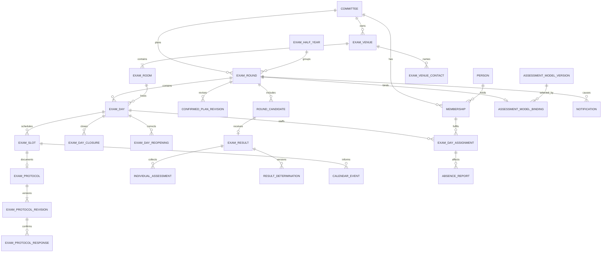

# Fachmodell und Verträge

`lzug` unterstützt die Arbeit genau eines Prüfungsausschusses je Instanz.
Diese Seite erklärt die Semantik der fachlichen und technischen Verträge.
Sie ist keine vollständige Feld-, Tabellen-, Routen- oder Konfigurationsliste;
für ausführbare Details bleiben Modelle, Schema, Migrationen, OpenAPI und Tests
maßgeblich.

## Fachmodell

- **Ausschuss, Person und Mitgliedschaft:** Der Ausschuss ist der fachliche
  und autorisierende Arbeitskontext.
  Personen können aktive oder historische Mitgliedschaften mit Rolle und
  Vertreterseite halten.
  Ein technisches Betreiberkonto ist keine fachliche Mitgliedschaft.
- **Prüfungshalbjahr und Prüfungsrunde:** Das Halbjahr liefert die gemeinsame
  zeitliche Einordnung; die Runde ist der planbare und fachlich abschließbare
  Vorgang eines Ausschusses.
  Abschluss, vollständige Absage, Sperre, Wiederöffnung und Export sind an eine
  monoton steigende Rundenrevision gebunden.
- **Planung und Durchführung:** Verfügbarkeiten, mögliche Tage und Vorschläge
  führen zu Prüfungstagen, Slots und Besetzungen.
  Eine bestätigte Planung kann nur vor dem tatsächlichen Start als vollständiges
  Aggregat und mit unveränderlicher Vorher-/Nachher-Revision geändert werden.
- **Prüfungsorte, Räume und Kontakte:** Ein Prüfungsort ist ein wiederverwendbarer
  globaler oder ausschussbezogener Stammdatensatz mit vollständiger Anschrift.
  Sein normalisierter Name ist im jeweiligen Scope eindeutig.
  Räume gehören genau zu einem Ort, führen keine zweite Anschrift und sind dort
  über ihre normalisierte Bezeichnung eindeutig.
  Kontakte gehören zu einem Ort, gelten ohne Raumzuordnung ortsweit und bleiben
  berechtigungsfreie Stammdaten.
  Neue Einplanungen referenzieren immer einen konkreten aktiven Raum.
- **Ausfall und Folgen:** Ein Ausfall bezieht sich auf eine bestätigte
  Besetzung und ändert den Plan nicht voreilig.
  Benachrichtigungs- und Kalenderfolgen werden nach einem erfolgreichen
  Fach-Commit getrennt, wiederholbar und best effort verarbeitet.
- **Prüfungsprotokoll:** Ein tatsächlich gestarteter Slot erhält genau ein
  gemeinsames Protokoll mit unveränderlichen Inhaltsversionen und Reaktionen
  der tatsächlich Beteiligten.
  Bewertungsdaten bleiben im getrennten Ergebnisaggregat.
- **Bewertungsmodell und Ergebnis:** Vor der ersten Bewertung wird eine
  unveränderliche Modellversion gebunden.
  Verdeckte Einzelbewertungen, kontrollierte Offenlegung, externe
  Eingangsergebnisse, Berechnung, Feststellung, Bestätigung, Mitteilung,
  Korrektur und Export bleiben unterscheidbare Zustände.
- **Tages- und Rundenabschluss:** Ein Tagesabschluss bindet Durchführung,
  Anwesenheit, Besetzung, Ausfälle, Protokolle und Bewertungen an eine Revision.
  Nachträgliche Änderungen benötigen einen begründeten, zielgerichteten
  Wiederöffnungsumfang; frühere Nachweise bleiben erhalten.
- **Dokumente und Kommunikation:** Dokumentmetadaten und Binärinhalt liegen an
  einer kontrollierten gemeinsamen Mutationsgrenze.
  Ein fachlicher Hinweis bleibt bestehen, wenn ein externer Zustellkanal
  scheitert.

## Fachliche Invarianten

- Fachzugriffe bleiben im aktiven Ausschusskontext; Betreiberrechte ersetzen
  keine Ausschussrolle.
- Vorsitz und Stellvertretung besitzen dieselben fachlichen Verwaltungsrechte.
  Ein aktiver Ausschuss benötigt einen widerspruchsfreien Bootstrap-Zustand und
  genau einen aktiven Vorsitz.
- Bestätigte Pläne werden nur mit aktuellem Revisionsstand, Grund und
  berechtigtem Actor verändert.
  Gestartete, geschlossene oder gezielt gesperrte Gegenstände werden nicht
  durch einen allgemeinen Schreibpfad umgangen.
- Ein Prüfungsort kann erst mit bestätigter Barrierefreiheitsangabe und mindestens
  einem aktiven Raum aktiviert werden.
  Inaktive Orte und Räume bleiben für bestehende Referenzen erhalten, sind aber
  für neue Planungen nicht verwendbar.
  Änderungen an Orten, Räumen und Kontakten schreiben einen append-only
  Auditnachweis und verwenden Revisionsnummern gegen verlorene Updates.
  Bei bestätigten zukünftigen Einplanungen nennt die Vorprüfung Anzahl,
  Zeitraum sowie die erwarteten Kalender- und Benachrichtigungsfolgen und
  verlangt vor dem Speichern eine ausdrückliche Bestätigung.
  Name, Anschrift, Standort, konkrete Raum- und ausgegebene Auffindungsangaben
  aktualisieren nur zukünftige persönliche Kalenderereignisse unter ihrer
  stabilen externen ID.
  Anschrift, Standort, Eingang, Raum, Auffindung und Barrierefreiheit erzeugen
  bei bedeutungsrelevanten Änderungen normal priorisierte Hinweise für die
  betroffenen Mitglieder; Schreibkorrekturen können ausdrücklich als nicht
  bedeutungsrelevant bestätigt werden.
  Kontakte, Kartenpositionen, Aktivstatus und Raumkapazität lösen allein keine
  dieser Folgen aus.
  Die unveränderliche Orts-Audit-ID ist der idempotente Ursprung persistierter
  Folgetasks.
  Fehler rollen die Stammdatenänderung nicht zurück, bleiben für die handelnde
  Person sowie Vorsitz und Stellvertretung sichtbar und können nur nach einer
  Aktualitätsprüfung erneut verarbeitet werden.
  Diese Verarbeitung verändert keine bestätigte Planrevision.
- Fachlich relevante Korrekturen überschreiben weder Protokolle, Bewertungen,
  Feststellungen noch Abschlussentscheidungen stillschweigend.
- Individuelle Bewertungen bleiben bis zur vollständigen Eigenbewertung und
  kontrollierten Offenlegung für andere Beteiligte verborgen.
  Ein berechneter Vorschlag wird erst durch den vorgesehenen Beschluss zum
  festgestellten Ergebnis.
- Personenbezogene Inhalte werden auf Zweck und Empfänger begrenzt.
  Kalender, Benachrichtigungen, Diagnosen und Logs enthalten keine unnötigen
  Fach- oder Geheimnisdaten.

Die fachliche Bedeutung liegt in den Services und ihren Tests, insbesondere
unter `backend/planning.py`, `backend/exam_protocols.py`,
`backend/exam_results.py`, `backend/exam_day_closures.py` und
`backend/exam_round_lifecycle.py` sowie `backend/venue_consequences.py`.
Ändert sich eine Invariante, müssen Service, Persistenz, HTTP-Vertrag,
Frontendverhalten und betroffene Tests gemeinsam geprüft werden.

## Persistenz und Migrationen

`backend/models.py` bildet die Produktstruktur mit SQLAlchemy ab.
`db/schema.sql` ist die ausführbare Referenz für eine neue Datenbank;
`db/migrations/` entwickelt vorhandene Bestände geordnet vorwärts.
Die Laufzeit prüft Reihenfolge, Prüfsummen und Integrität der
Migrationshistorie fail-closed.

Die Migrationen bis `028_add_exam_venue_change_notifications.sql` bilden den aktuellen
Stand von Authentifizierung und Sitzungen, Planrevisionen, Benachrichtigungen,
Kalendern, Ausfall und Ersatz, Prüfungsprotokollen, Ergebnissen,
Tagesabschlüssen, Ausschuss-Bootstrap, Planfolgen, Rundenlebenszyklus sowie
Prüfungsorten, Backup-/Export-Nachweisen und der auditierten öffentlichen
Backup-Empfängerkonfiguration ab.
`025_model_exam_venues.sql` ersetzt den bisherigen kombinierten Altbestand.
Sie gruppiert nur bei gleichem Ausschuss, normalisiertem Namen und vollständiger
normalisierter Anschrift, erhält jede Alt-ID über eine dauerhafte Raumzuordnung
und stellt Planungsstandards, Prüfungstage sowie gespeicherte Planrevisionen
auf Raumreferenzen um.
Ein Preflight prüft die Ortsmigration und bricht bei verwaisten Referenzen,
Namens- oder Raumkonflikten atomar ab.
Migrierte Orte bleiben wegen ungeklärter Barrierefreiheit inaktiv; externe
Karten- oder Geocodingdienste werden nicht verwendet.
Bestandsmigrationen erfinden keine historischen Actor, Bewertungen,
Bestätigungen oder Abschlussentscheidungen.
`027_expand_exam_venue_audit.sql` erweitert den unveränderlichen Verlauf um
technische Operator-Akteure und die Ereignisse für beantragte, genehmigte oder
abgelehnte Hochstufungen.
`028_add_exam_venue_change_notifications.sql` ergänzt den Ereignistyp für
persistierte Benachrichtigungen nach wirksamen Prüfungsortänderungen.
Unbekannte oder nicht unterstützte Schemastände verhindern Start, Restore oder
Lifecycle-Mutation an der jeweiligen kontrollierenden Grenze.

SQLite läuft im Self-Hosting-Modell mit dem persistenten Dokumentbestand und
dem anwendungseigenen Authentifizierungsschlüssel unter `/data`.
Ein vollständiges Backup hält Datenbank, Dokumente und Schlüssel an einem
gemeinsamen Snapshot-Zeitpunkt geschützt zusammen.
Ein Vollexport ist dagegen ein geschütztes offenes Fachartefakt ohne
Authentifizierungs-, Sitzungs-, Zustell- oder Betriebsgeheimnisse und kein
Restore-Eingang.
Er umfasst auch Prüfungsorte, Räume, Kontakte, Zuordnungen, Audit- und
Migrationsreferenzen mit unveränderten Identitäten.
Providerzugangsdaten, Kartenkacheln und unverarbeitete Geocoder-Antworten sind
ausgeschlossen.
Sein maschinenlesbarer Datenvertrag liegt unter
[full-export-v1.schema.json](reference/full-export-v1.schema.json).

## HTTP und OpenAPI

`backend.fastapi_app.create_app` ist die produktive Application Factory.
Sie erzeugt OpenAPI direkt aus Routen, Request- und Responsemodellen sowie
Sicherheitsdeklarationen; eine parallel gepflegte Spezifikation existiert
nicht.
`backend/server.py` startet dieselbe Anwendung, und die Demo ergänzt sie nur
über ihre Runtime-Policy.

`/api/health` ist ein öffentliches, fachinhaltsfreies Liveness-Signal.
`/api/ready` prüft Anwendungs- und Datenbankbereitschaft und antwortet mit HTTP
200 oder 503.
API-Einstieg, OpenAPI und interaktive API-Dokumentation sowie alle
Fachoperationen benötigen eine gültige Session; schreibende Operationen
benötigen zusätzlich den CSRF-Nachweis.
Actor, Ausschuss-Scope und Rollen werden ausschließlich serverseitig aus der
Session abgeleitet.

Die Venue-API führt `/api/exam-venues` als Aggregatroute ein.
Sie liest und ändert Orte über ihre Revision und legt Räume sowie Kontakte über
`/api/exam-venues/{id}/rooms` und `/api/exam-venues/{id}/contacts` an.
Einzelne Räume und Kontakte bleiben unter `/api/exam-rooms/{id}` und
`/api/exam-venue-contacts/{id}` les- und revisionsbasiert änderbar.
Aktive Mitglieder sehen aktive globale Orte und aktive Orte ihrer Ausschüsse;
inaktive Orte bleiben nur bei Verwendung in einem zugänglichen Plan sichtbar.
Vorsitz und Stellvertretung verwalten den Bestand ihrer Ausschüsse einschließlich
inaktiver oder noch zu klärender Orte.
Operatoren verwalten globale Orte ohne fachliche Ausschussrechte und sehen einen
ausschussbezogenen Ort nur während eines offenen Hochstufungsantrags.

Vor dem Anlegen oder Ändern liefert `/api/exam-venues/duplicate-check` ähnliche
Namen und Anschriften aus dem jeweils sichtbaren Scope.
Betroffene bestätigte künftige Einplanungen werden durch `POST` auf den
`change-impact`-Routen anhand des konkreten Änderungsentwurfs ermittelt.
Die Antwort trennt aktualisierte Kalenderereignisse und benachrichtigte
Mitglieder samt auslösenden Feldgruppen; die Mutation verlangt anschließend
die ausdrückliche Bestätigung.
Fehlgeschlagene aktuelle Folgen erscheinen am verwaltbaren Ortsaggregat und
werden über
`/api/exam-venue-changes/{audit_id}/consequences/retry` kontrolliert erneut
angestoßen.
Ausschussverantwortliche beantragen eine identitätserhaltende Hochstufung über
`/api/exam-venues/{id}/promotion-requests`; Operatoren entscheiden sie über
`/api/exam-venue-promotion-requests/{id}/decision`.
Kollidierende globale Orte verhindern die Hochstufung.

`/api/locations` bleibt übergangsweise eine als veraltet markierte Leseprojektion
von Räumen für noch nicht migrierte Clients.
Ihre Schreiboperationen antworten mit HTTP 410 und verweisen auf die
aggregierten Venue-Routen, damit kein Altformular eine Aktivierung ohne
Barrierefreiheitsnachweis umgehen kann.

Die OpenAPI-Vertragstests vergleichen produktive Antworten, dokumentierte
Fehler und alle vom Angular-Client verwendeten Operationen mit der erzeugten
Beschreibung.
Der öffentliche Publikationsaufbau exportiert dieselbe Beschreibung
revisionsgebunden als OpenAPI-JSON und erzeugt daneben eine deterministische
Ansicht von `db/schema.sql`.

## Lokaler Admin- und Artefaktvertrag

Die Betreiber-CLI verwendet Protokollversion 1 für kleine JSON-Aufträge und
Protokollversion 2 für getrennte Binär- und Kontrollströme über Container-`exec`.
Sie kennt weder SQLite noch SQLAlchemy und dupliziert keine fachliche Backup-,
Restore-, Export-, Manifest- oder Migrationslogik.

Die Go-CLI besitzt allein die kryptografische Hülle mit `filippo.io/age`.
Sie erzeugt und prüft X25519-age-Identitäten lokal, verschlüsselt den vom
Backend erzeugten ZIP-Strom unmittelbar in ein atomisches geschütztes Ziel und
entschlüsselt Prüfung oder Restore ohne lokale Klartextdatei.
Private Identitäten gelangen weder in Backendauftrag, argv, Umgebung,
Konfiguration, Ausgabe, Audit noch Logs.
Das Backend kennt ausschließlich den persistenten auditierten öffentlichen
Backup-Empfänger, dessen vollständigen SHA-256-Fingerabdruck und kontrollierte
Klartext-Paket- beziehungsweise Restore-Stagingbereiche.

Der öffentliche Vorspann `lzug-age-artifact` Version 2 nennt nur Format,
`age-x25519-v1` und den Fingerabdruck.
Das v0.6-Format wird als inkompatibel erkannt; der unterstützte Pfad führt über
Restore mit v0.6.0, reguläres Upgrade und ein neues geprüftes age-Backup.

Diagnose, Konto- und Ausschussverwaltung, Benachrichtigungsverarbeitung,
Backup, nicht mutierende Artefaktprüfung, Restore, Vollexport, Upgrade und
Rollback teilen diesen versionierten Vertrag.
Stabile Exit-Codes unterscheiden Eingabefehler, Engine- und
Persistenzprobleme, Artefakt- und Schlüsselbefunde, Inkompatibilität,
erforderliche Ersetzungs- oder Migrationsbestätigung sowie vollständig
ausgeführte Diagnosewarnungen und -fehler.
Die verbindlichen Bedienfolgen stehen ausschließlich im
[Administrationshandbuch](../portal/betreiben.md).

## Erzeugte Referenzen

Der Dokumentationsbuild erzeugt aus Google-Style-Docstrings die
[Python-Backend-Referenz](reference/backend.md) und aus TSDoc die
[TypeScript-Frontend-Referenz](reference/frontend.md).
Der öffentliche Site-Build ergänzt OpenAPI-JSON und Datenbankschema direkt aus
den ausführbaren Quellen.
Diese Artefakte unterstützen die Navigation im Code, ersetzen aber weder die
fachlichen Invarianten dieser Seite noch ihre jeweiligen ausführbaren
Verträge.
