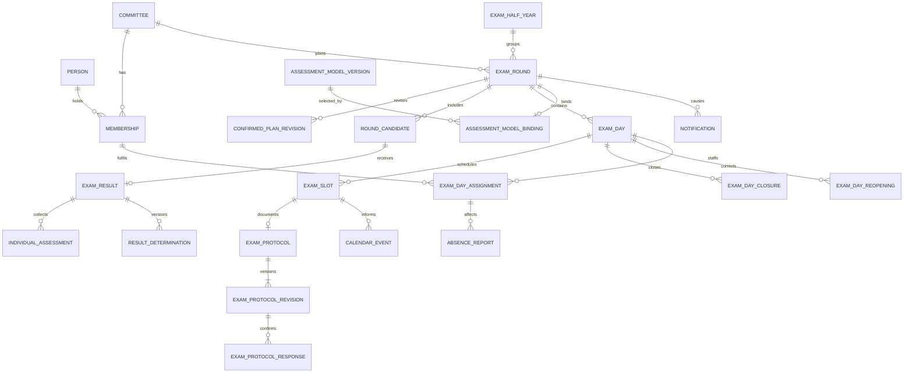

# Fachmodell und Verträge

`lzug` unterstützt die Arbeit genau eines Prüfungsausschusses je Instanz.
Diese Seite erklärt die Semantik der fachlichen und technischen Verträge.
Sie ist keine vollständige Feld-, Tabellen-, Routen- oder Konfigurationsliste;
für ausführbare Details bleiben Modelle, Schema, Migrationen, OpenAPI und Tests
maßgeblich.

## Fachmodell

- **Ausschuss, Person und Mitgliedschaft:** Der Ausschuss ist der fachliche
  und autorisierende Arbeitskontext.
  Personen können aktive oder historische Mitgliedschaften mit Rolle und
  Vertreterseite halten.
  Ein technisches Betreiberkonto ist keine fachliche Mitgliedschaft.
- **Prüfungshalbjahr und Prüfungsrunde:** Das Halbjahr liefert die gemeinsame
  zeitliche Einordnung; die Runde ist der planbare und fachlich abschließbare
  Vorgang eines Ausschusses.
  Abschluss, vollständige Absage, Sperre, Wiederöffnung und Export sind an eine
  monoton steigende Rundenrevision gebunden.
- **Planung und Durchführung:** Verfügbarkeiten, mögliche Tage und Vorschläge
  führen zu Prüfungstagen, Slots und Besetzungen.
  Eine bestätigte Planung kann nur vor dem tatsächlichen Start als vollständiges
  Aggregat und mit unveränderlicher Vorher-/Nachher-Revision geändert werden.
- **Ausfall und Folgen:** Ein Ausfall bezieht sich auf eine bestätigte
  Besetzung und ändert den Plan nicht voreilig.
  Benachrichtigungs- und Kalenderfolgen werden nach einem erfolgreichen
  Fach-Commit getrennt, wiederholbar und best effort verarbeitet.
- **Prüfungsprotokoll:** Ein tatsächlich gestarteter Slot erhält genau ein
  gemeinsames Protokoll mit unveränderlichen Inhaltsversionen und Reaktionen
  der tatsächlich Beteiligten.
  Bewertungsdaten bleiben im getrennten Ergebnisaggregat.
- **Bewertungsmodell und Ergebnis:** Vor der ersten Bewertung wird eine
  unveränderliche Modellversion gebunden.
  Verdeckte Einzelbewertungen, kontrollierte Offenlegung, externe
  Eingangsergebnisse, Berechnung, Feststellung, Bestätigung, Mitteilung,
  Korrektur und Export bleiben unterscheidbare Zustände.
- **Tages- und Rundenabschluss:** Ein Tagesabschluss bindet Durchführung,
  Anwesenheit, Besetzung, Ausfälle, Protokolle und Bewertungen an eine Revision.
  Nachträgliche Änderungen benötigen einen begründeten, zielgerichteten
  Wiederöffnungsumfang; frühere Nachweise bleiben erhalten.
- **Dokumente und Kommunikation:** Dokumentmetadaten und Binärinhalt liegen an
  einer kontrollierten gemeinsamen Mutationsgrenze.
  Ein fachlicher Hinweis bleibt bestehen, wenn ein externer Zustellkanal
  scheitert.

## Fachliche Invarianten

- Fachzugriffe bleiben im aktiven Ausschusskontext; Betreiberrechte ersetzen
  keine Ausschussrolle.
- Vorsitz und Stellvertretung besitzen dieselben fachlichen Verwaltungsrechte.
  Ein aktiver Ausschuss benötigt einen widerspruchsfreien Bootstrap-Zustand und
  genau einen aktiven Vorsitz.
- Bestätigte Pläne werden nur mit aktuellem Revisionsstand, Grund und
  berechtigtem Actor verändert.
  Gestartete, geschlossene oder gezielt gesperrte Gegenstände werden nicht
  durch einen allgemeinen Schreibpfad umgangen.
- Fachlich relevante Korrekturen überschreiben weder Protokolle, Bewertungen,
  Feststellungen noch Abschlussentscheidungen stillschweigend.
- Individuelle Bewertungen bleiben bis zur vollständigen Eigenbewertung und
  kontrollierten Offenlegung für andere Beteiligte verborgen.
  Ein berechneter Vorschlag wird erst durch den vorgesehenen Beschluss zum
  festgestellten Ergebnis.
- Personenbezogene Inhalte werden auf Zweck und Empfänger begrenzt.
  Kalender, Benachrichtigungen, Diagnosen und Logs enthalten keine unnötigen
  Fach- oder Geheimnisdaten.

Die fachliche Bedeutung liegt in den Services und ihren Tests, insbesondere
unter `backend/planning.py`, `backend/exam_protocols.py`,
`backend/exam_results.py`, `backend/exam_day_closures.py` und
`backend/exam_round_lifecycle.py`.
Ändert sich eine Invariante, müssen Service, Persistenz, HTTP-Vertrag,
Frontendverhalten und betroffene Tests gemeinsam geprüft werden.

## Persistenz und Migrationen

`backend/models.py` bildet die Produktstruktur mit SQLAlchemy ab.
`db/schema.sql` ist die ausführbare Referenz für eine neue Datenbank;
`db/migrations/` entwickelt vorhandene Bestände geordnet vorwärts.
Die Laufzeit prüft Reihenfolge, Prüfsummen und Integrität der
Migrationshistorie fail-closed.

Die Migrationen bis `024_add_artifact_operations.sql` bilden den aktuellen
Stand von Authentifizierung und Sitzungen, Planrevisionen, Benachrichtigungen,
Kalendern, Ausfall und Ersatz, Prüfungsprotokollen, Ergebnissen,
Tagesabschlüssen, Ausschuss-Bootstrap, Planfolgen, Rundenlebenszyklus sowie
Backup-/Export-Nachweisen ab.
Bestandsmigrationen erfinden keine historischen Actor, Bewertungen,
Bestätigungen oder Abschlussentscheidungen.
Unbekannte oder nicht unterstützte Schemastände verhindern Start, Restore oder
Lifecycle-Mutation an der jeweiligen kontrollierenden Grenze.

SQLite läuft im Self-Hosting-Modell mit dem persistenten Dokumentbestand und
dem anwendungseigenen Authentifizierungsschlüssel unter `/data`.
Ein vollständiges Backup hält Datenbank, Dokumente und Schlüssel an einem
gemeinsamen Snapshot-Zeitpunkt geschützt zusammen.
Ein Vollexport ist dagegen ein geschütztes offenes Fachartefakt ohne
Authentifizierungs-, Sitzungs-, Zustell- oder Betriebsgeheimnisse und kein
Restore-Eingang.
Sein maschinenlesbarer Datenvertrag liegt unter
[full-export-v1.schema.json](reference/full-export-v1.schema.json).

## HTTP und OpenAPI

`backend.fastapi_app.create_app` ist die produktive Application Factory.
Sie erzeugt OpenAPI direkt aus Routen, Request- und Responsemodellen sowie
Sicherheitsdeklarationen; eine parallel gepflegte Spezifikation existiert
nicht.
`backend/server.py` startet dieselbe Anwendung, und die Demo ergänzt sie nur
über ihre Runtime-Policy.

`/api/health` ist ein öffentliches, fachinhaltsfreies Liveness-Signal.
`/api/ready` prüft Anwendungs- und Datenbankbereitschaft und antwortet mit HTTP
200 oder 503.
API-Einstieg, OpenAPI und interaktive API-Dokumentation sowie alle
Fachoperationen benötigen eine gültige Session; schreibende Operationen
benötigen zusätzlich den CSRF-Nachweis.
Actor, Ausschuss-Scope und Rollen werden ausschließlich serverseitig aus der
Session abgeleitet.

Die OpenAPI-Vertragstests vergleichen produktive Antworten, dokumentierte
Fehler und alle vom Angular-Client verwendeten Operationen mit der erzeugten
Beschreibung.
Der öffentliche Publikationsaufbau exportiert dieselbe Beschreibung
revisionsgebunden als OpenAPI-JSON und erzeugt daneben eine deterministische
Ansicht von `db/schema.sql`.

## Lokaler Admin- und Artefaktvertrag

Die Betreiber-CLI spricht ausschließlich Protokollversion 1 des lokalen
Python-Adminprozesses über Container-`exec` und ein JSON-Objekt auf stdin/stdout.
Sie kennt weder SQLite noch SQLAlchemy und dupliziert keine Backup-, Restore-,
Migrations- oder Kryptologik.
Private Empfängerschlüssel gelangen nur über stdin in die kontrollierte
Operation; öffentliche Schlüssel, Release-Digests und technische Kennungen
dürfen als geheimnisfreie Metadaten verwendet werden.

Diagnose, Konto- und Ausschussverwaltung, Benachrichtigungsverarbeitung,
Backup, nicht mutierende Artefaktprüfung, Restore, Vollexport, Upgrade und
Rollback teilen diesen versionierten Vertrag.
Stabile Exit-Codes unterscheiden Eingabefehler, Engine- und
Persistenzprobleme, Artefakt- und Schlüsselbefunde, Inkompatibilität,
erforderliche Ersetzungs- oder Migrationsbestätigung sowie vollständig
ausgeführte Diagnosewarnungen und -fehler.
Die verbindlichen Bedienfolgen stehen ausschließlich im
[Administrationshandbuch](https://github.com/lxndrp/lzug/wiki/Administration).

## Erzeugte Referenzen

Der Dokumentationsbuild erzeugt aus Google-Style-Docstrings die
[Python-Backend-Referenz](reference/backend.md) und aus TSDoc die
[TypeScript-Frontend-Referenz](reference/frontend.md).
Der öffentliche Site-Build ergänzt OpenAPI-JSON und Datenbankschema direkt aus
den ausführbaren Quellen.
Diese Artefakte unterstützen die Navigation im Code, ersetzen aber weder die
fachlichen Invarianten dieser Seite noch ihre jeweiligen ausführbaren
Verträge.
