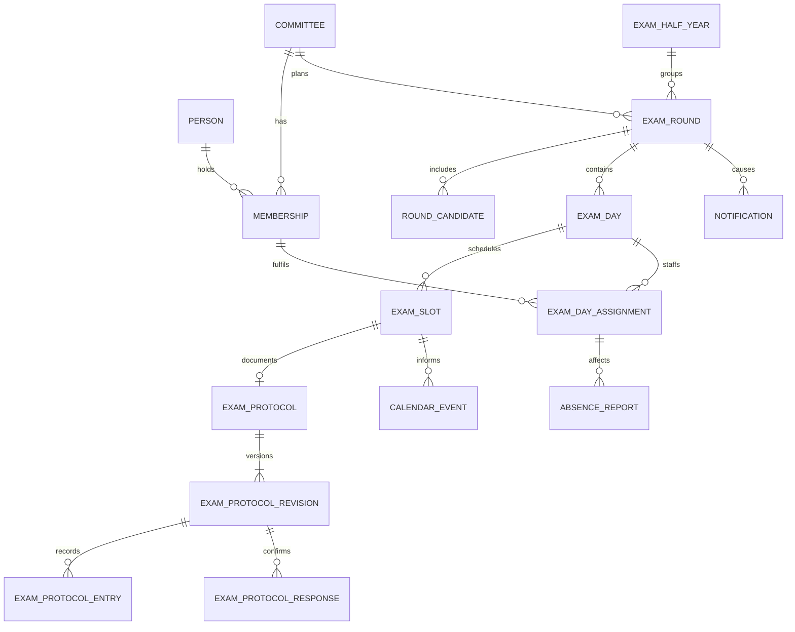

# Fachliches Datenmodell

Dieses Dokument beschreibt die fachlichen Begriffe, Aggregate, Beziehungen und
Invarianten von lzug. Es ist keine zweite API-, Feld- oder Schemareferenz. Die
ausführbare technische Struktur liegt in den SQLAlchemy-Modellen,
`db/schema.sql` und den Migrationen; die öffentliche HTTP-Schnittstelle in der
OpenAPI-Quelle.

## Aggregate und Beziehungen

- **Ausschuss und Person**: Ein Ausschuss ist der fachliche und
  autorisierende Arbeitskontext. Personen können Mitgliedschaften mit Rolle,
  Vertreterseite und Aktivitätsstatus halten. Ein Betreiberkonto ist keine
  fachliche Mitgliedschaft.
- **Prüfungszeitraum und Prüfungsrunde**: Ein Prüfungshalbjahr fasst die
  zeitliche Einordnung; eine Prüfungsrunde ist der planbare Vorgang eines
  Ausschusses. Zugeordnete Prüflinge gehören zur Runde, nicht unmittelbar zum
  Ausschuss.
- **Planung und Durchführung**: Orte, Verfügbarkeiten, mögliche Tage und ein
  Vorschlag führen zu Prüfungstagen, Slots und Besetzungen. Die bestätigte
  Planung ist die Grundlage für Benachrichtigungen, Kalender und Ausfälle.
- **Kommunikation und Dokumente**: Ein fachlicher Hinweis ist von seinen
  technischen Zustellungen getrennt. Persönliche Kalender enthalten nur die
  eigene Einplanung. Dokumente besitzen fachliche Metadaten; ihr Inhalt bleibt
  in einer separaten, kontrollierten Ablage.
- **Ausfall und Ersatz**: Eine Ausfallmeldung bezieht sich auf eine bestätigte
  Besetzung. Rückmeldungen, Ersatzwahl und Korrekturen bilden einen
  nachvollziehbaren Prozess, der den bestätigten Plan nicht voreilig ändert.
- **Prüfungsprotokoll**: Jeder tatsächlich gestartete Slot besitzt genau ein
  gemeinsames Protokoll. Es stellt den regulären Verlauf ausdrücklich fest oder
  erfasst Besonderheiten strukturiert. Inhalt, Reaktionen und Korrekturen sind
  versioniert; Bewertungsdaten bleiben dem getrennten Bewertungsaggregat
  vorbehalten.

## Fachliche Invarianten

- Planung und Fachzugriffe bleiben im Ausschusskontext; Betreiberrechte
  ersetzen keine Ausschussrolle.
- Vorsitz und Stellvertretung sind in der fachlichen Bearbeitung gleichgestellt;
  die Stellvertretung bezeichnet nur die Vertretungsfunktion.
- Eine bestätigte Tagesbesetzung deckt Arbeitgeber-, Arbeitnehmer- und
  Schulseite ab und verfügt zusätzlich über einen Fallback. Ein Tag besteht
  nicht ausschließlich aus mündlichen Ergänzungsprüfungen.
- Verfügbarkeiten, Ersatz und Kalenderereignisse beziehen sich auf die
  konkrete Runde und den betroffenen Tagesabschnitt. Ein Ersatz wird erst nach
  kontrollierter Auswahl wirksam.
- Fachliche Hinweise bleiben erhalten, wenn eine externe Zustellung scheitert.
  Wiederholungen dürfen keinen zweiten gleichartigen Hinweis erzeugen.
- Vor dem tatsächlichen Start entsteht kein Protokoll. Nach dem Start bleiben
  auch unterbrochene oder abgebrochene Prüfungen protokollpflichtig. Eine neue
  Inhaltsversion macht Reaktionen auf den vorigen Stand sichtbar überholt;
  regulär abschließbar ist nur ein von allen tatsächlich Beteiligten
  behandelter aktueller Stand.
- Nur tatsächlich beteiligte Prüfer dürfen inhaltlich reagieren. Vorsitz und
  Stellvertretung dürfen ausschussbezogen lesen sowie begründete
  Korrekturvorgänge koordinieren; Betreiberrechte gewähren keinen
  Protokollzugriff.
- Personenbezogene Inhalte sind auf erforderliche Beteiligte begrenzt:
  Kalenderfeeds offenbaren keine Prüflings- oder Fremdbesetzungsdaten;
  Dokumentpfade und Zustellungsdetails sind keine frei wählbaren Fachdaten.

Ändert sich eine fachliche Regel, wird dieses Dokument gemeinsam mit den
zugehörigen Services und Tests geprüft. Ändert sich nur eine technische
Darstellung, bleibt deren ausführbare Quelle maßgeblich.
