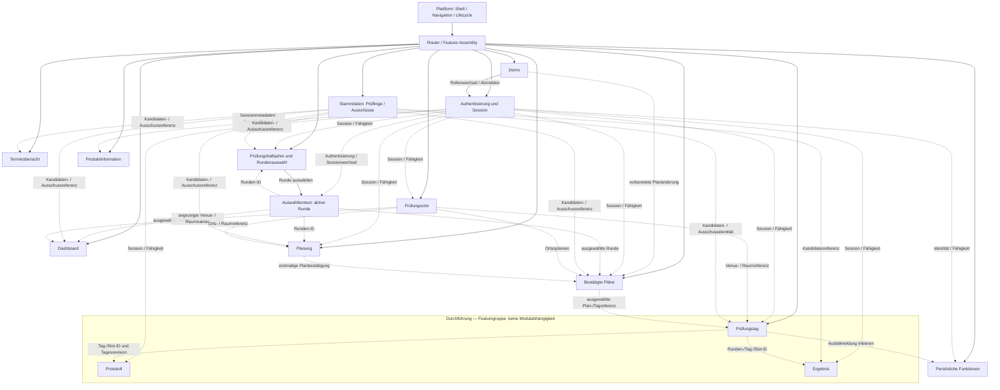
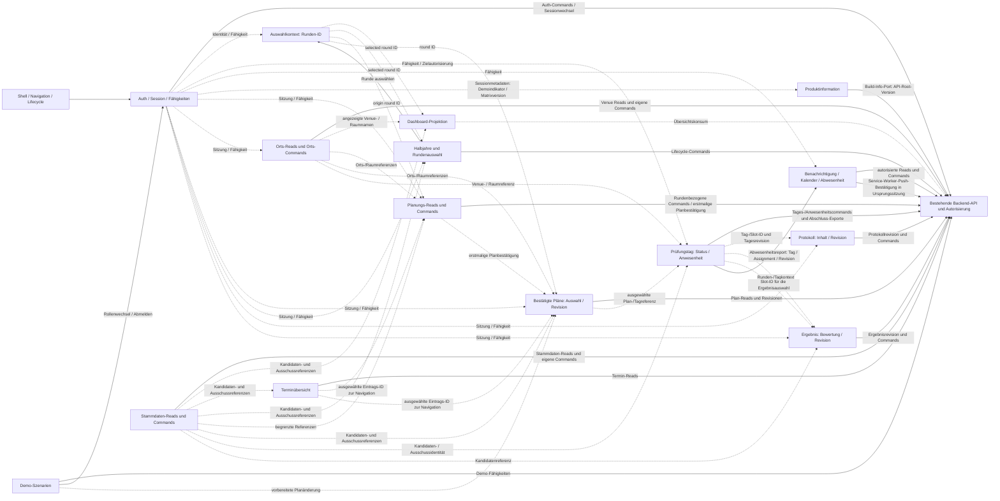

# Frontend-Architekturvertrag

Dieser Vertrag beschreibt Zielverantwortung, Routen, Provider-Lebensdauern und
fachliche Datenflüsse des Angular-Frontends.
Die Entscheidung ist in [ADR-0042](decisions/0042-frontend-zustandsbesitz-und-feature-lebensdauern.md)
festgehalten.

## Frontend-Zielvertrag

[ADR-0042](decisions/0042-frontend-zustandsbesitz-und-feature-lebensdauern.md)
verbindet den bestehenden Angular-/REST-Vertrag aus ADR-0004 mit konkretem
Datenbesitz, Schreibrecht und Lebensdauer.
Die Matrix beschreibt das bestätigte Ziel.
Der folgende Ist-Hinweis hält befristete Übergangspfade fest, ohne sie als
Zielarchitektur auszugeben.

| Bereich | Daten- und Zustandsbesitz | Commands und Schreibrecht | Geteilte Referenzen und Konsumenten | Lebensdauer und Invalidierung |
| --- | --- | --- | --- | --- |
| Shell und Navigation | Shell besitzt Navigationszustand, globale Hinweise, Lifecycle-Anzeige und Zugriffssicht; keine Fachdaten oder fachlichen Workflow-Drafts. | Keine fachlichen Commands; Auth- und Session-Commands liegen beim Auth-Feature. | Auth-/Capability-Sicht für erlaubte Aktionen; globale Rückmeldungen nehmen Ergebnisse entgegen, besitzen aber nicht deren Fachdaten. | Shell bleibt während der App-Sitzung. Auth-/Sessionwechsel leert geschützte Ansichten; Navigation allein löscht keine anwendungsweiten Identitäts- oder Lifecycle-Werte. |
| Authentisierung und Session | Auth besitzt Anmeldung, Einladung/Aktivierung, Wiederherstellung, Sitzungsidentität und Auth-Antworten; auch eine ausstehende Server-Sitzungswiderrufung sowie die anwendungsweite Demo-Workspace-Ablaufprüfung gehören hierher. Der Session-Ablauf bleibt über Routenwechsel aktiv; nur der sichtbare Countdown ist ans Demo-Feature gebunden. | Anmelden, Einladung aktivieren, Zugang wiederherstellen, TOTP bestätigen und Sitzung beenden über `AuthService`/Auth-Feature. Demo-Rollenwechsel und Verlassen der Demo delegieren Sitzungseinrichtung beziehungsweise Abmeldung an Auth. | Authentisierte Identität und Berechtigungen sind begrenzte Referenzen für geschützte Features; die Shell konsumiert die Zugriffssicht. | Ansichtwechsel verwirft Einladungs-/Wiederherstellungstoken sowie Passwort- und TOTP-Drafts. Ein angenommener Aktivierungs- oder Wiederherstellungsvorgang behält seine einmaligen Wiederherstellungscodes featuregebunden, bis sie angezeigt und ausdrücklich bestätigt wurden; ein Auth-Ansichtswechsel darf sie nicht verwerfen. Ist die Antwort mit Klartextcodes unbekannten Ausgangs verloren, bietet die bestehende API keinen erneuten Abruf; eine Wiederherstellung dieses Falls erfordert einen separaten Auth-/Backend-Vertrag. Andere verspätete Antworten bleiben an ihren Ursprungsvorgang gebunden. Bei fehlgeschlagener Validierung sperrt Auth den ungeprüften Kontext, persistiert sofort einen Widerrufungsbedarf und startet den Serverwiderruf. Dieser Pending-Zustand ist originweit und an eine Auth-Übergangsgeneration gebunden. Ein gemeinsamer tabübergreifender Übergangs-Lock serialisiert jeden Sitzungscookie-Wechsel vor dem Senden des Requests und hält bis zur validierten Annahme oder zum Abschluss des Widerrufsversuchs; nach fehlgeschlagenem Widerruf hält der persistierte Fence in allen Tabs neue Sitzungserzeugung und -annahme gesperrt. Die Wiederholung richtet sich weiter auf den quarantänisierten Ursprungskontext; ein erfolgreicher Widerruf darf nur den Marker derselben Generation löschen. Erst danach darf eine neue Sitzung entstehen oder angenommen werden. Solange der Bedarf besteht, bietet die Shell einen expliziten Wiederholungsbefehl; normale Initialisierung bleibt gesperrt. Jeder erfolgreiche Auth-Generationswechsel – neue Sitzung, Demo-Rollenwechsel, Abmeldung, erfolgreicher Widerruf oder erkannter Ablauf/Entzug – wird tabübergreifend bekannt gemacht, damit alle Tabs alten SessionScope, Capabilities, geschützte Ansichten und Reads leeren oder fencen. Nach Browser-Sichtbarkeitsrückkehr validiert Auth eine bestehende Sitzung erneut; eine abgelaufene oder entzogene Sitzung löst denselben originweiten Übergang aus. Unabhängig von dieser asynchronen Bereinigung muss jede geschützte oder identitätsabhängige Antwort unmittelbar vor ihrem Zustandswrite ihre Auth-Generation mit der geteilten aktuellen Generation vergleichen und bei Abweichung verworfen werden; verspätete Antworten der alten Generation dürfen keinen Zustand mehr schreiben. |
| Auswahlkontext | `RoundContextService` besitzt die nullable ausgewählte Runden-ID; die ausgewählte Ausschuss-ID ist nur ein kleiner UI-Kontext. Keine Rundendaten, Boards oder Drafts. | Runde auswählen/wechseln; fachliche Änderung und Autorisierung verbleiben beim zuständigen Runden-Feature. Der Sessionkontext wird nach erfolgreicher Authentisierung explizit initialisiert. | IDs und wenige begründete Anzeigeinformationen für Routing und Commands; Feature-Reads bleiben Eigentum des jeweiligen Features. | Rundenwechsel verwirft alle rundenbezogenen Reads und Drafts. Jeder gestartete Command bindet die ursprüngliche Runden-ID; sein Ergebnis darf nicht in einen anderen Kontext geschrieben werden. Sessionwechsel löscht geschützte Auswahlwerte; ohne authentisierte Auswahl gibt es keine synthetische Standardrunde. |
| Dashboard | Eigene Übersicht, Summary und für die Dashboard-Aufgabe nötige Projektion. Keine Quelle für Orts-, Personal- oder Featurezustand. | Öffnen/Navigation zu Features; keine Mutationen fremder Fachbereiche. | Runde, kleine Zusammenfassungen und die für das Board angezeigten Orts-/Raumnamen als begrenzter Konsument; keine Voraussetzung für unabhängige Features. | Wechsel aus der Ansicht verwirft deren Reads/Projektion. Rundenauswahl, Sessionwechsel oder eine erfolgreiche Runden-Lifecycle-Mutation (Schließen, Abbrechen, Wiederöffnen oder Löschen), die seine Round-/Summary-Projektion ändert, invalidiert sie; betroffene Venue-/Raum-Umbenennungen invalidieren seine Orts-/Boardprojektion. Erfolgreiche Planungseinstellungs- und Verfügbarkeitswrites invalidieren das Dashboard der Quellrunde; Verfügbarkeitswrites invalidieren außerdem Dashboards aller Zielrunden, auf die dieselbe Verfügbarkeit gespiegelt wurde. Erneutes Öffnen lädt gezielt neu. |
| Prüfungsorte | Ortsfeature besitzt Venue-, Raum- und Kontaktdaten, Auswahl, Filter, Drafts, Lade-/Fehlerstatus und Geocoding-/Preflight-Ergebnisse. Reads sind ohne Runde verfügbar. | Orts-, Raum- und Kontaktänderungen, Geocoding, Dubletten-/Auswirkungsprüfungen, Promotionanträge/-entscheidungen und Folgeaufträge. Nur freigegebene Berechtigungen erlauben den jeweiligen Write. | Orts-IDs und schmale lesende Ortsreferenz für Planung, bestätigte Pläne, Prüfungstag und Dashboard; diese Konsumenten besitzen keine Ortsmutation. | Ansichtswechsel verwirft Reads, Preflight und ansichtsgebundene Draft-Ergebnisse. Angenommene Venue-/Raum-/Kontaktänderungen bleiben an ihre Ursprungs-ID gebunden; jede revisionierte Prüfung, Vorschau und Mutation behält die beim Laden gelesene Entity-Revision bis zum endgültigen Write. Eine Bestätigung nach Vorschau darf die Revision nicht ersetzen; Konflikte erfordern gezieltes Neuladen und erneute Prüfung. Sessionwechsel invalidiert geschützte Ortsdaten. Erfolgreiche Commands übernehmen bestätigte Venue-/Raum-/Kontaktantworten oder invalidieren betroffene Orts-Reads; Venue-/Raumänderungen invalidieren die abhängigen Ortsreferenzen in Planung, bestätigten Plänen und Prüfungstag sowie die Dashboard-Boardprojektion. Erfolgreiche Auswirkungsbearbeitung oder -wiederholung invalidiert betroffene Personal-Kalender- und Benachrichtigungsprojektionen. |
| Stammdaten | Kandidaten und Ausschüsse besitzen ihre kanonischen Stammdaten im Master-Data-Feature; Listen, Editoren und Commands gehören zum jeweiligen Einstieg. | Kandidaten anlegen, ändern und löschen; Ausschussmitglieder anlegen und ihren Aktivstatus ändern. Kandidaten-/Zuordnungswrites laufen über Planning-Commands; Mitgliedschaftsänderungen rufen den Identity-eigenen Use Case für Audit und erforderliche Sitzungs-/Tokenfolgen auf. | Kandidaten, Ausschussmitglieder und Ausschüsse sind begrenzte Leseoptionen für Dashboard, Terminübersicht, Rundenwahl, Planung, bestätigte Pläne und Durchführung; Änderungen invalidieren gezielt die davon abhängigen Referenzen. | Ansichtswechsel verwirft lokale Such-/Edit-Drafts. Anlegen nutzt bis zur Antwort eine stabile Ansichts-/Operationskorrelation und wechselt danach zur Server-ID; andere Mutationen bleiben an die Ursprungsobjekt-ID gebunden. Sessionwechsel leert geschützte Daten. Rundenzuweisungen sowie bestätigte-Plan-, Day- und Result-Referenzen werden bei relevanten Master-Data-Änderungen gezielt invalidiert (siehe Operationstabelle). Jede Aktivstatusänderung eines Ausschussmitglieds invalidiert Day-Projektionen aller betroffenen Tageszuweisungen, weil die Schließbereitschaft den aktiven Mitgliedsstatus auswertet. Dies gilt für Aktivierung und Deaktivierung; Identitätsmutation, Audit und notwendige Token-/Sitzungsfolgen bleiben im Identity-UoW atomar. |
| Prüfungshalbjahre und Rundenauswahl | Halbjahre und Runden-Lebenszyklus gehören dem Halbjahresfeature. Der ausgewählte Rundenzeiger gehört zum Auswahlkontext; die Rundenauswahl im Halbjahres-Einstieg schreibt ihn über den Auswahlkontext. Kandidatenzuordnungen werden hier nicht neu angelegt oder neu zugeordnet; terminale Statuscommands beenden eine aktive Zuordnung atomar mit der Änderung des RoundCandidate. | Runden anlegen, schließen, abbrechen, wieder öffnen, leere Runden löschen, terminale Kandidatenstatus setzen, IHK-Status dokumentieren und Lebenszyklusdaten exportieren. Runde und ein dafür erforderliches Halbjahr werden atomar angelegt; terminale Kandidatenstatuswechsel schreiben RoundCandidate-Status, Assignment-Ende, Rundenrevision und Audit gemeinsam. Runde auswählen löst einen Kontextwechsel über den Auswahlkontext aus. | Ausschüsse, Kandidaten und Zuordnungen sind begrenzte Stammdaten-Reads; Runden-ID wird an nachfolgende Commands übergeben. | Ansichtswechsel verwirft Feature-Reads/Drafts. Beim Anzeigen lädt das Feature die Lifecycle-Readiness; solange es sichtbar bleibt, aktualisiert es diese in featureeigener Kadenz mit begrenzter Anzeigungsveraltung, sofort nach Rückkehr zur Browser-Sichtbarkeit und bei bekannten gleichursprünglichen Folge-Statusänderungen. Lifecycle-Antworten werden an Session- und View-Generation gebunden. Schließen/Abbrechen bleibt serverautoritativ und prüft erneut Rundenrevision und Lifecycle-Voraussetzungen; eine zwischengespeicherte Bereitschaft ist nur Anzeigezustand. Ein Rundenwechsel invalidiert alle abgeleiteten rundenbezogenen Views, nicht aber fachunabhängige Ortsdaten. Erfolgreiche Lifecycle-Mutationen invalidieren betroffene Dashboard- und Terminübersicht-Projektionen. Eine Rundenanlage invalidiert zusätzlich die Halbjahresliste, damit eine neue Saison-/Jahresgruppe unmittelbar erscheint. Erfolgreiches Löschen der ausgewählten Runde leert die Auswahl nur, wenn sie noch auf die gelöschte Ursprungs-ID zeigt; danach ist eine explizite neue Auswahl erforderlich. Sessionwechsel löscht geschützte Listen. |
| Planung | Planung besitzt Rundenorganisation, Verfügbarkeiten, Tages-/Planungsentwürfe, Validierung und Vorschlagszustand. | Runden aktualisieren, Verfügbarkeiten anfordern/speichern, Prüfungstage anlegen/generieren/aktivieren/deaktivieren, Vorschläge erzeugen/speichern und erstmalig bestätigen werden durch Planning-Commands geschrieben. Vorschauerzeugung, Speichern eines bestehenden Vorschlags und Lesen des Vorschlags bleiben getrennte Vorgänge. Erzeugen und Speichern claimen Revision/Status, ersetzen die vollständigen Tages-/Slot-/Zuordnungsaggregate und lesen das bestätigte Aggregat innerhalb derselben atomaren Planning-Operation erneut. Die Revision eines bereits bestätigten Plans gehört dem Feature Bestätigte Pläne und dessen `CONFIRMED_PLANS_PORT`. | Kandidaten-, Ausschuss-, Raum-/Orts-Referenzen werden nur als Read-Verträge konsumiert; Terminübersicht und bestätigte Pläne sind getrennte Konsumenten. | Ansichtswechsel verwirft Reads, Vorschlagsansichten, lokale Entwürfe und UI-Effekte des alten Einstiegs. Angenommene Commands bleiben an die Ursprungsrunde gebunden; Anlegen von Prüfungstagen nutzt bis zur Antwort eine Ansichts-/Operationskorrelation, Aktivieren/Deaktivieren behält die ursprüngliche Prüfungstag-ID. Nur ein Port, der eine Quellrevision annimmt, bindet den Write zusätzlich daran. Einstellungen, Verfügbarkeiten, Vorschauerzeugung und Erstbestätigung nehmen keine Quellrevision entgegen; beim Speichern eines bestehenden Vorschlags bleibt dessen angezeigte `revision` gebunden. Erfolgreiche Writes invalidieren gezielt geänderte Dashboard-/Terminübersicht-Projektionen; Einstellungen und Verfügbarkeiten invalidieren das Dashboard der Quellrunde, und Verfügbarkeitswrites zusätzlich Dashboards aller betroffenen Spiegelungsrunden. Änderungen von Rundenname oder -status invalidieren außerdem die Halbjahresliste; eine erfolgreiche Verfügbarkeitsanfrage invalidiert die Personal-Benachrichtigungen. Eine erfolgreiche Rundenumbenennung invalidiert auch betroffene Confirmed-Plans- und Day-Reads, deren Antworten den Rundennamen enthalten. Die erstmalige Planbestätigung invalidiert bestätigte Pläne sowie nach erfolgreicher Folgeausführung die betroffenen Personal-Kalender- und Benachrichtigungsprojektionen; unveränderliche Folgequellen und ursprüngliche Empfänger werden mit dem bestätigten Plan committed und von Application nach dem Domain-Commit replayt. Antworten aktualisieren nur das Planning-Feature. Planrevisionsantworten folgen dem Ursprungskontext des Bestätigte-Pläne-Features und invalidieren betroffene Prüfungstag-Reads, damit diese die bestätigte Revision neu laden. Erfolgreiche koordinierte Ersatzwahlen invalidieren zusätzlich die Planning-Projektion jeder betroffenen Runde, weil sich die Mitglieds-/Zuordnungsreferenzen ändern. Rundenwechsel setzt rundenbezogene Planung zurück. Sessionwechsel invalidiert geschützte Daten. |
| Bestätigte Pläne | Das Feature besitzt die Liste bestätigter Pläne, die Auswahl, Details, Revisionsentwurf und Revisionshistorie. | Bestätigte Pläne lesen sowie einen bestehenden bestätigten Plan mit Grund als neue Revision speichern; Queries und Revisionen laufen über `CONFIRMED_PLANS_PORT`. Die erstmalige Planbestätigung bleibt beim Planning-Feature. | Rundenauswahl und Plan-/Runden-IDs; Prüfungsorte und Stammdaten sind begrenzte Lese-Referenzen. Das Feature liefert die ausgewählte Plan-/Tag-Referenz an Prüfungstag. | Ansichtswechsel verwirft Listen-/Detail-Reads und lokale Revisionsentwürfe. Ein angenommener Revisions-Command bleibt an ursprüngliche Plan-/Runden-ID und Quellrevision gebunden. Rundenwechsel invalidiert die zugehörige Auswahl; eine erfolgreiche erstmalige Bestätigung oder Tagesmutation invalidiert betroffene Plan-/Tag-Projektionen. Die gespeicherte Planrevision invalidiert sofort betroffene Dashboard-Projektionen. Betroffene Personal-Kalender- und Benachrichtigungsprojektionen werden nach erfolgreicher Ausführung der jeweiligen Folgeaktion invalidiert, auch nach einem erfolgreichen Retry; ausstehende oder fehlgeschlagene Folgen bleiben retrybar und lösen noch keine Personalinvalidierung aus. Sessionwechsel löscht geschützte Reads und Entwürfe. |
| Terminübersicht | Rundenübergreifende Übersicht der Prüfungstermine; sie besitzt keine Planungsschreibrechte. | Terminübersicht lesen; die ausgewählte Eintrags-ID dient der Navigation in Planung oder Bestätigte Pläne. Planungsänderungen gehören dem Planning-Feature. | Nur ausgewählte Eintrags-ID als Navigationskontext; sie konsumiert nicht den globalen Auswahlkontext und verändert weder Plan- noch Ortsdaten. Die Einträge enthalten Rundenname/-status und Kalenderwochen. | Ansichtswechsel verwirft den Overview-Read. Ein Wechsel der aktiven Runde wirkt sich nicht auf die rundenübergreifende Übersicht aus. Erfolgreiche Planning- oder Lifecycle-Writes invalidieren den Overview-Read, wenn sie dessen angezeigte Felder ändern. Sessionwechsel verwirft geschützte Reads. |
| Durchführung: Prüfungstag | Prüfungstag besitzt Tagesstatus, Anwesenheit, persönliche Anwesenheitserklärung und Tagesansicht. Die UI startet dort eigene oder koordinierte Ausfallmeldungen für eine Tageszuweisung; Command, Antwort und Datenbesitz bleiben im Personal-Feature. | Anwesenheit koordinieren, Slotstart/-status ändern, Prüfungstag schließen oder nach Auswirkungsprüfung wieder öffnen; Maschinen- und Textnachweis eines Tagesabschlusses auf ausdrückliche Anforderung exportieren; eigene Anwesenheit melden; eine eigene oder koordinierte Ausfallmeldung wird als Personal-Command an `PersonalFacade` delegiert. Die berechtigten Exportabfragen protokollieren einen Export, ändern aber nicht den fachlichen Abschlusszustand. | Runde und Tag sowie je nach Command Slot-ID oder Assignment-ID und die vom Command akzeptierte Tagesrevision verbinden Tages-Reads und Workflow-Commands. Kandidatenanwesenheit zielt auf einen Slot, Mitgliedsanwesenheit und koordinierte Ausfallmeldung auf eine Tageszuweisung. Abschluss-Exporte bleiben an die Ursprungs-Tag-ID gebunden. Personal stellt die Fähigkeit zur eigenen Ausfallmeldung oder autorisierten Koordination bereit, ohne den Personalzustand an Prüfungstag abzugeben. | Ansichtswechsel verwirft Tages-Reads und lokale Antworten. Tagescommands behalten die akzeptierten Ursprungs-IDs und Revisionen; die Personal-Ausfallmeldung bleibt an ihre Personal-Identität gebunden. Jeder erfolgreiche Command, der die Day-Revision ändert, invalidiert die zugehörigen Protokoll- und Ergebnis-Child-Reads und lädt sie aus dem aktualisierten Day-Kontext neu; das gilt unabhängig davon, ob die Änderung durch Anwesenheit, Status oder Wiedereröffnung entstand. Erfolgreiche Tagescommands invalidieren außerdem betroffene Bestätigte-Plan-Projektionen. Ein ausdrücklich angeforderter Abschluss-Export bleibt an Tag und Sitzung gebunden; eine private Antwort wird nicht in eine andere Sitzung übernommen. Runden- und Sessionwechsel invalidieren geschützte Reads. |
| Durchführung: Protokoll | Protokollfeature besitzt Protokollinhalt, Revision, Änderungsentwurf, Abschluss-/Wiederöffnungszustand und Exportantworten. | Protokoll speichern, abschließen, wieder öffnen, Antworten erfassen, Korrektur anfordern/öffnen und exportieren; Konfliktbehandlung bleibt revisionsgebunden. | Runde und Tag sind geteilter Kontext. Ergebnis ist ein paralleler Konsument dieses Kontexts; es liest weder Protokoll-ID noch Protokollrevision über `ExamResultPort`. | Ansichtswechsel verwirft ungespeicherte, ansichtsgebundene Entwürfe und Reads. Mutationen binden die vom Port akzeptierten Protokoll-/Tagesrevisionen. Erfolgreiche Writes aktualisieren oder invalidieren die Day-eigene Tagesrevision und betroffene Bestätigte-Plan-Projektionen; die geteilte Revision wird den parallelen Protokoll-/Ergebnis-Konsumenten nach Refresh bereitgestellt. Export ist an Protokoll-ID und aktuellen Stand bei Anforderung gebunden; seine Antwort wird nur dem Ursprungsfeature zugestellt. Sessionwechsel invalidiert geschützte Inhalte. |
| Durchführung: Ergebnis | Ergebnisfeature besitzt Bewertung, Punkte, Teilnehmerergebnis, Revisionen und Exportzustand. | Bewertung speichern/zurücknehmen, Bewertungen offenlegen, Komponenten-/Gesamtergebnis feststellen und bestätigen, externes Ergebnis erfassen/bestätigen, Korrektur öffnen, Ergebnis mitteilen, Aufbewahrung setzen und vorhandene Exporte anfordern innerhalb der erteilten Fähigkeiten. | Runde und Tag sind geteilter Kontext mit dem Protokollfeature; die Slot-ID wählt das Ergebnis innerhalb des Tages aus. Dessen ID oder Revision ist keine Abhängigkeit des Ergebnisports. | Ansichtswechsel verwirft Read und lokalen Editor-Draft. Ein angenommener Write wird mit den vom Port akzeptierten Ursprungs-IDs und Revisionen fortgeführt. Erfolgreiche Writes aktualisieren oder invalidieren jede betroffene Day-eigene Revision aus der vollständigen `dayRevisions`-Antwort sowie die zugehörigen Bestätigte-Plan-Projektionen; Protokoll- und Ergebnis-Child-Reads der betroffenen Tage werden aus dem erneuerten Day-Kontext geladen. Eine Änderung der Ergebnisaufbewahrung invalidiert außerdem die betroffene Halbjahres-Lifecycle-Projektion mit Frist- und Legal-Hold-Aggregat. Export wird nur an den Ursprungsworkflow zugestellt. Sessionwechsel löscht geschützte Ergebnisdaten. |
| Persönliche Funktionen | Persönlicher Bereich besitzt Benachrichtigungen, Zustellkanäle, Kalenderstatus/-ereignisse und Abwesenheitsmeldungen mit je lokaler Ansicht. | Benachrichtigungen und Kanäle lesen, Push-Endpunkt registrieren, Kalenderaktionen ausführen sowie Abwesenheit für die eigene Person oder ein zugewiesenes Ausschussmitglied melden und Vertretungsbefehle mit passender Fähigkeit. Der Personal-Browseradapter besitzt außerdem die sitzungsgebundene, vom Service Worker ausgelöste Push-Zustellbestätigung an `technically_confirmed`; sie ist kein UI-Command. Eine eigene Ersatzantwort zielt auf die Response-ID; koordinierte Ersatzwahl zielt auf Abwesenheitsreport-ID, ausgewählte Ausschussmitglied-ID und Reportversion. | Authentisierte Identität und eigene Mitglieds-/Kalenderkennung; eine autorisierte Ausschusskoordination meldet Abwesenheit zu einer Tageszuweisung mit Tag-, Assignment-ID und akzeptierter Tagesrevision. Prüfungstag startet diese Aktion, übernimmt aber weder Report-Command noch Personalzustand. Die Ausschusskoordination bleibt im Personal-Feature. | Ansichtswechsel verwirft Ansichtsdaten und neue Reads; ein angenommener personenbezogener Command läuft in seinem Personal-Workflow fort. Erfolgreiche Abwesenheits-/Vertretungsbefehle invalidieren betroffene Day- und Bestätigte-Plan-Projektionen, wenn sie Tagesrevision, Besetzung oder Anwesenheit ändern. Eine neue Kalenderfeed-URL bleibt als einmaliges, derselben Sitzung zugeordnetes Ergebnis verfügbar, bis sie angezeigt/kopiert oder ausdrücklich verworfen wurde. Sessionwechsel löscht personenbezogene Reads und verhindert spätere Antwortübernahme in eine neue Sitzung. |
| Demo und Produktinformation | Demo besitzt Szenarioübersicht, Reset-Command und ansichtslokalen Tour-/Countdownzustand; Demo-Rollenwechsel und Abmeldung sind Auth-Session-Commands. Die anwendungsweite Durchsetzung des Workspace-Ablaufs bleibt beim Auth-Feature. Produktinformation besitzt die Buildversion; demoabhängige Anzeige und Matrixversion stammen aus dem Auth-Sessionzustand. Fachänderungen innerhalb einer Demo-Szene bleiben beim jeweiligen Feature. | Demo-Reset ist ein expliziter Demo-Command; Rollenwechsel und Demo verlassen delegieren an `AuthService`. Produktinformation lädt die Buildversion über einen eigenen Build-Info-Port aus der API-Root-Version; sie konsumiert weder Fachzustand noch den globalen Workspace. Tour und Navigation schreiben keine Fachaggregate. Ein bestätigter Reset/Rollenwechsel läuft zu Ende und erzeugt danach einen neuen Demo-Read. | Demo-Rolle und `demo_matrix_version` sind Auth-Sessionreferenzen; Produktinformation konsumiert die Buildversion aus der API-Root-Antwort. | Ansichtswechsel verwirft Szenario-Reads, lokale Auswahl und Tour-/Timerzustand. Der bestätigte Reset ist ein eigener bewusster Command, kein Effekt des Ansichtswechsels. Das Verlassen der Demo verwirft ihren lokalen Countdown, beendet aber nicht die Auth-eigene Ablaufprüfung der Sitzung. Ein erfolgreicher Workspace-Reset rotiert die originweite Workspace-Generation, ohne Auth-Rolle, Capabilities oder Matrixversion zu ändern. Der Generationswechsel wird tabübergreifend bekannt gemacht; jeder geschützte Antwortwriter prüft die aktuelle Workspace-Generation unmittelbar vor dem Zustandswrite und verwirft alte Antworten. Alle Tabs löschen oder fencen geschützte Reads, Drafts und Auswahlwerte vor dem nächsten Reload, bevor Demo-Reads neu beginnen. Rollen-/Sessionwechsel invalidiert geschützte Demo-Reads und lässt demoabhängige Produktinformation neu aus der Auth-Session ableiten. Produktversion bleibt an den App-Build gebunden. |

### Modulgrenzen

Die Module bezeichnen fachliche Zuständigkeiten und Feature-Assemblies; sie
schreiben keine Angular-`NgModule`-Klassen oder Verzeichnisstruktur vor.
Jedes Fachmodul besitzt seine Reads, Drafts und Commands.
Andere Module greifen ausschließlich über begrenzte Query-/Referenzverträge
und explizite IDs/Revisionen darauf zu.



Der Durchführungs-Cluster gruppiert Prüfungstag, Protokoll und Ergebnis; er
bezeichnet keine Abhängigkeit zu einem zusätzlichen `Execution`-Modul.
Die gestrichelten Kanten erlauben nur den benannten Read-/Referenzvertrag.
Sie übertragen weder Datenbesitz noch Schreibrecht an den Konsumenten.
Die Ansicht erfordert keine neue gemeinsame Fachdatenbibliothek.

### Route-to-Feature-Zuordnung

Jede Zeile benennt den tatsächlich konfigurierten URL-Pfad und den in
`app.routes.ts` geladenen Einstieg.
Bei gemeinsamem Einstieg sind die URLs einzeln aufgeführt; die Einordnung als
Gruppierung sagt nur, dass die aktuelle Routerkonfiguration dieselbe
Einstiegskomponente verwendet.
`/` leitet auf `/dashboard` und `/planning` auf `/scheduling-overview` um;
unbekannte Pfade leiten ebenfalls zum Dashboard um.
Diese Einträge laden keine eigene Route-Komponente.

| Route-Komponente oder direkter Einstieg | URL(s) | Feature-Komponente und fachlicher Besitzer |
| --- | --- | --- |
| `AuthFlowComponent` (gemeinsamer Einstieg für drei Auth-Aktionen) | `/login`, `/activate`, `/recover` | Auth-Feature: `AuthFlowComponent`; Authentisierung und Session liegen in `AuthService`. |
| `DashboardRouteComponent` | `/dashboard` | Dashboard: `DashboardComponent`; öffnet andere Features per Navigation. |
| `SchedulingOverviewRouteComponent` | `/scheduling-overview` | Terminübersicht: `SchedulingOverviewComponent`; Rundenwahl/Öffnen ist keine Planungsmutation. |
| `PlanningRouteComponent` | `/scheduling-overview/:roundId` | Planung: `PlanningComponent`; Route bindet die Runde und Befehle an `PlanningWorkflowService`. |
| `ConfirmedPlansRouteComponent` (gleicher Einstieg für Liste, Bearbeitung und Details) | `/confirmed-plans`, `/confirmed-plans/:roundId`, `/confirmed-plans/:roundId/edit` | Bestätigte Pläne: `ConfirmedPlansComponent`; die Gruppen teilen View, nicht einen neuen Featurebesitzer. |
| `ExamDayRouteComponent` | `/confirmed-plans/:roundId/days/:dayId` | Prüfungstag: `ExamDayComponent`; URL liefert Runde und Tag. |
| `CandidatesRouteComponent` | `/candidates` | Stammdaten Prüflinge: `CandidatesComponent`; Mutationen über `MasterDataWorkflowService`. |
| `CommitteeRouteComponent` | `/committee` | Stammdaten Ausschuss: `CommitteeComponent`; Mutationen über `MasterDataWorkflowService`. |
| `LocationsRouteComponent` (gleicher Einstieg für Liste/Detail) | `/locations`, `/locations/:id` | Prüfungsorte: `LocationsComponent`; `:id` ist eine selektierte Detailansicht desselben Features. |
| `ExamHalfYearsRouteComponent` | `/exam-half-years` | Prüfungshalbjahre/Rundenauswahl: `ExamHalfYearsComponent`. |
| Direkter Einstieg `NotificationsComponent` | `/notifications` | Persönliche Benachrichtigungen und Kalender: `NotificationsComponent` / Personal-Feature. |
| Direkter Einstieg `AbsenceReportsComponent` | `/absence-reports` | Persönliche Abwesenheiten: `AbsenceReportsComponent` / Personal-Feature. |
| Direkter Einstieg `DemoScenariosComponent` | `/demo-scenarios` | Demo-Szenarien: `DemoScenariosComponent`; Demo bleibt eigene Assembly/Sessionfunktion. |
| `AboutRouteComponent` | `/about` | Produktinformation: `AboutComponent`; App-Version aus Buildinformation, Demoindikator und Matrixversion aus der aktuellen Auth-Session. |

### Komponentenbaum

Die Featurekästen fassen Verantwortungen zusammen und schreiben keine
zusätzlichen Klassen vor.
Die Root-Shell rendert Routen über `router-outlet`; ein Route-Einstieg wird nur
dort gezeigt, wo `app.routes.ts` eine Bindungs- oder Kontextaufgabe hat.

```mermaid
flowchart TB
  App[App: Shell, Navigation, Zugriffssicht]
  Router[Angular Router / router-outlet]
  App --> Router
  Router --> Auth[Auth: Anmeldung / Aktivierung / Wiederherstellung]
  Router --> DashboardRoute[DashboardRouteComponent]
  DashboardRoute --> Dashboard[DashboardComponent]
  Router --> OverviewRoute[SchedulingOverviewRouteComponent]
  OverviewRoute --> Overview[SchedulingOverviewComponent]
  Router --> PlanningRoute[PlanningRouteComponent]
  PlanningRoute --> Planning[PlanningComponent]
  Router --> PlansRoute[ConfirmedPlansRouteComponent]
  PlansRoute --> Plans[ConfirmedPlansComponent]
  Router --> DayRoute[ExamDayRouteComponent]
  DayRoute --> Day[ExamDayComponent]
  Day --> Protocol[ExamProtocolComponent: eingebettetes Slotfeature]
  Day --> Result[ExamResultComponent: eingebettetes Slotfeature]
  Router --> CandidateRoute[CandidatesRouteComponent]
  CandidateRoute --> Candidates[CandidatesComponent]
  Router --> CommitteeRoute[CommitteeRouteComponent]
  CommitteeRoute --> Committee[CommitteeComponent]
  Router --> LocationsRoute[LocationsRouteComponent]
  LocationsRoute --> Locations[LocationsComponent]
  Router --> HalfYearsRoute[ExamHalfYearsRouteComponent]
  HalfYearsRoute --> HalfYears[ExamHalfYearsComponent]
  Router --> Notifications[NotificationsComponent]
  Router --> Absences[AbsenceReportsComponent]
  Router --> Demo[DemoScenariosComponent]
  Router --> AboutRoute[AboutRouteComponent]
  AboutRoute --> About[AboutComponent]
  Shared[Auth / Session / Lifecycle / Auswahlkontext]
  App --> Shared
```



### DI-Provider-Sicht (Ist-Komposition)

Diese Sicht entspricht der aktuellen `app.config.ts`-Root-Composition.
Ein gebundener Token zeigt die vorhandene Port-Adapter-Zuordnung;
`useExisting` teilt die vorhandene Auth- oder Lifecycle-Instanz.
Alle dort explizit gebundenen Ports/Adapter liegen im Root-EnvironmentInjector.
Services mit `providedIn: 'root'` — darunter aktuell Workspace- und
Workflow-Services — sind ebenfalls anwendungsweit erreichbare Singletons;
das Verlassen einer Route zerstört sie nicht.
Komponentenfelder und lokale Signals leben dagegen mit ihrer
Komponenteninstanz.
Diese Ist-DI-Lebensdauer ist nicht gleich fachlichem Datenbesitz.

Im Ziel bleiben Authentisierung, Session, Lifecycle und tatsächlich
zustandslose technische Adapter im Root-Injector.
Feature-Reads, Ansichtsselektion und Drafts erhalten eine View-/Route- oder
Feature-Injektorlebensdauer passend zur Matrix.
Nur ein Command, dessen Operationseintrag die Fortführung über den
Ansichtswechsel vorsieht, gehört einem Feature-Command-Eigentümer mit
festgehaltenem Ursprungskontext; ein Root-Provider ist dafür nicht automatisch
erforderlich.
Diese Dokumentation verschiebt noch keine Provider und behauptet keine
implementierte Feature-Injektorgrenze.

```mermaid
flowchart LR
  Root[app.config.ts / Root EnvironmentInjector]
  Root --> Router[provideRouter(routes)]
  Root --> Http[provideHttpClient / Interceptors]
  Root --> OverviewPort[SCHEDULING_OVERVIEW_PORT]
  OverviewPort --> OverviewAdapter[HttpSchedulingOverviewAdapter]
  Root --> PlanningPort[PLANNING_PORT]
  PlanningPort --> PlanningAdapter[HttpPlanningAdapter]
  Root --> HalfYearPort[EXAM_HALF_YEARS_PORT]
  HalfYearPort --> HalfYearAdapter[HttpExamHalfYearsAdapter]
  Root --> PersonalPort[PERSONAL_PORT]
  PersonalPort --> PersonalAdapter[HttpPersonalAdapter]
  Root --> ProtocolPort[EXAM_PROTOCOL_PORT]
  ProtocolPort --> ProtocolAdapter[HttpExamProtocolAdapter]
  Root --> ResultPort[EXAM_RESULT_PORT]
  ResultPort --> ResultAdapter[HttpExamResultAdapter]
  Root --> LocationPort[LOCATIONS_PORT]
  LocationPort --> LocationAdapter[HttpLocationsAdapter]
  Root --> LocationRead[LOCATIONS_READ_PORT]
  LocationRead --> LocationReadAdapter[HttpLocationsReadAdapter]
  Root --> MasterPort[MASTER_DATA_PORT]
  MasterPort --> MasterAdapter[HttpMasterDataAdapter]
  Root --> DayPort[EXAM_DAY_PORT]
  DayPort --> DayAdapter[HttpExamDayAdapter]
  Root --> WorkspacePort[WORKSPACE_PORT]
  WorkspacePort --> WorkspaceAdapter[HttpWorkspaceAdapter]
  Root --> PlansPort[CONFIRMED_PLANS_PORT]
  PlansPort --> PlansAdapter[HttpConfirmedPlansAdapter]
  Root --> DemoPort[DEMO_SCENARIOS_PORT]
  DemoPort --> DemoAdapter[HttpDemoScenariosAdapter]
  Root --> AuthPort[AUTHENTICATION_PORT useExisting]
  AuthPort --> Auth[AuthService]
  Root --> LifecyclePort[LIFECYCLE_AVAILABILITY_PORT useExisting]
  LifecyclePort --> Lifecycle[LifecycleService]
  Root --> ErrorPort[FRONTEND_ERROR_REPORTER_PORT]
  ErrorPort --> ErrorAdapter[HttpFrontendErrorReporter]
  Adapters[Weitere API-Clients und HttpClient]
  Http --> Adapters
  PlanningAdapter --> Adapters
  LocationAdapter --> Adapters
  WorkspaceAdapter --> Adapters
```

`LOCATIONS_READ_PORT` ist im aktuellen Code an `HttpLocationsReadAdapter`
gebunden, dessen Snapshot noch aus dem Workspace projiziert wird.
Das ist eine befristete Ist-Kopplung und wird mit dem Orts-Piloten #1067
entfernt.
Die globalen Workspace-Projektionen und ihre Verbraucher werden in den
Feature-Slices rückgebaut; die Root-Provider der Ports belegen keine
Workspace-Zuständigkeit.

### Datenfluss-Sicht

Die Pfeile zeigen fachliche Reads, Commands und gezielte Referenzen des
Zielvertrags, nicht einen zusätzlichen globalen Eventbus.
Durchgezogene Linien markieren Besitzer-/Command-Fluss; gestrichelte Linien
markieren begrenzte Leseverträge.



Jede geteilte Referenz hat einen Fachbesitzer und einen begrenzten
Konsumentenkreis.
Kandidaten- und Ausschussänderungen invalidieren nur Referenzprojektionen, die
diese Entitäten anzeigen oder für neue Commands benötigen.
Venue-/Raumänderungen invalidieren Ortsdaten und davon abhängige Planungs-,
Bestätigte-Plan- und Tagreferenzen, nicht die Runde als Ganzes.
Rundenänderungen invalidieren rundenbezogene Planung, Board, Tag, Protokoll
und Ergebnis; Ortsdaten bleiben gültig.
Protokoll- und Ergebnisänderungen verwenden bestätigte IDs/Revisionen und
invalidieren keine allgemeine Dashboardladung.
Sessionwechsel verwirft alle geschützten Feature-Reads unabhängig von diesen
gezielten fachlichen Regeln.

### Operations- und Invalidierungsvertrag

Die Ansichts-, Runden- und Sessionwechsel-Regeln gelten je Operationstyp wie
folgt.
`Verwerfen/abbrechen` bedeutet, dass ein Read, Ergebnis oder lokaler Draft
nicht in eine neue Ansicht übernommen wird.
`Weiterführen mit festgehaltenem Ursprung` gilt nur für bereits angenommene
Commands: Sie behalten den ursprünglichen Entitäts-, Runden-, Tag-, Identitäts- und
Revisionsbezug; eine Antwort wird nie in einen neu gewählten
Kontext geschrieben.
Mutierende Folgeaktionen, die eine Freigabe oder fachliche Vorschau erfordern,
werden `nur nach Bestätigung` angenommen.
Die Halbjahres-Lifecycle-Bereitschaft ist eine rundenbezogene Projektion.
Jeder erfolgreiche Command, der ihre Prüfwerte ändert, invalidiert die betroffene
Lifecycle-Auswertung; dazu zählen Runden-/Kandidatenstatus, Tagesabschluss oder
Wiederöffnung, Slotstatus, Protokoll-/Ergebnis-Korrekturen, Abwesenheitsprozesse
und ausstehende Planfolgen.

| Bereich | Operation | Ansichtswechsel | Rundenwechsel | Sessionwechsel |
| --- | --- | --- | --- | --- |
| Shell und Navigation | Navigation, Lifecycle- und Zugriffssicht | Keine Fachdatenoperation; nur Ansichtszustand wechselt. | Shell bleibt; kontextbezogene Kennzeichnung wechselt. | Geschützte Navigation/Capabilities leeren und Auth-Sicht neu aufbauen. |
| Authentisierung und Session | Anmeldung, Einladung/Aktivierung, Wiederherstellung, TOTP bestätigen, Abmelden oder ausstehende Sitzungswiderrufung wiederholen | Auth-Einstiegswechsel verwirft Token-, Passwort- und TOTP-Drafts; angenommene Aktivierungs-/Wiederherstellungsantworten mit einmaligen Codes bleiben bis zur Anzeige und ausdrücklichen Bestätigung im Auth-Feature erhalten. Andere Antworten an den ursprünglichen Vorgang binden und nicht in eine neue Auth-Ansicht übernehmen. Die Widerrufswiederholung ist eine explizite Auth-Operation im Shell-Recoveryzustand und bleibt verfügbar, solange der persistierte Widerrufungsbedarf besteht. | Kein Rundenkontext; Auth-Antworten ändern keine Runden-Reads. | Angenommene Auth-Commands behalten ihre Vorgangskorrelation. Bei fehlgeschlagener Sessionvalidierung sperrt Auth den ungeprüften Kontext und persistiert den Widerrufungsbedarf vor dem unmittelbaren Serverwiderruf. Ein gemeinsamer tabübergreifender Übergangs-Lock serialisiert alle Auth-Session-Cookie-Wechsel einschließlich bereits gestarteter Login- und Demo-Aufbauten gegen die Widerrufswiederholung. Solange diese Generation aussteht, darf kein Tab eine Ersatzsitzung beginnen oder annehmen; der Retry darf nur den quarantänisierten Ursprung widerrufen und Erfolg löscht nur den Marker genau dieser Generation. Bei Fehlschlag bleibt die normale Initialisierung und jede neue Sitzung gesperrt. Jeder erfolgreiche Auth-Generationswechsel – neue Sitzung, Demo-Rollenwechsel, Abmeldung, erfolgreicher Widerruf oder erkannter Ablauf/Entzug – wird tabübergreifend bekannt gemacht und leert oder fencet alte SessionScopes, Capabilities, geschützte Ansichten und Reads. Jede geschützte oder identitätsabhängige Antwort prüft unmittelbar vor ihrem Zustandswrite die Auth-Generation gegen die geteilte aktuelle Generation und wird bei Abweichung verworfen; die Broadcast-Bereinigung ist kein Ersatz für diesen Fence. Rückbau der tabübergreifenden Auth-Response-Fencing-, Recovery- und Sensitive-Draft-Lebensdauer: #1097. |
| Auswahlkontext | Runden-ID auswählen/wechseln | Auswahl bleibt appweit, solange dieselbe Sitzung gilt. | Alte rundenbezogene Reads und Drafts `verwerfen`; neue Runde gezielt laden. Bereits angenommene Commands `weiterführen mit festgehaltenem Ursprung`. | Auswahl auf leer setzen; erst nach erfolgreicher Authentisierung aus einer expliziten Auswahl initialisieren. Die verantwortliche Transition vom heutigen `DEFAULT_ROUND_ID = 1` liegt im Auswahlkontext-Slice #1097. |
| Dashboard | Übersicht/Summary lesen | Read abbrechen und Projektion verwerfen; beim Wiederöffnen gezielt neu laden. | Alte Summary verwerfen; neue Runde/Übersicht laden. | Geschützten Read abbrechen und Ergebnis verwerfen. |
| Prüfungsorte | Orts-, Raum- und Kontaktlisten/Details lesen; Filter/Draft; Dubletten-, Geocoding- und Preflight-Ergebnis | Reads, Filter, Drafts und Prüfergebnisse abbrechen/verwerfen; kein unbestätigter mutierender Folgecommand. | Ortsread und Draft bleiben bestehen, da unabhängig von einer Runde. | Geschützte Reads, Filter, Drafts und Prüfergebnisse verwerfen. |
| Prüfungsorte | Venue/Raum/Kontakt anlegen, ändern oder löschen; Auswirkungsprüfung, Dublettenprüfung, Promotion und Folgecommand | Anlegen bis zur Antwort über stabile Ansichts-/Operationskorrelation verfolgen und erst danach die Server-ID verwenden; Update/Löschen bleiben an der Ursprungs-ID. Jede revisionierte Auswirkungs-/Geocode-Prüfung, Bestätigung und endgültige Mutation behält die geladene Entity-Revision unverändert. Venue-/Raumänderung und append-only `ExamVenueAuditEvent` committen gemeinsam im Planning-UoW; die Audit-ID bleibt die stabile Quelle für wiederholbare Folgeaufträge nach dem Commit. Bestätigung gilt für Venue-Löschen, Dublettentreffer und Auswirkungen, wenn der konkrete Prüfpfad sie verlangt. Raum-/Kontaktanlage und -löschung sowie Kontaktänderungen und Promotionanträge/-entscheidungen werden nach expliziter Nutzeraktion direkt ausgeführt; Raumänderungen bestätigen nur relevante Auswirkungen. Andere ausdrücklich vorschaupflichtige Zweige behalten ihre Bestätigung. | Kein Rundenkontext; angenommener Ortscommand läuft weiter. Betroffene Bestätigte-Plan-, Planning-Orts- und Tag-Reads mit Venue-/Raumprojektionen gezielt invalidieren; eine Änderung angezeigter Venue-/Raumnamen invalidiert zusätzlich das Dashboard-Board. Erfolgreiche Auswirkungsbearbeitung oder -wiederholung invalidiert betroffene Personal-Kalender- und Benachrichtigungsprojektionen. Terminübersicht nicht invalidieren, wenn sie keine Ortsreferenz enthält. | Vor Annahme verwerfen; bereits angenommene Commands behalten ihre Ursprungsidentität. Antwort darf weder Draft noch Daten einer neuen Sitzung aktualisieren. |
| Stammdaten | Kandidaten-/Ausschusslisten und Details lesen; Such-/Edit-Draft | Read abbrechen, lokalen Such-/Edit-Draft verwerfen; neu öffnen lädt gezielt. | Fachunabhängige Stammdaten-Reads bleiben; rundenbezogene Zuordnungsprojektionen invalidieren. | Geschützte Reads und Drafts verwerfen. |
| Stammdaten | Kandidat anlegen/ändern/löschen; Ausschussmitglied anlegen oder Aktivstatus ändern | Anlegen bis zur Antwort über stabile Ansichts-/Operationskorrelation verfolgen und erst danach die Server-ID verwenden; andere Mutationen bleiben an der Ursprungsobjekt-ID. Nur der bestätigte Datensatz wird aktualisiert. Kandidat anlegen oder einer Zielrunde neu zuordnen bleibt eine atomare Planning/Application-Port-Operation: Kandidat, Quell-/Ziel-RoundCandidate und betroffene Halbjahreszuweisungen gemeinsam schreiben. Ausschussmitglied-Anlage und Aktivstatusänderung laufen als Identity-Use-Case mit Audit und notwendigen Token-/Sitzungsfolgen in einem Identity-UoW. Bei Erstellung, Änderung oder Löschung die jeweils betroffenen Runden-IDs mit dem Command festhalten; Neuzuordnung hält Quell- und Zielrunde. | Angenommener Stammdatencommand bleibt an sein Objekt gebunden. Kandidatenerstellung invalidiert die Zuordnungsprojektionen ihrer Zielrunde; Kandidatenlöschung invalidiert Zuordnungsprojektionen jeder betroffenen Runde; Neuzuordnung invalidiert sie in Quell- und Zielrunde. Für alle betroffenen Runden Dashboard-/Planungsprojektionen aktualisieren; Kandidatenidentitätsänderungen invalidieren zusätzlich die Day-/Result-Referenzen und laden Ergebnis-Child-Reads aus dem aktualisierten Day-Kontext. Jede Aktivstatusänderung eines Ausschussmitglieds invalidiert Day-Projektionen aller betroffenen Tageszuweisungen, weil die Schließbereitschaft den aktiven Mitgliedsstatus auswertet. Bei geänderten angezeigten Referenzen außerdem Kandidaten-/Mitgliedsoptionen bestätigter Pläne invalidieren. | Vor Annahme abbrechen; danach Command im Ursprungsobjekt fortführen, Antwort nicht in neue Sitzung übernehmen. Wenn das deaktivierte Ausschussmitglied zur aktuellen Auth-Identität gehört, nach erfolgreichem Write Auth-Session und Berechtigungen neu validieren; bei entfallenem Zugriff Session-Scope, geschützte Daten und Rundenauswahl zurücksetzen. |
| Prüfungshalbjahre/Rundenauswahl | Halbjahr- und Rundendaten lesen; Lifecycle-Daten anzeigen | Beim Anzeigen die Lifecycle-GETs laden; solange die Ansicht sichtbar ist, in featureeigener Kadenz mit begrenzter Anzeigungsveraltung aktualisieren sowie sofort bei Browser-Sichtbarkeitsrückkehr oder bekannter gleichursprünglicher Folge-Statusänderung neu laden. Keine numerische Kadenz festschreiben; die Featurekadenz begrenzt die sichtbare Veraltung. Jede Antwort gegen aktuelle Session- und View-Generation prüfen. Beim Verlassen Reads abbrechen und lokale Auswahl-/Filterzustände verwerfen. | Alte rundenbezogene Reads verwerfen; neue Zielrunde gezielt laden. | Geschützte Reads/Drafts verwerfen; verspätete Lifecycle-Antworten einer alten Session verwerfen. Schließen/Abbrechen prüft der Server anhand aktueller Rundenrevision und Lifecycle-Voraussetzungen erneut; der sichtbare Read ist keine Autorisierung. |
| Prüfungshalbjahre/Rundenauswahl | Runde anlegen, schließen, abbrechen, wieder öffnen oder leere Runde löschen; terminalen Kandidatenstatus setzen; IHK-Status dokumentieren | Explizit gestartete Lifecycle-Commands an ursprünglicher Halbjahres-/Runden-ID fortführen; wo der Port eine Revision verlangt, die Ursprungsrevision binden. Rundenanlage bis zur Antwort über Ansichts-/Operationskorrelation verfolgen und erst danach die Server-ID verwenden; ein benötigtes Halbjahr wird mit der ersten Runde im selben Planning-UoW angelegt. Schließen, Abbrechen und erneutes Schließen atomar mit Rundenzustand/-revision, Entscheidungssnapshot, vorheriger Entscheidungssupersession und Auditdaten committen; beim Reabschluss zusätzlich Wiederöffnungsabschluss und offene Aufgaben im selben Commit erledigen. Wiederöffnung atomar mit Rundenzustand/-revision, Entscheidungssupersession, Export-Supersession, Reconfirmations-/IHK-Aufgaben und Auditdaten committen; Benachrichtigungen erst nach Commit zustellen. Terminale Statusänderungen, die die Kandidatenzuordnung beenden, samt Abschlussrevision in derselben atomaren Lifecycle-Operation fortführen; dies ist von einer Master-Data-Neuzuordnung getrennt. Rundenabbruch bleibt ein atomarer Cross-Domain-Lifecycle-Command: Rundungsentscheidung/-revision, Tages- und Slotstornierungen sowie unveränderliche Folgequellen samt ursprünglichen Empfängern werden im gemeinsamen Application-UoW festgeschrieben. Calendar-Projektionen werden nach dem Commit aus stabilen Quellen replaybar verarbeitet; ein Projektionsfehler rollt die akzeptierte Absage nicht zurück. | Angenommener Command bleibt bei der Quellrunde; sein Ergebnis darf die neu ausgewählte Runde nicht ändern. Terminalstatus `transferred`, `postponed` oder `ihk_terminated` deaktiviert den RoundCandidate und beendet eine aktive Ausschusszuordnung innerhalb derselben Transaktion; die Quellrunden-Projektionen werden invalidiert. Eine erfolgreiche Lifecycle-Mutation invalidiert die Dashboard-Round-/Summary- und Terminübersicht-Projektion, falls diese von der geänderten oder gelöschten Runde abhängt. Jede erfolgreiche Rundenerstellung invalidiert zusätzlich die Terminübersicht, da neue Entwurfsrunden dort sofort erscheinen. Abbruch oder Wiederöffnung invalidiert außerdem die betroffene Personal-Benachrichtigungsprojektion nach den erzeugten `plan_changed`-Meldungen. Nach erfolgreichem Abbrechen werden betroffene Bestätigte-Pläne-, Prüfungstag- und persönliche Kalenderprojektionen invalidiert, weil Tage, Slots und zukünftige Kalenderereignisse der Runde storniert werden. Erfolgreiches Löschen leert die Auswahl nur dann, wenn sie noch auf die gelöschte Ursprungs-ID zeigt; danach wird keine Ersatzrunde automatisch gewählt. | Vor Annahme verwerfen; danach nur im Ursprungsworkflow fortführen und geschützte Antwort verwerfen. |
| Prüfungshalbjahre/Rundenauswahl | Lifecycle-Export anfordern | Nur als ausdrücklich gestartete, dauerhafte/auditierte Operation annehmen; der Server speichert ein `ExamRoundExport` mit Entscheidungs-, Revisions-, Status-, Akteur- und Zeitdaten. An die Runden-ID der angeklickten Tabellenzeile binden, nicht an die globale Rundenauswahl; nach erfolgreichem Download die Lifecycle-/Exporthistorie der Ursprungsrunde aktualisieren. | Export gehört zur Ursprungsrunde und darf keine neu ausgewählte Runde aktualisieren. | Vor Annahme abbrechen; danach Auditoperation fortführen und private Antwort nur in der Ursprungssitzung zustellen. |
| Planung | Rundenplan, Verfügbarkeiten, Prüfungszeiten, Validierung und gespeicherten Vorschlag lesen | Read abbrechen und Ansichtszustand verwerfen; erneut öffnen lädt gezielt. | Alte Reads, Validierung und Vorschlag verwerfen. | Geschützte Reads abbrechen und verwerfen. |
| Planung | Vorschlag erzeugen | Als expliziten Write an die bei Aufruf gewählte Ursprungsrunde und den ursprünglichen Feature-Workflow binden. Die Erzeugungsoperation nimmt keine Quellrevision entgegen. Bei Erfolg Dashboard-, Terminübersicht- und Halbjahresprojektionen invalidieren, da der Command Runde und gespeicherten Tages-/Slot-/Zuordnungsvorschlag auf `plan_proposed` setzt. | Angenommener Write bleibt bei der Quellrunde; veralteten Vorschlagszustand verwerfen und gezielt neu laden. | Vor Annahme abbrechen; danach in Ursprungsrunde und -sitzung fortführen, geschützte Antwort nicht in neue Sitzung übernehmen. |
| Planung | Bestehenden Vorschlag speichern | Als expliziten Write an die Ursprungsrunde und den ursprünglichen Feature-Workflow binden; die `revision` des geladenen `EditablePlanningProposal` für die optimistische Sperre erhalten. Revision/Status-Claim, Entfernung des alten Vorschlags und vollständiger Ersatz von Tagen, Zuweisungen und Slots teilen eine atomare Planning-Transaktion. Nach Erfolg Dashboard-Projektionen des gespeicherten Vorschlags invalidieren. | Angenommener Write bleibt bei der Quellrunde; nach Erfolg aktualisiert nur die bestätigte Serverantwort den Vorschlag. | Vor Annahme abbrechen; danach in Ursprungsrunde und -sitzung fortführen, geschützte Antwort nicht in neue Sitzung übernehmen. |
| Planung | Runde aktualisieren, Verfügbarkeiten anfordern, Prüfungstag anlegen/generieren/aktivieren/deaktivieren | Explizite Writes an die Ursprungsrunden-ID binden. Prüfungstag-Anlage bleibt bis zur Serverantwort an Ansichts-/Operationskorrelation gebunden; Statusänderungen behalten die ursprüngliche Prüfungstag-ID. Bei Ansichtswechsel wird die Antwort nur dem Ursprungsworkflow zugestellt. | Angenommener Write läuft in seiner Ursprungsrunde fort; keinen anderen Auswahlkontext aktualisieren. Eine erfolgreiche Rundenumbenennung invalidiert außerdem Confirmed-Plans- und Day-Reads, deren Antworten den Rundennamen enthalten. | Vor Annahme abbrechen; danach nur im Ursprungsworkflow fortführen und geschützte Antworten verwerfen. Erfolgreiche Writes invalidieren geänderte Dashboard-/Terminübersicht-Felder; Einstellungen und Verfügbarkeiten invalidieren das Dashboard der Quellrunde, Verfügbarkeitswrites zusätzlich die Dashboards aller betroffenen Spiegelungsrunden. Änderungen von Rundenname oder -status invalidieren außerdem die betroffene Halbjahresliste; eine erfolgreiche Verfügbarkeitsanfrage invalidiert Personal-Benachrichtigungen nach erfolgreicher Folgeausführung. Eine Rundenumbenennung invalidiert außerdem betroffene persönliche Kalenderprojektionen, deren materialisierte Ereignisse den Rundennamen enthalten. |
| Planung | Einstellungen und Verfügbarkeiten speichern | Nur nach explizitem Command speichern und an die Ursprungsrunden-ID binden; die aktuellen Einstellungen- und Verfügbarkeitsports nehmen keine Quellrevision entgegen. | Angenommener Command bleibt an Quellrunde gebunden. Ein erfolgreicher Einstellungssave invalidiert die zugehörige Terminübersicht, da sie Kalenderwochen aus den Planungseinstellungen anzeigt. Verfügbarkeitswrites ermitteln außerdem Spiegelungen auf weitere Mitgliedschaften derselben Person in anderen Runden desselben Halbjahrs; nach erfolgreichem Commit die Planning-Verfügbarkeitsprojektionen der Quell- und aller betroffenen Zielrunden invalidieren, während die Antwort an Quellrunde und Ursprungssitzung gefenced bleibt. | Vor Annahme abbrechen; danach in Quellrunde und -sitzung fortführen, geschützte Antwort nicht in eine neue Sitzung übernehmen. |
| Planung | Vorschlag bestätigen (erstmalige Planbestätigung) | Nur nach fachlicher Bestätigung ausführen und mit festgehaltener Ursprungsrunden-ID fortführen; der Bestätigungsport nimmt keine Quellrevision entgegen. Rundenrevision/-status und alle bestätigten Tage, Slots und Fallbackzuordnungen gemeinsam in einer atomaren Application-Operation committen; Unveränderliche Calendar-/Notification-Folgequellen mit stabiler Ursprungs-ID und ursprünglichen Empfängern committen atomar mit der Planbestätigung. Application verarbeitet die daraus abgeleiteten Folgen nach dem Domain-Commit dauerhaft und wiederholbar; Projektion- oder Zustellfehler machen die bestätigte Planmutation nicht rückgängig. Bei Erfolg Confirmed-Plans-, Dashboard-, Terminübersicht- und Halbjahresprojektionen invalidieren, da Runde, Tage und Slots von `plan_proposed` auf `plan_confirmed` wechseln. Betroffene Personal-Kalender- und Benachrichtigungsprojektionen nach erfolgreichem Calendar-Sync beziehungsweise Notification-Write invalidieren. | Angenommener Command bleibt an Quellrunde gebunden; darf neuen Kontext nicht aktualisieren. | Vor Annahme abbrechen; danach in Quellrunde fortführen, Antwort nicht in neue Sitzung übernehmen. |
| Bestätigte Pläne | Liste, Details, Planrevisionen und Revisionshistorie lesen; Revisionsentwurf bearbeiten | Read abbrechen und lokalen Revisionsentwurf verwerfen. | Auswahl- und Readzustand für die alte Runde verwerfen; neu öffnen lädt deren bestätigten Plan gezielt. Plan-/Tagauswahl bleibt Featurekontext und wird nur als explizite Referenz an Prüfungstag übergeben. | Geschützte Reads und Revisionsentwürfe verwerfen. |
| Bestätigte Pläne | Bestehenden bestätigten Plan mit Änderungsgrund als neue Revision speichern | Nach explizitem Nutzercommand annehmen und mit ursprünglicher Plan-/Runden-ID und Quellrevision fortführen; Rundenrevision/-status, erhaltene Tage/Slots/Zuordnungen und unveränderlicher Vorher-/Nachher-Auditdatensatz werden atomar geschrieben. Calendar-/Notification-Folgequellen mit stabiler Ursprungs-ID und ursprünglichen Empfängern werden mit Revision, Assignment-Änderung und Audit gespeichert; Application verarbeitet sie nach dem Commit dauerhaft und wiederholbar. Jede Folgeableitung und jeder Retry invalidiert die betroffene Halbjahres-Lifecycle-Projektion nach jeder Änderung von `PlanConsequence`- oder Batchstatus, einschließlich `pending` und `temporarily_failed`; Personal-Kalender- und Benachrichtigungsprojektionen werden nach erfolgreicher Ausführung der jeweiligen Folgeaktion invalidiert. | Angenommener Revisionscommand bleibt am Ursprungsplan und aktualisiert keine neu gewählte Runde. Die gespeicherte Revision invalidiert sofort betroffene Dashboard- und Day-Projektionen, da Datums-, Raum-, Zuordnungs- und Slotwerte geändert sein können. Betroffene Personal-Kalender- und Benachrichtigungsprojektionen werden nach erfolgreicher Ausführung der jeweiligen Folgeaktion invalidiert, auch nach einem erfolgreichen Retry; ausstehende oder fehlgeschlagene Folgen bleiben retrybar und lösen noch keine Personalinvalidierung aus. | Vor Annahme abbrechen; danach im Ursprungsworkflow fortführen, Antwort nicht in eine neue Sitzung übernehmen. |
| Terminübersicht | Rundenübergreifende Termine lesen; Eintrag zur Navigation auswählen | Beim Verlassen der View den Read abbrechen; die Eintrags-ID dient nur der Navigation. | Kein Effekt auf den rundenübergreifenden Overview-Read. | Geschützte Reads verwerfen. |
| Prüfungstag | Tagesstatus, Anwesenheit und Fehlmeldung lesen; lokale Antwort | Read abbrechen; lokale Antwort verwerfen. | Tagesread und Draft zur alten Runde/am alten Tag verwerfen. | Geschützte Tagesdaten und Antwort verwerfen. |
| Prüfungstag | Maschinen- oder Textnachweis des Tagesabschlusses exportieren | Nur auf ausdrückliche Exportaktion als dauerhafte/auditierte Operation und mit der Ursprungs-Tag-ID anfordern; erfolgreiche Abfrage erzeugt den Export-Auditdatensatz und aktualisiert die Abschluss-/Exporthistorie des Ursprungstags, ändert aber nicht den fachlichen Tagesabschluss. | Export gehört zur Ursprungs-Tag-ID; keine Übernahme einer privaten Antwort in einen anderen Tag. | Vor Annahme abbrechen; nach Annahme Auditoperation fortführen und Exportantwort nur in der Ursprungssitzung zustellen, nicht in eine neue Sitzung übernehmen. |
| Prüfungstag | Kandidatenanwesenheit auf Slot setzen; Mitgliedsanwesenheit auf Tageszuweisung setzen; eigene An-/Abwesenheit melden | Erst nach explizitem Nutzercommand annehmen; danach mit ursprünglicher Runde, Tag-ID, tatsächlicher Slot- oder Assignment-ID und akzeptierter Tagesrevision weiterführen. | Angenommener Tagescommand bleibt am Ursprungstag; keine Übernahme in den neuen Tag. Anwesenheits-Write speichert Anwesenheit, Actor-/Audit-Evidenz, Day-Guard und Day-Revision in derselben Transaktion; er invalidiert betroffene Bestätigte-Plan-Projektionen sowie Protokoll-/Ergebnis-Child-Reads, die aus dem aktualisierten Day-Kontext neu geladen werden. | Vor Annahme abbrechen; danach Ursprungscommand fortführen, Antwort darf keine Daten der neuen Sitzung verändern. |
| Prüfungstag | Slot starten/Status ändern, Tag schließen; Wiedereröffnung voranzeigen und ausführen | Read/Preview abbrechen und verwerfen. Angenommene Commands an die vom Port akzeptierte Tages-/Slot-ID und Tagesrevision binden. Slotstart bleibt eine atomare Day-/Application-Port-Operation: Slotstatus `running`, Snapshot der anwesenden Prüfenden, Protokollrevision 1, Day-Revision und erforderliche Audit-/Folgequellen committen gemeinsam. Application verarbeitet Calendar-/Notification-Folgen danach wiederholbar. Regulärer und Ausnahmeabschluss committen Tageszustand/-revision, Closure-Snapshot, Supersession des vorherigen Abschlusses, Auditdaten sowie unveränderliche Calendar-/Notification-Beschreibungen und ursprüngliche Empfänger atomar; beim Reabschluss zusätzlich Wiederöffnungsabschluss und offene Aufgaben. Application verarbeitet Folgen nach dem Commit dauerhaft und wiederholbar. Wiedereröffnung committet Tageszustand, Korrekturrevisionen und -ansprüche, Wiederbestätigungsaufgaben, Auditdaten sowie unveränderliche Calendar-/Notification-Beschreibungen und ursprüngliche Empfänger atomar; Application verarbeitet Folgen nach dem Commit dauerhaft und wiederholbar. | Command und Ergebnis bleiben an Ursprungsrunde und -tag gebunden; keine Übernahme in neue Auswahl. Jeder erfolgreiche Write, der die Day-Revision ändert, invalidiert betroffene Bestätigte-Plan-Projektionen sowie Protokoll-/Ergebnis-Child-Reads, die aus dem erneuerten Day-Kontext neu geladen werden. Statuswechsel, die Kalenderereignisse einer Runde ändern, invalidieren die betroffene Personal-Kalenderprojektion; Abschluss, Wiederöffnung oder Reabschluss invalidiert nach erzeugten Meldungen auch die Personal-Benachrichtigungen. | Vor Annahme abbrechen; danach nur im Ursprungsworkflow fortführen und geschützte Antwort verwerfen. |
| Protokoll | Protokoll/Revision lesen, lokalen Änderungsentwurf erstellen | Read abbrechen, ungespeicherten Draft verwerfen. | Read/Draft zur alten Runde, Tag- und Protokollrevision verwerfen. | Geschützten Read/Draft verwerfen. |
| Protokoll | Speichern, abschließen, wieder öffnen, antworten, Korrektur anfordern/öffnen; Export anfordern | Mutation nur als expliziter Command; Export nur nach explizitem Exportbefehl. Mutationen an den vom Port akzeptierten Protokoll-/Tagesrevisionen binden; konkurrierende Antwort überschreibt keinen neueren Read. Protokollmutation, zugehörige Auditdaten und Day-Guard-/Revisionsupdates in derselben Application-Port-Transaktion committen. Unveränderliche Calendar-/Notification-Folgequellen mit stabiler Ursprungsidentität und ursprünglichen Empfängern gehören bei betroffenen Tagesübergängen in denselben Commit; Application replayt sie nach dem Domain-Commit. Export verwendet Protokoll-ID und aktuellen Stand bei Anforderung; Antwort nur an Ursprungsworkflow zustellen. | Operation an ursprünglicher Tag-/Protokollrevision fortführen; Export/Antwort nicht in neue Runde übernehmen. Erfolgreiche Mutationen aktualisieren oder invalidieren die Day-eigene Tagesrevision und betroffene Bestätigte-Plan-Projektionen; Protokoll- und Ergebnis-Child-Reads werden aus dem erneuerten Day-Kontext geladen. | Vor Annahme abbrechen; danach im Ursprungsworkflow fortführen, private Antwort nicht in neue Sitzung übernehmen. |
| Ergebnis | Ergebnis/Revision und bereitgestellte Exportreferenzen lesen; Bewertungsentwurf bearbeiten | Read abbrechen und lokalen Editor-Draft verwerfen; Exportreferenzen nur zum angezeigten Ursprungsergebnis verwenden. | Read/Draft zur alten Runde, Tag- und Ergebnisrevision verwerfen. | Geschützten Read/Draft verwerfen. |
| Ergebnis | Bewertung speichern/zurücknehmen, offenlegen, Komponente/Gesamtergebnis feststellen und bestätigen, externes Ergebnis erfassen/bestätigen, Korrektur öffnen, Ergebnis mitteilen und Aufbewahrung setzen | Nur nach explizitem Nutzercommand annehmen. Commands binden die vom Port akzeptierten Ergebnis-/Tagesrevisionen; bestätigte Antworten aktualisieren nur das Ursprungsergebnis. Ergebnismutation, zugehörige Auditdaten sowie Guards und Revisionen aller betroffenen Days in derselben Application-Port-Transaktion committen. | Am Ursprungsergebnis und den akzeptierten Tagrevisionen fortführen; keine Aktualisierung der neu gewählten Runde. Erfolgreiche Mutationen aktualisieren oder invalidieren jede betroffene Day-eigene Revision aus der vollständigen `dayRevisions`-Antwort und betroffene Bestätigte-Plan-Projektionen; Protokoll- und Ergebnis-Child-Reads aller betroffenen Tage werden aus dem erneuerten Day-Kontext geladen. Eine Aufbewahrungsänderung invalidiert zusätzlich die Halbjahres-Lifecycle-Projektion für die betroffene Runde. | Vor Annahme abbrechen; danach Ursprungscommand fortführen, geschützte Antwort nicht in neue Sitzung übernehmen. |
| Ergebnis | Maschinen- oder Textnachweis für ein vorhandenes Ergebnis exportieren | Export nur nach ausdrücklichem Nutzerbefehl; als dauerhafte/auditierte Operation behandeln, nicht als abbrechbaren Read. Exportanforderung an die Ursprungs-Ergebnis-ID und die aktuelle Sitzung binden; nach erfolgreichem Download die Exporthistorie des Ursprungsergebnisses aktualisieren. | Serverseitige Export-Auditierung bleibt erhalten; eine private Exportantwort wird ausschließlich im Ursprungsergebnis und derselben Sitzung ausgeliefert. | Vor Annahme abbrechen; danach Auditoperation am Ursprungsergebnis fortführen und die private Antwort nicht in eine neue Sitzung übernehmen. |
| Persönliche Funktionen | Benachrichtigungen, Kalender und Abwesenheitsmeldungen gemäß Ausschussberechtigung lesen; Ansichtsfilter/Draft | Read abbrechen, View-Zustand verwerfen; beim Wiederöffnen gezielt neu laden. | Personenbezogene Reads bleiben bei Rundenauswahl gültig; nur explizite Rundenreferenzen neu laden. | Personenbezogene Reads, Filter und Drafts löschen. |
| Persönliche Funktionen | Vom Service Worker empfangene Push-Zustellung für eine Notification technisch bestätigen | Als sitzungsgebundene Browseradapter-Operation mit Notification-ID annehmen; sie wird durch Push-Empfang, nicht durch einen UI-Command ausgelöst. Der bestehende Request benennt keine einzelne Zustellung; eine pro-Zustellung-Identität würde einen separaten Service-Worker-/Backend-Vertrag erfordern. Nach erfolgreicher Bestätigung den betroffenen Personal-Zustellstatus aktualisieren oder neu laden. | Eine angenommene Bestätigung an die Ursprungsidentität binden; Viewwechsel darf die Hintergrundoperation nicht in einen anderen Personal-Workflow umlenken. | Bei Sitzungswechsel keine geschützte Antwort in die neue Sitzung übernehmen. |
| Persönliche Funktionen | Push-Endpunkt registrieren, Kalenderfeed aktivieren/rotieren/widerrufen, Kalenderereignis laden oder herunterladen, Abwesenheit für sich oder ein zugewiesenes Ausschussmitglied melden, eigene Ersatzantwort geben; Ausschusskoordination wählt Ersatz | Aktion nur nach explizitem Nutzercommand annehmen; danach mit ursprünglicher Identität weiterführen. Kalenderereignis-Download kann serverseitig gespeicherte Kalenderprojektionen synchronisieren; nach erfolgreicher Antwort die betroffene Personal-Kalenderprojektion aktualisieren oder neu laden. Das Auflisten von Kalenderereignissen kann ebenfalls eine serverseitige Synchronisierung auslösen: nach Annahme läuft dieser Persistenzschritt unabhängig vom Viewwechsel zu Ende; die Kalenderantwort wird dennoch gegen aktuelle Session- und View-Generation gefenced. Eine koordinierte Abwesenheitsmeldung bindet Tag-ID, Assignment-ID und akzeptierte Tagesrevision. Eigene Ersatzantwort bindet Response-ID; koordinierte Ersatzwahl bindet Report-ID, Ziel-Ausschussmitglied-ID und Reportversion. Abwesenheitsmeldung, Ersatzantwort und Ersatzwahl sind je eine atomare Personal-/Application-Port-Operation: Report-/Audit- und gegebenenfalls Assignment-Änderung, Day-Guard, Tagesrevision sowie unveränderliche Calendar-/Notification-Folgequellen mit stabiler Ursprungs-ID, Before-Image und ursprünglichen Empfängern werden gemeinsam committed. Application verarbeitet diese Quellen nach dem Domain-Commit dauerhaft und wiederholbar; eine Folgeausführungsstörung lässt den angenommenen Command bestehen. Die bei Aktivierung/Rotation einmalig ausgegebene Kalenderfeed-URL bleibt im selben Sessionkontext angezeigt/kopierbar, bis sie bestätigt oder ausdrücklich verworfen wurde. Bei unbekanntem Aktivierungs-/Rotationsausgang zuerst den bestehenden Status-Read verwenden; eine aktive Feed-URL wird dort nicht erneut ausgegeben. Eine neue URL erst durch ausdrücklich bestätigte Rotation anfordern, die die bisherige URL ersetzt. | Angenommene persönliche Aktion läuft unabhängig von der Rundenauswahl. Erfolgreiche Abwesenheits-/Vertretungswrites invalidieren betroffene Day- und Bestätigte-Plan-Projektionen, wenn Tagesrevision, Besetzung oder Anwesenheit betroffen sind. Ersatzwahl invalidiert zusätzlich die betroffene Dashboard-Boardprojektion sowie Planning-Projektionen der betroffenen Runden; geänderte Besetzung invalidiert Personal-Kalenderereignisse. Jede Abwesenheitsmeldung, Ersatzantwort und Ersatzwahl invalidiert Personal-Benachrichtigungen. | Vor Annahme abbrechen; angenommener Command bleibt in Ursprungsidentität, seine Antwort darf die neue Sitzung nicht verändern. One-time feed result nicht vor Anzeige/Bestätigung verwerfen. |
| Demo | Szenarien lesen, Szenario auswählen, Tour/Timer bedienen | Read abbrechen; lokale Auswahl sowie Tour-/Timerzustand verwerfen. | Keine Rundendatenabhängigkeit; Demo-Rollen-/Sessionzustand bleibt separat. | Geschützten Read verwerfen; lokale Tour-/Countdown- und Rollenansicht zurücksetzen. Die Auth-eigene Demo-Workspace-Ablaufprüfung bleibt unabhängig von dieser Ansicht aktiv. |
| Demo/Auth | Demo-Reset, Rollenwechsel oder Demo verlassen | Szenario-/Reset-Operationen über Demo-Fähigkeiten direkt ausführen. Rollenwechsel und Verlassen als explizite Auth-Commands über `AuthService.startDemoSession()` beziehungsweise `AuthService.logout()` abwickeln; neue Sitzung und Capabilities nur nach erfolgreicher Auth-Sessionantwort übernehmen. | Kein impliziter Reset oder Rollenwechsel durch Rundenauswahl. | Demo-Reset ist eine appweite Workspace-Generationsgrenze, die Auth-Rolle, Capabilities und Matrixversion unverändert lässt. Den Generationswechsel tabübergreifend bekannt machen; jeder geschützte Antwortwriter vergleicht unmittelbar vor dem Zustandswrite die aktuelle Workspace-Generation und verwirft alte Antworten. Alle Tabs löschen oder fencen geschützte Reads, Drafts und Auswahlwerte vor dem nächsten Reload. Rollenwechsel/Abmelden löscht ebenfalls geschützte Alt-Reads; alter Command darf keinen Zustand der neuen Sitzung überschreiben. |
| Produktinformation | Buildversion sowie demoabhängige Anzeige/Matrixversion lesen | Buildversion bleibt unverändert; Demoindikator und Matrixversion beim Viewwechsel aus aktueller Auth-Session ableiten. | Buildversion bleibt unverändert; keine Rundendatenabhängigkeit. | Nur die Buildversion ist buildgebunden. Demoindikator und Matrixversion werden bei Sessionwechsel invalidiert und aus der neuen Auth-Session berechnet. |

Diese Matrix ist der konkrete Fortführungsvertrag für die Befehle in der
Verantwortungsmatrix; ihre Operationseinträge bestimmen die jeweilige
Abbruch-, Bestätigungs- und Fortführungsregel.
Ein bestätigter Command ist keine Zusage, den alten Bildschirm oder seine
Drafts wiederherzustellen; nach Abschluss wird dessen Antwort nur dem
Ursprungsfeature zugestellt.
Sessionwechsel verwirft geschützte Ansichten auch dann, wenn ein angenommener
Command im Ursprungsworkflow noch abgeschlossen wird.

### Übergangsverträge und Rückbau

| Bestehender Pfad | Befristeter Besitzer | Ziel und zuständiger Rückbau |
| --- | --- | --- |
| `ApplicationWorkspaceService` bündelt Runde, Summary, Board und Stammdaten; mehrere Ansichten lesen daraus. | Aktuell globaler Workspace; nicht Zielbesitzer der jeweiligen Fachdaten. | Ortsprojektion und Ortsladezustand entfernen: #1067. Dashboard-/Stammdatenzustand trennen: #1092. |
| Planung liest Runde, Summary, Board und Stammdaten aus dem Workspace. | `PlanningWorkflowService` besitzt bereits Planungscommands und lokale Proposal-/Editorzustände; Workspace bleibt nur Kompatibilitätsleser. | Eigenständige Planung-Reads und Ursprungskontext; Workspace-Abhängigkeit entfernen: #1093. |
| Prüfungstag, Protokoll und Ergebnis verwenden eigene Featureports, aber Teile des Shell-/Workspacekontexts und bestehende mehrstufige Ketten. | Jeweilige Featurekomponente und vorhandene Application/Facade/Port; IDs/Revisionen bleiben explizit. | Prüfungstagszustand verantworten: #1094; Protokoll-/Ergebniszustand und Grenzen bereinigen: #1095. |
| Persönliche Ansichten und Ansichten für Halbjahre, bestätigte Pläne, Produktinformation konsumieren teils geteilte Workspacewerte oder breite Einstiege. | Das jeweilige Feature bleibt fachlicher Besitzer; Workspace ist Kompatibilität. Produktinformation erhält vor dem Abbau der Workspace-Abhängigkeit einen eigenen Build-Info-Port, der `applicationVersion` aus der API-Root-Version lädt. | Personal lokal und mit gezielten Fähigkeiten: #1096; Produkt-Build-Info-Port sowie tabübergreifende Auth-Response-Fencing-, Recovery- und sensible Draft-Lebensdauer, verbleibende Einstiege und Workspace-/Session-Übergänge: #1097. |
| Route-Einstiege und fachliche Services existieren parallel. | Route besitzt URL-Bindung/Command-Origin, Feature besitzt Fachzustand. | Beibehalten, solange beide eine dieser Aufgaben tragen; #1097 entfernt nur reine Durchreichung. |

Jede Rückbauänderung erhält vorhandene Lade-, Fehler-, Berechtigungs-,
Revisions-, Session- und Accessibility-Semantik.
Es wird weder ein Universal-Workspace noch eine Pflichtschicht je Request
eingeführt.
