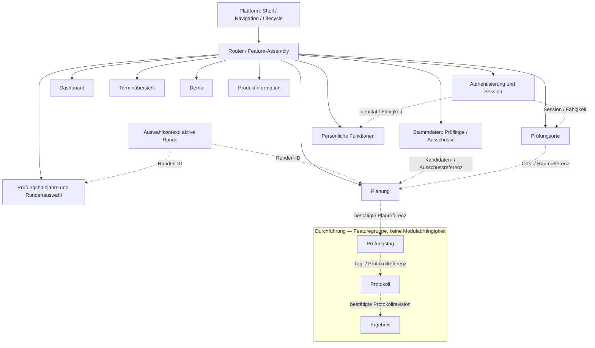
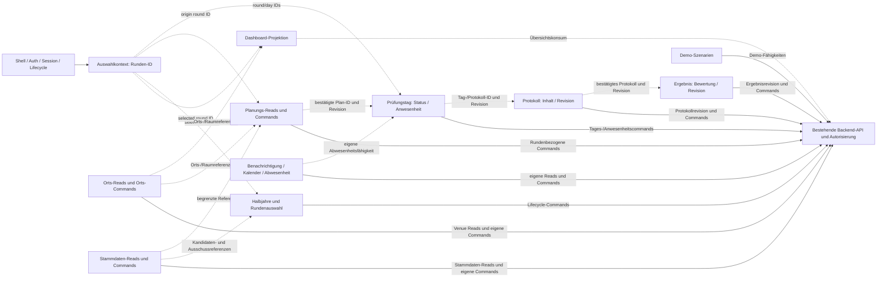

# Frontend-Architekturvertrag

Dieser Vertrag beschreibt Zielverantwortung, Routen, Provider-Lebensdauern und
fachliche Datenflüsse des Angular-Frontends.
Die Entscheidung ist in [ADR-0042](decisions/0042-frontend-zustandsbesitz-und-feature-lebensdauern.md)
festgehalten.

## Frontend-Zielvertrag

[ADR-0042](decisions/0042-frontend-zustandsbesitz-und-feature-lebensdauern.md)
verbindet den bestehenden Angular-/REST-Vertrag aus ADR-0004 mit konkretem
Datenbesitz, Schreibrecht und Lebensdauer.
Die Matrix beschreibt das bestätigte Ziel.
Der folgende Ist-Hinweis hält befristete Übergangspfade fest, ohne sie als
Zielarchitektur auszugeben.

| Bereich | Daten- und Zustandsbesitz | Commands und Schreibrecht | Geteilte Referenzen und Konsumenten | Lebensdauer und Invalidierung |
| --- | --- | --- | --- | --- |
| Shell und Navigation | Shell besitzt Navigationszustand, globale Hinweise, Lifecycle-Anzeige und Zugriffssicht; keine Fachdaten oder fachlichen Workflow-Drafts. | Keine fachlichen Commands; Auth- und Session-Commands liegen beim Auth-Feature. | Auth-/Capability-Sicht für erlaubte Aktionen; globale Rückmeldungen nehmen Ergebnisse entgegen, besitzen aber nicht deren Fachdaten. | Shell bleibt während der App-Sitzung. Auth-/Sessionwechsel leert geschützte Ansichten; Navigation allein löscht keine anwendungsweiten Identitäts- oder Lifecycle-Werte. |
| Auswahlkontext | `RoundContextService` besitzt die ausgewählte Runden-ID; die ausgewählte Ausschuss-ID ist nur ein kleiner UI-Kontext. Keine Rundendaten, Boards oder Drafts. | Runde auswählen/wechseln; fachliche Änderung und Autorisierung verbleiben beim zuständigen Runden-Feature. | IDs und wenige begründete Anzeigeinformationen für Routing und Commands; Feature-Reads bleiben Eigentum des jeweiligen Features. | Rundenwechsel verwirft alle rundenbezogenen Reads und Drafts. Jeder gestartete Command bindet die ursprüngliche Runden-ID; sein Ergebnis darf nicht in einen anderen Kontext geschrieben werden. Sessionwechsel löscht geschützte Auswahlwerte. |
| Dashboard | Eigene Übersicht, Summary und für die Dashboard-Aufgabe nötige Projektion. Keine Quelle für Orts-, Personal- oder Featurezustand. | Öffnen/Navigation zu Features; keine Mutationen fremder Fachbereiche. | Runde und kleine Zusammenfassungen als Konsument; keine Voraussetzung für unabhängige Features. | Wechsel aus der Ansicht verwirft deren Reads/Projektion. Rundenauswahl oder Sessionwechsel invalidiert sie; erneutes Öffnen lädt gezielt neu. |
| Prüfungsorte | Ortsfeature besitzt Venue-, Raum- und Kontaktdaten, Auswahl, Filter, Drafts, Lade-/Fehlerstatus und Geocoding-/Preflight-Ergebnisse. Reads sind ohne Runde verfügbar. | Orts-, Raum- und Kontaktänderungen, Geocoding, Dublettenprüfung, Auswirkungsbestätigung, Promotion und Folgeaufträge. Nur freigegebene Berechtigungen erlauben den jeweiligen Write. | Orts-IDs und schmale lesende Ortsreferenz für Planungs-/Planansichten; diese Konsumenten besitzen keine Ortsmutation. Rundenzusammenfassung und Dashboarddaten sind keine Ortsabhängigkeit. | Ansichtswechsel verwirft Reads, Preflight und ansichtsgebundene Draft-Ergebnisse. Angenommene Venue-/Raum-/Kontaktänderungen bleiben an ihre Ursprungs-ID gebunden; verspätete Antworten aktualisieren keinen neuen Draft. Sessionwechsel invalidiert geschützte Ortsdaten. Erfolgreiche Commands übernehmen bestätigte Venue-/Raum-/Kontaktantworten oder invalidieren genau den betroffenen Orts-Read. |
| Stammdaten | Kandidaten und Ausschüsse besitzen ihre kanonischen Stammdaten im Master-Data-Feature; Listen, Editoren und Commands gehören zum jeweiligen Einstieg. | Prüflinge und Ausschussmitglieder anlegen, ändern, löschen und aktivieren/deaktivieren durch berechtigte Stammdatenansichten. | Kandidaten, Ausschussmitglieder und Ausschüsse nur als begrenzte Leseoptionen für Rundenwahl, Planung und Durchführung; Änderungen invalidieren gezielt die davon abhängigen Referenzen. | Ansichtswechsel verwirft lokale Such-/Edit-Drafts. Anlegen, Ändern, Löschen und Aktivieren bleiben an ihr Ursprungsobjekt gebunden und übernehmen nur bestätigte Datensätze; Rundenzuweisungen werden gezielt invalidiert. Sessionwechsel leert geschützte Daten. Rundenzuweisungen werden gezielt invalidiert (siehe Operationstabelle). |
| Prüfungshalbjahre und Rundenauswahl | Halbjahre, Runden-Lebenszyklus und Kandidatenzuordnungen gehören dem Halbjahresfeature. Der ausgewählte Rundenzeiger gehört zum Auswahlkontext. | Runde eröffnen/schließen, Lebenszyklus steuern und Kandidaten zuordnen im Fachfeature; die Auswahl löst nur einen Kontextwechsel aus. Angenommene Commands laufen mit der ursprünglichen Runden-/Halbjahres-ID weiter und aktualisieren nicht die neu ausgewählte Runde. | Ausschüsse, Kandidaten und Zuordnungen sind begrenzte Stammdaten-Reads; Runden-ID wird an nachfolgende Commands übergeben. | Ansichtswechsel verwirft Feature-Reads/Drafts. Ein Rundenwechsel invalidiert alle abgeleiteten rundenbezogenen Views, nicht aber fachunabhängige Ortsdaten. Sessionwechsel löscht geschützte Listen. |
| Planung | Planung besitzt Rundenorganisation, Verfügbarkeiten, Tages-/Planungsentwürfe, Validierung und Vorschlagszustand. | Einstellungen, Verfügbarkeiten, Prüfungstage, Vorschläge, Bestätigung und Revision von Planung/Plan werden durch Planning-Commands geschrieben. Jeder Command bindet die Runden-ID bei Aufruf. | Kandidaten-, Ausschuss-, Raum-/Orts-Referenzen werden nur als Read-Verträge konsumiert; Bestätigte-Pläne- und Dashboardansichten sind getrennte Konsumenten. | Ansichtswechsel verwirft Reads, Vorschlagsansichten, lokale Entwürfe und UI-Effekte des alten Einstiegs. Speichern, Bestätigen und Revidieren bleiben an Ursprungsrunde und Quellrevision gebunden; Antworten aktualisieren nur diesen Plan. Rundenwechsel setzt rundenbezogene Planung zurück. Sessionwechsel invalidiert geschützte Daten. |
| Durchführung: Prüfungstag | Prüfungstag besitzt Tagesstatus, Anwesenheit, persönliche Anwesenheitserklärung, Fehlmeldung und Tagesansicht. | Anwesenheit koordinieren oder eigene Anwesenheit/Abwesenheit melden, jeweils nur mit passender Fähigkeit. | Runde, Tag, Mitglieds-ID und explizite Revision verbinden den Tages-Read mit Protokoll und Ergebnis. | Ansichtswechsel verwirft Tages-Reads und lokale Antworten. Anwesenheits- und Fehlmeldungscommands behalten Runde/Tag/Revision ihres Ursprungstags und ändern keine andere Tagesansicht. Runden- und Sessionwechsel invalidieren geschützte Reads. |
| Durchführung: Protokoll | Protokollfeature besitzt Protokollinhalt, Revision, Änderungsentwurf, Abschluss-/Wiederöffnungszustand und Exportantworten. | Protokoll speichern, abschließen, wieder öffnen und exportieren; Konfliktbehandlung bleibt revisionsgebunden. | Tag-/Runden-IDs und Protokollrevision sind explizite Verknüpfungen; Ergebnisfeature ist nachgelagerter Konsument bestätigter Protokolldaten. | Ansichtswechsel verwirft ungespeicherte, ansichtsgebundene Entwürfe und Reads. Speichern, Abschließen, Wiederöffnen und Export behalten die ursprüngliche Protokollrevision; konkurrierende oder verspätete Antworten überschreiben keinen neu geladenen Protokollstand. Sessionwechsel invalidiert geschützte Inhalte. |
| Durchführung: Ergebnis | Ergebnisfeature besitzt Bewertung, Punkte, Teilnehmerergebnis, Revisionen und Exportzustand. | Ergebnis bewerten, speichern, abschließen und exportieren innerhalb der erteilten Fähigkeiten. | Bestätigte Protokoll-/Tag-IDs und Revisionen werden ausdrücklich konsumiert; kein fremdes Protokoll- oder Plan-Signal wird beschrieben. | Ansichtswechsel verwirft Read und lokalen Editor-Draft. Ein angenommener Write wird mit seiner ursprünglichen Ergebnisrevision fortgeführt; Sessionwechsel löscht geschützte Ergebnisdaten. |
| Persönliche Funktionen | Persönlicher Bereich besitzt Benachrichtigungen, Zustellkanäle, Kalenderstatus/-ereignisse und Abwesenheitsmeldungen mit je lokaler Ansicht. | Benachrichtigungseinstellungen, Push, Kalenderaktionen und eigene Abwesenheits-/Vertretungsbefehle nur mit passender Fähigkeit. | Authentisierte Identität und eigene Mitglieds-/Kalenderkennung; Prüfungstag darf die Fähigkeit zur eigenen Abwesenheitsmeldung verwenden, übernimmt aber nicht Personalzustand. | Ansichtswechsel verwirft Ansichtsdaten und neue Reads; ein bestätigter personenbezogener Command läuft in seinem Personal-Workflow fort. Sessionwechsel löscht personenbezogene Reads und verhindert spätere Antwortübernahme in eine neue Sitzung. |
| Demo und Produktinformation | Demo besitzt Szenarioübersicht, Reset-Command, Demo-Rollenwechsel und Tour-/Timerzustand. Produktinformation besitzt Versions-/Buildangaben. Fachänderungen innerhalb einer Demo-Szene bleiben beim jeweiligen Feature. | Demo-Reset und Rollenwechsel sind explizite Demo-/Auth-Commands; Tour und Navigation schreiben keine Fachaggregate. Ein bestätigter Reset/Rollenwechsel läuft zu Ende und erzeugt danach einen neuen Demo-Read. | Demo-Rolle und Sessionmetadaten als Auth-Referenz; Produktinformation konsumiert Buildversion. | Ansichtswechsel verwirft Szenario-Reads, lokale Auswahl und Tour-/Timerzustand. Der bestätigte Reset ist ein eigener bewusster Command, kein Effekt des Ansichtswechsels. Rollen-/Sessionwechsel invalidiert geschützte Demo-Reads. Produktinformation ist an den App-Build gebunden. |

### Modulgrenzen

Die Module bezeichnen fachliche Zuständigkeiten und Feature-Assemblies; sie
schreiben keine Angular-`NgModule`-Klassen oder Verzeichnisstruktur vor.
Jedes Fachmodul besitzt seine Reads, Drafts und Commands.
Andere Module greifen ausschließlich über begrenzte Query-/Referenzverträge
und explizite IDs/Revisionen darauf zu.



Der Durchführungs-Cluster gruppiert Prüfungstag, Protokoll und Ergebnis; er
bezeichnet keine Abhängigkeit zu einem zusätzlichen `Execution`-Modul.
Die gestrichelten Kanten erlauben nur den benannten Read-/Referenzvertrag.
Sie übertragen weder Datenbesitz noch Schreibrecht an den Konsumenten.
Die Ansicht erfordert keine neue gemeinsame Fachdatenbibliothek.

### Route-to-Feature-Zuordnung

Jede Zeile benennt den tatsächlich konfigurierten URL-Pfad und den in
`app.routes.ts` geladenen Einstieg.
Bei gemeinsamem Einstieg sind die URLs einzeln aufgeführt; die Einordnung als
Gruppierung sagt nur, dass die aktuelle Routerkonfiguration dieselbe
Einstiegskomponente verwendet.
`/` leitet auf `/dashboard` und `/planning` auf `/scheduling-overview` um;
unbekannte Pfade leiten ebenfalls zum Dashboard um.
Diese Einträge laden keine eigene Route-Komponente.

| Route-Komponente oder direkter Einstieg | URL(s) | Feature-Komponente und fachlicher Besitzer |
| --- | --- | --- |
| `AuthFlowComponent` (gemeinsamer Einstieg für drei Auth-Aktionen) | `/login`, `/activate`, `/recover` | Auth-Feature: `AuthFlowComponent`; Authentisierung und Session liegen in `AuthService`. |
| `DashboardRouteComponent` | `/dashboard` | Dashboard: `DashboardComponent`; öffnet andere Features per Navigation. |
| `SchedulingOverviewRouteComponent` | `/scheduling-overview` | Terminübersicht: `SchedulingOverviewComponent`; Rundenwahl/Öffnen ist keine Planungsmutation. |
| `PlanningRouteComponent` | `/scheduling-overview/:roundId` | Planung: `PlanningComponent`; Route bindet die Runde und Befehle an `PlanningWorkflowService`. |
| `ConfirmedPlansRouteComponent` (gleicher Einstieg für Liste, Bearbeitung und Details) | `/confirmed-plans`, `/confirmed-plans/:roundId`, `/confirmed-plans/:roundId/edit` | Bestätigte Pläne: `ConfirmedPlansComponent`; die Gruppen teilen View, nicht einen neuen Featurebesitzer. |
| `ExamDayRouteComponent` | `/confirmed-plans/:roundId/days/:dayId` | Prüfungstag: `ExamDayComponent`; URL liefert Runde und Tag. |
| `CandidatesRouteComponent` | `/candidates` | Stammdaten Prüflinge: `CandidatesComponent`; Mutationen über `MasterDataWorkflowService`. |
| `CommitteeRouteComponent` | `/committee` | Stammdaten Ausschuss: `CommitteeComponent`; Mutationen über `MasterDataWorkflowService`. |
| `LocationsRouteComponent` (gleicher Einstieg für Liste/Detail) | `/locations`, `/locations/:id` | Prüfungsorte: `LocationsComponent`; `:id` ist eine selektierte Detailansicht desselben Features. |
| `ExamHalfYearsRouteComponent` | `/exam-half-years` | Prüfungshalbjahre/Rundenauswahl: `ExamHalfYearsComponent`. |
| Direkter Einstieg `NotificationsComponent` | `/notifications` | Persönliche Benachrichtigungen und Kalender: `NotificationsComponent` / Personal-Feature. |
| Direkter Einstieg `AbsenceReportsComponent` | `/absence-reports` | Persönliche Abwesenheiten: `AbsenceReportsComponent` / Personal-Feature. |
| Direkter Einstieg `DemoScenariosComponent` | `/demo-scenarios` | Demo-Szenarien: `DemoScenariosComponent`; Demo bleibt eigene Assembly/Sessionfunktion. |
| `AboutRouteComponent` | `/about` | Produktinformation: `AboutComponent`; Version aus Build-/Runtimeinformation, keine Fachansicht. |

### Komponentenbaum

Die Featurekästen fassen Verantwortungen zusammen und schreiben keine
zusätzlichen Klassen vor.
Die Root-Shell rendert Routen über `router-outlet`; ein Route-Einstieg wird nur
dort gezeigt, wo `app.routes.ts` eine Bindungs- oder Kontextaufgabe hat.

```mermaid
flowchart TB
  App[App: Shell, Navigation, Zugriffssicht]
  Router[Angular Router / router-outlet]
  App --> Router
  Router --> Auth[Auth: Anmeldung / Aktivierung / Wiederherstellung]
  Router --> DashboardRoute[DashboardRouteComponent]
  DashboardRoute --> Dashboard[DashboardComponent]
  Router --> OverviewRoute[SchedulingOverviewRouteComponent]
  OverviewRoute --> Overview[SchedulingOverviewComponent]
  Router --> PlanningRoute[PlanningRouteComponent]
  PlanningRoute --> Planning[PlanningComponent]
  Router --> PlansRoute[ConfirmedPlansRouteComponent]
  PlansRoute --> Plans[ConfirmedPlansComponent]
  Router --> DayRoute[ExamDayRouteComponent]
  DayRoute --> Day[ExamDayComponent]
  Router --> CandidateRoute[CandidatesRouteComponent]
  CandidateRoute --> Candidates[CandidatesComponent]
  Router --> CommitteeRoute[CommitteeRouteComponent]
  CommitteeRoute --> Committee[CommitteeComponent]
  Router --> LocationsRoute[LocationsRouteComponent]
  LocationsRoute --> Locations[LocationsComponent]
  Router --> HalfYearsRoute[ExamHalfYearsRouteComponent]
  HalfYearsRoute --> HalfYears[ExamHalfYearsComponent]
  Router --> Notifications[NotificationsComponent]
  Router --> Absences[AbsenceReportsComponent]
  Router --> Demo[DemoScenariosComponent]
  Router --> AboutRoute[AboutRouteComponent]
  AboutRoute --> About[AboutComponent]
  Shared[Auth / Session / Lifecycle / Auswahlkontext]
  App --> Shared
```



### DI-Provider-Sicht (Ist-Komposition)

Diese Sicht entspricht der aktuellen `app.config.ts`-Root-Composition.
Ein gebundener Token zeigt die vorhandene Port-Adapter-Zuordnung;
`useExisting` teilt die vorhandene Auth- oder Lifecycle-Instanz.
Alle dort explizit gebundenen Ports/Adapter liegen im Root-EnvironmentInjector.
Services mit `providedIn: 'root'` — darunter aktuell Workspace- und
Workflow-Services — sind ebenfalls anwendungsweit erreichbare Singletons;
das Verlassen einer Route zerstört sie nicht.
Komponentenfelder und lokale Signals leben dagegen mit ihrer
Komponenteninstanz.
Diese Ist-DI-Lebensdauer ist nicht gleich fachlichem Datenbesitz.

Im Ziel bleiben Authentisierung, Session, Lifecycle und tatsächlich
zustandslose technische Adapter im Root-Injector.
Feature-Reads, Ansichtsselektion und Drafts erhalten eine View-/Route- oder
Feature-Injektorlebensdauer passend zur Matrix.
Nur ein Command, dessen Operationseintrag die Fortführung über den
Ansichtswechsel vorsieht, gehört einem Feature-Command-Eigentümer mit
festgehaltenem Ursprungskontext; ein Root-Provider ist dafür nicht automatisch
erforderlich.
Diese Dokumentation verschiebt noch keine Provider und behauptet keine
implementierte Feature-Injektorgrenze.

```mermaid
flowchart LR
  Root[app.config.ts / Root EnvironmentInjector]
  Root --> Router[provideRouter(routes)]
  Root --> Http[provideHttpClient / Interceptors]
  Root --> OverviewPort[SCHEDULING_OVERVIEW_PORT]
  OverviewPort --> OverviewAdapter[HttpSchedulingOverviewAdapter]
  Root --> PlanningPort[PLANNING_PORT]
  PlanningPort --> PlanningAdapter[HttpPlanningAdapter]
  Root --> HalfYearPort[EXAM_HALF_YEARS_PORT]
  HalfYearPort --> HalfYearAdapter[HttpExamHalfYearsAdapter]
  Root --> PersonalPort[PERSONAL_PORT]
  PersonalPort --> PersonalAdapter[HttpPersonalAdapter]
  Root --> ProtocolPort[EXAM_PROTOCOL_PORT]
  ProtocolPort --> ProtocolAdapter[HttpExamProtocolAdapter]
  Root --> ResultPort[EXAM_RESULT_PORT]
  ResultPort --> ResultAdapter[HttpExamResultAdapter]
  Root --> LocationPort[LOCATIONS_PORT]
  LocationPort --> LocationAdapter[HttpLocationsAdapter]
  Root --> LocationRead[LOCATIONS_READ_PORT]
  LocationRead --> LocationReadAdapter[HttpLocationsReadAdapter]
  Root --> MasterPort[MASTER_DATA_PORT]
  MasterPort --> MasterAdapter[HttpMasterDataAdapter]
  Root --> DayPort[EXAM_DAY_PORT]
  DayPort --> DayAdapter[HttpExamDayAdapter]
  Root --> WorkspacePort[WORKSPACE_PORT]
  WorkspacePort --> WorkspaceAdapter[HttpWorkspaceAdapter]
  Root --> PlansPort[CONFIRMED_PLANS_PORT]
  PlansPort --> PlansAdapter[HttpConfirmedPlansAdapter]
  Root --> DemoPort[DEMO_SCENARIOS_PORT]
  DemoPort --> DemoAdapter[HttpDemoScenariosAdapter]
  Root --> AuthPort[AUTHENTICATION_PORT useExisting]
  AuthPort --> Auth[AuthService]
  Root --> LifecyclePort[LIFECYCLE_AVAILABILITY_PORT useExisting]
  LifecyclePort --> Lifecycle[LifecycleService]
  Root --> ErrorPort[FRONTEND_ERROR_REPORTER_PORT]
  ErrorPort --> ErrorAdapter[HttpFrontendErrorReporter]
  Adapters[Weitere API-Clients und HttpClient]
  Http --> Adapters
  PlanningAdapter --> Adapters
  LocationAdapter --> Adapters
  WorkspaceAdapter --> Adapters
```

`LOCATIONS_READ_PORT` ist im aktuellen Code an `HttpLocationsReadAdapter`
gebunden, dessen Snapshot noch aus dem Workspace projiziert wird.
Das ist eine befristete Ist-Kopplung und wird mit dem Orts-Piloten #1067
entfernt.
Die globalen Workspace-Projektionen und ihre Verbraucher werden in den
Feature-Slices rückgebaut; die Root-Provider der Ports belegen keine
Workspace-Zuständigkeit.

### Datenfluss-Sicht

Die Pfeile zeigen fachliche Reads, Commands und gezielte Referenzen des
Zielvertrags, nicht einen zusätzlichen globalen Eventbus.
Durchgezogene Linien markieren Besitzer-/Command-Fluss; gestrichelte Linien
markieren begrenzte Leseverträge.



Jede geteilte Referenz hat einen Fachbesitzer und einen begrenzten
Konsumentenkreis.
Kandidaten- und Ausschussänderungen invalidieren nur Referenzprojektionen, die
diese Entitäten anzeigen oder für neue Commands benötigen.
Venue-/Raumänderungen invalidieren Ortsdaten und davon abhängige Planungs- oder
Übersichtsreferenzen, nicht die Runde als Ganzes.
Rundenänderungen invalidieren rundenbezogene Planung, Board, Tag, Protokoll
und Ergebnis; Ortsdaten bleiben gültig.
Protokoll- und Ergebnisänderungen verwenden bestätigte IDs/Revisionen und
invalidieren keine allgemeine Dashboardladung.
Sessionwechsel verwirft alle geschützten Feature-Reads unabhängig von diesen
gezielten fachlichen Regeln.

### Operations- und Invalidierungsvertrag

Die Ansichts-, Runden- und Sessionwechsel-Regeln gelten je Operationstyp wie
folgt.
`Verwerfen/abbrechen` bedeutet, dass ein Read, Ergebnis oder lokaler Draft
nicht in eine neue Ansicht übernommen wird.
`Weiterführen mit festgehaltenem Ursprung` gilt nur für bereits angenommene
Commands: Sie behalten den ursprünglichen Entitäts-, Runden-, Tag-, Identitäts- und
Revisionsbezug; eine Antwort wird nie in einen neu gewählten
Kontext geschrieben.
Mutierende Folgeaktionen, die eine Freigabe oder fachliche Vorschau erfordern,
werden `nur nach Bestätigung` angenommen.

| Bereich | Operation | Ansichtswechsel | Rundenwechsel | Sessionwechsel |
| --- | --- | --- | --- | --- |
| Shell und Navigation | Navigation, Lifecycle- und Zugriffssicht | Keine Fachdatenoperation; nur Ansichtszustand wechselt. | Shell bleibt; kontextbezogene Kennzeichnung wechselt. | Geschützte Navigation/Capabilities leeren und Auth-Sicht neu aufbauen. |
| Auswahlkontext | Runden-ID auswählen/wechseln | Auswahl bleibt appweit, solange dieselbe Sitzung gilt. | Alte rundenbezogene Reads und Drafts `verwerfen`; neue Runde gezielt laden. Bereits angenommene Commands `weiterführen mit festgehaltenem Ursprung`. | Geschützte Auswahl leeren und nach neuer Authentisierung neu setzen. |
| Dashboard | Übersicht/Summary lesen | Read abbrechen und Projektion verwerfen; beim Wiederöffnen gezielt neu laden. | Alte Summary verwerfen; neue Runde/Übersicht laden. | Geschützten Read abbrechen und Ergebnis verwerfen. |
| Prüfungsorte | Orts-, Raum- und Kontaktlisten/Details lesen; Filter/Draft; Dubletten-, Geocoding- und Preflight-Ergebnis | Reads, Filter, Drafts und Prüfergebnisse abbrechen/verwerfen; kein unbestätigter mutierender Folgecommand. | Ortsread und Draft bleiben bestehen, da unabhängig von einer Runde. | Geschützte Reads, Filter, Drafts und Prüfergebnisse verwerfen. |
| Prüfungsorte | Venue/Raum/Kontakt anlegen, ändern oder löschen; Auswirkungsbestätigung, Promotion und Folgecommand | Erst `nur nach Bestätigung` annehmen; danach `weiterführen mit festgehaltenem Ursprung` (ursprüngliche Venue-/Raum-ID). Antwort aktualisiert nur betroffene Ortsdaten oder invalidiert exakt deren Read. | Kein Rundenkontext; angenommener Ortscommand läuft weiter. | Vor Bestätigung verwerfen; bereits angenommene Commands behalten Venue-Identität. Antwort darf weder Draft noch Daten einer neuen Sitzung aktualisieren. |
| Stammdaten | Kandidaten-/Ausschusslisten und Details lesen; Such-/Edit-Draft | Read abbrechen, lokalen Such-/Edit-Draft verwerfen; neu öffnen lädt gezielt. | Fachunabhängige Stammdaten-Reads bleiben; rundenbezogene Zuordnungsprojektionen invalidieren. | Geschützte Reads und Drafts verwerfen. |
| Stammdaten | Prüfling/Ausschussmitglied anlegen, ändern, löschen, aktivieren/deaktivieren | Erst nach explizitem Nutzercommand annehmen; dann mit Ursprungsobjekt-ID weiterführen und nur bestätigten Datensatz aktualisieren. | Angenommener Stammdatencommand bleibt an sein Objekt gebunden; Zuordnungs-Reads der alten Runde invalidieren. | Vor Annahme abbrechen; danach Command im Ursprungsobjekt fortführen, Antwort nicht in neue Sitzung übernehmen. |
| Prüfungshalbjahre/Rundenauswahl | Halbjahr- und Rundendaten lesen; Kandidatenzuordnungs-Draft | Read abbrechen, Draft verwerfen. | Alte Runde/Zuordnung verwerfen; neue Zielrunde gezielt laden. | Geschützte Reads/Drafts verwerfen. |
| Prüfungshalbjahre/Rundenauswahl | Runde eröffnen/schließen; Kandidaten zuordnen | Lifecycle- oder Zuordnungsänderung `nur nach Bestätigung` annehmen; danach mit ursprünglicher Halbjahres-/Runden-ID weiterführen. | Angenommener Command bleibt bei der Quellrunde; sein Ergebnis darf die neu ausgewählte Runde nicht ändern. | Vor Annahme verwerfen; danach nur im Ursprungsworkflow fortführen und geschützte Antwort verwerfen. |
| Planung | Rundenplan, Verfügbarkeiten, Prüfungszeiten, Validierung und Vorschlag lesen/berechnen | Read/Vorschlag abbrechen und Ansichtszustand verwerfen; erneut öffnen lädt/berechnet gezielt. | Alte Reads, Validierung und Vorschlag verwerfen. | Geschützte Reads/Vorschläge abbrechen und verwerfen. |
| Planung | Einstellungen/Verfügbarkeiten speichern; Plan bestätigen/revidieren | Speichern nach explizitem Command; Bestätigung/Revision `nur nach fachlicher Bestätigung`. Danach `weiterführen mit festgehaltener Runden-ID und Quellrevision`; Antwort betrifft nur diesen Plan. | Angenommener Command bleibt an Quellrunde und Revision gebunden; darf neuen Kontext nicht aktualisieren. | Vor Annahme abbrechen; danach in Quellrunde fortführen, Antwort nicht in neue Sitzung übernehmen. |
| Prüfungstag | Tagesstatus, Anwesenheit und Fehlmeldung lesen; lokale Antwort | Read abbrechen; lokale Antwort verwerfen. | Tagesread und Draft zur alten Runde/am alten Tag verwerfen. | Geschützte Tagesdaten und Antwort verwerfen. |
| Prüfungstag | Anwesenheit koordinieren oder eigene An-/Abwesenheit melden | Erst nach explizitem Nutzercommand annehmen; danach mit ursprünglicher Runden-, Tag- und Mitglieds-ID weiterführen. | Angenommener Tagescommand bleibt am Ursprungstag; keine Übernahme in den neuen Tag. | Vor Annahme abbrechen; danach Ursprungscommand fortführen, Antwort darf keine Daten der neuen Sitzung verändern. |
| Protokoll | Protokoll/Revision lesen, lokalen Änderungsentwurf erstellen | Read abbrechen, ungespeicherten Draft verwerfen. | Read/Draft zur alten Runde, Tag- und Protokollrevision verwerfen. | Geschützten Read/Draft verwerfen. |
| Protokoll | Speichern, abschließen, wieder öffnen; Export anfordern | Speichern/Abschluss/Wiederöffnung nur als expliziter Command; Export nur nach explizitem Exportbefehl. Angenommene Operationen mit ursprünglicher Protokoll-ID und Revision weiterführen; konkurrierende Antwort überschreibt keinen neueren Read. | Operation an ursprünglicher Tag-/Protokollrevision fortführen; Antwort nicht in neue Runde übernehmen. | Vor Annahme abbrechen; danach im Ursprungsworkflow fortführen, private Antwort nicht in neue Sitzung übernehmen. |
| Ergebnis | Ergebnis/Revision lesen; Bewertungsentwurf bearbeiten | Read abbrechen und lokalen Editor-Draft verwerfen. | Read/Draft zur alten Runde, Tag- und Ergebnisrevision verwerfen. | Geschützten Read/Draft verwerfen. |
| Ergebnis | Bewerten, speichern, abschließen; Export anfordern | Speichern/Abschluss nur als expliziter Command; Export nur nach explizitem Exportbefehl. Angenommene Operation mit Ergebnis-ID und Ursprungsrevision weiterführen; nur bestätigte Antwort übernimmt/invalidiert genau dieses Ergebnis. | Am Ursprungsergebnis und seiner Revision fortführen; keine Aktualisierung der neu gewählten Runde. | Vor Annahme abbrechen; danach Ursprungscommand fortführen, Antwort nicht in neue Sitzung übernehmen. |
| Persönliche Funktionen | Benachrichtigungen, Kalender und eigene Abwesenheiten lesen; Ansichtsfilter/Draft | Read abbrechen, View-Zustand verwerfen; beim Wiederöffnen gezielt neu laden. | Personenbezogene Reads bleiben bei Rundenauswahl gültig; nur explizite Rundenreferenzen neu laden. | Personenbezogene Reads, Filter und Drafts löschen. |
| Persönliche Funktionen | Benachrichtigungseinstellungen, Push, Kalenderaktion, eigene Abwesenheit/Vertretung ändern | Aktion nur nach explizitem Nutzercommand annehmen; danach mit ursprünglicher Identität weiterführen. | Angenommene persönliche Aktion läuft unabhängig von der Rundenauswahl. | Vor Annahme abbrechen; angenommener Command bleibt in Ursprungsidentität, seine Antwort darf die neue Sitzung nicht verändern. |
| Demo | Szenarien lesen, Szenario auswählen, Tour/Timer bedienen | Read abbrechen; lokale Auswahl sowie Tour-/Timerzustand verwerfen. | Keine Rundendatenabhängigkeit; Demo-Rollen-/Sessionzustand bleibt separat. | Geschützten Read verwerfen; Tour-/Timer- und Rollenansicht zurücksetzen. |
| Demo/Auth | Demo-Reset oder Rollenwechsel | Reset/Rollenwechsel nur nach explizitem Nutzercommand; nach Annahme den Reset/Wechsel im Ursprungsworkflow abschließen und danach einen neuen Demo-Read starten. | Kein impliziter Reset oder Rollenwechsel durch Rundenauswahl. | Rollen-/Sessionwechsel löscht geschützte Alt-Reads; alter Command darf keinen Zustand der neuen Sitzung überschreiben. |
| Produktinformation | Build-/Versionsinformation anzeigen | Buildgebundene Anzeige; kein fachlicher Draft oder Command. | Unverändert, da keine Rundendatenabhängigkeit. | Buildgebundene Anzeige bleibt; geschützte Sessiondaten sind nicht beteiligt. |

Diese Matrix ist der konkrete Fortführungsvertrag für die Befehle in der
Verantwortungsmatrix; ihre Operationseinträge bestimmen die jeweilige
Abbruch-, Bestätigungs- und Fortführungsregel.
Ein bestätigter Command ist keine Zusage, den alten Bildschirm oder seine
Drafts wiederherzustellen; nach Abschluss wird dessen Antwort nur dem
Ursprungsfeature zugestellt.
Sessionwechsel verwirft geschützte Ansichten auch dann, wenn ein angenommener
Command im Ursprungsworkflow noch abgeschlossen wird.

### Übergangsverträge und Rückbau

| Bestehender Pfad | Befristeter Besitzer | Ziel und zuständiger Rückbau |
| --- | --- | --- |
| `ApplicationWorkspaceService` bündelt Runde, Summary, Board und Stammdaten; mehrere Ansichten lesen daraus. | Aktuell globaler Workspace; nicht Zielbesitzer der jeweiligen Fachdaten. | Ortsprojektion und Ortsladezustand entfernen: #1067. Dashboard-/Stammdatenzustand trennen: #1092. |
| Planung liest Runde, Summary, Board und Stammdaten aus dem Workspace. | `PlanningWorkflowService` besitzt bereits Planungscommands und lokale Proposal-/Editorzustände; Workspace bleibt nur Kompatibilitätsleser. | Eigenständige Planung-Reads und Ursprungskontext; Workspace-Abhängigkeit entfernen: #1093. |
| Prüfungstag, Protokoll und Ergebnis verwenden eigene Featureports, aber Teile des Shell-/Workspacekontexts und bestehende mehrstufige Ketten. | Jeweilige Featurekomponente und vorhandene Application/Facade/Port; IDs/Revisionen bleiben explizit. | Prüfungstagszustand verantworten: #1094; Protokoll-/Ergebniszustand und Grenzen bereinigen: #1095. |
| Persönliche Ansichten und Ansichten für Halbjahre, bestätigte Pläne, Produktinformation konsumieren teils geteilte Workspacewerte oder breite Einstiege. | Das jeweilige Feature bleibt fachlicher Besitzer; Workspace ist Kompatibilität. | Personal lokal und mit gezielten Fähigkeiten: #1096; verbleibende Einstiege und Workspace-Übergänge: #1097. |
| Route-Einstiege und fachliche Services existieren parallel. | Route besitzt URL-Bindung/Command-Origin, Feature besitzt Fachzustand. | Beibehalten, solange beide eine dieser Aufgaben tragen; #1097 entfernt nur reine Durchreichung. |

Jede Rückbauänderung erhält vorhandene Lade-, Fehler-, Berechtigungs-,
Revisions-, Session- und Accessibility-Semantik.
Es wird weder ein Universal-Workspace noch eine Pflichtschicht je Request
eingeführt.
