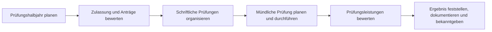
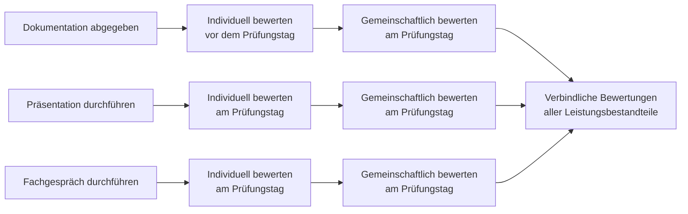

# Kernprozesse des Prüfungsausschusses

Diese Prozesslandkarte beschreibt die fachlichen Kernprozesse eines
Prüfungsausschusses auf oberster Ebene. Sie legt noch keine technische
Umsetzung fest. Detaillierte Prozessbeschreibungen ergänzen künftig pro
Kernprozess Rollen, Verantwortlichkeiten, Fachregeln, Varianten und
Nachweise.

Die Darstellung zeigt die grundlegende fachliche Abfolge. Vorbereitung und
Organisation können sich überlappen; die Bewertungsprozesse haben außerdem
eigene, zeitlich getrennte Schritte.

## Kernprozesse

| Kernprozess | Fachliches Ergebnis |
| --- | --- |
| [Prüfungshalbjahr planen](Prozess-Pruefungshalbjahr-planen) | Termine, Kapazitäten, Zuständigkeiten und der organisatorische Rahmen des Halbjahrs sind festgelegt. |
| [Zulassung und Anträge bewerten](Prozess-Zulassung-und-Antraege-bewerten) | Zu jedem Antrag liegt eine nachvollziehbare Entscheidung mit Auflagen oder Konsequenzen vor. |
| [Schriftliche Prüfungen organisieren](Prozess-Schriftliche-Pruefungen-organisieren) | Korrekturaufträge sind verteilt, fristgerecht bearbeitet und die Ergebnisse konsolidiert. |
| [Mündliche Prüfung planen und durchführen](Prozess-Muendliche-Pruefung-planen-und-durchfuehren) | Prüfungstage, Prüfungsorte, Prüflinge und regelkonforme Besetzungen stehen fest; die Prüfungen werden ordnungsgemäß durchgeführt. |
| [Prüfungsleistungen bewerten](Prozess-Pruefungsleistungen-bewerten) | Für Dokumentation, Präsentation und Fachgespräch liegen verbindliche, im Ausschuss festgestellte Bewertungen vor. |
| [Ergebnis feststellen, dokumentieren und bekanntgeben](Prozess-Ergebnis-feststellen-und-bekanntgeben) | Ergebnis, Ausschussbeschluss und Nachweise sind vollständig dokumentiert und den vorgesehenen Empfängerinnen und Empfängern bekanntgegeben. |

## User Journeys für den Frontend-Abgleich

Die User Journeys ergänzen die Prozesssteckbriefe um die Perspektive einer
handelnden Rolle. Sie sind ein Prüfmaßstab für das Frontend, keine zweite
Prozessbeschreibung.

| Journey | Rolle | Zugeordneter Kernprozess |
| --- | --- | --- |
| [Prüfungshalbjahr planen](User-Journey-Pruefungshalbjahr-planen) | Vorsitz und Stellvertretung | Prüfungshalbjahr planen |
| [Verfügbarkeit melden](User-Journey-Verfuegbarkeit-melden) | Ausschussmitglied / Prüfer:in | Prüfungshalbjahr planen |
| [Mündlichen Prüfungstag vorbereiten und durchführen](User-Journey-Muendlichen-Pruefungstag-vorbereiten-und-durchfuehren) | Prüfer:in | Mündliche Prüfung planen und durchführen |
| [Dokumentation individuell bewerten](User-Journey-Dokumentation-individuell-bewerten) | Prüfer:in | Prüfungsleistungen bewerten |
| [Präsentation und Fachgespräch bewerten](User-Journey-Praesentation-und-Fachgespraech-bewerten) | Prüfer:in | Prüfungsleistungen bewerten |
| [Ergebnis gemeinsam feststellen](User-Journey-Ergebnis-gemeinsam-feststellen) | Ausschussmitglied | Ergebnis feststellen, dokumentieren und bekanntgeben |

## Entscheidungsmatrizen

| Matrix | Zugeordneter Kernprozess |
| --- | --- |
| [Besetzung und Planbarkeit eines Prüfungstags](Entscheidungsmatrix-Besetzung-und-Planbarkeit) | Prüfungshalbjahr planen |
| [Ausfall und Ersatzbesetzung](Entscheidungsmatrix-Ausfall-und-Ersatzbesetzung) | Mündliche Prüfung planen und durchführen |
| [Verbindliche Gesamtbewertung](Entscheidungsmatrix-Verbindliche-Gesamtbewertung) | Prüfungsleistungen bewerten |

## Bewertungsprozess für Prüfungsleistungen

Bewertungen folgen stets zwei getrennten fachlichen Vorgängen:

1. Jede Prüferin und jeder Prüfer bewertet die jeweilige Prüfungsleistung
   zunächst individuell.
2. Der Ausschuss berät anschließend und stellt eine gemeinschaftliche
   Gesamtbewertung fest.

Die Einzelbewertung und die gemeinschaftliche Gesamtbewertung dürfen zeitlich
getrennt stattfinden. Erst die gemeinschaftlich festgestellte Bewertung ist
das verbindliche Ergebnis des Ausschusses.

### Dokumentation

Die Dokumentation wird vor dem Prüfungstag abgegeben und liegt dem Ausschuss
rechtzeitig vor. Die Prüferinnen und Prüfer nehmen ihre Einzelbewertungen daher
vor dem Prüfungstag vor. Am Prüfungstag berät der Ausschuss darüber und stellt
die gemeinschaftliche Gesamtbewertung der Dokumentation fest.

### Präsentation und Fachgespräch

Präsentation und Fachgespräch finden am Prüfungstag statt. Die Prüferinnen und
Prüfer bewerten beide Leistungen dort jeweils zunächst individuell. Noch am
Prüfungstag berät der Ausschuss die Einzelbewertungen und stellt die
gemeinschaftliche Gesamtbewertung fest.

Eine Gesamtbewertung der Prüfungsleistung kann erst festgestellt werden, wenn
die gemeinschaftlichen Bewertungen von Dokumentation, Präsentation und
Fachgespräch vorliegen.

Die in der Tabelle verlinkten Prozesssteckbriefe beschreiben die Kernprozesse
mit ihren Eingaben, Rollen, Regeln und Ergebnissen genauer.
